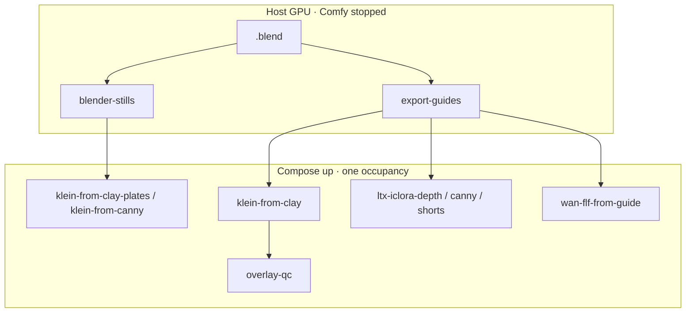

# Blender creator suite

**What's on this page**

- Two dump contracts: 5.00s shot pack vs single-frame still pack
- Still Apps (clay plates, canny restyle) and video envelopes (depth, canny, shorts, FLF)
- Occupancy: park Comfy (`blender-desk`) before a dump, or stop Compose
- Skip rules when Blender is missing

**What this enables**

- Blocking camera and layout in Blender, then finishing look and motion in Comfy
- Shipping creator plates (hero, packshot, IG, shorts) from one clay still
- Depth- or edge-guided 5.00s prints that keep the camera you blocked

**Who this is for:** studio users who already Queued Klein-from-clay or a 5 s LTX clip and want a Blender-shaped desk for both stills and video.

Blender stays on the **host**. It is never in `docker/Dockerfile`. Park Comfy (`occupancy enter blender-desk`) for Workbench dumps. Do not run Cycles CUDA next to a loaded denoise. [Occupancy desk](../occupancy.md).



---

## Stills

Not the 5.00s pack. Not the ten-camera [dream-house tour](dream-house.md). One camera, one plate.

```bash
./scripts/manage.sh occupancy enter blender-desk
./scripts/manage.sh blender-stills --film go-see --plate mug --blend /path/to/prop.blend --size 1024x1024
./scripts/manage.sh occupancy enter klein --yes
# Apps → klein-from-clay-plates  (or klein-from-canny)
```

`--install-inputs` copies `first.png` into `${COMFY_OUTPUT_DIR}/input` as `ez_clay_still_<plate>.png` (compose may stay up).

| Size | Use |
| --- | --- |
| 1280×704 | LTX / hero feeder |
| 768×1280 | Shorts / hook |
| 1024×1280 | Instagram 4:5 (generic) |
| 1024×1024 | Product packshot |
| 1280×720 | Thumbnail only — Klein, never LTX |

---

## Video (Path B)

```bash
./scripts/manage.sh occupancy enter blender-desk
./scripts/manage.sh export-guides --film go-see --shot 12 --blend /path/to/shot.blend --print ltx-iclora-depth
./scripts/manage.sh occupancy enter klein --yes
# klein-from-clay → overlay-qc → occupancy enter ltx --yes → ltx-iclora-depth
```

Portrait 5.00s: `--width 768 --height 1280`, then **ltx-iclora-depth-shorts**. Silent first-last: **wan-flf-from-guide** after `download-wan --tier fun-inp`.

Pack files and print modes: [DCC guide pack](../dcc-workflows.md). Golden film loop: [Clay to finish](clay-to-finish.md).

Path D: dump on the laptop, rsync `guides/`, Spark only runs Comfy.

Stay on `:8188` after the dump (no `--install-inputs`): [Stay in Comfy after a Blender dump](comfy-first-blender.md) — **klein-from-guide-loader-lab-example**.

---

## Skip rules

| If | Skip |
| --- | --- |
| No Blender / Path D not ready | Dumps. Queue language stills (`klein-still-draft`, `klein-dream-house`). Overlay QC is skipped, not faked |
| Need a walkable house | `blender-stills`. Use [house-views](dream-house.md) |
| Talking-head / VO-locked picture | Union Control. Use A2V freeze (`klein-talking-head-lab-example`) |
| Engine-final Cycles beauty | Path A (`dcc-final`) — not this suite |

Occupancy: one GB10 heavy job. `export-guides` and `blender-stills` die (exit 2) if Compose is up and **not** parked. Safety is unchanged: `restart: "no"`, type **yes** on start, headroom, download-limit clear-on-exit.
