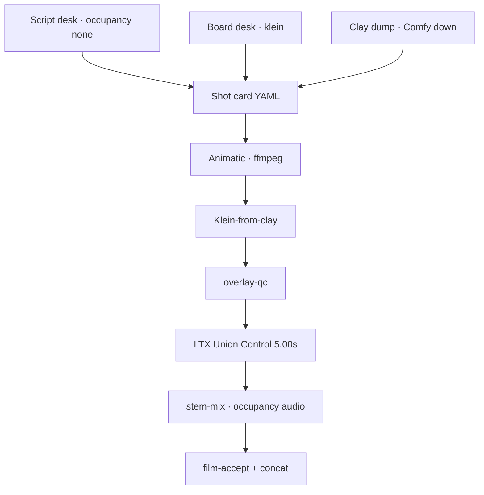

# Clay to finish

**What's on this page**

- Why clay first, then AI finish
- Three doors (script, board, clay) and one shot card
- Creator stills (`blender-stills`) vs the 5.00s print pack
- Overlay QC, animatic, and stem audio
- Occupancy XOR and skip rules

**What this enables**

- Directing camera and timing in a grey blockout instead of hoping a prompt remembers the cut
- Finishing materials with Klein and motion with LTX Union Control
- Treating LTX joint AV as a world bed, then mixing stems to YouTube loudness

**Who this is for:** studio users who have Queued a 5 s LTX clip and want a short that keeps the camera they blocked.

---

## Why not one prompt

2026 production pipelines that keep camera and timing split the job: the 3D clay owns geometry and cuts, a look plate owns materials, control-guided video restyles the clip, and audio is mixed after picture lock. Joint LTX AV is a bed, not a master.

This stack's Path B is that split. MiniMax H3 clay graphs are banned (US Excluded Territory). Cloud render-to-real endpoints are not lab defaults.

---

## Golden path (script door)

1. Load **beat-sheet-lab-example**. Fill logline, script, audio policy, 18 cards. Occupancy **none**.
2. `./scripts/manage.sh shot-sheet run --film go-see` writes `films/gosee/shots.yaml`. Does not overwrite lab YAML.
3. Optional board: **klein-identity-sheet-lab-example** then **klein-storyboard-6up-lab-example** (seed 42, 1280×704).
4. Optional clay: `manage.sh stop` then `export-guides --film go-see --shot 12`. Workbench clay + depth + canny, not Cycles beauty. Path D: dump on the laptop, rsync `guides/`. Creator plates (not 5.00s): `blender-stills` then **klein-from-clay-plates** — [Blender creator suite](blender-creator.md).
5. `manage.sh film-animatic --film go-see` — clay.mp4 or 5.00 s still holds, cap 90 s. Compose may stay up.
6. Start Comfy. Queue **klein-from-clay-lab-example** on `first.png`. Then `overlay-qc --film go-see --shot 12 --look PATH`. Iterate the look, not the print.
7. Stop Klein. `download-ltx --tier iclora` if needed. Queue **ltx-iclora-depth-5s-lab-example** or Templates → LTX-2.5 Union Control (depth from `depth.mp4`). MagCache off. Distilled-only. Refuse 19B Union.
8. Stop LTX. Occupancy **audio**. `stem-mix --film go-see --shot 12 --bg PATH` (optional `--dx`). Duck −15 dB, YouTube loudnorm I=-14. App: **audio-finish-lab-example**.
9. `film-accept` then concat. Disclosure sidecar stays.

Printers stay **5.00 s / 1280×704 / 120 frames @ 24 fps**. Do not type a 90 s latent.

---

## Skip rules

| If | Skip |
| --- | --- |
| No Blender / Path D not ready | Film clay dump. Look plate owns composition. Overlay QC is skipped, not faked. Instagram clay tour still Queues on `start` / `--seed-inputs` layout plates; language-only → **klein-dream-house-lab-example**. |
| Empty dialogue | DX stem |
| Shorts “world SFX, no score” | MX. Do not load ACE-Step next to LTX. |
| Talking-head / VO-locked picture | Union Control. Use A2V freeze (`klein-talking-head-lab-example`). Mouths will not match. |

---

## Occupancy

One GB10 job. `export-guides` and `house-views` die if compose is up (exit 2). `overlay-qc`, `film-animatic`, and `stem-mix` are host ffmpeg and **may** run while Comfy is up. Stop the visual session before ACE-Step.

Instagram stills of one place (not a 5.00s print): [Dream-house tours](dream-house.md). That dump is 1024×1280, not the LTX 1280×704 pack.

Safety is unchanged: `restart: "no"`, type **yes** on start, headroom, download-limit clear-on-exit.

Playbook details: [DCC guide pack](../dcc-workflows.md). Shot YAML: [90s shorts](../shorts.md). Apps: [ComfyUI Apps](../studio-apps.md).
