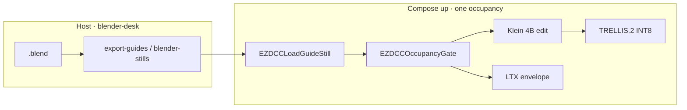

# Stay in Comfy after a Blender dump

**What's on this page**

- Comfy is the host UI; Blender is a backend dump tool
- First-party `ez_dcc` loaders (no third-party Blender-in-Comfy packs)
- Occupancy gate on the canvas
- The stay-on-`:8188` loop (Klein → overlay-qc → TRELLIS)
- Path D on one GB10

**What this enables**

- Loading clay / depth / canny from `guides/<slug>/<shot>/` without `--install-inputs`
- Failing closed when occupancy is still `blender-desk`
- Handing a Klein still to TRELLIS.2 INT8 under `output/assets/objects/_lab-mug/`

**Who this is for:** studio users who already dumped a guide pack and want to stay in the ComfyUI canvas.

There is **no** live Blender viewport embed. Blender stays on the host. Do not install GeometryPack, Comfy_BlenderTools, ComfyBlockout, MixLab, IRCSS, or spawn `blender` from a node.



---

## Operator loop

```bash
./scripts/manage.sh occupancy enter blender-desk
./scripts/manage.sh export-guides --film go-see --shot 12 --blend /path/to/shot.blend --print ltx-iclora-depth
./scripts/manage.sh occupancy enter klein --yes
# :8188 → klein-from-guide-loader-lab-example
# EZDCCLoadGuideStill slug=go-see shot_id=12 layer=first
./scripts/manage.sh overlay-qc --film go-see --shot 12 --look PATH
./scripts/manage.sh occupancy enter trellis --yes
# trellis-from-klein-still-lab-example — inspect mesh in Load 3D / Preview 3D
```

Widgets default to `slug=go-see`, `shot_id=12`, `plate=mug`. Depth stays mist 0–1 (near=white, far=black). Do not invert.

`EZDCCOccupancyGate` reads `${COMFY_OUTPUT_DIR}/.occupancy.json`. It does not `POST /free`, start Compose, or spawn Blender. Missing file passes (mode `unknown`). `blender-desk` vs Klein / LTX / Wan / TRELLIS **fails** — park is for dumps.

---

## Graphs (`_lab/dcc/`)

| Graph | Occupancy | What it does |
| --- | --- | --- |
| **klein-from-guide-loader-lab-example** | klein | Gate + `EZDCCLoadGuideStill(first)` → Klein 4B edit. 1280×704. Seed 42. Prefix `ez_guide_hero` |
| **ltx-iclora-from-guide-loader-lab-example** | ltx | Gate + still + `depth.mp4` path. Envelope only (Templates → Union Control). MagCache off. Distilled-only. Prefix `ez_iclora_guide` |
| **trellis-from-klein-still-lab-example** | trellis | Gate + still pack `plate=mug` → native TRELLIS.2 INT8. Output `assets/objects/_lab-mug/` under `output/` |

The original seven DCC graphs stay on `LoadImage` + `--install-inputs`. After a dump you can keep using those, or stay on `:8188` with the loaders.

---

## Path D (default on one GB10)

Laptop dump → rsync `guides/` → Spark Comfy. Spark does not run Blender.

```bash
rsync -a guides/go-see/12/ spark-0:/mnt/comfy-output/guides/go-see/12/
./scripts/manage.sh start
```

Pack contract and print modes: [DCC guide pack](../dcc-workflows.md). Occupancy XOR: [Occupancy desk](../occupancy.md). Stills vs 5.00s: [Blender creator suite](blender-creator.md).

!!! danger "Hard bans"

    No Blender in Docker. No GeometryPack / Comfy_BlenderTools / ComfyBlockout / MixLab / IRCSS. No Pixal3D, nvdiffrast, Flux Dev, or 19B Union. No `asset-new`. TRELLIS stays opt-in `download-3d --tier trellis2`.
