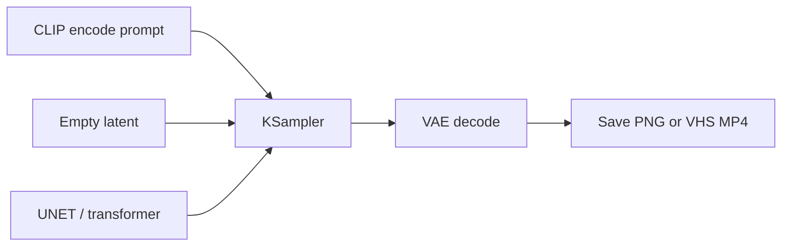

# ComfyUI basics

**What's on this page**

- Node graph vs a linear app
- How lab workflows get onto the canvas
- Queue, seed, widgets, Note node
- Where outputs go, and what “Missing Models” actually means

**What this enables**

- Using the studio without editing JSON
- Mapping every Create-page instruction onto a thing you can click

**Who this is for:** first hour in the UI after `manage.sh start`.

---

## A graph, not a chat box

ComfyUI is a **node graph**. Each box is a step (load weights, encode text, sample, decode, save). Wires carry images, latents, and strings. You do not type a prompt into a single chat field and hope — you change **widgets** on the nodes the lab already wired.



Daily rule: **do not edit raw `*-lab-example` JSON.** Open the graph, change widgets, Queue.

---

## How a lab graph shows up

On `start`, the entrypoint copies host `workflows/*.json` and `workflows/shorts/*.json` into Comfy’s `user/default/workflows/`.

1. Open `http://${SPARK_HOST}:${COMFY_PORT}` (port-forward from a laptop if needed)
2. Load **klein-still-draft-lab-example** (filename suffix **`-lab-example`**)
3. Read the on-canvas **Note node** — purpose, models, sampler, prompting, run steps
4. Queue

If the graph is missing, restart the container so the copy runs. YAML shot lists stay on the host; they are not copied.

---

## Queue, seed, batch

| Control | Meaning |
| --- | --- |
| **Queue** | Run the graph once (encode → sample → decode → save) |
| **seed** | RNG lock. Same seed + same graph ≈ same picture |
| **batch** | How many stills in one Queue (draft Klein uses 2) |
| **Bypass** | Skip a group (Ctrl+B) without deleting it |

A still-draft Queue is the “hello world” of this studio. A one-click 90s film Queue is **long** because it runs 18 sequential 5 s prints — that is expected, not a hang.

Fix the seed when you iterate a prompt. Randomize when you are exploring.

---

## Inputs and outputs

=== "Stills"

    `SaveImage` writes PNG under `${COMFY_OUTPUT_DIR}` (container `/outputs`). Draft prefix `ez_still_draft`. Hero prefix `ez_still_hero`.

=== "Video"

    `VHS_VideoCombine` writes MP4. After Queue, open **Save video (MP4) — open node for preview**. LTX also muxes decoded audio into that MP4.

=== "I2V start frame"

    Set **LoadImage** to the PNG you like (`ez_still_draft_*.png`). Leaving Comfy’s `example.png` only smoke-tests the graph.

`cleanup` does **not** delete `COMFY_OUTPUT_DIR`. `status` prints the path.

---

## Missing Models is a cache problem

If the canvas says **Missing Models**, the JSON is fine and the **weights** are not on `MODELS_DIR` (or the `comfy/` symlink is broken). Re-run `./scripts/manage.sh download-models`, then `doctor`. Do not rewrite the graph to “fix” a missing file.

Prompt Enhance missing? Restart so `custom_nodes/ez_prompt_enhance` is copied. Enhance is fail-soft: generation still runs without the GGUF.

---

## Laptop access

```bash
ssh -L "${COMFY_PORT}:127.0.0.1:${COMFY_PORT}" "${SPARK_USER}@${SPARK_HOST}"
# then open http://127.0.0.1:${COMFY_PORT}
```

Next: [Image and video generation](generation.md) · [Getting Started](../getting-started.md) if the stack is not up yet.
