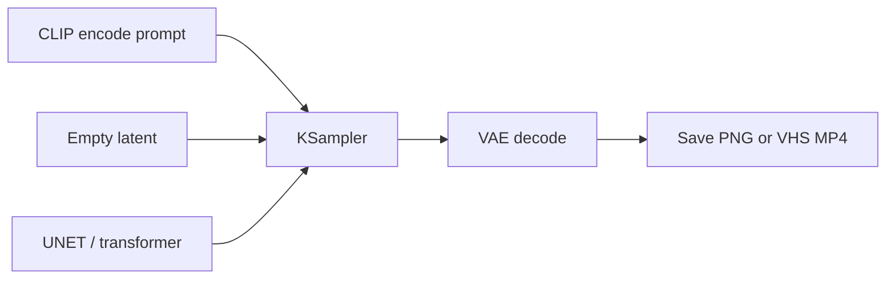

# ComfyUI basics

**What's on this page**

- Node graph vs App Mode (same JSON, creator widgets)
- Nodes 2.0 (Vue renderer) as the default canvas
- How lab workflows get onto the canvas (Workflows and Apps)
- Queue, seed, widgets, Note node
- Where outputs go, and what “Missing Models” / “Missing Node Packs” actually means

**What this enables**

- Using the studio without editing JSON
- Mapping every Studio-page instruction onto a thing you can click

**Who this is for:** first hour in the UI after `manage.sh start`.

---

## A graph, not a chat box

ComfyUI is a **node graph**. Each box is a step (load weights, encode text, sample, decode, save). Wires carry images, latents, and strings. You do not type a prompt into a single streaming chat field and hope — you change **widgets** on the nodes the lab already wired. **inspire/research-chat** is still that graph: one **Message** widget, then Queue (occupancy **llm**). It is not Comfy Cloud’s In-App Agent.



Daily rule: **do not edit raw `_lab` JSON.** Open the graph, change widgets, Queue.

### Nodes 2.0

The studio canvas uses [Nodes 2.0](https://docs.comfy.org/interface/nodes-2) (Vue DOM nodes, not LiteGraph canvas drawing). `start` writes `Comfy.VueNodes.Enabled` and `Comfy.VueNodes.AutoScaleLayout` into `user/default/comfy.settings.json` **only when those keys are absent** — an operator who already toggled Nodes 2.0 off keeps that choice. Lab graphs stamp `extra.workflowRendererVersion` as **`Vue-corrected`** so coordinates stay LiteGraph-canonical; do **not** stamp `"Vue"` or the frontend shrinks the layout by 1.2×. Shipped node positions already leave room for Vue widget height (Enhance, CLIP, LoadImage, KSampler) so Auto-scale does not stack boxes.

Toggle from the Comfy logo menu or Settings. Classic LiteGraph still loads the same JSON.

### Graph and App

The same JSON can open as a **graph** (nodes and wires) or as an **App** (creator widgets only). App Mode is official from ComfyUI frontend **1.41.13** (this stack pins **1.52.7**). Lab graphs stamp `extra.linearData` as `[nodeId, widgetName, config]` plus `extra.lab_app_mode` so **Quality** (Lab / Draft / High), **Sample prompt** (30 recipes + **Custom**), **Prompt**, **Format / platform**, **Output size** (Match input or Force format), **Duration** on LTX Apps (5/8/10/12 s, default 8 s), **Style**, **Rewrite prompt**, and **Seed** show first in the App panel. Pick a lab recipe or **Custom** to type your own. LoadImage / LoadAudio upload a file or choose one already on the output disk. **Start image** appears only when that LoadImage is wired (I2V / character tweak / clay). Style is a dropdown (`none` = off) and is hidden on I2V — the start frame owns look. Size and UNET stay hidden except on **klein-still-daily**, **stills/still-studio**, and **stills/image-studio** (Format / platform also sets size; image-studio also exposes Creator mode). Multi-shot Apps expose one identity prompt — not ten shot cards. Duplicate widgets get unique labels (Klein / Wan / LTX on Prompt Forge; Beat 1 enter on the beat sheet). 90s films stay in graph view. Occupancy is a chip at the top of the widget list, not over Run. This is **not** `studio-ui` and not a second product. See [ComfyUI Apps](../studio-apps.md).

---

## How a lab graph shows up

On `start`, the entrypoint rsyncs shipped JSON into Comfy’s `user/default/workflows/_lab/<lane>/` (directory-preserving; `--delete` is scoped to `_lab/` only). Prefer host `workflows/_lab/` when present; otherwise map the current flat repo globs into those lanes. App Mode graphs (`default_view: app`) land as `_lab/<lane>/*.app.json` so they show in the **Apps** sidebar as well as **Workflows**. 90s films stay `*.json` (graph default). Save your own graphs under **`_user/`** — start never deletes or overwrites that folder. If you Save in `_lab/` anyway, start **rescues** extras into `_user/` and edited lab graphs into `_user/_rescued/`, then restores the git catalog in `_lab/`. Re-open the rescued copy; do not keep editing `_lab/`.

1. Open `http://${SPARK_HOST}:${COMFY_PORT}` (port-forward from a laptop if needed)
2. Load **stills/still-draft** from **Apps** or **Workflows**
3. Read the on-canvas **Note node** — purpose, models, sampler, prompting, run steps
4. Queue

If the graph is missing, restart the container so the copy runs. YAML shot lists stay on the host; they are not copied.

---

## Queue, seed, batch

| Control | Meaning |
| --- | --- |
| **Queue** | Run the graph once (encode → sample → decode → save) |
| **seed** | RNG lock. Same seed + same graph ≈ same picture |
| **batch** | How many stills in one Queue (draft Klein uses 2) |
| **Bypass** | Skip a group (Ctrl+B) without deleting it |

A still-draft Queue is the “hello world” of this studio. A one-click 90s film Queue is **long** because it runs 18 sequential 5 s prints — that is expected, not a hang.

Fix the seed when you iterate a prompt. Randomize when you are exploring.

---

## Inputs and outputs

<Tabs groupId="stills-video-i2v-start-frame" items={["Stills", "Video", "I2V start frame"]} persist>
  <Tab value="Stills">
    `SaveImage` writes PNG under `${COMFY_OUTPUT_DIR}` (container `/outputs`). Draft prefix `ez_still_draft`. Hero prefix `ez_still_hero`.
  </Tab>
  <Tab value="Video">
    `VHS_VideoCombine` writes MP4. After Queue, open **Save video (MP4) — open node for preview**. LTX also muxes decoded audio into that MP4.
  </Tab>
  <Tab value="I2V start frame">
    Set **LoadImage** to the PNG you like (`ez_still_draft_*.png`). Leaving Comfy’s `example.png` only smoke-tests the graph.
  </Tab>
</Tabs>
After `stop` / image pull / `start`, Comfy **History** is empty — open the **Outputs** sidebar to browse thumbnails, delete, or send a still to LoadImage. `cleanup` does **not** delete `COMFY_OUTPUT_DIR`. `status` prints the path.

---

## Missing Models is a cache problem

If the canvas says **Missing Models**, the JSON is fine and the **weights** are not on `MODELS_DIR` (or the `comfy/` symlink is broken). Re-run `./scripts/manage.sh download-models`, then `doctor`. Do not rewrite the graph to “fix” a missing file.

Prompt Enhance missing? Restart so `custom_nodes/ez_prompt_enhance` is copied. Enhance is fail-soft: generation still runs without the GGUF. Creative Research missing with `IMPORT FAILED` / `No module named 'ez_prompt_enhance'`, or LTX snap missing with `IMPORT FAILED: …/ez_ltx_spatial` / `No module named 'ez_film'`, is the same restart after this pack load fix — Comfy 0.34 does not import sibling packs by folder name.

Errors tab **Missing Node Packs** / **Unknown pack** for `EZImageDescribe` or `EZImageUpscale` is the same copy-on-start gap (those classes live in `ez_prompt_enhance` and `ez_image`). Do not Manager-install an unknown pack. `./scripts/manage.sh stop` then `start` (type **yes**), then hard-refresh. Details: [Troubleshooting — models and workflows](../operate/troubleshooting-models-workflows.md).

---

## Laptop access

```bash
ssh -L "${COMFY_PORT}:127.0.0.1:${COMFY_PORT}" "${SPARK_USER}@${SPARK_HOST}"
# then open http://127.0.0.1:${COMFY_PORT}
```

Next: [Image and video generation](generation.md) · [Getting Started](../getting-started.md) if the stack is not up yet.
