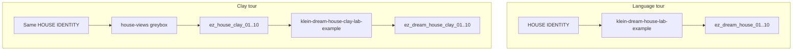

# Dream-house tours

**What's on this page**

- Two doors to a ten-still Instagram 4:5 walkthrough
- When to use language persistence vs a 3D greybox
- Occupancy: stop Comfy before a Blender `house-views` dump (`--install-inputs` / `--seed-inputs` may run while Comfy is up)
- `start` seeds LoadImage plates so the clay App can Queue without a dump

**What this enables**

- Keeping **klein-dream-house-lab-example** as a one-Queue language tour
- Using a real 3D scene so rooms stay adjacent while Klein only paints materials

**Who this is for:** studio users who already Queued the T2I dream-house and want the rooms to share a floorplan.

---

## Two doors

The T2I tour remembers the place in prose (`HOUSE IDENTITY` + Prompt Join `lock=view`). The clay tour remembers it as geometry: Blender dumps ten Workbench stills from named cameras, then Klein **edit** restyles each plate.



| Graph | Persistence | When |
| --- | --- | --- |
| **klein-dream-house-lab-example** | Prompt Join `lock=view`. Independent T2I | No Blender, or you want a one-Queue draft |
| **klein-dream-house-clay-lab-example** | One greybox + ten cameras. Klein edit + `ReferenceLatent` | You want the kitchen to stay next to the lounge. `start` seeds plates; Blender dump is optional Workbench quality |

Same ten cameras (tower, foyer, lounge, kitchen, dining, bedroom, bath, terrace, drone, study). Same 1024×1280 Instagram 4:5. Same optional style dropdown on the bible. Prefixes do **not** collide.

TRELLIS.2 is a hero-piece tool, not a walkable house. Do not TRELLIS a full-scene still and expect a foyer. Godot is P2 — `house-views` is Blender only.

---

## Clay loop

`manage.sh start` seeds `ez_house_clay_01.png` … `10.png` into `${COMFY_OUTPUT_DIR}/input` (container `/inputs`) so LoadImage can Queue. If a `house-views` pack already exists it is copied; otherwise the shipped `schemas/house_layout.yaml` cameras are rendered (no Blender). Reload the App if it was open before seed.

Optional Workbench dump (higher quality) — stop Comfy first:

```bash
./scripts/manage.sh stop
./scripts/manage.sh house-views --slug lab-penthouse
# optional: --layout /path/to/house_layout.yaml
./scripts/manage.sh start   # type yes
# Queue workflows/_lab/klein/klein-dream-house-clay-lab-example.json
```

Dump lives under `${COMFY_OUTPUT_DIR}/assets/sets/<slug>/` (layout, `mesh/house.glb`, `views/`, `depth/`). Clay copies `ez_house_clay_01.png` … `10.png` land in that folder and in `${COMFY_OUTPUT_DIR}/input`. LoadImage does **not** list the output root.

Already dumped but Clay 01–10 show **Missing Inputs** / “no file selected”? Copy or reseed without Blender (compose may stay up), then reload the graph:

```bash
./scripts/manage.sh house-views --slug lab-penthouse --install-inputs
./scripts/manage.sh house-views --slug lab-penthouse --seed-inputs
```

Default layout is `schemas/house_layout.yaml` (lab penthouse matching the canned bible). `--layout` overrides. v1 does not invent a unique floorplan from prose.

---

## Skip rules

| If | Skip |
| --- | --- |
| No host Blender | Workbench dump. `start` / `--seed-inputs` still render layout cameras. Language-only tour → **klein-dream-house-lab-example**. Do not substitute T2I stills or `example.png` as clay |
| Compose is up | Blender `house-views` dump (exit 2). `./scripts/manage.sh stop` first. `--install-inputs` and `--seed-inputs` may run while compose is up |
| You only needed a language bible | Clay dump. Queue **klein-dream-house-lab-example** |

---

## Occupancy

One GB10 job. A Blender `house-views` dump dies if compose is up (exit 2), same XOR as `export-guides`. `--install-inputs` and `--seed-inputs` are host file writes and may run while Comfy is up. Do not Queue the clay graph and a Blender dump in one session. `restart: "no"`, type **yes** on start, headroom, and download-limit clear-on-exit are unchanged. Blender is never in the Dockerfile.

Related: [Clay to finish](clay-to-finish.md) (film Path B), [DCC guide pack](../dcc-workflows.md) (1280×704 / 120f LTX packs — different contract), [Asset Bible](../asset-bible.md), [Prompting](../prompting.md).
