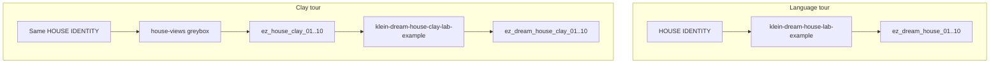

# Dream-house tours

**What's on this page**

- Two doors to a ten-still Instagram 4:5 walkthrough
- When to use language persistence vs a 3D greybox
- Occupancy: stop Comfy before `house-views`
- Skip rule when Blender is missing

**What this enables**

- Keeping **klein-dream-house-lab-example** as a one-Queue language tour
- Using a real 3D scene so rooms stay adjacent while Klein only paints materials

**Who this is for:** studio users who already Queued the T2I dream-house and want the rooms to share a floorplan.

---

## Two doors

The T2I tour remembers the place in prose (`HOUSE IDENTITY` + Prompt Join `lock=view`). The clay tour remembers it as geometry: Blender dumps ten Workbench stills from named cameras, then Klein **edit** restyles each plate.



| Graph | Persistence | When |
| --- | --- | --- |
| **klein-dream-house-lab-example** | Prompt Join `lock=view`. Independent T2I | No Blender, or you want a one-Queue draft |
| **klein-dream-house-clay-lab-example** | One greybox + ten cameras. Klein edit + `ReferenceLatent` | Host Blender on `PATH`. You want the kitchen to stay next to the lounge |

Same ten cameras (tower, foyer, lounge, kitchen, dining, bedroom, bath, terrace, drone, study). Same 1024×1280 Instagram 4:5. Same optional style dropdown on the bible. Prefixes do **not** collide.

TRELLIS.2 is a hero-piece tool, not a walkable house. Do not TRELLIS a full-scene still and expect a foyer. Godot is P2 — `house-views` is Blender only.

---

## Clay loop

```bash
./scripts/manage.sh stop
./scripts/manage.sh house-views --slug lab-penthouse
# optional: --layout /path/to/house_layout.yaml
./scripts/manage.sh start   # type yes
# Queue workflows/_lab/klein/klein-dream-house-clay-lab-example.json
```

Dump lives under `${COMFY_OUTPUT_DIR}/assets/sets/<slug>/` (layout, `mesh/house.glb`, `views/`, `depth/`). Clay copies `ez_house_clay_01.png` … `10.png` land in that folder and in `COMFY_OUTPUT_DIR` so LoadImage finds them.

Default layout is `schemas/house_layout.yaml` (lab penthouse matching the canned bible). `--layout` overrides. v1 does not invent a unique floorplan from prose.

---

## Skip rules

| If | Skip |
| --- | --- |
| No host Blender | Clay tour. Use the T2I dream-house. Do not fake clay |
| Compose is up | `house-views` (exit 2). `./scripts/manage.sh stop` first |
| You only needed a language bible | Clay dump. Queue **klein-dream-house-lab-example** |

---

## Occupancy

One GB10 job. `house-views` dies if compose is up (exit 2), same XOR as `export-guides`. Do not Queue the clay graph and a dump in one session. `restart: "no"`, type **yes** on start, headroom, and download-limit clear-on-exit are unchanged. Blender is never in the Dockerfile.

Related: [Clay to finish](clay-to-finish.md) (film Path B), [DCC guide pack](../dcc-workflows.md) (1280×704 / 120f LTX packs — different contract), [Asset Bible](../asset-bible.md), [Prompting](../prompting.md).
