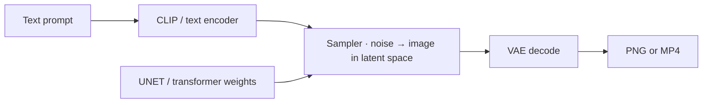
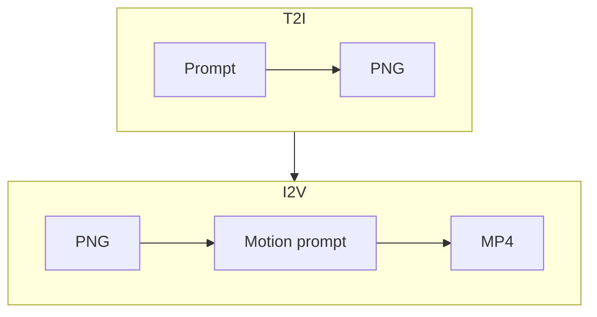

# Image and video generation

**What's on this page**

- The three-part engine: text encoder, denoiser, VAE
- Latent size, frame counts, and the LTX ÷32 rule
- Steps, CFG, and distilled Klein
- T2I / I2V / T2V / A2V in one table

**What this enables**

- Reading a lab graph without treating every node as magic
- Avoiding the two classic Spark-melters: 720p on LTX, and a 90 s latent

**Who this is for:** studio users who can Queue a still and want to know *why* the widgets look like that.

---

## Three boxes

Every lab still or clip is the same shape:

| Piece | Job in this studio |
| --- | --- |
| **CLIP** | Turns words into conditioning. Klein uses Qwen (`flux2`), Wan uses UMT5 (`wan`), LTX uses Gemma4-with-proj (`ltxv`) |
| **Denoiser** | Walks noise toward a sample for N **steps** at a **CFG** and **seed** |
| **VAE** | Decodes latents to pixels (and LTX audio). Each family has its own VAE — do not mix |

Wrong CLIP type on a Klein graph is a Queue error, not a “bad prompt.”

---

## Latents are where size lives

The sampler does not paint a PNG directly. It denoises a **latent** tensor. Width, height, and frame count are latent widgets.

| Goal | Lab default | Why |
| --- | --- | --- |
| Fast still | Klein draft **768×432**, 4 steps | Minutes, not a hero |
| I2V feeder / LTX | **1280×704** | LTX VAE is **÷32**. 1280×720 is not (720/16=45) |
| ~5 s motion | LTX **121** frames (`1+8n`) @ 24 fps ≈ **5.04 s**; Wan shot **120** = **5.00 s** | Iterate in minutes |
| 90 s film | **18 × 5.00 s** + stitch | Not a 90 s denoise |

Typing 720 or 1080 on an LTX widget is auto-snapped (704 / 1056) by `ez_ltx_spatial`. Prefer 704 so you skip the extra crop. The same pack snaps illegal **120** length to **121** (`1+8n`). Portrait shorts I2V is **768×1280**.

!!! warning "Do not Queue a 30 / 60 / 90 s latent"

    Long latents melt GB10. Film graphs still use 121-frame (`1+8n`) LTX printers. See [90s shorts](../shorts.md).

---

## Distilled Klein: CFG 1.0 / 4 steps

Distilled Klein is **not** “turn CFG up for quality.” Quality is the **positive** prompt (and resolution/steps on the hero graph). FLUX-family models do not use negatives well — put constraints in the positive (“unmarked facades, empty of signage”).

Wan and LTX pin their own steps on the canvas. Change them on purpose; do not copy an SD1.5 recipe.

---

## Modalities

| Code | Means | Start image? | Audio? | Default model |
| --- | --- | --- | --- | --- |
| **T2I** | Text → still | No | — | Klein 4B |
| **I2V** | Still → clip | **Yes — owns look** | Wan silent / LTX world audio | Wan 5B or LTX-2.5 |
| **T2V** | Text → clip | No | Wan silent / LTX AV | Wan 5B or LTX-2.5 |
| **A2V** | Soundtrack → picture | Often a freeze still | Input audio | LTX talking-head smoke |
| **S2V** | Speech → picture | Optional | Speech | Opt-in Wan 14B |

I2V prompt = **motion + one camera move**. Do not re-describe the coat and the city; the PNG already did.

Next: [Klein, Wan, and LTX](pipeline.md) · [Prompting](../prompting.md).
