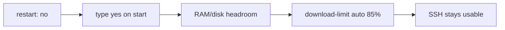
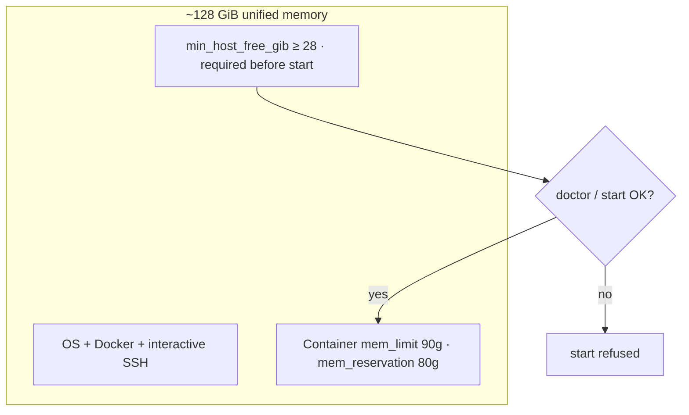
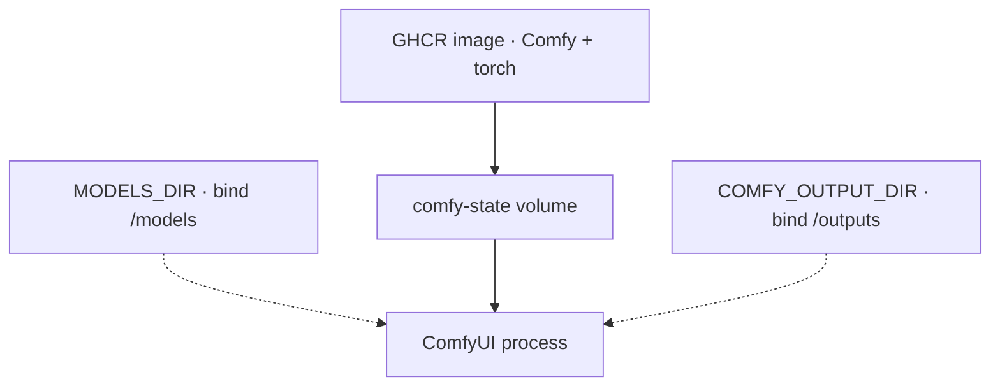
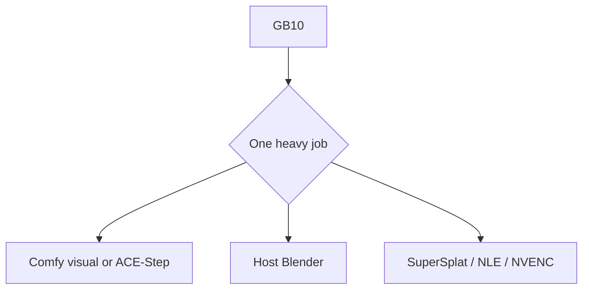
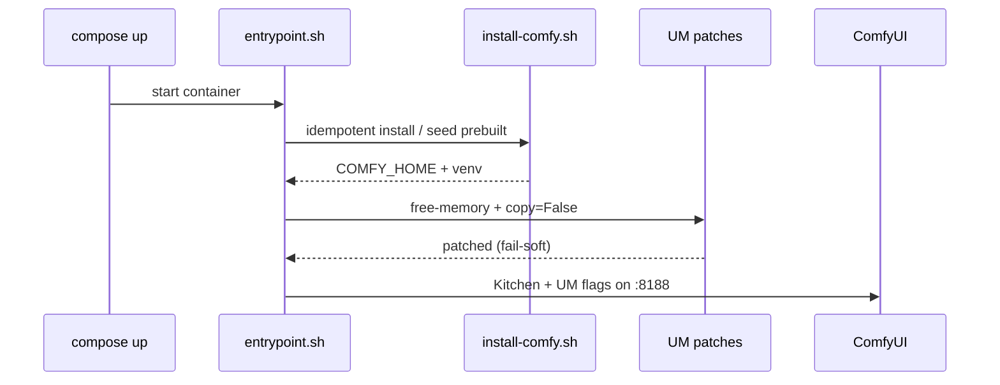

# Hardware, memory, and safety

**What's on this page**

- Why SSH recoverability shapes every default
- Unified memory, 90g limit, headroom preflight
- Image vs weights vs comfy-state
- Occupancy, Kitchen attention, and the entrypoint

**What this enables**

- Operating a remote Spark without locking yourself out
- Knowing what `cleanup`, `stop`, and `download-models` each delete or keep

**Who this is for:** operators, and studio users who just hit OOM or a slow Queue.

!!! warning "Do not weaken"

    `restart: "no"`, type **yes** on start, headroom preflight, and download-limit **clear-on-exit** are the SSH-safe defaults. Demos do not get a pass.

---

## The constraint is SSH, not the demo

DGX Spark nodes are often driven over the internet with no KVM. A 90g GPU job that auto-starts on boot, or a full-rate Hugging Face pull, is how you lose the box.



Details: [Reboot safety](../reboot-safety.md) · [Download limit](../download-limit.md).

---

## Unified memory on GB10

GB10 shares **~128 GiB** among OS, SSH, Docker, and Comfy. There is no separate giant VRAM island.



Lab flags (do not “optimize” these away):

| Setting | Why |
| --- | --- |
| Default VRAM + offload flags | Unified memory. Omit `--highvram` / `--gpu-only`. ComfyUI dropped `--normalvram` |
| `patch_unified_memory_copy.py` | `copy=False` so UM does not double weights |
| `patch_get_free_memory.py` | Host free RAM instead of under-reporting `cudaMemGetInfo` |
| `--use-ck-attention` | Comfy Kitchen. XOR Sage — never both |
| `TORCH_COMPILE_DISABLE=1` | Triton compile off by default on sm_121 |
| Occupancy | One heavy GPU job |

`doctor` must **not** print `attention: pytorch-fallback` on a running Spark (10–20× slow). spark-timing is measured on a real Spark after Kitchen is live — CI does not invent seconds.

```bash
./scripts/manage.sh doctor
# Queue klein-still-draft, wan-i2v-5s, ltx-i2v-5s
./scripts/manage.sh spark-timing record --klein N --wan N --ltx N
```

---

## Three stores

| Store | What it is | Destroyed by |
| --- | --- | --- |
| **GHCR image** | ComfyUI + PyTorch (`us-safe-studio` / `-development`) | Re-pull / rebuild. **No weights** |
| **MODELS_DIR** | Klein / Wan / LTX / GGUF on the host (default `/mnt/models`) | You, or `reap-models`. **Not** `cleanup` |
| **comfy-state volume** | Comfy install, custom nodes, seeded workflows | `cleanup` (type `DELETE`) |

Outputs live in **COMFY_OUTPUT_DIR** (default `/mnt/comfy-output`). `cleanup` does not delete them.



---

## Occupancy

GB10 is **one** GPU.



`manage.sh blender`, `film-proxies`, and NVENC preview **die if compose is up**. Cover art is a separate Klein session from podcast/rap.

---

## What happens on start



First start usually **seeds** from `/opt/comfy-prebuilt`. Without that image, cold pip is **10–30+ minutes**. Ops scripts are bind-mounted — edit them on the host and restart; do not rebuild for an entrypoint typo.

Operator first run: [Getting Started](../getting-started.md). Command catalog: [manage.sh reference](../manage-cli.md).
