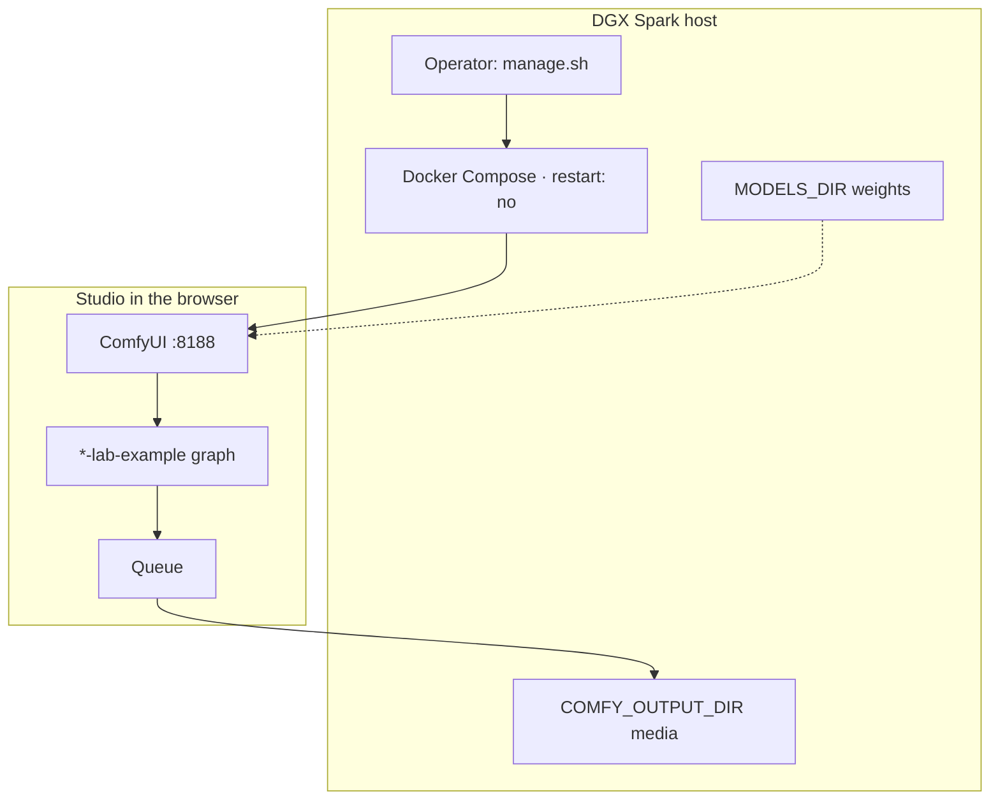
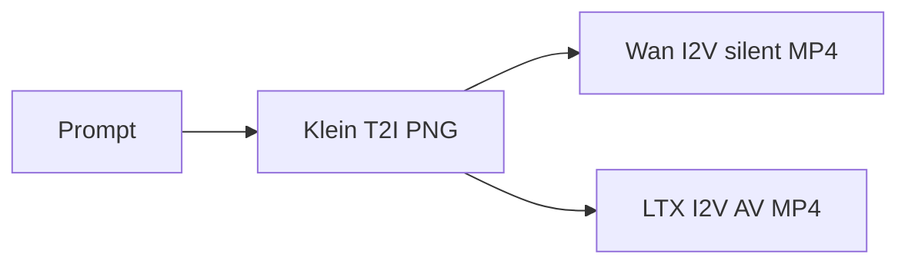

# How the studio works

**What's on this page**

- What this project is (and is not)
- Operator vs studio user
- The still → silent 5 s → AV 5 s loop
- Where to read next

**What this enables**

- Choosing the right tab (Learn, Start, Create, Operate) on the first visit
- Naming the pieces you will touch: manage.sh, ComfyUI, Klein, Wan, LTX

**Who this is for:** someone new to the repo, ComfyUI, or DGX Spark.

---

## The one-sentence version

ez-comfy-stack is a **sample US-safe local studio**: ComfyUI in Docker on **one** NVIDIA DGX Spark, with Apache Klein 4B stills, Apache Wan 2.2 silent motion, and LTX-2.5 joint AV.

It is **not** nvidia-dgx-spark-lab (no K3s, no dashboard, no multi-node NCCL). Graduate to the lab when you outgrow a demo.

-   :material-account-cog:{ .lg .middle } **Operator**

    ---

    SSH to the Spark. Run `./scripts/manage.sh` for setup, doctor, downloads, start (type **yes**), and stop.

    [:octicons-arrow-right-24: Getting Started](../getting-started.md)

-   :material-palette:{ .lg .middle } **Studio user**

    ---

    Browser at port **8188**. Load a `*-lab-example` graph, change widgets, Queue, pick PNG/MP4 from `COMFY_OUTPUT_DIR`.

    [:octicons-arrow-right-24: ComfyUI basics](comfyui.md)

-   :material-shield-check:{ .lg .middle } **US-safe defaults**

    ---

    Local weights only. Klein + Wan are Apache; LTX is Community License (gated, $10M cap). MiniMax H3 is banned.

    [:octicons-arrow-right-24: Model licenses](../licenses.md)

-   :material-book-alphabet:{ .lg .middle } **Glossary**

    ---

    Dotted terms open a definition dialog. This Learn section teaches the ideas behind those words.

    [:octicons-arrow-right-24: Glossary](../glossary.md)

---

## Two jobs, one machine

You can be both people. First-time path is still operator-shaped (clone, doctor, download, start), then you become a studio user for the first still.

---

## What you make

Text → **still** (Klein) → **silent ~5 s** (Wan) → **AV ~5 s** (LTX). Iterate in minutes. A 90 s YouTube short is **18 × 5 s** prints stitched, not one 90 s denoise.

Learn the models: [Klein, Wan, and LTX](pipeline.md). Learn the math-lite version of latents and steps: [Image and video generation](generation.md). Learn why SSH-safe defaults exist: [Hardware, memory, and safety](hardware.md).

---

## Suggested order

1. This page (you are here)
2. [ComfyUI basics](comfyui.md) — canvas nouns
3. [Getting Started](../getting-started.md) — first successful still
4. [Prompting](../prompting.md) — how each model reads text
5. [Still to motion to AV](../visual-generative-ai.md) — the daily playbook
6. [Clay to finish](clay-to-finish.md) — script → clay → look → print → stems
7. [Blender creator suite](blender-creator.md) — stills + 5.00s packs from host Blender
8. [Dream-house tours](dream-house.md) — language T2I vs Blender greybox + Klein restyle
9. [Workflow catalog](../studio-workflows.md) — which graph for a thumbnail, GIF, or 90s film

Something broke: [Troubleshooting](../troubleshooting.md). Before reboot: [Reboot safety](../reboot-safety.md).
