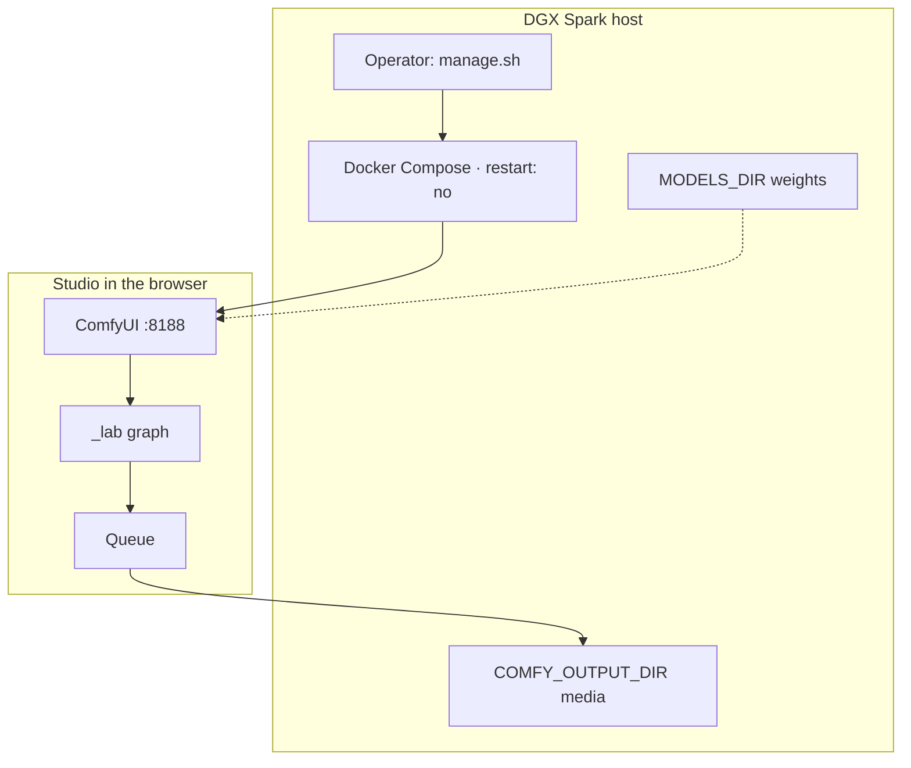
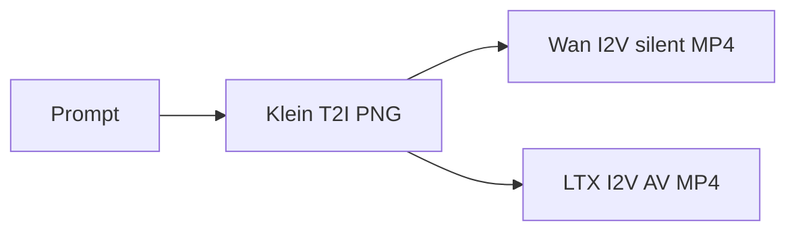

# How the studio works

**What's on this page**

- What this project is (and is not)
- Operator vs studio user
- The still → silent 5 s → AV 8 s loop
- Where to read next

**What this enables**

- Choosing the right tab (Learn, Get started, Studio, Operate, Reference) on the first visit
- Naming the pieces you will touch: manage.sh, ComfyUI, Klein, Wan, LTX

**Who this is for:** someone new to the repo, ComfyUI, or DGX Spark.

---

## The one-sentence version

ez-comfy-stack is a **sample US-safe local studio**: ComfyUI in Docker on **one** NVIDIA DGX Spark, with Apache Klein 4B stills, Apache Wan 2.2 silent motion, and LTX-2.5 joint AV.

It is **not** nvidia-dgx-spark-lab (no K3s, no dashboard, no multi-node NCCL). How the pieces fit: [Architecture](architecture.md). When to graduate: [When to use vs spark-lab](../start/when-to-use-vs-spark-lab.md).

<Cards>
  <Card title="Operator">
    ---

    SSH to the Spark. Run `./scripts/manage.sh` for setup, doctor, downloads, start (type **yes**), and stop.

    [Getting Started](../getting-started.md)
  </Card>
  <Card title="Studio user">
    ---

    Browser at port **8188**. Load a `_lab` graph, change widgets, Queue, pick PNG/MP4 from `COMFY_OUTPUT_DIR`.

    [ComfyUI basics](comfyui.md)
  </Card>
  <Card title="US-safe defaults">
    ---

    Local weights only. Klein + Wan are Apache; LTX is Community License (gated, $10M cap). MiniMax H3 is banned.

    [Model licenses](../licenses.md)
  </Card>
  <Card title="Glossary">
    ---

    Dotted terms open a definition dialog. This Learn section teaches the ideas behind those words.

    [Glossary](../glossary.md)
  </Card>
</Cards>

---

## Two jobs, one machine

You can be both people. First-time path is still operator-shaped (clone, doctor, download, start), then you become a studio user for the first still.

---

## What you make

Text → **still** (Klein) → **silent ~5 s** (Wan) → **AV ~5 s** (LTX). Iterate in minutes. A 90 s YouTube short is **18 × 5 s** prints stitched, not one 90 s denoise.

Learn the models: [Klein, Wan, and LTX](pipeline.md). Learn the math-lite version of latents and steps: [Image and video generation](generation.md). Learn why SSH-safe defaults exist: [Hardware, memory, and safety](hardware.md).

---

## Suggested order

This tab is a course. Read top to bottom; skip a lesson only if you already know it.

1. This page (you are here) — roles and the still → silent → AV loop
2. [ComfyUI basics](comfyui.md) — graph, App Mode, Queue
3. [Image and video generation](generation.md) — latents, steps, I2V
4. [Klein, Wan, and LTX](pipeline.md) — why these three models
5. [Why one heavy job](occupancy.md) — occupancy as an idea
6. [Hardware, memory, and safety](hardware.md) — why SSH-safe defaults exist
7. [Architecture](architecture.md) — Compose, three stores
8. [How we land changes](merges.md) — merge commits, stacked PRs (contributors)
9. Optional DCC: [Clay to finish](clay-to-finish.md) · [Blender creator suite](blender-creator.md) · [Dream-house tours](dream-house.md)
10. [Glossary](../glossary.md) — dictionary, not the course

Then leave Learn: [Getting Started](../getting-started.md) for the first still, [Still to motion to AV](../visual-generative-ai.md) for the daily playbook, [Workflow catalog](../studio-workflows.md) for filenames.

Something broke: [Troubleshooting](../troubleshooting.md). Before reboot: [Reboot safety](../reboot-safety.md).
