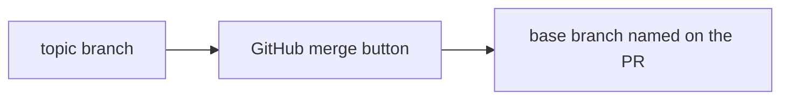
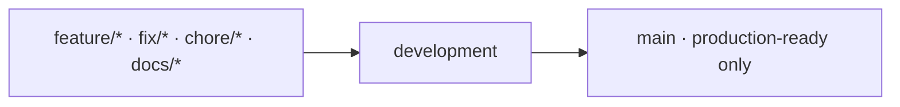
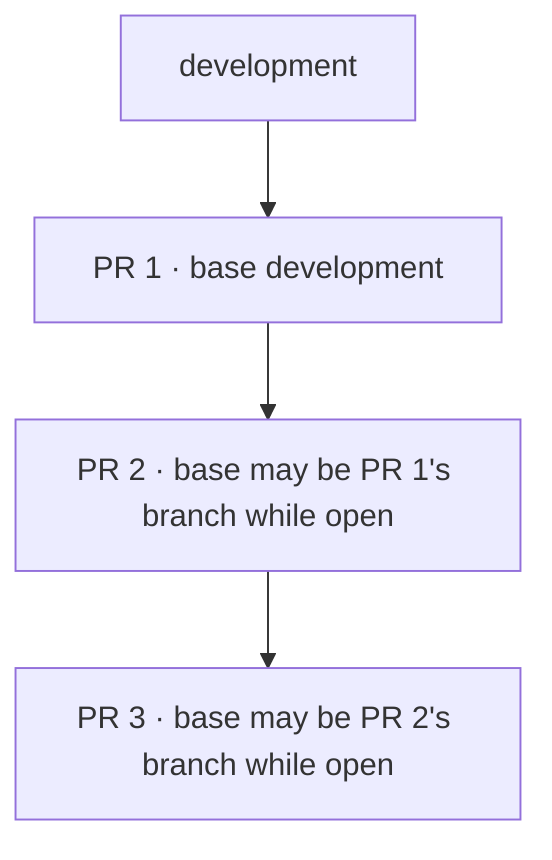
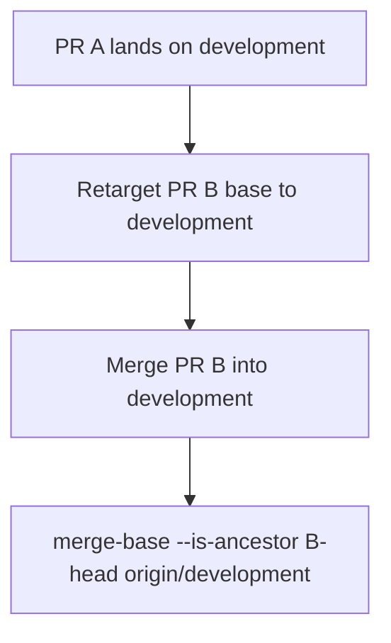

# How we land changes

**What's on this page**

- What a merge is (and which GitHub button we use)
- Stacked independently-green PRs as the large-change pattern
- The landing rule: every merge that counts targets `development`
- How to prove a PR actually landed

**What this enables**

- Landing a stack without GitHub marking a PR Merged while `development` stays unchanged
- Resolving overlapping files in the order the commits intended
- Choosing merge commit, squash, or rebase on purpose instead of by habit

**Who this is for:** contributors and agents opening PRs into `development`. Studio users can skip this lesson.

Canonical contributor checklist: [Contributing](../contribute/contributing.md). Agent workflow: [AGENTS.md](https://github.com/toxicoder/ez-comfy-stack/blob/__DOCS_GIT_REF__/AGENTS.md).

---

## What a merge is

A **merge** is how one branch's commits become reachable from another branch. GitHub's green button can do that three ways. The **base** of the pull request is the branch that receives the result.

| Method | What GitHub writes | We use it? |
| --- | --- | --- |
| **Merge commit** (`Merge pull request #N`) | A two-parent commit on the **base** branch. Topic commits stay in history. | **Yes — this is how we land into `development`.** |
| **Squash** | One new commit on the base. The topic branch's individual commits disappear from that history. | No for integration. Do not squash stacked feature PRs. `main` promotions have used squash-style titles historically; that is not the feature-landing path. |
| **Rebase (GitHub)** | Replay the PR commits onto the tip of the base, linear history, no merge commit. | No for landing. Local `git rebase` onto latest `development` **before** you open or update a PR is fine. |
| **Fast-forward** | Move the branch pointer when there is no divergence. | Rare. Use `git pull --ff-only origin development` when updating your local integration branch. |



The important noun is **base**. GitHub merges into whatever base the PR currently names. If that base is another `feature/*` / `fix/*` / `feat/*` branch, `development` does not move, even though the PR shows **Merged**.

---

## This repo's integration shape



1. Update integration: `git fetch origin && git checkout development && git pull --ff-only origin development`
2. Branch `feature/…`, `fix/…`, `chore/…`, or `docs/…` from that tip
3. Open a PR **into `development`**
4. Land with a **merge commit**
5. Promote to `main` only when the tree is production-ready

Do not commit feature work on `development` or `main`. Do not base a new branch on `main` (hotfix exception lives in AGENTS.md).

---

## Stacked independently-green PRs

Large work is split so each PR is independently green (`bazelisk run //:validate`) and reviewable. While the stack is **open**, PR 2 may target PR 1's branch so the GitHub diff is only PR 2's unique commits:



That targeting is for **review**. It is not how you land.

### Landing rule

1. Merge **PR 1 into `development`** (merge commit).
2. **Retarget** PR 2's base to `development` (GitHub: Edit → base). Confirm the Files tab is still PR 2's unique delta.
3. Merge PR 2 **into `development`**. Repeat down the stack.
4. Never click Merge on a PR whose base is still another topic branch.
5. After each merge, prove the unique commits are ancestors of integration:

```bash
git fetch origin
git merge-base --is-ancestor <pr-head-sha> origin/development
```

Exit 0 means the commit is in `development`. Exit 1 means GitHub's Merged badge is not enough — the work is on the old topic branch only.

Merging the **tip** of the stack into `development` once also works when every unique commit is already on that tip. Merging each stacked PR into its feature-branch base does not.

### Why this failed once

App Mode PRs **#266 → #268 → #267 → #265** were stacked. #266 targeted `development` and landed. #268 / #267 / #265 targeted the previous topic branches. All four were marked Merged within a minute. Only #266 reached `development`. Media picker, 300 styles / 30 sample recipes, and the LTX duration combo had to be restored later, keeping the later **#274** 8 s LTX default.

---

## Overlapping files and conflict order

When two PRs touch the same file, merge **bottom of stack first**. Keep **both** intents in the conflict resolution; last-writer-wins is a defect.

Examples that did this correctly:

- **#253** then **#254**: `docs/getting-started.md` kept job-folder paths (`stills/still-draft`) **and** the Outputs sidebar sentence.
- **#270** / **#269** then **#271** / **#272**: docs IA and setup-client / services pack. #271 and #272 were retargeted to `development` before merge. The `nav.json` conflict was additive.



---

## Local rebase vs landing rebase

| Action | When |
| --- | --- |
| `git fetch origin && git rebase origin/development` on your topic branch | Before opening a PR, or when `development` moved and you need a clean diff |
| GitHub “Rebase and merge” | Do not use to land into `development` |
| `git pull --ff-only origin development` | Updating your local `development` |

Prefer stacked independently-green PRs over one giant change. Tests ship in the same commit as the production files they cover.

---

## Related

| Need | Page |
| --- | --- |
| Branch + TDD + PR checklist | [Contributing](../contribute/contributing.md) |
| Conventions, including Branches | [Project conventions](../project-conventions.md) |
| First still after clone | [Getting Started](../getting-started.md) |
