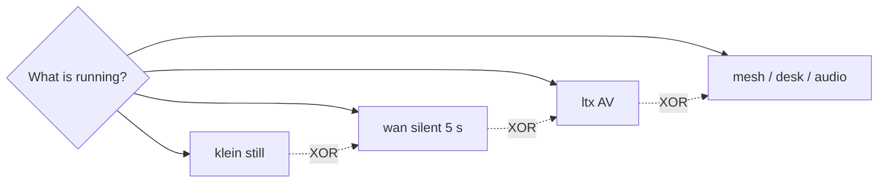

# Why one heavy job

**What's on this page**

- What occupancy means in this studio
- Why Klein, Wan, LTX, TRELLIS, and the 35B desk cannot share a session
- Park vs stop vs reboot
- Where to look up the exact mode table

**What this enables**

- **Choosing** one job before you Queue, instead of stacking models until the host swaps
- **Knowing** why the App chip says klein / wan / ltx
- **Jumping** to the occupancy desk when you need to park Comfy for Blender

**Who this is for:** learners after [Klein, Wan, and LTX](pipeline.md). Operators: [Occupancy desk](../occupancy.md). Lookup: [Occupancy matrix](../operate/occupancy-matrix.md).

---

## One GB10, one heavy job

The Spark has a lot of unified memory, but this stack still treats the GPU as **one** heavy occupant. A Klein still, a Wan 5 s clip, an LTX AV shot, a TRELLIS mesh, and the optional 35B writing desk each want the same RAM. Running two of them is how SSH dies.

Occupancy is the name for that rule. The App chip on a lab graph is not decoration — it is the job you just reserved.

You do **not** need the matrix to Queue `stills/still-draft`. You do need it before you park Comfy for Blender or start the 35B sidecar.

---

## Park, stop, reboot

| Action | What it does |
| --- | --- |
| **Queue another App** | Unload the previous occupant first if the chip changed |
| **Park** (`occupancy enter …`) | `POST /free` unloads weights; the container can stay up |
| **Stop** | Container down. Type **yes** on the next `start` |
| **Reboot the Spark** | Always `stop` first. Compose `restart: "no"` will not bring Comfy back |

This does **not** weaken `restart: "no"`, headroom preflight, or download-limit clear-on-exit.

---

## Next

<Cards>
  <Card title="Hardware and safety">
    ---

    Why the memory limit, headroom, and download throttle exist.

    [Hardware, memory, and safety](hardware.md)
  </Card>
  <Card title="Occupancy desk">
    ---

    Park Comfy, enter blender-desk or llm-desk, restore a visual occupant.

    [Occupancy desk](../occupancy.md)
  </Card>
</Cards>
