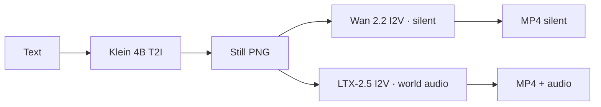
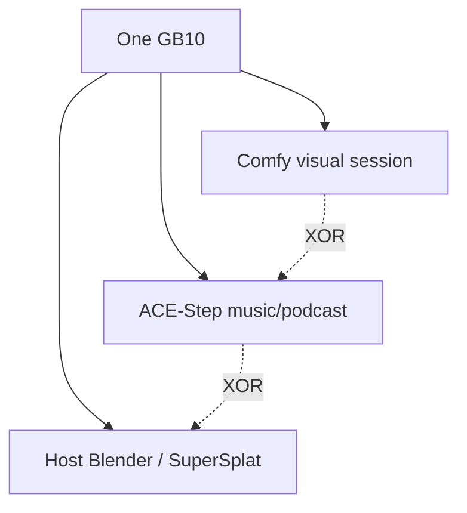

# Klein, Wan, and LTX

**What's on this page**

- Role split (still / silent motion / joint AV)
- Licenses in one traffic-light
- What you type vs what each encoder hears
- Occupancy: do not stack ACE-Step on LTX

**What this enables**

- Picking the next graph after a still without guessing
- Prompting each model in its native shape

**Who this is for:** studio users who have Queued `klein-still-draft-lab-example` once.

---

## Three jobs, three licenses

| Model | Job | Encoder | License |
| --- | --- | --- | --- |
| **Klein 4B** distilled FP8 | Still (T2I, optional edit) | Qwen3-4B · `flux2` | Apache 2.0 |
| **Wan 2.2** TI2V-5B | Silent T2V / I2V ~5 s | UMT5-XXL · `wan` | Apache 2.0 — **no native audio** |
| **LTX-2.5** distilled INT8-convrot | Joint AV ~5 s | Gemma4-with-proj · `ltxv` | Community License, **gated**, $10M company cap |

Klein 9B and FLUX.2-dev are not defaults. MiniMax H3 is banned (US Excluded Territory). Canonical table: [Model licenses](../licenses.md).

**Handoff:** Queue a Klein still → set Wan **LoadImage** to that PNG → optional LTX I2V from the **same** first frame at **1280×704**.

---

## What you type vs what they hear

=== "Klein (still)"

    Sentences. Subject → place → light → camera. Under ~150 words. Positive opposites, not “no logos”. Distilled = CFG 1.0 / 4 steps, so the Positive widget *is* the quality knob.

=== "Wan I2V"

    The PNG owns look. Prompt **motion + one camera verb** (`dolly in`, `pan`, `tracking`, `fixed camera`). Silent — do not prompt a score, foley, or dialogue.

=== "Wan T2V"

    Entity + scene + motion + aesthetic + one camera move, about 80–120 words. Still no audio.

=== "LTX AV"

    One flowing **present-tense** paragraph, 4–8 sentences, **sound interleaved** (wind beside the coat, not a trailer at the end). Dialogue in `"quotes"` only if you asked for speech. Shorts: world SFX, no score.

Lab `*-lab-example` graphs already ship model-native text. Leave **Enhance** off unless you replace that text with something short. Recipes: [Prompting](../prompting.md).

---

## Why not one model for everything

- **Wan** is the legally cleanest motion default (Apache) and the cheap 5 s rehearsal. It cannot mux world audio.
- **LTX** is the AV hero and is **not** Apache. You accept a gated license and a revenue cap for that audio.
- **Klein** is the identity lock. A 90s film is Klein identity + 18 LTX prints, not a 90s Wan denoise.

Optional fallbacks (Z-Image, Wan A14B, LTX-2.3) live on [Models and cache](../models-and-cache.md). They are not the first download.

---

## Occupancy

Do **not** load Klein + Wan + LTX + ACE-Step in one session. Cover art is a separate Klein graph. Podcast and rap packs are opt-in and share the ACE-Step AIO file.

Playbook after this page: [Still to motion to AV](../visual-generative-ai.md). Which filename to load: [Workflow catalog](../studio-workflows.md).
