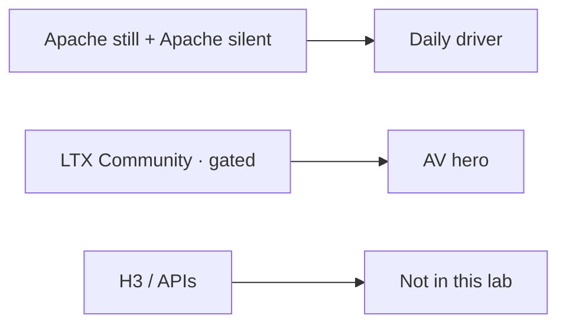

# Model licenses

**What's on this page**

- Who this policy is for (US casual commercial, local weights only)
- Canonical table (same rows as repo-root `LICENSE-MODELS.md`)
- What we download by default vs omit
- LTX $10M company-revenue cap vs Wan Apache silent video
- How 90s shorts split Klein still / optional silent Wan / LTX AV print
- Free Commercial Use (\<$10M) quality: Klein 4B → optional SeedVR2 → LTX-2.5
- What is banned (MiniMax H3, MiniMax Music 3, Suno/Udio, API-only) vs opt-in NC (Klein 9B, FLUX.2-dev)

**What this enables**

- A grep-able policy CI can test
- Honest copy: LTX is the audio model and is **not Apache**; Wan is the legally cleanest motion model and has **no native audio**
- Operators can Queue the lab graphs without pulling US-excluded or non-commercial defaults

<Callout type="warning" title="Not legal advice">
  This page encodes the stack’s **download and workflow policy**. It is not legal advice. Read each Hugging Face model card and license before you monetize. Company-revenue caps (LTX) count **affiliates**.
</Callout>

## Defaults vs gated vs banned

| Bucket | Meaning |
| --- | --- |
| **Default download** | Klein 4B still (Apache) + Wan 2.2 silent (Apache) + LTX-2.5 AV (LTX Community License, **gated**, $10M company cap) + Prompt Enhance GGUF |
| **Gated** | LTX-2.5 (LTX Community License): token **and** a license click as that Hugging Face user |
| **Opt-in** | Podcast (Kokoro, ACE-Step), rap AIO, Qwen3.6-35B-A3B GGUF (`download-llm --tier qwen36-35b-a3b`, occupancy `llm-desk`), describe VLM (`download-llm --tier describe`), cubic person mask (DeepLabV3 ResNet50, BSD-3, first Cubic block world Queue, not in `download-models`), Z-Image, Wan A14B, Fun InP, TRELLIS.2, … |
| **Banned** | MiniMax H3 (US Excluded Territory for weights **and** outputs), cloud partner APIs, NC TTS packs, Nunchaku 9B |
| **Opt-in NC** | Klein 9B and FLUX.2-dev: `download-image --tier 9b` / `flux2-dev`. Not YouTube-ok. Not lab UNET pins. |

## Audience

US-based casual content creators: YouTube, client shorts, ads under a **small LLC**. Run **only locally hosted** models. No fal / Comfy Cloud / MiniMax API / Kling / Seedance / Veo partner nodes in lab graphs.

## Canonical table

Columns: model | HF repo | license name | US self-host OK? | monetized YouTube OK? | $ threshold | attribution | distillation ban | default download?

| model | HF repo | license name | US self-host OK? | monetized YouTube OK? | $ threshold | attribution | distillation ban | default download? |
| --- | --- | --- | --- | --- | --- | --- | --- | --- |
| FLUX.2 Klein 4B distilled FP8 | black-forest-labs/FLUX.2-klein-4b-fp8 | Apache 2.0 | Yes | Yes | none | Apache NOTICE if you redistribute weights | No extra ban beyond Apache | Yes |
| FLUX.2 Klein 4B base FP8 | black-forest-labs/FLUX.2-klein-base-4b-fp8 | Apache 2.0 | Yes | Yes | none | Apache NOTICE if you redistribute weights | No extra ban beyond Apache | No |
| FLUX.2 Klein 4B NVFP4 | black-forest-labs/FLUX.2-klein-4b-nvfp4 | Apache 2.0 | Yes | Yes | none | Apache NOTICE if you redistribute weights | No extra ban beyond Apache | No |
| Qwen3-4B text encoder (Klein 4B companion) | Comfy-Org/flux2-klein-4B | Apache 2.0 | Yes | Yes | none | Apache NOTICE if you redistribute weights | No extra ban beyond Apache | Yes |
| FLUX.2 VAE | Comfy-Org/flux2-dev (split_files/vae) | Apache 2.0 companion | Yes | Yes | none | follow card | No extra ban beyond card | Yes |
| FLUX.2 small decoder VAE | black-forest-labs/FLUX.2-small-decoder | Apache 2.0 | Yes | Yes | none | Apache NOTICE if you redistribute weights | No extra ban beyond Apache | No |
| Z-Image Turbo | Comfy-Org/z_image_turbo | Apache 2.0 | Yes | Yes | none | Apache NOTICE if you redistribute weights | No extra ban beyond Apache | No |
| Wan 2.2 TI2V-5B | Comfy-Org/Wan_2.2_ComfyUI_Repackaged | Apache 2.0 | Yes | Yes | none | Apache NOTICE if you redistribute weights | No extra ban beyond Apache | Yes |
| Wan 2.2 A14B T2V/I2V | Comfy-Org/Wan_2.2_ComfyUI_Repackaged | Apache 2.0 | Yes | Yes | none | Apache NOTICE if you redistribute weights | No extra ban beyond Apache | No |
| Wan 2.2 Fun InP A14B | alibaba-pai/Wan2.2-Fun-A14B-InP | Apache 2.0 | Yes | Yes | none | Apache NOTICE if you redistribute weights | No extra ban beyond Apache | No |
| SeedVR2-3B | ByteDance-Seed/SeedVR2-3B | Apache 2.0 | Yes | Yes | none | Apache NOTICE if you redistribute weights | No extra ban beyond Apache | No |
| TRELLIS.2 native | Comfy-Org/TRELLIS.2 | MIT | Yes | Yes | none | MIT NOTICE | No extra ban beyond MIT. No nvdiffrast/nvdiffrec | No |
| DINOv3 ViT-L (TRELLIS companion) | Comfy-Org/TRELLIS.2 (clip_vision) | DINOv3 License | Yes | Yes if you comply with the DINOv3 license | none | DINOv3 LICENSE with the pack | card | No |
| DA3-BASE | depth-anything/DA3-BASE | Apache 2.0 | Yes | Yes | none | Apache NOTICE if you redistribute weights | No extra ban beyond Apache | No |
| DeepLabV3 ResNet50 person mask | pytorch/vision (deeplabv3_resnet50 COCO-with-VOC) | BSD-3 | Yes | Yes | none | BSD NOTICE if you redistribute weights | No extra ban beyond BSD | No |
| Wan 2.1 VACE 1.3B | Wan-AI/Wan2.1-VACE-1.3B | Apache 2.0 | Yes | Yes | none | Apache NOTICE if you redistribute weights | No extra ban beyond Apache | No |
| Wan 2.2 S2V 14B | Wan-AI/Wan2.2-S2V-14B | Apache 2.0 | Yes | Yes | none | Apache NOTICE if you redistribute weights | No extra ban beyond Apache | No |
| SuperSplat | playcanvas/supersplat | MIT | Yes | Yes | none | MIT | Host static viewer. Not in Dockerfile | No |
| UMT5-XXL text encoder (Wan companion) | Comfy-Org/Wan_2.2_ComfyUI_Repackaged | Apache 2.0 | Yes | Yes | none | Apache NOTICE if you redistribute weights | No extra ban beyond Apache | Yes |
| LTX-2.5 distilled INT8-convrot | Lightricks/LTX-2.5 | LTX Community License | Yes | Yes if company under cap | $10M COMPANY annual revenue (affiliates count) | disclose AI-generated media; do not strip provenance | Yes — do not distill into a competing model | Yes |
| LTX-2.5 IC-LoRA Union Control | Lightricks/LTX-2.3-22b-IC-LoRA-Union-Control | LTX Community License | Yes | Yes if company under cap | $10M COMPANY annual revenue (affiliates count) | disclose AI-generated media; do not strip provenance | Yes — do not distill into a competing model. Distilled-only. Official 2.5 graph widgets `ltx-2.3-22b-ic-lora-union-control-ref0.5.safetensors`. Refuse 19B Union. | No |
| LTX-2.3 distilled FP8 | Kijai/LTX2.3_comfy | LTX Community License | Yes | Yes if company under cap | $10M COMPANY annual revenue (affiliates count) | disclose AI-generated media; do not strip provenance | Yes — do not distill into a competing model | No |
| FLUX.2 Klein 9B | black-forest-labs/FLUX.2-klein-9b-fp8 | FLUX Non-Commercial | Yes (non-commercial only) | No | paid BFL commercial license | card | card | No |
| FLUX.2 Klein 9B base FP8 | black-forest-labs/FLUX.2-klein-base-9b-fp8 | FLUX Non-Commercial | Yes (non-commercial only) | No | paid BFL commercial license | card | card | No |
| FLUX.2 Klein 9B NVFP4 | black-forest-labs/FLUX.2-klein-9b-nvfp4 | FLUX Non-Commercial | Yes (non-commercial only) | No | paid BFL commercial license | card | card | No |
| Qwen3-8B text encoder (Klein 9B companion) | Comfy-Org/flux2-klein-9B | follow card | Yes (with 9B) | No | follow card | card | card | No |
| FLUX.2 [dev] | black-forest-labs/FLUX.2-dev | FLUX.2-dev / Non-Commercial | Yes (non-commercial only) | No | paid BFL commercial license | card | card | No |
| FLUX.2 [dev] FP8 Comfy pack | Comfy-Org/flux2-dev | FLUX Non-Commercial | Yes (non-commercial only) | No | paid BFL commercial license | card | card | No |
| Mistral Small Flux2 text encoder | Comfy-Org/flux2-dev (split_files/text_encoders) | FLUX Non-Commercial | Yes (non-commercial only) | No | paid BFL commercial license | card | card | No |
| MiniMax H3 | Comfy-Org/MiniMax-H3 | MiniMax H3 Community License | No — US Excluded Territory for weights AND outputs | No | n/a | n/a | n/a | No |
| Wan 2.5 / 2.6 / 2.7 / 3.0 | (API / partner) | API-only / partner | No (not local weights) | No as a lab default | n/a | n/a | n/a | No |
| Seedance / Kling / Veo / fal / Comfy Cloud | (API / partner) | API-only / partner | No (not local weights) | No as a lab default | n/a | n/a | n/a | No |
| HunyuanVideo 1.5 | Tencent Hunyuan | territorial clause (not EU/UK/KR) | Yes | Yes in the US | card | card | card | No |
| LongCat-Video | meituan-longcat/LongCat-Video | MIT | Yes | Yes | none | MIT | No extra ban beyond MIT. No NCCL | No |
| DreamX-Creator 1.0 | GD-ML/DreamX-Creator | Apache 2.0 | Yes | Yes | none | Apache NOTICE if you redistribute weights | No extra ban beyond Apache. Not DreamX-World | No |
| Qwen3-4B-Instruct-2507 Q4_K_M GGUF | unsloth/Qwen3-4B-Instruct-2507-GGUF | Apache 2.0 | Yes | Yes | none | Apache NOTICE if you redistribute weights | No extra ban beyond Apache | Yes |
| Qwen2.5-VL-3B-Instruct Q4_K_M GGUF | ggml-org/Qwen2.5-VL-3B-Instruct-GGUF | Apache 2.0 | Yes | Yes | none | Apache NOTICE if you redistribute weights | No extra ban beyond Apache | No |
| Qwen3.6-35B-A3B UD-Q4_K_XL GGUF | unsloth/Qwen3.6-35B-A3B-MTP-GGUF | Apache 2.0 | Yes | Yes | none | Apache NOTICE if you redistribute weights | No extra ban beyond Apache | No |
| Kokoro-82M | hexgrad/Kokoro-82M (ONNX pack: fastrtc/kokoro-onnx) | Apache 2.0 | Yes | Yes | none | Apache NOTICE if you redistribute weights | No extra ban beyond Apache | No |
| ACE-Step 1.5 turbo AIO | Comfy-Org/ace_step_1.5_ComfyUI_files | MIT upstream / Apache companion pack | Yes | Yes | none | MIT | No extra ban beyond MIT | No |
| ACE-Step 1.5 XL | Comfy-Org/ace_step_1.5_ComfyUI_files | MIT | Yes | Yes | none | MIT | No extra ban beyond MIT | No |
| MiniMax Music 3 | (partner / not lab default) | MiniMax Music 3 | No — not a lab default | No | n/a | n/a | n/a | No |
| Suno / Udio | (partner) | API-only / partner | No (not local weights) | No | n/a | n/a | n/a | No |
| Chatterbox / Multilingual v3 / Turbo | ResembleAI/chatterbox | MIT | Yes | Yes | none | MIT; PerTh watermark stays on | No extra ban beyond MIT | No |
| Qwen3-TTS 0.6B | Qwen/Qwen3-TTS-12Hz-0.6B-Base | Apache 2.0 | Yes | Yes | none | Apache NOTICE if you redistribute weights | No extra ban beyond Apache | No |
| faster-whisper large-v3 | Systran/faster-whisper-large-v3 | MIT | Yes | Yes | none | MIT | No extra ban beyond MIT | No |
| Silero VAD | snakers4/silero-vad | MIT | Yes | Yes | none | MIT | No extra ban beyond MIT | No |
| F5-TTS official weights | SWivid/F5-TTS | CC-BY-NC-4.0 | No | No | n/a | n/a | n/a | No |
| Coqui XTTS v2 | coqui/XTTS-v2 | CPML | No | No | n/a | n/a | n/a | No |
| Echo-TTS | (Echo-TTS card) | CC-BY-NC-SA | No | No | n/a | n/a | n/a | No |
| Fish Audio S2 | Fish Audio S2 | research/NC | No | No | n/a | n/a | n/a | No |
| Higgs Boson | Higgs v2/v3 | community/commercial traps | No | No | n/a | n/a | n/a | No |
| TTS-Audio-Suite | diodiogod/TTS-Audio-Suite | mixed NC / research pack | No | No | n/a | n/a | n/a | No |
| OldTimeRadio | jbrick2070/ComfyUI-OldTimeRadio | H3 / FLUX-dev / NC optional lanes | No | No | n/a | n/a | n/a | No |

TRELLIS.2 footnote: download `Comfy-Org/TRELLIS.2` (`trellis_2_int8_convrot` + shape/texture VAEs + `dino_v3_vit_l`). Original research weights: microsoft/TRELLIS.2. Companion encoder DINOv3 (Meta custom license, commercial-friendly) is not a default download — it ships inside opt-in `download-3d --tier trellis2`. Native TRELLIS Comfy basenames such as `trellis_2_int8_convrot` are opt-in via `download-3d` only — do not treat them as `download-models`.

The same table is in repo-root `LICENSE-MODELS.md` so tests can grep either file.

## Before `download-models`

LTX-2.5 is gated. Klein 4B and Wan 5B are Apache and do not need a license click.

1. Create or edit `.env` with `HF_TOKEN=hf_...` (or `hf auth login`)
2. In a browser, as **that same user**, open https://huggingface.co/Lightricks/LTX-2.5 and click **Agree**
3. Fine-grained tokens need **gated repo** read
4. `./scripts/manage.sh download-models` (`hf` is auto-installed; token in `.env` is enough — no extra `hf auth login` if `HF_TOKEN` is set)

A token in `.env` is **not** the same as accepting the Lightricks license. First-run path: [Getting Started](getting-started.md).

## Why these defaults

**Still (Apache 2.0):** FLUX.2 Klein **4B distilled FP8** is the official ComfyUI Klein 4B path (`flux-2-klein-4b-fp8.safetensors`, `qwen_3_4b.safetensors`, `flux2-vae.safetensors`). Distilled = 4 steps, CFG 1.0. Klein **9B** is FLUX Non-Commercial — **not** fine for monetized YouTube; opt-in with `download-image --tier 9b` (gated HF agree) plus `qwen_3_8b_fp8mixed.safetensors` and the Apache `full_encoder_small_decoder.safetensors` small VAE. FLUX.2 [dev] is the same NC family (`--tier flux2-dev`), not a casual-commercial default.

**Runner-up still:** Z-Image Turbo (Apache 2.0, native Comfy templates). Optional `download-image --tier zimage` if Klein 4B quality disappoints. Qwen-Image is the slower quality sibling — documented only, not a default download.

**Silent motion (Apache 2.0):** Wan 2.2 TI2V-5B is the daily driver (T2V + I2V, official Comfy templates). **No native audio.** Wan 2.2 A14B is an optional hero (`download-wan --tier a14b`), not the first download.

**Audio + video (not Apache):** LTX-2.5 distilled INT8-convrot is the AV hero. **LTX Community License**: free commercial under **$10M COMPANY annual revenue (affiliates count)**; **no US geo-ban**; disclose AI-generated media; do not strip provenance; do not distill into a competing model. Hugging Face repo is **gated** — accept the license and set `HF_TOKEN` before `download-models`. Lab download is the **small distilled set**, not the 400 GB monorepo.

**LTX-2.3:** optional fallback (`download-ltx --tier 2.3`) if 2.5 access or INT8-convrot fails. Not advertised as 30 s / 60 s films.

**Free Commercial Use (\<$10M) quality:** Klein **4B** still at LTX feeder size (`1280×704` / `768×1280`) → optional Apache SeedVR2 polish on that PNG (not 4K) → LTX-2.5 I2V (motion + sound; LTX 2× / DFR for resolution). Unload Klein before LTX. The Quality combo of that name never selects Klein 9B or FLUX.2-dev. Wan silent 5 s remains the Apache rehearsal (no company-revenue cap, no native audio).

**90s films:** Klein identity still + 18 × LTX 5.00s print (world audio, no score), stitch with a 90s cap. Do not Queue a 90s latent. See [90s shorts](shorts.md).

**Omitted:** LongCat-Video (custom-node risk). HunyuanVideo 1.5 (US-legal but territorial clause for other countries — not the one-stack default).

## Banned

Do not download, do not reference in lab graphs, do not pin Comfy for them:

- MiniMax H3 (US Excluded Territory for **weights and outputs**)
- MiniMax Music 3 as a lab default
- Suno / Udio partner APIs
- FLUX.2 [dev] as any default or “quality” image `--tier` alias (opt-in is `download-image --tier flux2-dev`)
- FLUX.2 Klein 9B as the **default** image model or a pinned lab UNET (opt-in is `download-image --tier 9b`)
- Nunchaku 9B packs
- API-only models (Wan 2.5/2.6/2.7/3.0, Seedance, Kling, Veo, fal, Comfy Cloud, MiniMax API)
- F5-TTS official weights (CC-BY-NC-4.0), Coqui XTTS v2 (CPML), Echo-TTS (CC-BY-NC-SA)
- Fish Audio S2 (research/NC), Higgs Boson (community/commercial traps)
- TTS-Audio-Suite as a pack; OldTimeRadio as a pack (H3 / FLUX-dev / NC optional lanes)
- nvdiffrast / nvdiffrec TRELLIS, DA3-LARGE, Inria 3DGS, Pixal3D-as-default
- DreamX-World (Creator 1.0 Apache only)
- Wav2Lip OSS
- LTX-2 19B IC-LoRA Union Control (`Lightricks/LTX-2-19b-IC-LoRA-Union-Control`)

Opt-in local podcast (not in `download-models`): Kokoro-82M Apache TTS, native ACE-Step 1.5 MIT instrumental beds, optional Chatterbox MIT / Qwen3-TTS Apache. See [Local podcast](podcast.md). Opt-in local dub: Silero VAD + faster-whisper large-v3 (MIT) + Chatterbox Multilingual V3 (MIT, PerTh on). See [Local dub](dub.md). Opt-in local rap: same ACE-Step 1.5 turbo AIO via `download-music --tier turbo` (shared dest with `download-podcast --tier acestep`). See [Local music](music.md).

`./scripts/manage.sh download-models` **refuses** MiniMax H3.

## Default `download-models` pack

Apache still: `flux-2-klein-4b-fp8.safetensors` + `qwen_3_4b.safetensors` + `flux2-vae.safetensors`

Opt-in NC still (not in `download-models`): `flux-2-klein-9b-fp8.safetensors` + `qwen_3_8b_fp8mixed.safetensors` + `full_encoder_small_decoder.safetensors` via `download-image --tier 9b`. FLUX Non-Commercial — not monetized YouTube. `flux2_dev_fp8mixed.safetensors` + `mistral_3_small_flux2_bf16.safetensors` via `--tier flux2-dev`.

Apache silent motion: `wan2.2_ti2v_5B_fp16.safetensors` + `wan2.2_vae.safetensors` + `umt5_xxl_fp8_e4m3fn_scaled.safetensors`

LTX AV (not Apache): `ltx-2.5-22b-distilled-transformer-comfy-int8-convrot.safetensors` + `gemma4-12b-with-proj-ltx-2.5-comfy-int8-convrot.safetensors` + `ltx-2.5-video-vae-bf16.safetensors` + `ltx-2.5-audio-vae-bf16.safetensors`

Apache prompt-enhance GGUF: `Qwen3-4B-Instruct-2507-Q4_K_M.gguf`

## Doctor one-liner

`manage.sh doctor` prints:

`License policy: Apache Klein 4B still + Apache Wan 2.2 5B silent + LTX-2.5 AV (Community, under 10M company USD). Not legal advice. See docs/licenses.md`
