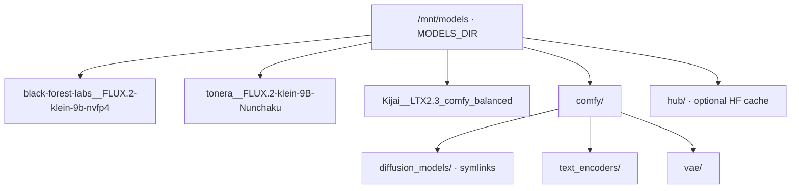
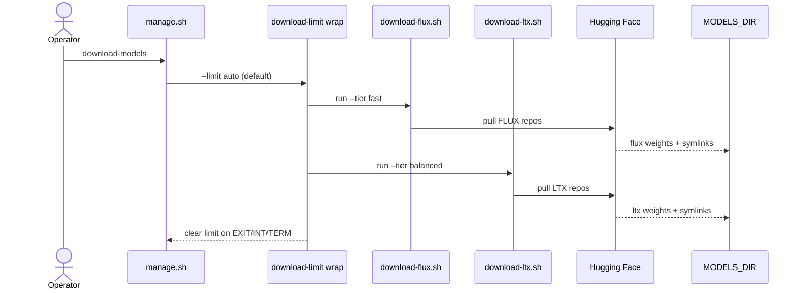
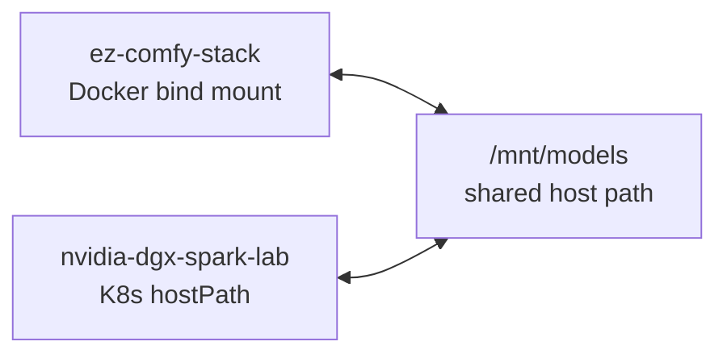
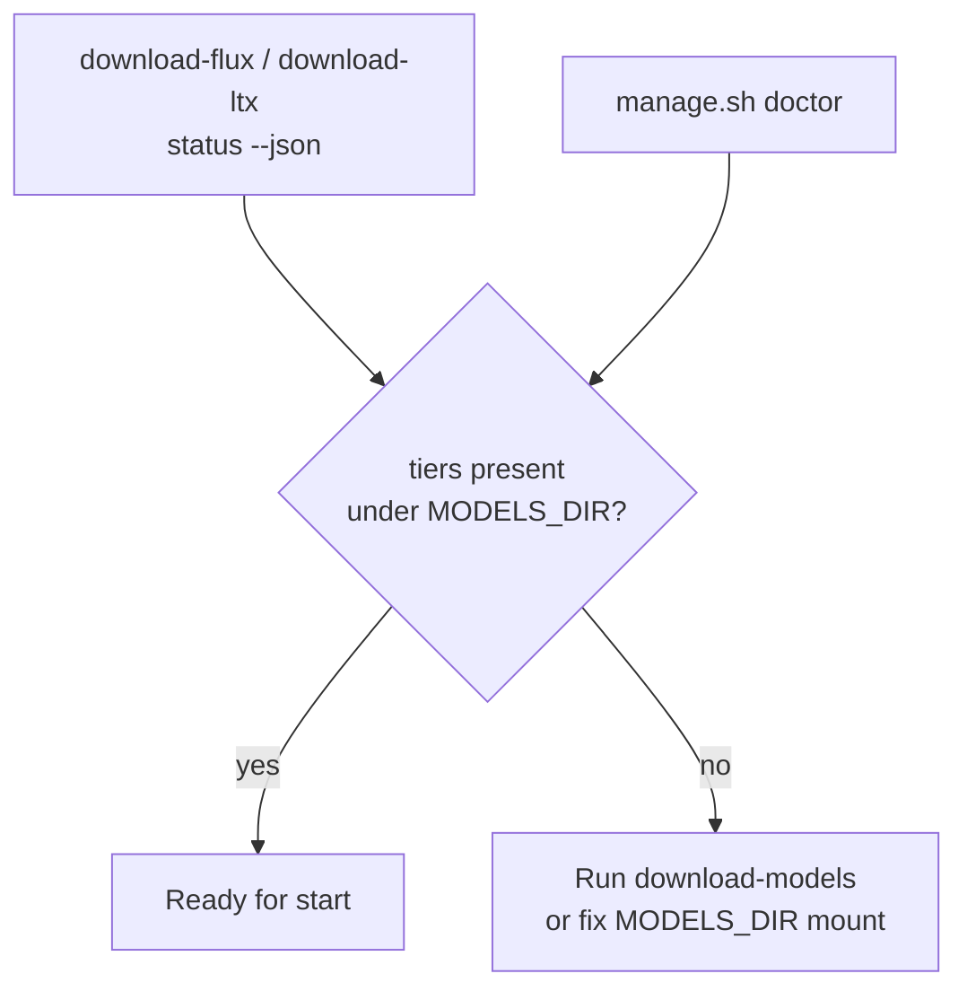

# Models & Cache

**What's on this page**

- Default cache location and layout
- Download utilities and readiness checks
- Sharing with nvidia-dgx-spark-lab

**What this enables**

- Downloading weights once and reusing them across stacks
- Checking readiness without network access

## Default location

```text
MODELS_DIR=/mnt/models
```

Override in `.env` if needed. Prefer a large, durable disk on the Spark.

### Permissions

`doctor`, `download-models`, and download utilities require `MODELS_DIR` to be **writable by the current user**. If `/mnt` is root-owned:

```bash
sudo mkdir -p /mnt/models
sudo chown "$USER:$USER" /mnt/models
```

Or point at a home path:

```bash
# .env
MODELS_DIR=$HOME/models
```

## Layout

```text
/mnt/models/
  black-forest-labs__FLUX.2-klein-9b-nvfp4/
  tonera__FLUX.2-klein-9B-Nunchaku/
  Kijai__LTX2.3_comfy_balanced/
  comfy/
    diffusion_models/   # symlinks
    text_encoders/
    vae/
  hub/                  # HF cache (optional)
```

This matches the lab hostPath pattern so K8s and Docker demos can share weights.



## Utilities

```bash
./scripts/utilities/download-flux.sh status --tier fast --json
./scripts/utilities/download-ltx.sh status --tier balanced --json
./scripts/utilities/download-flux.sh run --tier fast
./scripts/utilities/download-ltx.sh run --tier balanced
```

Or:

```bash
./scripts/manage.sh download-models
```

### Download path



### Multi-stack sharing



### Readiness check



## Licenses & tokens

Accept model licenses on Hugging Face. Set `HF_TOKEN` in `.env` when downloads are gated.

## Disk headroom

`manage.sh doctor` / `start` require free disk ≥ `MIN_DISK_FREE_GIB` (default 40).
