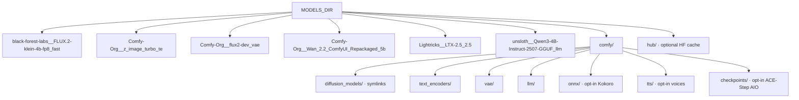
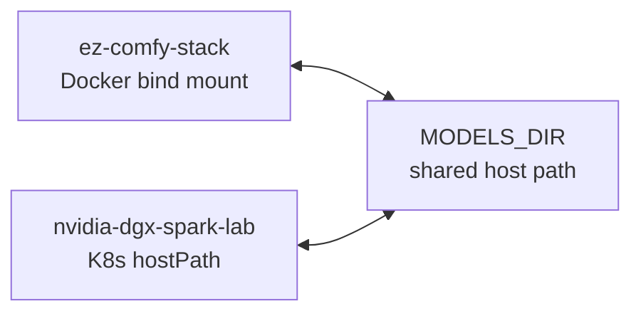
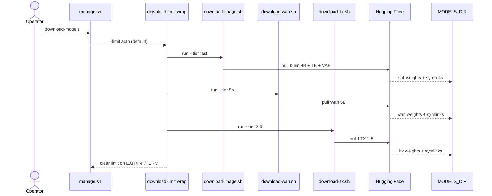
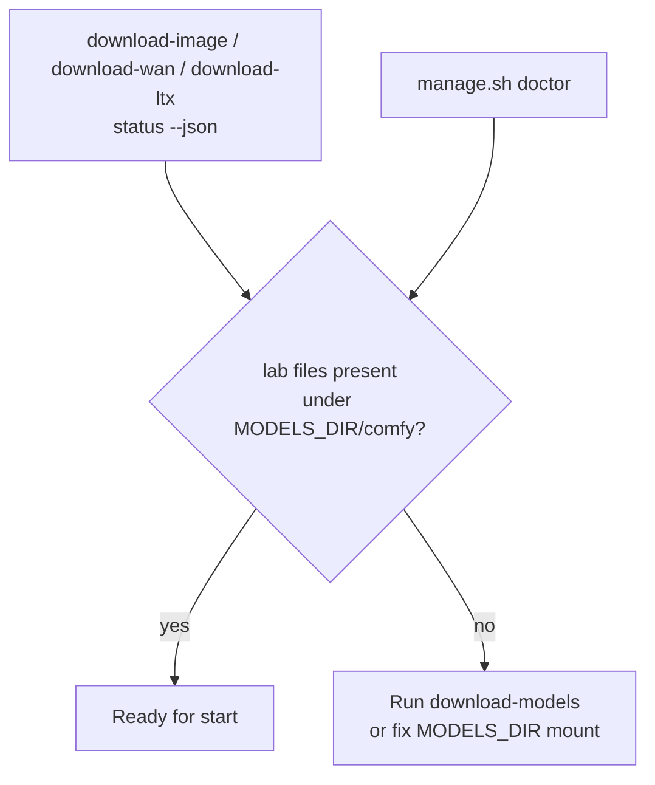

# Models & Cache

**What's on this page**

- Default cache location and layout
- Download utilities, resume / stuck-partial recovery, and readiness checks
- Prebuilt image layer-cache contract (what invalidates multi‑GB pulls)
- Volume Comfy pin (`.lab-comfyui-ref`) vs image `COMFYUI_REF`
- Sharing with nvidia-dgx-spark-lab

**What this enables**

- Downloading weights once and reusing them across stacks
- Checking readiness without network access
- Rebuilding/pulling only the layers that actually changed

!!! tip "Operator path"

    Most operators only need: set `MODELS_DIR` → `download-models` → confirm basenames. Layer pins and Dockerfile cache order are for maintainers — collapsed below.

---

## Default location

```bash
export MODELS_DIR="${MODELS_DIR:-/mnt/models}"
```

Override in `.env` if needed. Prefer a large, durable disk on the Spark.

### Permissions

`doctor`, `download-models`, and download utilities require `MODELS_DIR` to be **writable by the current user**.

=== "Preferred (setup)"

    ```bash
    ./scripts/manage.sh setup
    # sudo mkdir -p + chown for MODELS_DIR when needed
    ```

=== "Manual"

    ```bash
    sudo mkdir -p "${MODELS_DIR}"
    sudo chown "$USER:$USER" "${MODELS_DIR}"
    ```

=== "Home path"

    ```bash
    # .env
    MODELS_DIR=$HOME/models
    ```

---

## Layout

Each utility writes to `${MODELS_DIR}/<org__repo>_<tier>` (`tier_dir`), then **relative** symlinks into `comfy/`:

```text
${MODELS_DIR}/
  black-forest-labs__FLUX.2-klein-4b-fp8_fast/
  Comfy-Org__z_image_turbo_te/                # qwen_3_4b
  Comfy-Org__flux2-dev_vae/                   # flux2-vae
  Comfy-Org__Wan_2.2_ComfyUI_Repackaged_5b/
  Lightricks__LTX-2.5_2.5/
  unsloth__Qwen3-4B-Instruct-2507-GGUF_llm/
  comfy/
    diffusion_models/   # relative symlinks into tier repos above
    text_encoders/
    vae/
    llm/                # Qwen3-4B-Instruct-2507 Q4_K_M GGUF
    onnx/               # opt-in Kokoro ONNX (download-podcast --tier analog)
    tts/                # opt-in Kokoro voices + optional Chatterbox/Qwen3-TTS
    checkpoints/        # opt-in ACE-Step 1.5 AIO (download-music --tier turbo / download-podcast --tier acestep)
  hub/                  # HF cache (optional)
```

`download-models` links weights into `comfy/*` with **relative** symlinks (e.g. `../../Comfy-Org__flux2-dev_vae/split_files/vae/flux2-vae.safetensors`). That way the same tree resolves on the host (`MODELS_DIR=/mnt/models`) and inside the container (bind-mounted at `/models`). Absolute `/mnt/models/…` file links look fine on the host but break Comfy with “exists but doesn't link anywhere”.

This matches the lab hostPath pattern so K8s and Docker demos can share weights.



---

## Download

```bash
./scripts/manage.sh download-models
# Exits non-zero until every lab basename under MODELS_DIR/comfy is present
# Klein TE + flux2-vae use file-level readiness so a TE-only
# partial cannot cache-hit skip the VAE.
```

Or per utility:

```bash
./scripts/utilities/download-image.sh status --tier fast --json
./scripts/utilities/download-wan.sh status --tier 5b --json
./scripts/utilities/download-ltx.sh status --tier 2.5 --json
./scripts/utilities/download-image.sh run --tier fast
./scripts/utilities/download-wan.sh run --tier 5b
./scripts/utilities/download-ltx.sh run --tier 2.5
./scripts/utilities/download-llm.sh run
./scripts/utilities/download-music.sh status --tier turbo --json
./scripts/utilities/download-music.sh run --tier turbo
```

`--tier fast` also pulls Klein companions (`te` + `vae`). Optional stills: `--tier nvfp4` / `--tier base` / `--tier zimage`. Optional motion: `download-wan.sh run --tier a14b`. Optional LTX fallback: `download-ltx.sh run --tier 2.3`.

Downloads use the modern **`hf download`** CLI (not deprecated `huggingface-cli`):

```bash
command -v hf || pipx install huggingface_hub
# or: pip install -U 'huggingface_hub[cli]'
```

Progress UI is owned by the stack (disk size + MiB/s + elapsed on one line). Hub/tqdm file-count bars are disabled so they do not smash the heartbeat. `HF_PROGRESS=0` turns progress lines off; `HF_PROGRESS_INTERVAL=10` sets the tick (seconds).

### Expected basenames after `download-models` (lab workflows)

| File | Comfy folder | Role |
| --- | --- | --- |
| `flux-2-klein-4b-fp8.safetensors` | `diffusion_models/` | Apache Klein 4B distilled still UNET |
| `qwen_3_4b.safetensors` | `text_encoders/` | Klein 4B TE (CLIP type **`flux2`**) |
| `flux2-vae.safetensors` | `vae/` | Flux.2 VAE |
| `wan2.2_ti2v_5B_fp16.safetensors` | `diffusion_models/` | Apache Wan 2.2 TI2V-5B |
| `umt5_xxl_fp8_e4m3fn_scaled.safetensors` | `text_encoders/` | Wan CLIP (type **`wan`**) |
| `wan2.2_vae.safetensors` | `vae/` | Wan 2.2 VAE |
| `ltx-2.5-22b-distilled-transformer-comfy-int8-convrot.safetensors` | `diffusion_models/` | LTX-2.5 distilled AV UNET (Community License) |
| `gemma4-12b-with-proj-ltx-2.5-comfy-int8-convrot.safetensors` | `text_encoders/` | LTX-2.5 Gemma4-with-proj (CLIP type **`ltxv`**) |
| `ltx-2.5-video-vae-bf16.safetensors` | `vae/` | LTX-2.5 video VAE |
| `ltx-2.5-audio-vae-bf16.safetensors` | `vae/` | LTX-2.5 audio VAE |
| `Qwen3-4B-Instruct-2507-Q4_K_M.gguf` | `llm/` | On-box prompt enhance (CPU llama.cpp) |

Opt-in music (`./scripts/manage.sh download-music --tier turbo`, **not** `download-models`). Turbo **reuses** the podcast acestep snapshot — do not pull the ~10 GB AIO twice:

```bash
./scripts/manage.sh download-music --tier turbo
./scripts/utilities/download-music.sh status --tier turbo --json
```

| File | Comfy folder | Role |
| --- | --- | --- |
| `ace_step_1.5_turbo_aio.safetensors` | `checkpoints/` | ACE-Step 1.5 rap + podcast AIO |
| `acestep_v1.5_xl_turbo_bf16.safetensors` | `diffusion_models/` | Optional XL split (`--tier xl` only) |
| `qwen_0.6b_ace15.safetensors` / `qwen_1.7b_ace15.safetensors` | `text_encoders/` | Optional XL text encoders |
| `ace_1.5_vae.safetensors` | `vae/` | Optional XL VAE |

Opt-in podcast (`./scripts/manage.sh download-podcast`, **not** `download-models`):

| File | Comfy folder | Role |
| --- | --- | --- |
| `kokoro-v1.0.onnx` | `onnx/` | Kokoro-82M ONNX (analog TTS) |
| `voices-v1.0.bin` | `tts/` | Kokoro built-in voice pack |
| `ace_step_1.5_turbo_aio.safetensors` | `checkpoints/` | ACE-Step 1.5 turbo AIO (podcast beds + rap lane; shared dest) |
| `t3_turbo_v1.safetensors` | `tts/` | Optional Chatterbox Turbo |
| `model.safetensors` | `tts/` | Optional Qwen3-TTS 0.6B |

### Example graphs

Seeded into Comfy `user/default/workflows/` from host `workflows/*.json` and `workflows/shorts/*.json` (name pattern **`*-lab-example.json`**). Catalog and iteration loop: [Visual Generative AI](visual-generative-ai.md).

| Graph | Notes |
| --- | --- |
| `klein-still-draft-lab-example.json` | Klein 4B 768×432, 4 steps, batch 2 |
| `music-rap-draft-lab-example.json` | ACE-Step rap draft 32 s (`ez_rap_draft`; opt-in AIO) |
| `music-rap-full-lab-example.json` | ACE-Step rap full 96 s (`ez_rap_full`) |
| `klein-still-hero-lab-example.json` | Same prompt/seed, 1280×720 |
| `klein-still-daily-lab-example.json` | Daily still; UNET swap distilled / NVFP4 / base |
| `klein-dream-house-lab-example.json` | Ten IG 4:5 stills of one cabin from new cameras; locked inventory |
| `wan-i2v-5s-lab-example.json` | Wan 5B I2V smoke (121 @ 24 fps) |
| `wan-t2v-5s-lab-example.json` | Wan 5B T2V smoke |
| `wan-i2v-shot-lab-example.json` | 5.00 s Wan I2V + last-frame SaveImage |
| `wan-gif-loop-lab-example.json` | Ping-pong GIF, 49 @ 12 fps |
| `ltx-i2v-5s-lab-example.json` | LTX-2.5 I2V ~5 s with audio muxed into MP4 (121) |
| `ltx-t2v-5s-lab-example.json` | LTX-2.5 T2V ~5 s with audio muxed into MP4 |
| `ltx-i2v-shot-lab-example.json` | 5.00 s LTX I2V print + last-frame SaveImage |
| `shorts/film-*-90s-*-lab-example.json` | **One-click** Klein identity + 18 LTX 5.00s AV prints + stitch ([90s shorts](shorts.md)) |
| `klein-shorts-still-lab-example.json` | Vertical 9:16 Shorts still |
| `wan-shorts-i2v-lab-example.json` | Vertical silent Shorts I2V |
| `ltx-shorts-i2v-lab-example.json` | Vertical AV Shorts I2V |
| `klein-thumbnail-lab-example.json` | YouTube thumbnail still |
| `klein-product-packshot-lab-example.json` | Product packshot 1:1 |
| `klein-before-after-lab-example.json` | Before/after still pair |
| `klein-style-lock-lab-example.json` | Four style-locked stills |
| `wan-bumper-loop-lab-example.json` | Loopable MP4 bumper |
| `ltx-broll-ambient-lab-example.json` | Ambient B-roll AV ~5 s |
| `klein-storyboard-6up-lab-example.json` | Six storyboard frames |
| `klein-endcard-cta-lab-example.json` | End-card / CTA plate 16:9 |
| `klein-quote-bg-lab-example.json` | Quote-card background 1:1 |
| `klein-og-blog-lab-example.json` | Blog / OG hero |
| `klein-podcast-cover-lab-example.json` | Podcast cover 1:1 |
| `klein-banner-wide-lab-example.json` | Wide channel banner |
| `klein-ig-square-lab-example.json` | Instagram 1:1 still |
| `klein-hook-still-lab-example.json` | 9:16 hook still |
| `klein-lower-third-bg-lab-example.json` | Lower-third-safe 16:9 |
| `klein-food-tabletop-lab-example.json` | Food tabletop 4:5 |
| `klein-lighting-trio-lab-example.json` | Three-light study |
| `klein-time-of-day-lab-example.json` | Dawn / noon / dusk / night |
| `klein-camera-angles-lab-example.json` | Wide / medium / close |
| `klein-color-moods-lab-example.json` | Four color moods |
| `wan-orbit-i2v-lab-example.json` | Slow orbit I2V ~5 s |
| `wan-push-in-i2v-lab-example.json` | Hero push-in I2V ~5 s |
| `wan-parallax-i2v-lab-example.json` | Parallax I2V ~5 s |
| `wan-sticker-loop-lab-example.json` | Looping sticker MP4 |
| `ltx-weather-broll-lab-example.json` | Weather B-roll AV ~5 s |
| `ltx-interior-ambience-lab-example.json` | Interior ambience AV ~5 s |
| `ltx-hook-av-lab-example.json` | AV hook / cold open ~5 s |

Lab LTX video graphs write **MP4** via **`VHS_VideoCombine`** (ComfyUI-VideoHelperSuite, h264 @ 24 fps) and still write **frames** via `SaveImage`. They still **must** wire the audio VAE because LTX is a joint AV model.

MiniMax H3 is **banned** (US Excluded Territory). See [Model licenses](licenses.md). `download-models` refuses `--with-h3`.

### Gated models / HF_TOKEN

**LTX-2.5** (`Lightricks/LTX-2.5`) is gated. Klein 4B distilled and Wan 2.2 5B are Apache and do not need a license click. A token in `.env` is **not** the same as accepting the Lightricks license.

```bash
# .env
HF_TOKEN=hf_...
# Browser, same account: https://huggingface.co/Lightricks/LTX-2.5 → Agree
# or: hf auth login
hf auth whoami
```

Fine-grained tokens need **gated repo** read. `download-models` passes `--token` from `HF_TOKEN` so it wins over a leftover `hf auth login`.

### Disk headroom

`manage.sh doctor` / `start` require free disk ≥ `MIN_DISK_FREE_GIB` (default 40).

---

## LTX selective download

Default **2.5** is the small distilled set from `Lightricks/LTX-2.5` (status `min_gb` 30).

`Kijai/LTX2.3_comfy` is a multi-variant hub repo (~**400 GB** if you pull everything). Use it only as a **2.3 fallback**:

| Tier | Transformer (approx) | Plus | Total (approx) |
| --- | --- | --- | --- |
| **2.5** (default) | LTX-2.5 distilled INT8-convrot | Gemma4-with-proj + video/audio VAEs | status floor ~30 GB |
| **2.3** / **balanced** | distilled FP8 `…fp8_input_scaled_v3` (~25 GB) | text projection + video/audio VAE + Gemma 3 TE | ~28–30 GB + ~9.5 GB TE |
| **quality** | distilled BF16 (~42 GB) | same projection + VAEs + Gemma 3 | ~45–48 GB + TE |
| **gemma** (auto with 2.3/balanced/quality) | — | `gemma_3_12B_it_fp4_mixed` from `Comfy-Org/ltx-2` | ~9.5 GB |

Lab LTX-2.5 graphs use **CLIPLoader** (Gemma4-with-proj, type **`ltxv`**). LTX-2.3 DualCLIP is fallback only — seeded lab JSON still names 2.5 files.

`status --json` readiness uses `min_gb` 30 (2.5) / 20 (2.3/balanced) / 35 (quality) / 8 (gemma) as a floor, not the full monorepo size.

??? tip "Cleanup extra LTX monorepo files"

    If an older run pulled the full `Kijai/LTX2.3_comfy` snapshot into a 2.3/balanced/quality local-dir, reclaim disk by deleting everything outside the selective keep set:

    ```bash
    # Preview (default)
    ./scripts/utilities/download-ltx.sh cleanup --tier 2.3

    # Delete extras (keeps FP8 transformer + TE + VAEs only)
    ./scripts/utilities/download-ltx.sh cleanup --tier 2.3 --yes
    ```

    Does **not** touch Klein, Wan, or other trees under `MODELS_DIR`.

??? warning "Full monorepo escape hatch"

    Operators who really want every precision/lora:

    ```bash
    LTX_FULL_REPO=1 ./scripts/utilities/download-ltx.sh run --tier 2.3
    ```

    After a full-repo mistake, use `cleanup --yes` instead of wiping all of `MODELS_DIR`.

---

## Resume & cache

Downloads are **resumable** and **cacheable** under `MODELS_DIR`:

| Behavior | Detail |
| --- | --- |
| Resume after interrupt | ++ctrl+c++ / crash leaves `*.incomplete` under each tier’s `.cache/huggingface/`; re-run the same command to continue |
| Resume stall (0 MiB/s) | Live `hf` holding a lock with no disk growth. FORCE-clearing locks will not unstick it. ++ctrl+c++, then `./scripts/manage.sh reset-hf-partials --yes` and re-run, or `download-models --drop-incomplete`. After 90s the downloader drops that dest’s partials and retries **once**. |
| Skip when ready | `download-image` / `download-wan` / `download-ltx` skip tiers that already have required weights (log: `cache hit`) |
| `HF_HOME` | Set to `MODELS_DIR` so hub metadata lives on the durable model disk |
| Cleanup | `download-ltx.sh cleanup --yes` removes non-selective monorepo weights but **keeps** `.cache/`, `*.incomplete`, and selective keep-set files |

!!! tip "Keep `.cache/`"

    Do not delete a tier’s `.cache/huggingface/` folder if you want fast resume/metadata checks. Finished weight files are never re-downloaded unless missing or hub revision changes.

---

## Multi-stack sharing



### Download path



### Readiness check



---

## Prebuilt container image (GHCR)

| Item | Detail |
| --- | --- |
| Image (`main`) | `ghcr.io/toxicoder/ez-comfy:us-safe-studio` (arm64) |
| Image (`development` / feature) | `ghcr.io/toxicoder/ez-comfy:us-safe-studio-development` (arm64) |
| Selection | `manage.sh` maps current git branch → tag (override: `EZ_COMFY_IMAGE`) |
| Frozen tags | Old `flux-to-ltx*` tags freeze on the previous image |
| Final base | `nvidia/cuda` **runtime** (builder defaults to the same runtime image; override `CUDA_BASE_IMAGE` to devel only if you compile CUDA extensions) |
| Contains | CUDA runtime, ComfyUI, Python venv, PyTorch/CUDA wheels (`.git`/caches stripped) |
| Does **not** contain | `HF_TOKEN`, `.env`, host PII, or Klein/Wan/LTX weights |
| First start | Seeds `comfy-state` volume from `/opt/comfy-prebuilt` (local rsync/cp) |
| Volume pin | `COMFY_HOME/.lab-comfyui-ref` — stamp-present refresh reseeds from prebuilt (or git-clones `COMFYUI_REF`) when this lags the runtime pin. Compose passes `COMFYUI_REF` at **runtime**, not only as a build-arg |
| Weights | Still under `MODELS_DIR` via `download-models` |
| Publish | `publish-image` on `main` / `development` (docker/**); Buildx **registry** cache (`:buildcache-arm64`) |
| Local build | Optional: `LAB_STACK_FORCE_BUILD=1 ./scripts/manage.sh start` builds `docker/Dockerfile` instead of pulling — see [Getting Started](getting-started.md#build-the-image-locally-optional) |

### Image layer cache (high-velocity rebuilds + pulls)

??? abstract "Layer invalidation matrix"

    Dockerfile order is intentional so **ops-script edits do not re-download multi‑GB torch**, **Comfy/node pip does not re-pull torch**, and **runtime apt changes rebase** via `COPY --link`:

    | Change | Rebuild multi‑GB **torch** stage? | Re-pull **venv-torch**? | Re-pull **venv-extra**? | Re-pull **app**? |
    | --- | --- | --- | --- | --- |
    | `entrypoint.sh` / `patch_get_free_memory.py` / orchestrator | No | No | No | No |
    | `install-comfy/common.sh` (clone/link/strip only) | No | No | No | Maybe (nodes/comfy stages) |
    | `install-comfy/phase-nodes.sh` or node **sources** only | No | No | No | Yes (smaller) |
    | VideoHelperSuite / new node **pip** deps (opencv, llama-cpp, …) | No | No | **Yes** (delta only) | Yes |
    | `install-comfy/phase-comfy.sh` / `COMFYUI_REF` bump | No | No | **Yes** if reqs change | Yes |
    | `install-comfy/core.sh` / `phase-venv-torch.sh` / `TORCH_VERSION` | Yes | Yes | Yes | Yes |
    | Runtime `apt` only (`gcc`/`g++`/`python3-dev` for Triton JIT) | No | No (`COPY --link`) | No | No |

    Builder: **named stages** `torch` → `comfy` → `nodes`. Torch `COPY` is only `core.sh` + `phase-venv-torch.sh`. Pin `ARG`s are declared in the stage that uses them. Runtime: **`COPY --link` `/opt/parts/venv` then `venv-extra` then `app`** (then thin ops scripts). Compose bind-mounts `entrypoint.sh`, `install-comfy.sh`, `install-comfy/`, `pythonpath/`, and the free-memory patch so local script iteration needs **no image rebuild**.

    Runtime installs **`gcc` + `g++` + `python3-dev`** (not full `build-essential`) so PyTorch 2.13+ Triton can JIT-compile `cuda_utils` (needs **CC + `Python.h`**) on first `CLIPTextEncode`. That is a small apt layer; `COPY --link` keeps the multi‑GB torch blob. If JIT deps are still incomplete, the entrypoint sets `LAB_DISABLE_TORCH_NATIVE_TRITON=1` so torch falls back to eager/cuBLAS.

    **venv-extra** is the pip delta after the torch snapshot (Comfy `requirements.txt`, Manager/VHS, llama-cpp). Baking a small optional wheel (e.g. `kokoro-onnx`) invalidates extra, not torch.

### Prebuild version pins (validated)

??? abstract "Pin table and bump procedure"

    Defaults are intentional tags so GHCR rebuilds are reproducible. Validated **2026-07-29**:

    | Pin | Default | Why this value |
    | --- | --- | --- |
    | `TORCH_VERSION` | `2.14.0` | cu130 aarch64 wheel from `https://download.pytorch.org/whl/cu130`. Declared only in the **torch** stage. Bump here (and compose / publish-image / `install-comfy/core.sh`) when rebuilding the multi‑GB layer. |
    | `COMFYUI_REF` | `v0.34.0` | Native Klein 4B + Wan 2.2 + LTX-2.5 loaders. Torch cu130. Rebuild the **comfy** image stage after this bump (torch stage stays cached). Spark free-memory patch still matches `mem_free_cuda, _ = torch.cuda.mem_get_info(dev)` in `comfy/model_management.py`. |
    | `COMFYUI_MANAGER_REF` | `4.2.2` | Latest stable Manager tag; `requires-python >= 3.9`; no hard ComfyUI version floor. |
    | `COMFYUI_NUNCHAKU_NODE_REF` | `v1.2.1` | Latest plugin release; aligned with `NUNCHAKU_VERSION=1.2.1`. **Optional** on GB10 (no official aarch64 engine wheels); `*-lab-example` graphs do not require it. |
    | `COMFYUI_VHS_REF` | *(empty = main)* | [ComfyUI-VideoHelperSuite](https://github.com/Kosinkadink/ComfyUI-VideoHelperSuite) for lab **`VHS_VideoCombine`** MP4. **Required** for `wan-*-lab-example` / `ltx-*-lab-example`. Empty ref clones default branch; set a tag/branch when you need a pin. |

    **How to bump pins:** change the defaults in `docker/Dockerfile` `ARG`s, `docker/docker-compose.yml` build-args, `.github/workflows/publish-image.yml`, `docker/install-comfy/core.sh` (torch) and `docker/install-comfy/common.sh` (Comfy/node refs), then rebuild/publish. Escape hatch: set `COMFYUI_REF=` empty to float the default branch (not recommended for GHCR).
