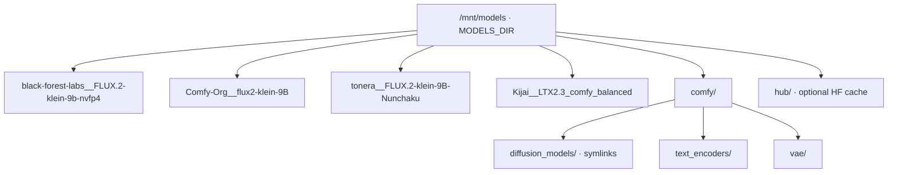
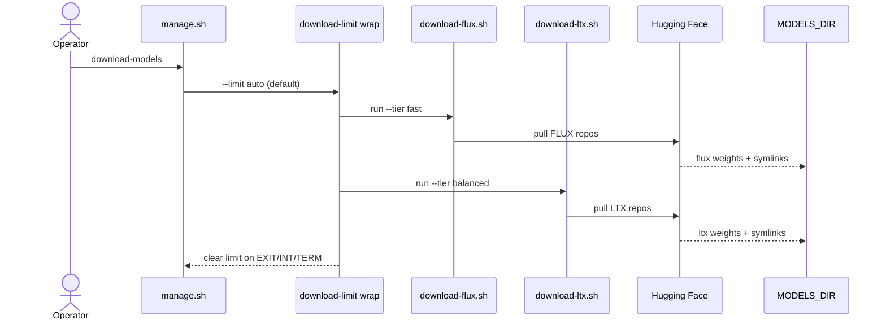
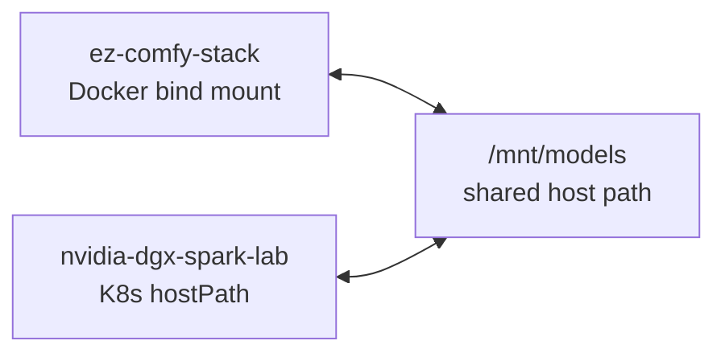
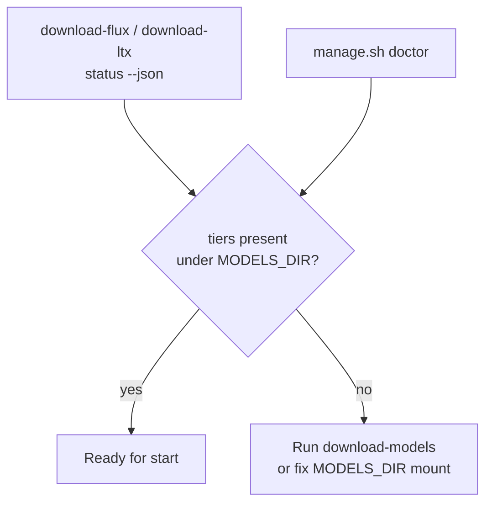

# Models & Cache

**What's on this page**

- Default cache location and layout
- Download utilities and readiness checks
- Prebuilt image layer-cache contract (what invalidates multi‑GB pulls)
- Sharing with nvidia-dgx-spark-lab

**What this enables**

- Downloading weights once and reusing them across stacks
- Checking readiness without network access
- Rebuilding/pulling only the layers that actually changed

## Default location

```text
MODELS_DIR=/mnt/models
```

Override in `.env` if needed. Prefer a large, durable disk on the Spark.

### Permissions

`doctor`, `download-models`, and download utilities require `MODELS_DIR` to be **writable by the current user**.

Preferred:

```bash
./scripts/manage.sh setup
# sudo mkdir -p + chown for MODELS_DIR when needed
```

Manual:

```bash
sudo mkdir -p /mnt/models
sudo chown "$USER:$USER" /mnt/models
```

Or point at a home path:

```bash
# .env
MODELS_DIR=$HOME/models
```

## Layout

```text
/mnt/models/
  black-forest-labs__FLUX.2-klein-9b-nvfp4/   # flux fast UNET
  Comfy-Org__flux2-klein-9B/                  # companions: Qwen TE + flux2 VAE
  tonera__FLUX.2-klein-9B-Nunchaku/           # optional (INCLUDE_NUNCHAKU)
  Kijai__LTX2.3_comfy_balanced/               # ltx balanced selective
  comfy/
    diffusion_models/   # symlinks
    text_encoders/
    vae/
  hub/                  # HF cache (optional)
```

This matches the lab hostPath pattern so K8s and Docker demos can share weights.



## Utilities

```bash
./scripts/utilities/download-flux.sh status --tier fast --json
./scripts/utilities/download-ltx.sh status --tier balanced --json
./scripts/utilities/download-flux.sh run --tier fast
./scripts/utilities/download-ltx.sh run --tier balanced
```

Or:

```bash
./scripts/manage.sh download-models
# Exits non-zero until every lab basename under MODELS_DIR/comfy is present
# (see table below). Companions (Qwen TE + flux2-vae) use file-level readiness
# so a TE-only partial cannot cache-hit skip the VAE.
```

### Cleanup extra LTX monorepo files

If an older run pulled the full `Kijai/LTX2.3_comfy` snapshot into the balanced/quality local-dir, reclaim disk by deleting everything outside the selective keep set:

```bash
# Preview (default)
./scripts/utilities/download-ltx.sh cleanup --tier balanced

# Delete extras (keeps FP8 transformer + TE + VAEs only)
./scripts/utilities/download-ltx.sh cleanup --tier balanced --yes
```

Does **not** touch FLUX, nunchaku, or other trees under `MODELS_DIR`.

Downloads use the modern **`hf download`** CLI (not deprecated `huggingface-cli`). Install:

```bash
command -v hf || pipx install huggingface_hub
# or: pip install -U 'huggingface_hub[cli]'
```

Progress UI is owned by the stack (disk size + MiB/s + elapsed on one line). Hub/tqdm file-count bars are disabled so they do not smash the heartbeat. `HF_PROGRESS=0` turns progress lines off; `HF_PROGRESS_INTERVAL=10` sets the tick (seconds).

### Expected basenames after `download-models` (lab workflows)

| File | Comfy folder | Role |
| --- | --- | --- |
| `flux-2-klein-9b-nvfp4.safetensors` | `diffusion_models/` | Flux fast UNET (BFL) |
| `qwen_3_8b_fp4mixed.safetensors` | `text_encoders/` | Flux TE (Comfy-Org companions; CLIP type **`flux2`**) |
| `flux2-vae.safetensors` | `vae/` | Flux VAE (Comfy-Org companions) |
| `ltx-2.3-22b-distilled_transformer_only_fp8_input_scaled_v3.safetensors` | `diffusion_models/` | LTX balanced UNET |
| `ltx-2.3_text_projection_bf16.safetensors` | `text_encoders/` | LTX text projection |
| `LTX23_video_vae_bf16.safetensors` | `vae/` | LTX video VAE (used by lab I2V/T2V) |
| `LTX23_audio_vae_bf16.safetensors` | `vae/` | LTX audio VAE (downloaded; **not wired** in lab graphs) |

Example graphs under `workflows/` (seeded into Comfy `user/default/workflows/`):

| Graph | Notes |
| --- | --- |
| `lab-flux-txt2img.json` | 1024² T2I |
| `lab-flux-txt2img-portrait.json` | 768×1024 |
| `lab-flux-txt2img-landscape.json` | 1280×720 |
| `lab-flux-txt2img-quick.json` | 768² / 4 steps smoke |
| `lab-flux-img2img.json` | I2I |
| `lab-ltx-i2v.json` / `lab-ltx-i2v-short.json` | I2V frames (~97 / ~33) |
| `lab-ltx-t2v.json` / `lab-ltx-t2v-short.json` | T2V frames (~97 / ~33) |
| `lab-flux-to-ltx.json` | Flux T2I + handoff note → LTX I2V |

Lab video graphs write **frames** via `SaveImage` only (no VHS). Audio VAE remains on disk for operators who build joint AV graphs themselves.

### Prebuilt container image (GHCR)

| Item | Detail |
| --- | --- |
| Image (`main`) | `ghcr.io/toxicoder/ez-comfy:flux-to-ltx` (arm64) |
| Image (`development` / feature) | `ghcr.io/toxicoder/ez-comfy:flux-to-ltx-development` (arm64) |
| Selection | `manage.sh` maps current git branch → tag (override: `EZ_COMFY_IMAGE`) |
| Final base | `nvidia/cuda` **runtime** (builder uses **devel** only during image build) |
| Contains | CUDA runtime, ComfyUI, Python venv, PyTorch/CUDA wheels (`.git`/caches stripped) |
| Does **not** contain | `HF_TOKEN`, `.env`, host PII, or FLUX/LTX weights |
| First start | Seeds `comfy-state` volume from `/opt/comfy-prebuilt` (local rsync/cp) |
| Weights | Still under `MODELS_DIR` via `download-models` |
| Publish | `publish-image` on `main` / `development` (docker/**); Buildx GHA layer cache |

### Image layer cache (high-velocity rebuilds + pulls)

Dockerfile order is intentional so **ops-script edits do not re-download multi‑GB torch**, and **app-only prebuild churn does not re-pull the full venv blob**:

| Change | Rebuild multi‑GB torch phase? | Re-pull multi‑GB **venv** layer? | Re-pull **app** layer? |
| --- | --- | --- | --- |
| `entrypoint.sh` / `patch_get_free_memory.py` / orchestrator | No | No | No |
| `install-comfy/phase-nodes.sh` or node sources only (no new pip) | No | No | Yes (smaller) |
| `install-comfy/phase-comfy.sh` / `COMFYUI_REF` bump (may change requirements) | No (torch phase) | **Yes if pip set changes** | Yes |
| `install-comfy/phase-venv-torch.sh` / CUDA base / apt | Yes | Yes | Yes |

Builder: **COPY only phase modules each `RUN` needs** (`common`+`phase-venv-torch` → `phase-comfy` → `phase-nodes`+`phase-finalize`) with BuildKit pip cache mounts. Runtime: **`COPY /opt/parts/venv` then `/opt/parts/app`** (then thin ops scripts). Compose bind-mounts `entrypoint.sh`, `install-comfy.sh`, `install-comfy/`, and the free-memory patch so local script iteration needs **no image rebuild**.

**Caveat:** the venv layer is the **final** `.venv` after comfy+nodes pip installs (not torch-only). Any new pip package still re-pulls multi‑GB.

### Prebuild version pins (validated)

Defaults are intentional tags so GHCR rebuilds are reproducible. Validated **2026-07-29**:

| Pin | Default | Why this value |
| --- | --- | --- |
| `COMFYUI_REF` | `v0.29.0` | Latest ComfyUI release (2026-07-29). Official README recommends **torch cu130**. Includes native Flux nodes + LTX kitchen-rope / LTXV fixes. Lab graphs use **core** nodes only (`UNETLoader`, `EmptyFlux2LatentImage`, `LTXV*`, …). Spark free-memory patch still matches `mem_free_cuda, _ = torch.cuda.mem_get_info(dev)` in `comfy/model_management.py`. |
| `COMFYUI_MANAGER_REF` | `4.2.2` | Latest stable Manager tag; `requires-python >= 3.9`; no hard ComfyUI version floor. |
| `COMFYUI_NUNCHAKU_NODE_REF` | `v1.2.1` | Latest plugin release; aligned with `NUNCHAKU_VERSION=1.2.1`. **Optional** on GB10 (no official aarch64 engine wheels); lab-flux/lab-ltx graphs do not require it. |

**How to bump pins:** change the defaults in `docker/Dockerfile` `ARG`s, `docker/docker-compose.yml` build-args, `.github/workflows/publish-image.yml`, and `docker/install-comfy/common.sh`, then rebuild/publish. Escape hatch: set `COMFYUI_REF=` empty to float the default branch (not recommended for GHCR).

### Resume & cache

Downloads are **resumable** and **cacheable** under `MODELS_DIR`:

| Behavior | Detail |
| --- | --- |
| Resume after interrupt | Ctrl+C / crash leaves `*.incomplete` under each tier’s `.cache/huggingface/`; re-run the same command to continue |
| Skip when ready | `download-flux` / `download-ltx` skip tiers that already have required weights (log: `cache hit`) |
| `HF_HOME` | Set to `MODELS_DIR` so hub metadata lives on the durable model disk |
| Cleanup | `download-ltx.sh cleanup --yes` removes non-selective monorepo weights but **keeps** `.cache/`, `*.incomplete`, and selective keep-set files |

Do not delete a tier’s `.cache/huggingface/` folder if you want fast resume/metadata checks. Finished weight files are never re-downloaded unless missing or hub revision changes.

### LTX selective download (not the full monorepo)

`Kijai/LTX2.3_comfy` is a multi-variant hub repo (~**400 GB** if you pull everything). This stack defaults to a **selective** subset via `hf download --include`:

| Tier | Transformer (approx) | Plus | Total (approx) |
| --- | --- | --- | --- |
| **balanced** | distilled FP8 `…fp8_input_scaled_v3` (~25 GB) | text projection + video/audio VAE | ~28–30 GB |
| **quality** | distilled BF16 (~42 GB) | same TE + VAEs | ~45–48 GB |

`status --json` readiness uses `min_gb` 20 (balanced) / 35 (quality) as a floor, not the full monorepo size.

Escape hatch (operators who really want every precision/lora):

```bash
LTX_FULL_REPO=1 ./scripts/utilities/download-ltx.sh run --tier balanced
```

After a full-repo mistake, use `cleanup --yes` (above) instead of wiping all of `MODELS_DIR`.

### Gated models / HF_TOKEN

FLUX and some LTX assets may require accepting the license on Hugging Face and a token:

```bash
# .env
HF_TOKEN=hf_...
# or: hf auth login
```

### Download path



### Multi-stack sharing



### Readiness check



## Licenses & tokens

Accept model licenses on Hugging Face. Set `HF_TOKEN` in `.env` when downloads are gated.

## Disk headroom

`manage.sh doctor` / `start` require free disk ≥ `MIN_DISK_FREE_GIB` (default 40).
