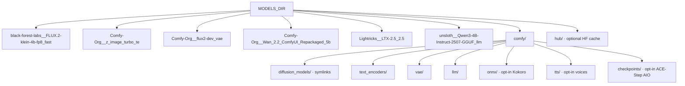

# Models & Cache

**What's on this page**

- **Three stores** (GHCR image, `MODELS_DIR`, comfy-state volume)
- **Default location** and permissions for `${MODELS_DIR}` and `${COMFY_OUTPUT_DIR}` layout dirs
- **Layout** (tier dirs, relative `comfy/` symlinks, reap)
- **Pack map** pointing at download utilities (`download-image.sh`, `download-wan.sh`, `download-ltx.sh`, `download-llm.sh`)

**What this enables**

- **Downloading Klein 4B, Wan 2.2, and LTX-2.5 weights once** and reusing them across stacks
- **Keeping weights** off the GHCR image (`us-safe-studio`)
- **Checking the tree** without network access

**Who this is for:** operators setting `MODELS_DIR` before `download-models`.

<Callout type="info" title="Operator path">
  Most operators only need: set `MODELS_DIR` → `download-models` → confirm basenames. Layer pins, gated tokens, and multi-stack sharing are linked below.
</Callout>
<Cards>
  <Card title="Gated models">
    ---

    LTX-2.5 needs a Hugging Face license click. `HF_TOKEN` is not that click.

    [HF_TOKEN](operate/models-tokens.md)
  </Card>
  <Card title="Multi-stack sharing">
    ---

    One `MODELS_DIR` for this Docker stack and nvidia-dgx-spark-lab hostPath.

    [Sharing](operate/models-sharing.md)
  </Card>
  <Card title="Which `--tier`">
    ---

    Pack id per downloader, not a quality ladder. `--limit` is Mbps.

    [Download tiers](download-tiers.md)
  </Card>
  <Card title="Download packs">
    ---

    Basenames, example graphs, LTX selective download, resume, GHCR pins.

    [Packs](operate/models-packs.md)
  </Card>
</Cards>

## Three stores

| Store | Holds | Not held here |
| --- | --- | --- |
| **GHCR image** | ComfyUI + PyTorch | Klein / Wan / LTX weights |
| **MODELS_DIR** | Weights + `comfy/` relative symlinks | The Comfy venv |
| **comfy-state volume** | Comfy install, lab `ez_*` custom nodes | Host PNGs/MP4s, start images, Comfy `user/`, operator `_user` node packs (`COMFY_OUTPUT_DIR`) |

`cleanup` (type `DELETE`) removes **comfy-state only**. Generated media, LoadImage start frames (`${COMFY_OUTPUT_DIR}/input`), Comfy user workflows (`${COMFY_OUTPUT_DIR}/comfy-user`), and operator custom nodes (`${COMFY_OUTPUT_DIR}/custom-nodes-user`) stay on the host. Concepts: [Hardware, memory, and safety](learn/hardware.md).

### Persistence (survives stop / image pull)

| What | Host | Container | On `start` |
| --- | --- | --- | --- |
| Model weights | `${MODELS_DIR:-/mnt/models}` | `/models` | persist |
| Generated PNG/MP4/audio | `${COMFY_OUTPUT_DIR:-/mnt/comfy-output}` | `/outputs` (`COMFY_OUTPUT_DIR=/outputs` in the container) | persist |
| LoadImage inputs | `${COMFY_OUTPUT_DIR}/input` | `/inputs` | persist |
| Comfy `user/` (sidebar, history) | `${COMFY_OUTPUT_DIR}/comfy-user` | `/comfy-state/ComfyUI/user` (`--user-directory`) | persist |
| Live lab graphs | `…/comfy-user/default/workflows/_lab/` | same | **overwrite** from repo `workflows/_lab/` |
| Live operator graphs | `…/comfy-user/default/workflows/_user/` | same | **never overwrite** |
| Operator JSON saved under `_lab/` | same tree | same | **rescue** into `_user/` (extras) or `_user/_rescued/` (edited lab graphs), then lab overwrite |
| Other files under live workflows | same tree | same | **never touch** |
| Lab custom nodes `ez_*` | git `custom_nodes/` | `$COMFY_HOME/custom_nodes/ez_*` | overwrite |
| Operator custom nodes | `${COMFY_OUTPUT_DIR}/custom-nodes-user` | `$COMFY_HOME/custom_nodes/_user` | persist (pin refresh excludes this tree) |
| Comfy install + venv | Docker volume `ez-comfy-state` | `/comfy-state` | persist until `cleanup` |

`seed_from_prebuilt` skips **root-anchored** `/user/`, `/input/`, `/output/`, `/temp/`, `/extra_model_paths.yaml`, and `/custom_nodes/_user/` so a pin refresh cannot delete Manager-installed packs that live on the host bind. Anchoring matters: unanchored `input/` also dropped nested `comfy_api/input` (ComfyUI v0.34+ Curve/Range types) and ComfyUI crashed on import. Stamp-present refresh heals that package from `/opt/comfy-prebuilt` even when `.lab-comfyui-ref` already matches `COMFYUI_REF`. Lab packs named `ez_*` still overwrite from `/opt/ez-comfy/custom_nodes`.

---

## Default location

```bash
export MODELS_DIR="${MODELS_DIR:-/mnt/models}"
```

Override in `.env` if needed. Prefer a large, durable disk on the Spark.

### Permissions

`doctor` requires `MODELS_DIR` to be **writable by the current user** (check only; no sudo). Nested `${MODELS_DIR}/comfy` can still be root-owned after a container start — that is a **warning**, not a hard doctor failure.

`setup`, `download-models`, and `start` **sudo-heal** `${MODELS_DIR}/comfy` and each layout subdir (and the dest dir of each relative symlink) when they are not writable. They do **not** recurse `chown` over HF snapshots under `MODELS_DIR`. Do not prefix `download-models` with `sudo` (download-limit uses sudo internally; `hf` must stay on the login user's PATH).

<Tabs groupId="preferred-setup-download-models-manual-last-resort-home-path" items={["Preferred (setup / download-models)", "Manual last resort", "Home path"]} persist>
  <Tab value="Preferred (setup / download-models)">
    ```bash
    ./scripts/manage.sh setup
    ./scripts/manage.sh download-models
    # sudo mkdir -p + chown for MODELS_DIR and MODELS_DIR/comfy when needed
    ```
  </Tab>
  <Tab value="Manual last resort">
    ```bash
    sudo mkdir -p "${MODELS_DIR}/comfy"
    sudo chown -R "$USER:$USER" "${MODELS_DIR}/comfy"
    ```
  </Tab>
  <Tab value="Home path">
    ```bash
    # .env
    MODELS_DIR=$HOME/models
    ```
  </Tab>
</Tabs>

### Output layout permissions

`doctor` requires `${COMFY_OUTPUT_DIR}` (default `/mnt/comfy-output`) to be **writable by the current user** (check only; no sudo). Nested `comfy-user/` (and `_user/_rescued`) can still be root-owned after a container start — that is a **warning**, not a hard doctor failure.

`setup` and `start` **sudo-heal** each output layout dir (`input/`, `custom-nodes-user/`, `comfy-user/…/_user/_rescued`) when they are not writable. They do **not** recurse `chown` over generated PNG/MP4 or operator JSON.

<Tabs groupId="preferred-setup-start-manual-last-resort" items={["Preferred (setup / start)", "Manual last resort"]} persist>
  <Tab value="Preferred (setup / start)">
    ```bash
    ./scripts/manage.sh setup
    ./scripts/manage.sh start
    # sudo mkdir -p + chown for COMFY_OUTPUT_DIR layout dirs when needed
    ```
  </Tab>
  <Tab value="Manual last resort">
    ```bash
    sudo mkdir -p "${COMFY_OUTPUT_DIR}/comfy-user/default/workflows/_user/_rescued"
    sudo chown "$USER:$USER" "${COMFY_OUTPUT_DIR}/comfy-user"
    ```
  </Tab>
</Tabs>
---

## Layout

Each utility writes to `${MODELS_DIR}/<org__repo>_<tier>` (`tier_dir`), then **relative** symlinks into `comfy/`:

```text
${MODELS_DIR}/
  black-forest-labs__FLUX.2-klein-4b-fp8_fast/
  Comfy-Org__z_image_turbo_te/                # qwen_3_4b
  Comfy-Org__flux2-dev_vae/                   # flux2-vae
  Comfy-Org__Wan_2.2_ComfyUI_Repackaged_5b/
  Lightricks__LTX-2.5_2.5/
  unsloth__Qwen3-4B-Instruct-2507-GGUF_llm/
  comfy/
    diffusion_models/   # relative symlinks into tier repos above
    text_encoders/
    vae/
    llm/                # Qwen3-4B-Instruct-2507 Q4_K_M GGUF
    onnx/               # opt-in Kokoro ONNX (download-podcast --tier analog) + Silero VAD (download-dub)
    tts/                # opt-in Kokoro voices + Chatterbox / Qwen3-TTS / Chatterbox ML V3
    whisper/            # opt-in faster-whisper large-v3 (download-dub --tier asr)
    checkpoints/        # opt-in ACE-Step 1.5 AIO (download-music --tier turbo / download-podcast --tier acestep)
  hub/                  # HF cache (optional)
```

Host-wide leftovers (HF hub, Docker layers, Ollama, other inference backends) are **not** `reap-models` — use [disk-wizard](disk-wizard.md) (`--plan` first). When the default pack moves (LTX 2.3 → 2.5 already happened), **reap** the old tree — do not wait for disk-full:

```bash
./scripts/manage.sh models-status
./scripts/manage.sh reap-models --plan
./scripts/manage.sh reap-models --apply --class junk --yes
./scripts/manage.sh reap-models --apply --class superseded --quarantine --yes
```

`manage.sh cleanup` is **volume-only** (named volume `comfy-state`). It does **not** delete weights. `reap-models --plan` is the default; `--apply` requires `--yes`. Shared files (`flux2-vae`, ACE-Step AIO) stay in the keep-set so `--drop-pack` cannot eat them.

`download-models` links weights into `comfy/*` with **relative** symlinks (e.g. `../../Comfy-Org__flux2-dev_vae/split_files/vae/flux2-vae.safetensors`). That way the same tree resolves on the host (`MODELS_DIR=/mnt/models`) and inside the container (bind-mounted at `/models`). Absolute `/mnt/models/…` file links look fine on the host but break Comfy with “exists but doesn't link anywhere”.

This matches the lab hostPath pattern so K8s and Docker demos can share weights.



---

## Pack map

Full download, basename, resume, and pin reference: [Download packs](operate/models-packs.md). `--tier` is a pack id ([Download tiers](download-tiers.md)).

<EzCommand id="download-models" />

| Utility | Default pack | Role |
| --- | --- | --- |
| `scripts/utilities/download-image.sh` | `--tier fast` | Klein 4B distilled + TE + VAE |
| `scripts/utilities/download-wan.sh` | `--tier 5b` | Wan 2.2 TI2V-5B |
| `scripts/utilities/download-ltx.sh` | `--tier 2.5` | LTX-2.5 distilled AV |
| `scripts/utilities/download-llm.sh` | prompt-enhance GGUF | On-box Qwen3-4B |
| GHCR image | `us-safe-studio` | ComfyUI + PyTorch; **not** Klein / Wan / LTX weights |

```bash
./scripts/utilities/download-image.sh status --tier fast --json
./scripts/utilities/download-wan.sh status --tier 5b --json
./scripts/utilities/download-ltx.sh status --tier 2.5 --json
./scripts/utilities/download-llm.sh run
```

`download-models` has **no** `--tier`. It always pulls the default still + Wan 5B + LTX-2.5 set.

## Disk headroom

`manage.sh doctor` / `start` require free disk ≥ `MIN_DISK_FREE_GIB` (default 40).
