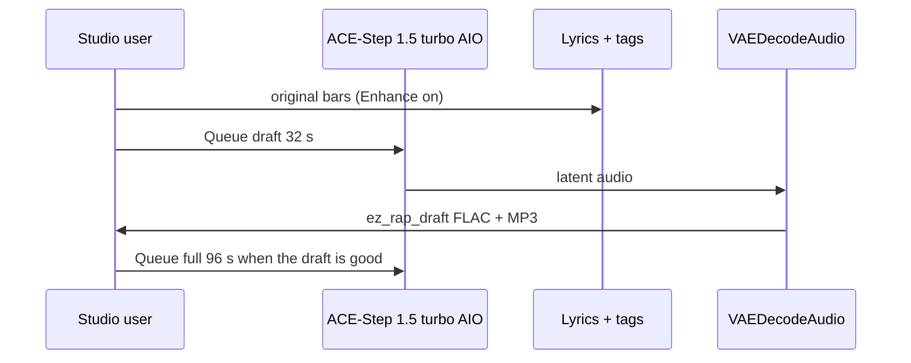

# Local music

**What's on this page**

- Queue the rap **draft** first, then the **full** track
- App Mode: tags, lyrics, rewrite, vocal/instrumental, duration
- Tags vs lyrics; `[verse]` / `[chorus]` / `[spoken word]` as vocal hints
- Original lyrics only — no “in the style of \<living artist\>”
- ACE-Step vocal = invented identity, not a clone
- DistroKid / Spotify / YouTube / USCO Part 2 disclosure
- `download-music --tier turbo`; sequential Queue + existing Klein covers
- Spark: ~10 GB AIO; do not co-resident with LTX / Wan / Klein

**What this enables**

- A first 32 s boom-bap draft on one NVIDIA DGX Spark without cloud music APIs
- Reusing the podcast ACE-Step AIO dest so the 10 GB file is not pulled twice
- Keeping the visual studio bootable when the music pack is missing

!!! warning "Not legal advice"

    Platform rules and copyright change. Read the current DistroKid, Spotify, YouTube, FTC, and USCO pages before you monetize.

---



Cover art is a **later** Klein session. Occupancy: do not load LTX + ACE-Step together.

## Two graphs

Do **not** load Klein + Wan + LTX + ACE-Step in one session. Cover art is a separate graph.

### Draft — first Queue

Graph: **music-rap-draft-lab-example** (`extra.lab_profile` `us-safe-music`). Same role as **klein-still-draft**.

| Stage | What runs | Prefix |
| --- | --- | --- |
| MODEL | `CheckpointLoaderSimple` `ace_step_1.5_turbo_aio.safetensors` + `ModelSamplingAuraFlow` | — |
| DURATION | App **Duration (seconds)** (primitive **32** s) → `EmptyAceStep1.5LatentAudio` | — |
| PROMPT | App **Tags**, **Lyrics**, **Rewrite prompt**, **Vocal / instrumental**. `EZAceStepPromptEnhance` enhance **on**. `ConditioningZeroOut` negative. KSampler 8 / cfg 1 / euler / simple | `ez_rap_prompt` |
| OUTPUT | `VAEDecodeAudio` → FLAC + 320 kbps MP3 | `ez_rap_draft` |
| COVER | Queue **klein-thumbnail-lab-example** or **klein-podcast-cover-lab-example** separately | `ez_thumbnail` / `ez_podcast` |

Default tags (both graphs):

`boom bap, hip-hop, dusty drums, vinyl crackle, dry snare, sampled piano stab, upright bass, male rap vocals, dry booth, no autotune, 88 bpm`

**Beat-only pass:** set App **Vocal / instrumental** to instrumental (forces no-vocals tags and `[inst]` lyrics). There is no third instrumental JSON.

Canned style swaps (tags widget only — not extra files):

- **trap:** `trap, 808 bass, rapid hi-hats, dark pads, male rap vocals, half-time, 140 bpm`
- **lo-fi:** `lo-fi hip-hop, dusty drums, rhodes, vinyl crackle, laid-back male rap vocals, 86 bpm`

### Full track

Graph: **music-rap-full-lab-example**. App **Duration (seconds)** defaults to **96** s. Same sampler and model. Prefix `ez_rap_full`. Same voice + second verse + repeated chorus + `[outro]`. Human rewrite required before any release.

---

## Tags vs lyrics

- **Tags** describe genre, drums, bass, booth, vocal character, and bpm.
- **Lyrics** are the bars. Section labels `[intro]`, `[verse]`, `[chorus]`, `[outro]`, and `[spoken word]` are vocal **hints** operators may add — they are not a rights grant.
- Original lyrics only. Do not write “in the style of \<living artist\>”. No living-MC names. No famous-hook paraphrases.
- Short percussive lines (about 6–10 syllables) slur less. Keep `language=en` on `TextEncodeAceStepAudio1.5` (combo, not free text). The seeded graph stores seed control as **fixed** after the seed; re-open **music-rap-draft-lab-example** after a pull so those combos stay aligned.

ACE-Step generates the vocal from lyrics + tags. That timbre is an **invented identity**, not a cloned MC. Do not add Kokoro / Chatterbox / TTS-Audio-Suite to these graphs.

---

## DistroKid, Spotify, YouTube, authorship

- **DistroKid / Spotify:** you must own the rights. Disclose AI lyrics + vocals + instrumental. If the artist identity is fake, Spotify may treat it as an “AI Persona” — prefer a **human artist name** with disclosed AI production.
- **YouTube:** use the synthetic-audio / altered-content flag. Mass-upload of near-duplicates is inauthentic content.
- **USCO Part 2 / Thaler:** edit the lyrics. Prompts are not authorship. A human rewrite plus selection and arrangement can be; raw generations are not registrable.

---

## Download

Music weights are **opt-in**. `./scripts/manage.sh download-models` does **not** pull them. `doctor` prints turbo JSON and still exits 0 when the pack is absent.

```bash
./scripts/manage.sh download-music --tier turbo     # ace_step_1.5_turbo_aio.safetensors (~10 GB)
./scripts/manage.sh download-music --tier xl        # optional XL split only
# same --limit auto|N|off wrap as download-models (always clears on exit)
```

Turbo uses the **same snapshot** as `download-podcast --tier acestep`:

```text
${MODELS_DIR}/Comfy-Org__ace_step_1.5_ComfyUI_files_acestep/checkpoints/ace_step_1.5_turbo_aio.safetensors
${MODELS_DIR}/comfy/checkpoints/ace_step_1.5_turbo_aio.safetensors   # relative symlink
```

If you already ran `download-podcast --tier acestep`, `download-music --tier turbo` is a cache hit + relink. Do not download the 10 GB AIO twice.

Relative symlinks only (host `/mnt/models` vs container `/models`).

---

## Sequential Queue

1. `./scripts/manage.sh download-music --tier turbo`
2. `./scripts/manage.sh start` — type **yes**
3. Load **music-rap-draft-lab-example**. Enhance on. Queue. Files under `${COMFY_OUTPUT_DIR}` as `ez_rap_draft_*.flac` / `ez_rap_draft_*.mp3`
4. Then load **music-rap-full-lab-example** (96 s)
5. Cover in a **later** session: **klein-thumbnail-lab-example** or **klein-podcast-cover-lab-example**

Spark: the AIO is ~10 GB VRAM-adjacent work. Do **not** co-resident with LTX / Wan / Klein.

Start still requires typing `yes`. Compose `restart: "no"` is unchanged.

---

## Hard no

Do not vendor or default:

- TTS-Audio-Suite, OldTimeRadio, cloud `ace-step/ACE-Step-ComfyUI`
- MiniMax Music 3 as a lab default, MiniMax H3, Suno / Udio, Stable Audio 2.5 partner
- Celebrity names in tags/lyrics, `LoadAudio` of copyrighted songs, “cover this Drake track”
- Required `XAI_API_KEY`

Native ACE-Step 1.5 already ships in `COMFYUI_REF=v0.34.0`.
