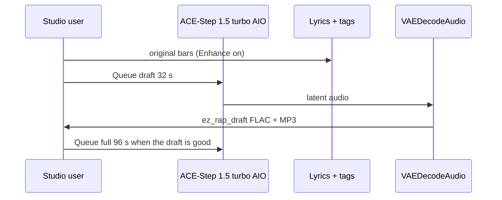

# Local music

**What's on this page**

- Queue the rap **draft** first, then the **full** track
- Forty-five **180 s** Nill Bye vs Rake diss examples under `_lab/audio/nill-bye/` (Queue on their own; lab catalog, style pack, trap/EDM pack; exclusive bars per take)
- Thirty **180 s** Drive-through rave-set EDM examples under `_lab/audio/drive-through/` (Queue on their own; American festival EDM, drop early, dirty pyro on every drop; vocals are a rare DJ treat on two graphs)
- App Mode: tags, lyrics, rewrite, vocal/instrumental, duration
- Tags vs lyrics; `[verse]` / `[chorus]` / `[spoken word]` as vocal hints; EDM uses `[inst]` / `[intro]` / `[outro]`, plus one short `[chorus]` chop on the two DJ-shout treats
- Original lyrics only — no “in the style of \<living artist\>”
- ACE-Step vocal = invented identity, not a clone
- DistroKid / Spotify / YouTube / USCO Part 2 disclosure
- `download-music --tier turbo`; sequential Queue + existing Klein covers
- Optional YouTube still-video: host `audio-still-video` after Queue (graphs stay FLAC + MP3)
- Spark: ~10 GB AIO; do not co-resident with LTX / Wan / Klein

**What this enables**

- A first 32 s boom-bap draft on one NVIDIA DGX Spark without cloud music APIs
- Forty-five 180 s original diss takes (Nill Bye vs Rake) with exclusive verses and punchlines, without cloud music APIs
- Thirty 180 s original Drive-through EDM takes (American festival EDM, BPM 140–176, drop-early dirty pyro; twenty-eight instrumental, two DJ-shout treats) without cloud music APIs
- Reusing the podcast ACE-Step AIO dest so the 10 GB file is not pulled twice
- Keeping the visual studio bootable when the music pack is missing
- Muxing a cover still + FLAC into a YouTube MP4 without changing the rap graphs

!!! warning "Not legal advice"

    Platform rules and copyright change. Read the current DistroKid, Spotify, YouTube, FTC, and USCO pages before you monetize.

---



Cover art is a **later** Klein session. Occupancy: do not load LTX + ACE-Step together.

## Graphs

Do **not** load Klein + Wan + LTX + ACE-Step in one session. Cover art is a separate graph.

### Draft — first Queue

Graph: **music-rap-draft-lab-example** (`extra.lab_profile` `us-safe-music`). Same role as **klein-still-draft**.

| Stage | What runs | Prefix |
| --- | --- | --- |
| MODEL | `CheckpointLoaderSimple` `ace_step_1.5_turbo_aio.safetensors` + `ModelSamplingAuraFlow` | — |
| DURATION | App **Duration (seconds)** (primitive **32** s) → `EmptyAceStep1.5LatentAudio` | — |
| PROMPT | App **Tags**, **Lyrics**, **Rewrite prompt**, **Vocal / instrumental**. `EZAceStepPromptEnhance` enhance **off** so tags, BPM, and `[verse]`/`[chorus]` stay as written. `ConditioningZeroOut` negative. KSampler 8 / cfg 1 / euler / simple | `ez_rap_prompt` |
| OUTPUT | `VAEDecodeAudio` → FLAC + 320 kbps MP3 | `ez_rap_draft` |
| COVER | Queue **klein-thumbnail-lab-example** or **klein-podcast-cover-lab-example** separately | `ez_thumbnail` / `ez_podcast` |

Default tags (both graphs):

`boom bap, hip-hop, dusty drums, vinyl crackle, dry snare, sampled piano stab, upright bass, male rap vocals, dry booth, no autotune, 88 bpm`

**Beat-only pass:** set App **Vocal / instrumental** to instrumental (forces no-vocals tags and `[inst]` lyrics). There is no third instrumental JSON.

Canned style swaps (tags widget only — not extra files):

- **trap:** `trap, 808 bass, rapid hi-hats, dark pads, male rap vocals, half-time, 140 bpm`
- **lo-fi:** `lo-fi hip-hop, dusty drums, rhodes, vinyl crackle, laid-back male rap vocals, 86 bpm`

### Full track

Graph: **music-rap-full-lab-example**. App **Duration (seconds)** defaults to **96** s. Same sampler and model. Prefix `ez_rap_full`. Same voice + second verse + repeated chorus + `[outro]`. Human rewrite required before any release.

### 180s Nill Bye diss examples

Forty-five extra full-track graphs under **`_lab/audio/nill-bye/`**. Same AIO, sampler, occupancy **audio**, and Klein cover handoff as the 96 s full track. App **Duration (seconds)** defaults to **180**. Queue **on their own** — draft-first is the generic lane, not a prerequisite. A longer Queue is expected (this is still an ACE-Step audio latent, not a video 90 s denoise).

Fictional MCs only: **Nill Bye** (science guy, mad) roasting **Rake** (in his feels; club-talk and fake-cool as a brand). Original lyrics. No living-MC names. No famous-hook paraphrases. Shipped bars stay short and SFW (roast the pose, not graphic content). Each take owns exclusive verses and punchlines — disses and content bars are not reused across the forty-five graphs; choruses stay unique hooks. ACE-Step vocal is an invented timbre. Human rewrite required before any release.

Style and trap/EDM packs keep the same dry-booth voice (`male rap vocals, dry booth, no autotune`). Trap/EDM graphs are rap **over** club beds — not autotune EDM vocals. Voices, tags, BPM, and seeds stay as shipped; only the bars change per take.

#### Lab catalog

| Graph | Tags / bpm | Prefix | Take |
| --- | --- | --- | --- |
| **music-rap-nill-bye-lab-coat-lab-example** | boom-bap **88** | `ez_rap_nill_labcoat` | Classroom lecture roast |
| **music-rap-nill-bye-peer-review-lab-example** | boom-bap **88**, `[spoken word]` intro | `ez_rap_nill_review` | Claims fail review |
| **music-rap-nill-bye-feels-lab-example** | lo-fi **86** | `ez_rap_nill_feels` | Sad-boy diary as a brand |
| **music-rap-nill-bye-fake-cool-lab-example** | trap **140** | `ez_rap_nill_fakecool` | Club-talk is not a method |
| **music-rap-nill-bye-hypothesis-lab-example** | boom-bap **92**, seed **7** | `ez_rap_nill_hypothesis` | Data vs rumor |
| **music-rap-nill-bye-control-group-lab-example** | boom-bap **88** | `ez_rap_nill_control` | Rake is the uncontrolled variable |
| **music-rap-nill-bye-sample-size-lab-example** | boom-bap **92**, seed **11** | `ez_rap_nill_samplesize` | One night is not a study |
| **music-rap-nill-bye-placebo-lab-example** | trap **140** | `ez_rap_nill_placebo` | The flex is a sugar pill |
| **music-rap-nill-bye-error-bars-lab-example** | boom-bap **88**, seed **17** | `ez_rap_nill_errorbars` | Confidence is a vibe, not a CI |
| **music-rap-nill-bye-lab-notebook-lab-example** | boom-bap **92**, seed **19** | `ez_rap_nill_notebook` | Receipts vs group-chat lore |
| **music-rap-nill-bye-office-hours-lab-example** | lo-fi **86**, seed **23** | `ez_rap_nill_office` | Extra help for a failing brand |
| **music-rap-nill-bye-grant-denied-lab-example** | boom-bap **88**, `[spoken word]` intro, seed **29** | `ez_rap_nill_grant` | No funding for feelings |
| **music-rap-nill-bye-contamination-lab-example** | trap **140**, seed **31** | `ez_rap_nill_contam` | Club talk leaked into the sample |
| **music-rap-nill-bye-double-blind-lab-example** | boom-bap **92**, seed **37** | `ez_rap_nill_doubleblind` | Even the booth knows you are faking |
| **music-rap-nill-bye-replicate-lab-example** | boom-bap **88**, seed **7** | `ez_rap_nill_replicate` | Cannot reproduce the night |

#### Style pack

Same invented vocal. Wider beds (jazz hop through folk) and diss angles. Not trap/EDM.

| Graph | Tags / bpm | Prefix | Take |
| --- | --- | --- | --- |
| **music-rap-nill-bye-citation-needed-lab-example** | jazz hop **90**, seed **41** | `ez_rap_nill_cite` | Claims with no source |
| **music-rap-nill-bye-p-hacking-lab-example** | g-funk **98**, seed **43** | `ez_rap_nill_phack` | Cherry-picked night |
| **music-rap-nill-bye-null-result-lab-example** | reggae **92**, seed **47** | `ez_rap_nill_null` | Flex found nothing |
| **music-rap-nill-bye-expired-reagent-lab-example** | neo-soul **84**, seed **53** | `ez_rap_nill_expired` | Cool past the date |
| **music-rap-nill-bye-lab-safety-lab-example** | rap rock **168**, seed **59** | `ez_rap_nill_safety` | Skipped the goggles |
| **music-rap-nill-bye-rumor-mill-lab-example** | industrial **108**, seed **61** | `ez_rap_nill_rumor` | Gossip vs measurement |
| **music-rap-nill-bye-gym-selfie-lab-example** | afrobeat **110**, seed **67** | `ez_rap_nill_gym` | Pose vs work |
| **music-rap-nill-bye-rented-drip-lab-example** | synthwave **104**, seed **71** | `ez_rap_nill_drip` | Costume cool |
| **music-rap-nill-bye-clout-diet-lab-example** | trip-hop **86**, seed **73** | `ez_rap_nill_clout` | Likes as calories |
| **music-rap-nill-bye-mood-forecast-lab-example** | cinematic **76**, seed **79** | `ez_rap_nill_forecast` | Weather of feelings |
| **music-rap-nill-bye-algorithm-lab-example** | funk **114**, seed **83** | `ez_rap_nill_algo` | Chasing the feed |
| **music-rap-nill-bye-story-time-lab-example** | blues **74**, `[spoken word]` intro, seed **89** | `ez_rap_nill_story` | Bedtime rumor |
| **music-rap-nill-bye-caption-lab-example** | chiptune **100**, seed **97** | `ez_rap_nill_caption` | Caption vs data |
| **music-rap-nill-bye-energy-drink-lab-example** | brass band **120**, seed **101** | `ez_rap_nill_fuel` | Fake fuel |
| **music-rap-nill-bye-campfire-lab-example** | folk **82**, seed **103** | `ez_rap_nill_camp` | Campfire rumor |

#### Trap / EDM pack

Same dry booth. Rap over club beds (no autotune).

| Graph | Tags / bpm | Prefix | Take |
| --- | --- | --- | --- |
| **music-rap-nill-bye-false-drop-lab-example** | dark trap **140**, seed **107** | `ez_rap_nill_drop` | Fake drop, no method |
| **music-rap-nill-bye-velvet-rope-lab-example** | festival trap **150**, seed **109** | `ez_rap_nill_rope` | VIP pose, empty list |
| **music-rap-nill-bye-fog-machine-lab-example** | rage **148**, seed **113** | `ez_rap_nill_fog` | Fog for a missing show |
| **music-rap-nill-bye-guest-list-lab-example** | phonk **132**, seed **127** | `ez_rap_nill_guest` | Name not on the list |
| **music-rap-nill-bye-sparkler-lab-example** | trap **145**, seed **131** | `ez_rap_nill_spark` | Sparkler science |
| **music-rap-nill-bye-bottle-service-lab-example** | house **126**, seed **137** | `ez_rap_nill_bottle` | Rented bottles |
| **music-rap-nill-bye-strobe-claim-lab-example** | techno **132**, seed **139** | `ez_rap_nill_strobe` | Strobe, no substance |
| **music-rap-nill-bye-amen-rumor-lab-example** | drum and bass **174**, seed **149** | `ez_rap_nill_amen` | Fast rumor, empty bar |
| **music-rap-nill-bye-wobble-alibi-lab-example** | dubstep **140**, seed **151** | `ez_rap_nill_wobble` | Alibi in the wobble |
| **music-rap-nill-bye-supersaw-flex-lab-example** | future bass **148**, seed **157** | `ez_rap_nill_saw` | Flex is a saw patch |
| **music-rap-nill-bye-laser-show-lab-example** | electro house **128**, seed **163** | `ez_rap_nill_laser` | Lights, no paper |
| **music-rap-nill-bye-two-step-lab-example** | UK garage **130**, seed **167** | `ez_rap_nill_twostep` | Two-step alibi |
| **music-rap-nill-bye-jersey-bounce-lab-example** | jersey club **140**, seed **173** | `ez_rap_nill_jersey` | Bounce with no proof |
| **music-rap-nill-bye-kick-split-lab-example** | hardstyle **150**, seed **179** | `ez_rap_nill_kick` | Kick-split myth |
| **music-rap-nill-bye-uplift-rumor-lab-example** | trance **138**, seed **181** | `ez_rap_nill_uplift` | Uplifting rumor |

Cover still in a later Klein session. Do not co-resident with LTX / Wan / Klein.

### 180s Drive-through EDM examples

Thirty extra full-track graphs under **`_lab/audio/drive-through/`**. Same AIO, sampler, occupancy **audio**, and Klein cover handoff as the 96 s full track. App **Duration (seconds)** defaults to **180**. Queue **on their own** — draft-first is the generic rap lane, not a prerequisite. A longer Queue is expected.

Fictional act only: **Drive-through** (hardcore, pure of heart) playing a **live rave DJ set**. Original **American festival EDM** arrangements (bass house, big room, future bass, brostep, festival trap, drumstep — not techno). No living-DJ names. No famous-hook paraphrases. Twenty-eight takes lock `instrumental, no vocals, no singing` (App **Vocal / instrumental** = instrumental). Two takes are sparse DJ-shout treats (`wide open`, `second wave`): App mode **vocal**, one short `[chorus]` chop, no `[verse]`. Arrangement scores are production cues in `[inst]` blocks — unique flow per take, drop in the first or second section, dirty pyro on every drop, mix-in/out — not a Nill Bye verse/chorus loop and not the same melody-drop-break-drop skeleton on every graph. ACE-Step timbre is invented. Human selection and edit required before any release.

This is **not** the Nill Bye trap/EDM pack. Those graphs are rap **over** club beds with a dry booth. Drive-through is dance EDM (mostly instrumental).

Catalog order is the recommended live-set queue (each graph still Queues alone):

| Graph | Tags / bpm | Prefix | Take |
| --- | --- | --- | --- |
| **music-edm-drive-through-night-window-lab-example** | bass house **145**, seed **193** | `ez_edm_drive_night` | Opener: dirty 808 pyro from the first drop |
| **music-edm-drive-through-open-lane-lab-example** | festival bass **152**, seed **191** | `ez_edm_drive_openlane` | Drop-first ID, second stacked pyro wreck |
| **music-edm-drive-through-exit-seven-lab-example** | electro house **142**, seed **233** | `ez_edm_drive_exit` | Filter mix-in, two dirty electro pyro drops |
| **music-edm-drive-through-skyline-pass-lab-example** | progressive house **145**, seed **199** | `ez_edm_drive_skyline` | Drop-first anthem, three pyro wrecks |
| **music-edm-drive-through-on-ramp-lab-example** | festival bass **155**, seed **197** | `ez_edm_drive_onramp` | Reverse-bass dirty pyro, three wrecks |
| **music-edm-drive-through-tunnel-bass-lab-example** | dirty bass **150**, seed **257** | `ez_edm_drive_tunnel` | Drop-first industrial 808, three pyro drops |
| **music-edm-drive-through-wide-open-lab-example** | big room **150**, seed **239** | `ez_edm_drive_wide` | **DJ shout treat** (`hands up`) + dirty mainstage pyro |
| **music-edm-drive-through-overpass-lab-example** | riddim **150**, seed **227** | `ez_edm_drive_overpass` | Drop-first wobble, four-floor pyro flip |
| **music-edm-drive-through-second-wave-lab-example** | festival remix **150**, seed **241** | `ez_edm_drive_second` | **Remix vocal-chop treat**, drop-first growl pyro |
| **music-edm-drive-through-freight-pulse-lab-example** | drumstep **176**, seed **211** | `ez_edm_drive_freight` | Drop-first amen, four dirty pyro wrecks |
| **music-edm-drive-through-keep-going-lab-example** | drumstep **170**, seed **251** | `ez_edm_drive_keep` | Drop-first 808 pyro, triple wreck |
| **music-edm-drive-through-horizon-kick-lab-example** | festival bass **165**, seed **263** | `ez_edm_drive_horizon` | Drop-first reverse bass pyro |
| **music-edm-drive-through-clean-wreckage-lab-example** | dirty electro **150**, seed **269** | `ez_edm_drive_wreck` | Immediate dirty electro, three pyro wrecks |
| **music-edm-drive-through-heart-lane-lab-example** | future bass **145**, seed **223** | `ez_edm_drive_heart` | Drop-first warm 808 pyro |
| **music-edm-drive-through-dawn-receipt-lab-example** | progressive house **140**, seed **229** | `ez_edm_drive_dawn` | Hour-1 closer, two dirty pyro wrecks |
| **music-edm-drive-through-rumble-strip-lab-example** | bass house **140**, seed **271** | `ez_edm_drive_rumble` | Hour-2 opener, drop-first chest 808 pyro |
| **music-edm-drive-through-low-lane-lab-example** | festival bass **144**, seed **277** | `ez_edm_drive_low` | Chest sub pyro, three wrecks |
| **music-edm-drive-through-warm-merge-lab-example** | future bass **148**, seed **281** | `ez_edm_drive_warm` | Drop-first warm 808 pyro |
| **music-edm-drive-through-colour-span-lab-example** | complextro **150**, seed **283** | `ez_edm_drive_colour` | Dirty electro pyro, three wrecks |
| **music-edm-drive-through-garage-ticket-lab-example** | festival trap **140**, seed **293** | `ez_edm_drive_garage` | Drop-first trap 808 pyro |
| **music-edm-drive-through-liquid-grade-lab-example** | drumstep **174**, seed **307** | `ez_edm_drive_liquid` | Drop-first drumstep pyro |
| **music-edm-drive-through-jump-bay-lab-example** | brostep **150**, seed **311** | `ez_edm_drive_jump` | Drop-first dirty growl pyro |
| **music-edm-drive-through-psy-median-lab-example** | big room **145**, seed **313** | `ez_edm_drive_psy` | Mainstage 808 pyro, two wrecks |
| **music-edm-drive-through-groove-mile-lab-example** | slap house **144**, seed **317** | `ez_edm_drive_groove` | Drop-first bounce 808 pyro |
| **music-edm-drive-through-donk-ramp-lab-example** | dirty electro **150**, seed **331** | `ez_edm_drive_donk` | Complextro 808 pyro, three wrecks |
| **music-edm-drive-through-bounce-booth-lab-example** | melbourne bounce **140**, seed **337** | `ez_edm_drive_bounce` | Drop-first bounce pyro |
| **music-edm-drive-through-toll-growl-lab-example** | tearout **150**, seed **347** | `ez_edm_drive_toll` | Drop-first tearout pyro, four wrecks |
| **music-edm-drive-through-night-oil-lab-example** | hybrid trap **142**, seed **349** | `ez_edm_drive_oil` | Hybrid 808 pyro, two wrecks |
| **music-edm-drive-through-chest-pass-lab-example** | festival bass **150**, seed **353** | `ez_edm_drive_chest` | Drop-first chest sub pyro |
| **music-edm-drive-through-sunrise-sub-lab-example** | progressive house **140**, seed **359** | `ez_edm_drive_sunsub` | Encore closer, two warm sub pyro wrecks |

Cover still in a later Klein session. Do not co-resident with LTX / Wan / Klein.

---

## Tags vs lyrics

- **Tags** describe genre, drums, bass, booth, vocal character, and bpm.
- **Lyrics** are the bars (rap) or the arrangement score (Drive-through EDM). Section labels `[intro]`, `[verse]`, `[chorus]`, `[outro]`, and `[spoken word]` are vocal **hints** operators may add — they are not a rights grant. EDM graphs use `[inst]` for the bed, build, and drops. Twenty-eight takes stay instrumental. Two rave-set treats add one short `[chorus]` DJ chop (never `[verse]`).
- Original lyrics only. Do not write “in the style of \<living artist\>”. No living-MC names. No famous-hook paraphrases.
- Short percussive lines (about 6–10 syllables) slur less. Keep `language=en` on `TextEncodeAceStepAudio1.5` (combo, not free text). The seeded graph stores seed control as **fixed** after the seed; re-open **music-rap-draft-lab-example** after a pull so those combos stay aligned.

ACE-Step generates the vocal from lyrics + tags. That timbre is an **invented identity**, not a cloned MC. Do not add Kokoro / Chatterbox / TTS-Audio-Suite to these graphs.

---

## DistroKid, Spotify, YouTube, authorship

- **DistroKid / Spotify:** you must own the rights. Disclose AI lyrics + vocals + instrumental. If the artist identity is fake, Spotify may treat it as an “AI Persona” — prefer a **human artist name** with disclosed AI production.
- **YouTube:** use the synthetic-audio / altered-content flag. Mass-upload of near-duplicates is inauthentic content.
- **USCO Part 2 / Thaler:** edit the lyrics. Prompts are not authorship. A human rewrite plus selection and arrangement can be; raw generations are not registrable.

---

## Download

Music weights are **opt-in**. `./scripts/manage.sh download-models` does **not** pull them. `doctor` prints turbo JSON and still exits 0 when the pack is absent.

```bash
./scripts/manage.sh download-music --tier turbo     # ace_step_1.5_turbo_aio.safetensors (~10 GB)
./scripts/manage.sh download-music --tier xl        # optional XL split only
# same --limit auto|N|off wrap as download-models (always clears on exit)
```

Turbo uses the **same snapshot** as `download-podcast --tier acestep`:

```text
${MODELS_DIR}/Comfy-Org__ace_step_1.5_ComfyUI_files_acestep/checkpoints/ace_step_1.5_turbo_aio.safetensors
${MODELS_DIR}/comfy/checkpoints/ace_step_1.5_turbo_aio.safetensors   # relative symlink
```

If you already ran `download-podcast --tier acestep`, `download-music --tier turbo` is a cache hit + relink. Do not download the 10 GB AIO twice.

Relative symlinks only (host `/mnt/models` vs container `/models`).

---

## Sequential Queue

1. `./scripts/manage.sh download-music --tier turbo`
2. `./scripts/manage.sh start` — type **yes**
3. Load **music-rap-draft-lab-example**. Enhance on. Queue. Files under `${COMFY_OUTPUT_DIR}` as `ez_rap_draft_*.flac` / `ez_rap_draft_*.mp3`
4. Then load **music-rap-full-lab-example** (96 s), **or** one **music-rap-nill-bye-*-lab-example** (180 s) from `_lab/audio/nill-bye/` on its own, **or** one **music-edm-drive-through-*-lab-example** (180 s rave-set take) from `_lab/audio/drive-through/` on its own
5. Cover in a **later** session: **klein-thumbnail-lab-example** or **klein-podcast-cover-lab-example**
6. Optional YouTube still-image video (host ffmpeg; graphs still save FLAC + MP3):

```bash
./scripts/manage.sh audio-still-video \
  --audio "${COMFY_OUTPUT_DIR}/ez_rap_full_00001_.flac" \
  --image "${COMFY_OUTPUT_DIR}/ez_thumbnail_00001_.png"
# → ${COMFY_OUTPUT_DIR}/ez_rap_full_00001_.mp4
# Square covers letterbox onto 1920×1080. Shorts: --size 1080x1920
```

Spark: the AIO is ~10 GB VRAM-adjacent work. Do **not** co-resident with LTX / Wan / Klein.

Start still requires typing `yes`. Compose `restart: "no"` is unchanged.

---

## Hard no

Do not vendor or default:

- TTS-Audio-Suite, OldTimeRadio, cloud `ace-step/ACE-Step-ComfyUI`
- MiniMax Music 3 as a lab default, MiniMax H3, Suno / Udio, Stable Audio 2.5 partner
- Celebrity names in tags/lyrics, `LoadAudio` of copyrighted songs, “cover this Drake track”
- Required `XAI_API_KEY`

Native ACE-Step 1.5 already ships in `COMFYUI_REF=v0.34.6`.
