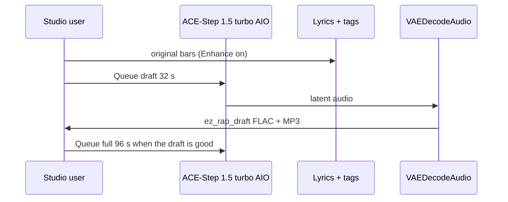

# Local music

**What's on this page**

- Queue the rap **draft** first, then the **full** track
- One hundred thirty-five **180 s** Nill Bye takes under `_lab/audio/albums/nill-bye/<album>/` (nine albums; Queue a track or `album.json` / `album-render`)
- Eighty-five **180 s** Drive-through bass-set EDM takes under `_lab/audio/albums/drive-through/<album>/` (Hour 1, Hour 2, Headliner, Afterparty, Secret Homage)
- Queued files are `NN - Song Title` under `albums/<Artist>/<Album>/` with artist/album tags
- App Mode: tags, lyrics, rewrite, vocal/instrumental, duration, artist, album, title, album art
- Tags vs lyrics; `[verse]` / `[chorus]` / `[spoken word]` as vocal hints; EDM uses `[inst]` / `[outro]`, plus one 1–2 word `[chorus]` chop on the two DJ-shout treats
- Original lyrics only — no “in the style of \<living artist\>”
- ACE-Step vocal = invented identity, not a clone
- DistroKid / Spotify / YouTube / USCO Part 2 disclosure
- `download-music --tier turbo`; sequential Queue + existing Klein covers
- Optional YouTube still-video: host `audio-still-video` after Queue (graphs stay FLAC + MP3)
- Spark: ~10 GB AIO; do not co-resident with LTX / Wan / Klein

**What this enables**

- A first 32 s boom-bap draft on one NVIDIA DGX Spark without cloud music APIs
- One hundred thirty-five 180 s original Nill Bye takes (vs Rake in phases 0–2; civic satire of Texas Gov. Greg Abbott in phases 3–4; civic satire of Donald Trump in phases 5–6; progress/solutions in phases 7–8) with exclusive verses and punchlines, without cloud music APIs
- Eighty-five 180 s original Drive-through EDM takes (warped hybrid-trap EDM, BPM 140–176, drop-first warpy drops, trap drums, chest-sub bass; eighty-three instrumental, two DJ-shout treats) without cloud music APIs
- Reusing the podcast ACE-Step AIO dest so the 10 GB file is not pulled twice
- Keeping the visual studio bootable when the music pack is missing
- Muxing a cover still + FLAC into a YouTube MP4 without changing the rap graphs

!!! warning "Not legal advice"

    Platform rules and copyright change. Read the current DistroKid, Spotify, YouTube, FTC, and USCO pages before you monetize.

---



Cover art is a **later** Klein session. Occupancy: do not load LTX + ACE-Step together.

## Graphs

Do **not** load Klein + Wan + LTX + ACE-Step in one session. Cover art is a separate graph.

### Draft — first Queue

Graph: **audio/music/rap-draft** (`extra.lab_profile` `us-safe-music`). Same role as **klein-still-draft**.

| Stage | What runs | Prefix |
| --- | --- | --- |
| MODEL | `CheckpointLoaderSimple` `ace_step_1.5_turbo_aio.safetensors` + `ModelSamplingAuraFlow` | — |
| DURATION | App **Duration (seconds)** (primitive **32** s) → `EmptyAceStep1.5LatentAudio` | — |
| PROMPT | App **Tags**, **Lyrics**, **Rewrite prompt**, **Vocal / instrumental**. `EZAceStepPromptEnhance` enhance **off** so tags, BPM, and `[verse]`/`[chorus]` stay as written. `ConditioningZeroOut` negative. KSampler 8 / cfg 1 / euler / simple | `ez_rap_prompt` |
| OUTPUT | `VAEDecodeAudio` → FLAC + 320 kbps MP3 | `ez_rap_draft` |
| COVER | Queue **klein/thumbnail** or **klein/podcast-cover** separately | `ez_thumbnail` / `ez_podcast` |

Default tags (both graphs):

`boom bap, hip-hop, dusty drums, vinyl crackle, dry snare, sampled piano stab, upright bass, male rap vocals, dry booth, no autotune, 88 bpm`

**Beat-only pass:** set App **Vocal / instrumental** to instrumental (forces no-vocals tags and `[inst]` lyrics). There is no third instrumental JSON.

Canned style swaps (tags widget only — not extra files):

- **trap:** `trap, 808 bass, rapid hi-hats, dark pads, male rap vocals, half-time, 140 bpm`
- **lo-fi:** `lo-fi hip-hop, dusty drums, rhodes, vinyl crackle, laid-back male rap vocals, 86 bpm`

### Full track

Graph: **audio/music/rap-full**. App **Duration (seconds)** defaults to **96** s. Same sampler and model. Prefix `ez_rap_full`. Same voice + second verse + repeated chorus + `[outro]`. Human rewrite required before any release.

### 180s Nill Bye diss examples

One hundred thirty-five extra full-track graphs under **`_lab/audio/albums/nill-bye/<album>/`**. Same AIO, sampler, occupancy **audio**. App **Duration (seconds)** defaults to **180**. Queue a numbered track **on its own**, or generate the album in one go with `./scripts/manage.sh album-render --album nill-bye/<album-slug>`. SaveAudio stem is **`NN - Song Title`**. FLAC/MP3 tags include artist, album, title, and optional cover.

**Nill Bye** (science guy, mad) is a fictional MC with an invented ACE-Step vocal. Phases 0–2 roast fictional MC **Rake** (in his feels; club-talk and fake-cool as a brand). Phases 3–4 are civic satire of Texas Gov. **Greg Abbott** as a public-record target, not a vocal identity. Phases 5–6 are civic satire of **Donald Trump** as a public-record target, not a vocal identity. Phases 7–8 are **progress** takes: methods, statutes, and measurement with **no roast target** (winterize, preregister, hearings, NDCs, Article I, lead-line replacement). Original lyrics. No living-MC names. No famous-hook paraphrases. Punch **up** on diss phases; **build up** on progress phases. Do not roast disability, race, faith, children, or people at the river. Shipped bars stay short and SFW. Each take owns exclusive verses and punchlines — content bars are not reused across the one hundred thirty-five graphs; choruses stay unique hooks. Human rewrite required before any release.

Style and trap/EDM packs keep the same dry-booth voice (`male rap vocals, dry booth, no autotune`). Trap/EDM graphs are rap **over** club beds — not autotune EDM vocals. Voices, tags, BPM, and seeds stay as shipped; only the bars change per take.

A new album lands in `_lab/audio/albums/<artist>/<album-slug>/` with numbered tracks plus `cover.json` and `album.json`. Do not leave new graphs at the artist folder root.

#### Peer Review (`audio/albums/nill-bye/peer-review/`)

Lab catalog. Queue a track on its own. Full album: `./scripts/manage.sh album-render --album nill-bye/peer-review`.

| Graph | Tags / bpm | Prefix | Take |
| --- | --- | --- | --- |
| **01-lab-coat** | boom-bap **88** | `01 - Lab Coat Lecture` | Classroom lecture roast |
| **02-peer-review** | boom-bap **88**, `[spoken word]` intro | `02 - Peer Review` | Claims fail review |
| **03-feels** | lo-fi **86** | `03 - In His Feels` | Sad-boy diary as a brand |
| **04-fake-cool** | trap **140** | `04 - Fake Cool` | Club-talk is not a method |
| **05-hypothesis** | boom-bap **92**, seed **7** | `05 - Hypothesis vs Rumor` | Data vs rumor |
| **06-control-group** | boom-bap **88** | `06 - Control Group` | Rake is the uncontrolled variable |
| **07-sample-size** | boom-bap **92**, seed **11** | `07 - Sample Size` | One night is not a study |
| **08-placebo** | trap **140** | `08 - Placebo` | The flex is a sugar pill |
| **09-error-bars** | boom-bap **88**, seed **17** | `09 - Error Bars` | Confidence is a vibe, not a CI |
| **10-lab-notebook** | boom-bap **92**, seed **19** | `10 - Lab Notebook` | Receipts vs group-chat lore |
| **11-office-hours** | lo-fi **86**, seed **23** | `11 - Office Hours` | Extra help for a failing brand |
| **12-grant-denied** | boom-bap **88**, `[spoken word]` intro, seed **29** | `12 - Grant Denied` | No funding for feelings |
| **13-contamination** | trap **140**, seed **31** | `13 - Contamination` | Club talk leaked into the sample |
| **14-double-blind** | boom-bap **92**, seed **37** | `14 - Double Blind` | Even the booth knows you are faking |
| **15-replicate** | boom-bap **88**, seed **7** | `15 - Replicate or Retract` | Cannot reproduce the night |

#### Citation Needed (`audio/albums/nill-bye/citation-needed/`)

Same invented vocal. Wider beds (jazz hop through folk) and diss angles. Not trap/EDM. Full album: `./scripts/manage.sh album-render --album nill-bye/citation-needed`.

| Graph | Tags / bpm | Prefix | Take |
| --- | --- | --- | --- |
| **01-citation-needed** | jazz hop **90**, seed **41** | `01 - Citation Needed` | Claims with no source |
| **02-p-hacking** | g-funk **98**, seed **43** | `02 - P-Hacking` | Cherry-picked night |
| **03-null-result** | reggae **92**, seed **47** | `03 - Null Result` | Flex found nothing |
| **04-expired-reagent** | neo-soul **84**, seed **53** | `04 - Expired Reagent` | Cool past the date |
| **05-lab-safety** | rap rock **168**, seed **59** | `05 - Lab Safety` | Skipped the goggles |
| **06-rumor-mill** | industrial **108**, seed **61** | `06 - Rumor Mill` | Gossip vs measurement |
| **07-gym-selfie** | afrobeat **110**, seed **67** | `07 - Gym Selfie` | Pose vs work |
| **08-rented-drip** | synthwave **104**, seed **71** | `08 - Rented Drip` | Costume cool |
| **09-clout-diet** | trip-hop **86**, seed **73** | `09 - Clout Diet` | Likes as calories |
| **10-mood-forecast** | cinematic **76**, seed **79** | `10 - Mood Forecast` | Weather of feelings |
| **11-algorithm** | funk **114**, seed **83** | `11 - Algorithm` | Chasing the feed |
| **12-story-time** | blues **74**, `[spoken word]` intro, seed **89** | `12 - Story Time` | Bedtime rumor |
| **13-caption** | chiptune **100**, seed **97** | `13 - Caption vs Data` | Caption vs data |
| **14-energy-drink** | brass band **120**, seed **101** | `14 - Energy Drink` | Fake fuel |
| **15-campfire** | folk **82**, seed **103** | `15 - Campfire Rumor` | Campfire rumor |

#### False Drop (`audio/albums/nill-bye/false-drop/`)

Same dry booth. Rap over club beds (no autotune). Full album: `./scripts/manage.sh album-render --album nill-bye/false-drop`.

| Graph | Tags / bpm | Prefix | Take |
| --- | --- | --- | --- |
| **01-false-drop** | dark trap **140**, seed **107** | `01 - False Drop` | Fake drop, no method |
| **02-velvet-rope** | festival trap **150**, seed **109** | `02 - Velvet Rope` | VIP pose, empty list |
| **03-fog-machine** | rage **148**, seed **113** | `03 - Fog Machine` | Fog for a missing show |
| **04-guest-list** | phonk **132**, seed **127** | `04 - Guest List` | Name not on the list |
| **05-sparkler** | trap **145**, seed **131** | `05 - Sparkler Science` | Sparkler science |
| **06-bottle-service** | house **126**, seed **137** | `06 - Bottle Service` | Rented bottles |
| **07-strobe-claim** | techno **132**, seed **139** | `07 - Strobe Claim` | Strobe, no substance |
| **08-amen-rumor** | drum and bass **174**, seed **149** | `08 - Amen Rumor` | Fast rumor, empty bar |
| **09-wobble-alibi** | dubstep **140**, seed **151** | `09 - Wobble Alibi` | Alibi in the wobble |
| **10-supersaw-flex** | future bass **148**, seed **157** | `10 - Supersaw Flex` | Flex is a saw patch |
| **11-laser-show** | electro house **128**, seed **163** | `11 - Laser Show` | Lights, no paper |
| **12-two-step** | UK garage **130**, seed **167** | `12 - Two-Step Alibi` | Two-step alibi |
| **13-jersey-bounce** | jersey club **140**, seed **173** | `13 - Jersey Bounce` | Bounce with no proof |
| **14-kick-split** | hardstyle **150**, seed **179** | `14 - Kick-Split Myth` | Kick-split myth |
| **15-uplift-rumor** | trance **138**, seed **181** | `15 - Uplifting Rumor` | Uplifting rumor |

#### Frozen Ercot (`audio/albums/nill-bye/frozen-ercot/`)

Same dry booth. Non-trap, non-EDM beds. Public-record satire of Abbott (punch up; no disability, race, or faith punch-down). Full album: `./scripts/manage.sh album-render --album nill-bye/frozen-ercot`.

| Graph | Tags / bpm | Prefix | Take |
| --- | --- | --- | --- |
| **01-frozen-ercot** | boom-bap **88**, seed **191** | `01 - Frozen Ercot` | Uri / ERCOT blame-shift |
| **02-abject-failure** | boom-bap **86**, `[spoken word]`, seed **193** | `02 - Abject Failure` | Uvalde delay, split message |
| **03-six-week-clock** | jazz hop **90**, seed **197** | `03 - Six Week Clock` | SB 8 bounty |
| **04-no-bid-wire** | industrial hip-hop **108**, seed **199** | `04 - No-Bid Wire` | OLS emergency procurement |
| **05-gavel-theater** | brass band **112**, seed **211** | `05 - Gavel Theater` | Paxton impeachment |
| **06-property-hymn** | folk **82**, seed **223** | `06 - Property Hymn` | No-income-tax vs levy |
| **07-voucher-raid** | country **100**, seed **227** | `07 - Voucher Raid` | ESA / Yass primaries |
| **08-uninsured-blues** | blues **74**, seed **229** | `08 - Uninsured Blues` | Medicaid non-expansion |
| **09-locked-stacks** | lo-fi **86**, seed **233** | `09 - Locked Stacks` | Book / DEI pull-lists |
| **10-mask-order** | neo-soul **84**, seed **239** | `10 - Mask Order` | GA-34 preemption |
| **11-mid-decade-map** | chiptune **100**, seed **241** | `11 - Mid Decade Map` | Mid-decade remap |
| **12-rack-tax** | synthwave **104**, seed **251** | `12 - Rack Tax` | Data-center boom then brake |
| **13-wudu-letter** | gospel **78**, seed **257** | `13 - Wudu Letter` | Airport rinse smear, called out |
| **14-fourth-term** | cinematic **76**, seed **263** | `14 - Fourth Term` | Unprecedented fourth lap |
| **15-campus-cordon** | rap rock **168**, seed **269** | `15 - Campus Cordon` | UT troopers vs protest |

#### Lone Star Tab (`audio/albums/nill-bye/lone-star-tab/`)

Same dry booth. Rap over club beds (no autotune). Same punch-up rule. Full album: `./scripts/manage.sh album-render --album nill-bye/lone-star-tab`.

| Graph | Tags / bpm | Prefix | Take |
| --- | --- | --- | --- |
| **01-lone-star-tab** | dark trap **140**, seed **271** | `01 - Lone Star Tab` | OLS forever budget |
| **02-river-buoy** | rage **148**, seed **277** | `02 - River Buoy` | Buoys and wire as cruelty |
| **03-bus-receipt** | phonk **132**, seed **281** | `03 - Bus Receipt` | People mailed as a presser |
| **04-guard-detail** | trap **145**, seed **283** | `04 - Guard Detail` | Guard deaths on state orders |
| **05-chase-wreck** | house **126**, seed **293** | `05 - Chase Wreck` | OLS pursuit deaths |
| **06-frequency-drop** | drum and bass **174**, seed **307** | `06 - Frequency Drop` | 20,000 MW load-shed |
| **07-permitless** | jersey club **140**, seed **311** | `07 - Permitless` | HB 1927 |
| **08-trigger-clock** | future bass **148**, seed **313** | `08 - Trigger Clock` | HB 1280 felony delay |
| **09-disaster-stamp** | techno **132**, `[spoken word]`, seed **317** | `09 - Disaster Stamp` | Monthly border emergency |
| **10-windmill-blame** | dubstep **140**, seed **331** | `10 - Windmill Blame` | Fox clip vs FERC mix |
| **11-yass-primary** | electro house **128**, seed **337** | `11 - Yass Primary` | Out-of-state cash primaries |
| **12-hold-request** | UK garage **130**, seed **347** | `12 - Hold Request` | ICE extradition fight |
| **13-sharia-plank** | hardstyle **150**, seed **349** | `13 - Sharia Plank` | Convention scare, empty docket |
| **14-invasion-hymn** | trance **138**, seed **353** | `14 - Invasion Hymn` | War-word as appropriation |
| **15-demolish-hook** | festival trap **150**, seed **359** | `15 - Demolish Hook` | “Demolish” closer |

#### Thirty Four Counts (`audio/albums/nill-bye/thirty-four-counts/`)

Same dry booth. Non-trap, non-EDM beds. Public-record satire of Trump (punch up; no disability, race, faith, or children as the joke). Full album: `./scripts/manage.sh album-render --album nill-bye/thirty-four-counts`.

| Graph | Tags / bpm | Prefix | Take |
| --- | --- | --- | --- |
| **01-thirty-four-counts** | boom-bap **88**, seed **367** | `01 - Thirty Four Counts` | 34 felony records counts |
| **02-one-eighty-seven** | boom-bap **86**, `[spoken word]`, seed **373** | `02 - One Eighty Seven` | Jan 6 idle minutes |
| **03-eleven-seven-eighty** | jazz hop **90**, seed **379** | `03 - Eleven Seven Eighty` | Raffensperger tape |
| **04-fake-electors** | industrial hip-hop **108**, seed **383** | `04 - Fake Electors` | Seven slates |
| **05-bathroom-boxes** | brass band **112**, seed **389** | `05 - Bathroom Boxes` | Mar-a-Lago storage |
| **06-statement-of-worth** | folk **82**, seed **397** | `06 - Statement of Worth` | Inflated SFSs |
| **07-university-tab** | country **100**, seed **401** | `07 - University Tab` | $25M seminar settlement |
| **08-ukraine-hold** | blues **74**, seed **409** | `08 - Ukraine Hold` | Aid freeze, first impeachment |
| **09-travel-memo** | lo-fi **86**, seed **419** | `09 - Travel Memo` | EO 13769 roster |
| **10-zero-tolerance** | neo-soul **84**, seed **421** | `10 - Zero Tolerance` | Family-separation memo |
| **11-census-question** | chiptune **100**, seed **431** | `11 - Census Question` | Citizenship-box pretext |
| **12-paris-walkout** | synthwave **104**, seed **433** | `12 - Paris Walkout` | Paris Agreement letter |
| **13-emoluments-suite** | gospel **78**, seed **439** | `13 - Emoluments Suite` | DC hotel while in office |
| **14-seven-fifty** | cinematic **76**, seed **443** | `14 - Seven Fifty` | Reported $750 federal line |
| **15-carroll-tab** | rap rock **168**, seed **449** | `15 - Carroll Tab` | Defamation after a finding |

#### Pardon Flood (`audio/albums/nill-bye/pardon-flood/`)

Same dry booth. Rap over club beds (no autotune). Same punch-up rule. Full album: `./scripts/manage.sh album-render --album nill-bye/pardon-flood`.

| Graph | Tags / bpm | Prefix | Take |
| --- | --- | --- | --- |
| **01-pardon-flood** | dark trap **140**, `[spoken word]`, seed **457** | `01 - Pardon Flood` | Day-one Jan 6 clemency |
| **02-ieepa-wreck** | rage **148**, seed **461** | `02 - Ieepa Wreck` | IEEPA tariffs 6–3 |
| **03-gold-card** | phonk **132**, seed **463** | `03 - Gold Card` | $1M residency SKU |
| **04-memecoin-tab** | trap **145**, seed **467** | `04 - Memecoin Tab` | Pre-oath token float |
| **05-east-wing-wreck** | house **126**, seed **479** | `05 - East Wing Wreck` | Ballroom teardown |
| **06-metro-surge** | drum and bass **174**, seed **487** | `06 - Metro Surge` | 2026 enforcement wave |
| **07-due-process** | jersey club **140**, seed **491** | `07 - Due Process` | Withholding skipped |
| **08-kennedy-plaque** | future bass **148**, seed **499** | `08 - Kennedy Plaque` | Organic-statute rename |
| **09-birthright-order** | techno **132**, seed **503** | `09 - Birthright Order` | 14th Amendment EO |
| **10-cook-firing** | dubstep **140**, seed **509** | `10 - Cook Firing` | Fed-governor purge try |
| **11-inspector-purge** | electro house **128**, seed **521** | `11 - Inspector Purge` | IG class sweep |
| **12-law-firm-order** | UK garage **130**, seed **523** | `12 - Law Firm Order` | Counsel-punishment EO |
| **13-visa-ticket** | hardstyle **150**, seed **541** | `13 - Visa Ticket` | $100k H-1B fee |
| **14-shadow-docket** | trance **138**, seed **547** | `14 - Shadow Docket` | Emergency-petition pile |
| **15-immunity-hymn** | festival trap **150**, seed **557** | `15 - Immunity Hymn` | Official-act structure |

#### Winterize Wells (`audio/albums/nill-bye/winterize-wells/`)

Same dry booth. Non-trap, non-EDM beds. Builder bars: methods and statutes, no roast target. Full album: `./scripts/manage.sh album-render --album nill-bye/winterize-wells`.

| Graph | Tags / bpm | Prefix | Take |
| --- | --- | --- | --- |
| **01-winterize-wells** | boom-bap **88**, seed **563** | `01 - Winterize Wells` | NERC wellhead jackets |
| **02-registered-report** | boom-bap **86**, `[spoken word]`, seed **569** | `02 - Registered Report` | Preregister the protocol |
| **03-named-uncertainty** | jazz hop **90**, seed **571** | `03 - Named Uncertainty` | Print the interval |
| **04-scif-only** | industrial hip-hop **108**, seed **577** | `04 - Scif Only` | Compartment the paper |
| **05-hearing-first** | brass band **112**, seed **587** | `05 - Hearing First` | Withholding, then plane |
| **06-keep-the-match** | folk **82**, seed **593** | `06 - Keep the Match` | Family-unity case-id |
| **07-honest-census** | country **100**, seed **599** | `07 - Honest Census` | Count, do not chill |
| **08-paris-seat** | blues **74**, seed **601** | `08 - Paris Seat` | Stay for the NDC |
| **09-qualified-divest** | lo-fi **86**, seed **607** | `09 - Qualified Divest` | Till off the desk |
| **10-return-pdf** | neo-soul **84**, seed **613** | `10 - Return Pdf` | Disclosure stack |
| **11-casework-screen** | chiptune **100**, seed **617** | `11 - Casework Screen` | Person-level file |
| **12-district-door** | synthwave **104**, seed **619** | `12 - District Door` | Fund the public door |
| **13-levy-in-code** | gospel **78**, seed **631** | `13 - Levy In Code` | Cut the roll in statute |
| **14-fourteenth-clause** | cinematic **76**, seed **641** | `14 - Fourteenth Clause` | Keep the citizenship sentence |
| **15-one-college** | rap rock **168**, seed **643** | `15 - One College` | One certified slate |

#### Duty Switch (`audio/albums/nill-bye/duty-switch/`)

Same dry booth. Rap over club beds (no autotune). Same builder rule. Full album: `./scripts/manage.sh album-render --album nill-bye/duty-switch`.

| Graph | Tags / bpm | Prefix | Take |
| --- | --- | --- | --- |
| **01-duty-switch** | dark trap **140**, `[spoken word]`, seed **647** | `01 - Duty Switch` | Switch at minute one |
| **02-article-one** | rage **148**, seed **653** | `02 - Article One` | Tariffs via a bill |
| **03-for-cause-lock** | phonk **132**, seed **659** | `03 - For-Cause Lock` | Fed Act lock |
| **04-ig-notice** | trap **145**, seed **661** | `04 - Ig Notice` | IGA notice-and-reason |
| **05-counsel-stays** | house **126**, seed **673** | `05 - Counsel Stays` | Sixth Amendment counsel |
| **06-prevailing-wage** | drum and bass **174**, seed **677** | `06 - Prevailing Wage` | H-1B labor file |
| **07-merits-syllabus** | jersey club **140**, seed **683** | `07 - Merits Syllabus` | Day-calendar reasons |
| **08-unofficial-sort** | future bass **148**, seed **691** | `08 - Unofficial Sort` | Three-room immunity |
| **09-clemency-file** | techno **132**, seed **701** | `09 - Clemency File` | Case-by-case mercy |
| **10-congress-the-wing** | dubstep **140**, seed **709** | `10 - Congress the Wing` | Act before rubble |
| **11-tie-the-island** | electro house **128**, seed **719** | `11 - Tie the Island` | Neighbor watts |
| **12-decade-lines** | UK garage **130**, seed **727** | `12 - Decade Lines` | Map after a census |
| **13-ratepayer-bus** | hardstyle **150**, seed **733** | `13 - Ratepayer Bus` | Barns pay the draw |
| **14-open-quad** | trance **138**, seed **739** | `14 - Open Quad` | Forum first |
| **15-wrench-the-tap** | festival trap **150**, seed **743** | `15 - Wrench the Tap` | Lead-line replacement |

Cover still in a later Klein session. Do not co-resident with LTX / Wan / Klein.

### 180s Drive-through EDM examples

Eighty-five extra full-track graphs under **`_lab/audio/albums/drive-through/<album>/`**. Same AIO, sampler, occupancy **audio**. App **Duration (seconds)** defaults to **180**. Queue a numbered track **on its own**, or `album-render --album drive-through/<album-slug>`. SaveAudio stem is **`NN - Song Title`**.

Fictional act only: **Drive-through** (hardcore, pure of heart) playing a **live bass DJ set**. Original **warped hybrid-trap EDM** (hybrid trap, riddim, tearout, brostep, wave bass, color bass, drumstep, dirty dubstep, neuro bass, chest/dirty bass — not techno, not big room, not progressive house). No living-DJ names. No famous-hook paraphrases. Eighty-three takes lock `instrumental, no vocals, no singing, no choir, no vocal chops` (App **Vocal / instrumental** = instrumental). Two takes are sparse DJ-shout treats (`wide open`, `second wave`): App mode **vocal**, one 1–2 word `[chorus]` chop, no `[verse]`. Arrangement scores are production cues in `[inst]` blocks — drop first, hard warpy drops, trap drums, chest-sub / 808, no quiet dips, unique flow per take — not a Nill Bye verse/chorus loop and not a melody-drop-break-drop skeleton. Some takes add dual-action pedal bass under rolling hats. Phase2, phase3, and phase4 graphs keep that ACE topology but vary Comfy node placement across five layouts (`column`, `wide-stage`, `stacked-tower`, `prompt-left`, `output-rail`). ACE-Step timbre is invented. Human selection and edit required before any release.

This is **not** the Nill Bye trap/EDM pack. Those graphs are rap **over** club beds with a dry booth. Drive-through is dance EDM (mostly instrumental).

Catalog order is the recommended live-set queue (each graph still Queues alone).

#### Hour 1 (`audio/albums/drive-through/hour-1/`)

Hour 1 of the live bass set. Full album: `./scripts/manage.sh album-render --album drive-through/hour-1`.

| Graph | Tags / bpm | Prefix | Take |
| --- | --- | --- | --- |
| **01-night-window** | hybrid trap **145**, seed **193** | `01 - Night Window` | Drop-first hybrid trap warp |
| **02-open-lane** | riddim **152**, seed **191** | `02 - Open Lane` | Drop-first riddim warp |
| **03-exit-seven** | tearout **142**, seed **233** | `03 - Exit Seven` | Drop-first tearout warp |
| **04-skyline-pass** | brostep **145**, seed **199** | `04 - Skyline Pass` | Drop-first brostep warp |
| **05-on-ramp** | wave bass **155**, seed **197** | `05 - On-Ramp` | Drop-first wave bass warp |
| **06-tunnel-bass** | dirty bass **150**, seed **257** | `06 - Tunnel Bass` | Drop-first dirty bass warp |
| **07-wide-open** | color bass **150**, seed **239** | `07 - Wide Open` | **DJ shout treat.** Drop-first color bass warp |
| **08-overpass** | dirty dubstep **150**, seed **227** | `08 - Overpass` | Drop-first dirty dubstep warp |
| **09-second-wave** | hybrid trap **150**, seed **241** | `09 - Second Wave` | **DJ shout treat.** Drop-first hybrid trap warp |
| **10-freight-pulse** | drumstep **176**, seed **211** | `10 - Freight Pulse` | Drop-first drumstep warp |
| **11-keep-going** | neuro bass **170**, seed **251** | `11 - Keep Going` | Drop-first neuro bass warp |
| **12-horizon-kick** | tearout **165**, seed **263** | `12 - Horizon Kick` | Drop-first tearout warp |
| **13-clean-wreckage** | brostep **150**, seed **269** | `13 - Clean Wreckage` | Drop-first brostep warp |
| **14-heart-lane** | wave bass **145**, seed **223** | `14 - Heart Lane` | Drop-first wave bass warp |
| **15-dawn-receipt** | chest bass **140**, seed **229** | `15 - Dawn Receipt` | Drop-first chest bass warp |

#### Hour 2 (`audio/albums/drive-through/hour-2/`)

Hour 2 of the live bass set. Full album: `./scripts/manage.sh album-render --album drive-through/hour-2`.

| Graph | Tags / bpm | Prefix | Take |
| --- | --- | --- | --- |
| **01-rumble-strip** | hybrid trap **140**, seed **271** | `01 - Rumble Strip` | Drop-first hybrid trap warp |
| **02-low-lane** | riddim **144**, seed **277** | `02 - Low Lane` | Drop-first riddim warp |
| **03-warm-merge** | wave bass **148**, seed **281** | `03 - Warm Merge` | Drop-first wave bass warp |
| **04-colour-span** | color bass **150**, seed **283** | `04 - Colour Span` | Drop-first color bass warp |
| **05-garage-ticket** | festival trap **140**, seed **293** | `05 - Garage Ticket` | Drop-first festival trap warp |
| **06-liquid-grade** | drumstep **174**, seed **307** | `06 - Liquid Grade` | Drop-first drumstep warp |
| **07-jump-bay** | brostep **150**, seed **311** | `07 - Jump Bay` | Drop-first brostep warp |
| **08-psy-median** | neuro bass **145**, seed **313** | `08 - Psy Median` | Drop-first neuro bass warp |
| **09-groove-mile** | hybrid trap **144**, seed **317** | `09 - Groove Mile` | Drop-first hybrid trap warp |
| **10-donk-ramp** | tearout **150**, seed **331** | `10 - Donk Ramp` | Drop-first tearout warp |
| **11-bounce-booth** | chest bass **140**, seed **337** | `11 - Bounce Booth` | Drop-first chest bass warp |
| **12-toll-growl** | riddim **150**, seed **347** | `12 - Toll Growl` | Drop-first riddim warp |
| **13-night-oil** | hybrid trap **142**, seed **349** | `13 - Night Oil` | Drop-first hybrid trap warp |
| **14-chest-pass** | dirty bass **150**, seed **353** | `14 - Chest Pass` | Drop-first dirty bass warp |
| **15-sunrise-sub** | wave bass **140**, seed **359** | `15 - Sunrise Sub` | Drop-first wave bass warp |

#### Headliner (`audio/albums/drive-through/headliner/`)

Hour 3 headliner. Node placement varies across five layouts. Full album: `./scripts/manage.sh album-render --album drive-through/headliner`.

| Graph | Tags / bpm | Prefix | Take |
| --- | --- | --- | --- |
| **01-lantern-merge** | hybrid trap **150**, seed **367** | `01 - Lantern Merge` | Drop-first hybrid trap warp |
| **02-firefly-lane** | color bass **152**, seed **373** | `02 - Firefly Lane` | Drop-first color bass warp |
| **03-canopy-bounce** | chest bass **148**, seed **379** | `03 - Canopy Bounce` | Drop-first chest bass warp |
| **04-grove-wreck** | riddim **150**, seed **383** | `04 - Grove Wreck` | Drop-first riddim warp |
| **05-moss-sub** | dirty bass **150**, seed **389** | `05 - Moss Sub` | Drop-first dirty bass warp |
| **06-fern-stack** | hybrid trap **155**, seed **397** | `06 - Fern Stack` | Drop-first hybrid trap warp |
| **07-pollen-kick** | drumstep **174**, seed **401** | `07 - Pollen Kick` | Drop-first drumstep warp |
| **08-cedar-growl** | tearout **150**, seed **409** | `08 - Cedar Growl` | Drop-first tearout warp |
| **09-moon-ramp** | wave bass **148**, seed **419** | `09 - Moon Ramp` | Drop-first wave bass warp |
| **10-trail-bounce** | color bass **150**, seed **421** | `10 - Trail Bounce` | Drop-first color bass warp |
| **11-dew-wreck** | neuro bass **172**, seed **431** | `11 - Dew Wreck` | Drop-first neuro bass warp |
| **12-sap-stack** | brostep **165**, seed **433** | `12 - Sap Stack` | Drop-first brostep warp |
| **13-glade-split** | dirty dubstep **150**, seed **439** | `13 - Glade Split` | Drop-first dirty dubstep warp |
| **14-root-chest** | chest bass **148**, seed **443** | `14 - Root Chest` | Drop-first chest bass warp |
| **15-ember-crest** | hybrid trap **165**, seed **449** | `15 - Ember Crest` | Drop-first hybrid trap warp |

#### Afterparty (`audio/albums/drive-through/afterparty/`)

Hour 4 afterparty. Node placement varies across five layouts. Full album: `./scripts/manage.sh album-render --album drive-through/afterparty`.

| Graph | Tags / bpm | Prefix | Take |
| --- | --- | --- | --- |
| **01-brake-fade** | dirty bass **150**, seed **457** | `01 - Brake Fade` | Drop-first dirty bass warp |
| **02-diesel-hum** | hybrid trap **152**, seed **461** | `02 - Diesel Hum` | Drop-first hybrid trap warp |
| **03-axle-grind** | tearout **155**, seed **463** | `03 - Axle Grind` | Drop-first tearout warp |
| **04-weigh-station** | brostep **158**, seed **467** | `04 - Weigh Station` | Drop-first brostep warp |
| **05-black-ice** | riddim **160**, seed **479** | `05 - Black Ice` | Drop-first riddim warp |
| **06-high-beams** | color bass **165**, seed **487** | `06 - High Beams` | Drop-first color bass warp |
| **07-chain-hook** | brostep **168**, seed **491** | `07 - Chain Hook` | Drop-first brostep warp |
| **08-grit-plate** | wave bass **150**, seed **499** | `08 - Grit Plate` | Drop-first wave bass warp |
| **09-steel-grate** | drumstep **172**, seed **503** | `09 - Steel Grate` | Drop-first drumstep warp |
| **10-rest-bay** | chest bass **155**, seed **509** | `10 - Rest Bay` | Drop-first chest bass warp |
| **11-haul-crate** | hybrid trap **170**, seed **521** | `11 - Haul Crate` | Drop-first hybrid trap warp |
| **12-night-splice** | wave bass **152**, seed **523** | `12 - Night Splice` | Drop-first wave bass warp |
| **13-torque-bay** | neuro bass **176**, seed **541** | `13 - Torque Bay` | Drop-first neuro bass warp |
| **14-spare-drum** | brostep **165**, seed **547** | `14 - Spare Drum` | Drop-first brostep warp |
| **15-oil-pan** | color bass **150**, seed **557** | `15 - Oil Pan` | Drop-first color bass warp |
| **16-curb-check** | drumstep **174**, seed **563** | `16 - Curb Check` | Drop-first drumstep warp |
| **17-last-exit** | dirty bass **160**, seed **569** | `17 - Last Exit` | Drop-first dirty bass warp |
| **18-asphalt-heart** | chest bass **155**, seed **571** | `18 - Asphalt Heart` | Drop-first chest bass warp |
| **19-clutch-slam** | tearout **168**, seed **577** | `19 - Clutch Slam` | Drop-first tearout warp |
| **20-trailer-hitch** | hybrid trap **165**, seed **587** | `20 - Trailer Hitch` | Drop-first hybrid trap warp |

#### Secret Homage (`audio/albums/drive-through/secret-homage/`)

Secret Homage. Node placement varies across five layouts. Full album: `./scripts/manage.sh album-render --album drive-through/secret-homage`.

| Graph | Tags / bpm | Prefix | Take |
| --- | --- | --- | --- |
| **01-hush-lane** | dirty dubstep **140**, seed **593** | `01 - Hush Lane` | Drop-first dirty dubstep warp |
| **02-cipher-lock** | brostep **140**, seed **599** | `02 - Cipher Lock` | Drop-first brostep warp |
| **03-ghost-dock** | riddim **140**, seed **601** | `03 - Ghost Dock` | Drop-first riddim warp |
| **04-sealed-ramp** | tearout **145**, seed **607** | `04 - Sealed Ramp` | Drop-first tearout warp |
| **05-fog-vault** | color bass **142**, seed **613** | `05 - Fog Vault` | Drop-first color bass warp |
| **06-dummy-light** | hybrid trap **145**, seed **617** | `06 - Dummy Light` | Drop-first hybrid trap warp |
| **07-quiet-wreck** | dirty bass **140**, seed **619** | `07 - Quiet Wreck` | Drop-first dirty bass warp |
| **08-off-ledger** | drumstep **174**, seed **631** | `08 - Off Ledger` | Drop-first drumstep warp |
| **09-back-alley** | neuro bass **172**, seed **641** | `09 - Back Alley` | Drop-first neuro bass warp |
| **10-cellar-kick** | dirty dubstep **148**, seed **643** | `10 - Cellar Kick` | Drop-first dirty dubstep warp |
| **11-hidden-booth** | hybrid trap **140**, seed **647** | `11 - Hidden Booth` | Drop-first hybrid trap warp |
| **12-coded-sub** | chest bass **140**, seed **653** | `12 - Coded Sub` | Drop-first chest bass warp |
| **13-shadow-coil** | neuro bass **150**, seed **659** | `13 - Shadow Coil` | Drop-first neuro bass warp |
| **14-mute-pyro** | wave bass **150**, seed **661** | `14 - Mute Pyro` | Drop-first wave bass warp |
| **15-unlisted-row** | drumstep **176**, seed **673** | `15 - Unlisted Row` | Drop-first drumstep warp |
| **16-night-cipher** | wave bass **140**, seed **677** | `16 - Night Cipher` | Drop-first wave bass warp |
| **17-blank-stencil** | festival trap **140**, seed **683** | `17 - Blank Stencil` | Drop-first festival trap warp |
| **18-blind-stamp** | riddim **150**, seed **691** | `18 - Blind Stamp` | Drop-first riddim warp |
| **19-cold-cache** | hybrid trap **142**, seed **701** | `19 - Cold Cache` | Drop-first hybrid trap warp |
| **20-secret-homage** | dirty dubstep **140**, seed **709** | `20 - Secret Homage` | Drop-first dirty dubstep warp |

Cover still in a later Klein session. Do not co-resident with LTX / Wan / Klein.

---

## Tags vs lyrics

- **Tags** describe genre, drums, bass, booth, vocal character, and bpm.
- **Lyrics** are the bars (rap) or the arrangement score (Drive-through EDM). Section labels `[intro]`, `[verse]`, `[chorus]`, `[outro]`, and `[spoken word]` are vocal **hints** operators may add — they are not a rights grant. EDM graphs use `[inst]` for the bed and drops. Eighty-three takes stay instrumental. Two bass-set treats add one 1–2 word `[chorus]` DJ chop (never `[verse]`). Do not put the act name in the score — ACE will sing it.
- Original lyrics only. Do not write “in the style of \<living artist\>”. No living-MC names. No famous-hook paraphrases.
- Short percussive lines (about 6–10 syllables) slur less. Keep `language=en` on `TextEncodeAceStepAudio1.5` (combo, not free text). The seeded graph stores seed control as **fixed** after the seed; re-open **audio/music/rap-draft** after a pull so those combos stay aligned.

ACE-Step generates the vocal from lyrics + tags. That timbre is an **invented identity**, not a cloned MC. Do not add Kokoro / Chatterbox / TTS-Audio-Suite to these graphs.

---

## DistroKid, Spotify, YouTube, authorship

- **DistroKid / Spotify:** you must own the rights. Disclose AI lyrics + vocals + instrumental. If the artist identity is fake, Spotify may treat it as an “AI Persona” — prefer a **human artist name** with disclosed AI production.
- **YouTube:** use the synthetic-audio / altered-content flag. Mass-upload of near-duplicates is inauthentic content.
- **USCO Part 2 / Thaler:** edit the lyrics. Prompts are not authorship. A human rewrite plus selection and arrangement can be; raw generations are not registrable.

---

## Download

Music weights are **opt-in**. `./scripts/manage.sh download-models` does **not** pull them. `doctor` prints turbo JSON and still exits 0 when the pack is absent.

```bash
./scripts/manage.sh download-music --tier turbo     # ace_step_1.5_turbo_aio.safetensors (~10 GB)
./scripts/manage.sh download-music --tier xl        # optional XL split only
# same --limit auto|N|off wrap as download-models (always clears on exit)
```

Turbo uses the **same snapshot** as `download-podcast --tier acestep`:

```text
${MODELS_DIR}/Comfy-Org__ace_step_1.5_ComfyUI_files_acestep/checkpoints/ace_step_1.5_turbo_aio.safetensors
${MODELS_DIR}/comfy/checkpoints/ace_step_1.5_turbo_aio.safetensors   # relative symlink
```

If you already ran `download-podcast --tier acestep`, `download-music --tier turbo` is a cache hit + relink. Do not download the 10 GB AIO twice.

Relative symlinks only (host `/mnt/models` vs container `/models`).

---

## Sequential Queue

1. `./scripts/manage.sh download-music --tier turbo`
2. `./scripts/manage.sh start` — type **yes**
3. Load **audio/music/rap-draft**. Enhance on. Queue. Files under `${COMFY_OUTPUT_DIR}` as `ez_rap_draft_*.flac` / `ez_rap_draft_*.mp3`
4. Then load **audio/music/rap-full** (96 s), **or** a numbered take under `_lab/audio/albums/nill-bye/<album>/`, **or** `_lab/audio/albums/drive-through/<album>/`. Full album: `./scripts/manage.sh album-render --album nill-bye/peer-review --art skip|upload|generate`
5. Album art: App **Album art** skip / upload / generate, or `album-render --art skip|upload|generate`. Generate queues `cover.json` (klein occupancy) then POST `/free` then ACE tracks. Do not co-resident Klein + ACE. Generic stills: **klein/thumbnail** or **klein/podcast-cover** in a later session.
6. Optional YouTube still-image video (host ffmpeg; graphs still save FLAC + MP3):

```bash
./scripts/manage.sh audio-still-video \
  --audio "${COMFY_OUTPUT_DIR}/ez_rap_full_00001_.flac" \
  --image "${COMFY_OUTPUT_DIR}/ez_thumbnail_00001_.png"
# → ${COMFY_OUTPUT_DIR}/ez_rap_full_00001_.mp4
# Square covers letterbox onto 1920×1080. Shorts: --size 1080x1920
```

Spark: the AIO is ~10 GB VRAM-adjacent work. Do **not** co-resident with LTX / Wan / Klein.

Start still requires typing `yes`. Compose `restart: "no"` is unchanged.

---

## Hard no

Do not vendor or default:

- TTS-Audio-Suite, OldTimeRadio, cloud `ace-step/ACE-Step-ComfyUI`
- MiniMax Music 3 as a lab default, MiniMax H3, Suno / Udio, Stable Audio 2.5 partner
- Celebrity names in tags/lyrics, `LoadAudio` of copyrighted songs, “cover this Drake track”
- Required `XAI_API_KEY`

Native ACE-Step 1.5 already ships in `COMFYUI_REF=v0.34.6`.
