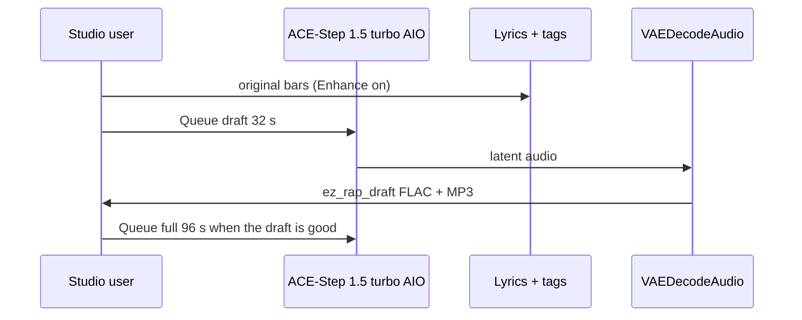

# Local music

**What's on this page**

- Queue the rap **draft** first, then the **full** track
- One hundred thirty-five **180 s** Nill Bye examples under `_lab/audio/nill-bye/phaseN/` (Queue on their own; phase0 lab catalog, phase1 style pack, phase2 trap/EDM pack, phase3 civic variety, phase4 civic club, phase5 federal variety, phase6 federal club, phase7 progress variety, phase8 progress club; exclusive bars per take)
- Eighty-five **180 s** Drive-through rave-set EDM examples under `_lab/audio/drive-through/phaseN/` (Queue on their own; phase0 hour 1, phase1 hour 2, phase2 hour 3 headliner, phase3 hour 4 afterparty, phase4 Secret Homage; American festival EDM, drop early, dirty pyro on every drop, chest-sub bass; vocals are a rare DJ treat on two graphs)
- Queued files are `Artist - Song Title - vN` (N matches the phase folder)
- App Mode: tags, lyrics, rewrite, vocal/instrumental, duration
- Tags vs lyrics; `[verse]` / `[chorus]` / `[spoken word]` as vocal hints; EDM uses `[inst]` / `[intro]` / `[outro]`, plus one short `[chorus]` chop on the two DJ-shout treats
- Original lyrics only — no “in the style of \<living artist\>”
- ACE-Step vocal = invented identity, not a clone
- DistroKid / Spotify / YouTube / USCO Part 2 disclosure
- `download-music --tier turbo`; sequential Queue + existing Klein covers
- Optional YouTube still-video: host `audio-still-video` after Queue (graphs stay FLAC + MP3)
- Spark: ~10 GB AIO; do not co-resident with LTX / Wan / Klein

**What this enables**

- A first 32 s boom-bap draft on one NVIDIA DGX Spark without cloud music APIs
- One hundred thirty-five 180 s original Nill Bye takes (vs Rake in phases 0–2; civic satire of Texas Gov. Greg Abbott in phases 3–4; civic satire of Donald Trump in phases 5–6; progress/solutions in phases 7–8) with exclusive verses and punchlines, without cloud music APIs
- Eighty-five 180 s original Drive-through EDM takes (American festival EDM, BPM 140–176, drop-early dirty pyro, chest-sub bass; eighty-three instrumental, two DJ-shout treats) without cloud music APIs
- Reusing the podcast ACE-Step AIO dest so the 10 GB file is not pulled twice
- Keeping the visual studio bootable when the music pack is missing
- Muxing a cover still + FLAC into a YouTube MP4 without changing the rap graphs

!!! warning "Not legal advice"

    Platform rules and copyright change. Read the current DistroKid, Spotify, YouTube, FTC, and USCO pages before you monetize.

---



Cover art is a **later** Klein session. Occupancy: do not load LTX + ACE-Step together.

## Graphs

Do **not** load Klein + Wan + LTX + ACE-Step in one session. Cover art is a separate graph.

### Draft — first Queue

Graph: **music-rap-draft-lab-example** (`extra.lab_profile` `us-safe-music`). Same role as **klein-still-draft**.

| Stage | What runs | Prefix |
| --- | --- | --- |
| MODEL | `CheckpointLoaderSimple` `ace_step_1.5_turbo_aio.safetensors` + `ModelSamplingAuraFlow` | — |
| DURATION | App **Duration (seconds)** (primitive **32** s) → `EmptyAceStep1.5LatentAudio` | — |
| PROMPT | App **Tags**, **Lyrics**, **Rewrite prompt**, **Vocal / instrumental**. `EZAceStepPromptEnhance` enhance **off** so tags, BPM, and `[verse]`/`[chorus]` stay as written. `ConditioningZeroOut` negative. KSampler 8 / cfg 1 / euler / simple | `ez_rap_prompt` |
| OUTPUT | `VAEDecodeAudio` → FLAC + 320 kbps MP3 | `ez_rap_draft` |
| COVER | Queue **klein-thumbnail-lab-example** or **klein-podcast-cover-lab-example** separately | `ez_thumbnail` / `ez_podcast` |

Default tags (both graphs):

`boom bap, hip-hop, dusty drums, vinyl crackle, dry snare, sampled piano stab, upright bass, male rap vocals, dry booth, no autotune, 88 bpm`

**Beat-only pass:** set App **Vocal / instrumental** to instrumental (forces no-vocals tags and `[inst]` lyrics). There is no third instrumental JSON.

Canned style swaps (tags widget only — not extra files):

- **trap:** `trap, 808 bass, rapid hi-hats, dark pads, male rap vocals, half-time, 140 bpm`
- **lo-fi:** `lo-fi hip-hop, dusty drums, rhodes, vinyl crackle, laid-back male rap vocals, 86 bpm`

### Full track

Graph: **music-rap-full-lab-example**. App **Duration (seconds)** defaults to **96** s. Same sampler and model. Prefix `ez_rap_full`. Same voice + second verse + repeated chorus + `[outro]`. Human rewrite required before any release.

### 180s Nill Bye diss examples

One hundred thirty-five extra full-track graphs under **`_lab/audio/nill-bye/phase0|phase1|phase2|phase3|phase4|phase5|phase6|phase7|phase8/`**. Same AIO, sampler, occupancy **audio**, and Klein cover handoff as the 96 s full track. App **Duration (seconds)** defaults to **180**. Queue **on their own** — draft-first is the generic lane, not a prerequisite. A longer Queue is expected (this is still an ACE-Step audio latent, not a video 90 s denoise). SaveAudio prefix is **`Nill Bye - Song Title - vN`** (N = phase).

**Nill Bye** (science guy, mad) is a fictional MC with an invented ACE-Step vocal. Phases 0–2 roast fictional MC **Rake** (in his feels; club-talk and fake-cool as a brand). Phases 3–4 are civic satire of Texas Gov. **Greg Abbott** as a public-record target, not a vocal identity. Phases 5–6 are civic satire of **Donald Trump** as a public-record target, not a vocal identity. Phases 7–8 are **progress** takes: methods, statutes, and measurement with **no roast target** (winterize, preregister, hearings, NDCs, Article I, lead-line replacement). Original lyrics. No living-MC names. No famous-hook paraphrases. Punch **up** on diss phases; **build up** on progress phases. Do not roast disability, race, faith, children, or people at the river. Shipped bars stay short and SFW. Each take owns exclusive verses and punchlines — content bars are not reused across the one hundred thirty-five graphs; choruses stay unique hooks. Human rewrite required before any release.

Style and trap/EDM packs keep the same dry-booth voice (`male rap vocals, dry booth, no autotune`). Trap/EDM graphs are rap **over** club beds — not autotune EDM vocals. Voices, tags, BPM, and seeds stay as shipped; only the bars change per take.

A new change group lands in the next `phaseN/` under the artist folder. First take of a title keeps today’s JSON stem; a later take of the same title needs a unique stem (`…-vN-lab-example.json`) so `lab_json()` does not collide. Do not leave new graphs at the artist folder root.

#### phase0 — Lab catalog

| Graph | Tags / bpm | Prefix | Take |
| --- | --- | --- | --- |
| **music-rap-nill-bye-lab-coat-lab-example** | boom-bap **88** | `Nill Bye - Lab Coat Lecture - v0` | Classroom lecture roast |
| **music-rap-nill-bye-peer-review-lab-example** | boom-bap **88**, `[spoken word]` intro | `Nill Bye - Peer Review - v0` | Claims fail review |
| **music-rap-nill-bye-feels-lab-example** | lo-fi **86** | `Nill Bye - In His Feels - v0` | Sad-boy diary as a brand |
| **music-rap-nill-bye-fake-cool-lab-example** | trap **140** | `Nill Bye - Fake Cool - v0` | Club-talk is not a method |
| **music-rap-nill-bye-hypothesis-lab-example** | boom-bap **92**, seed **7** | `Nill Bye - Hypothesis vs Rumor - v0` | Data vs rumor |
| **music-rap-nill-bye-control-group-lab-example** | boom-bap **88** | `Nill Bye - Control Group - v0` | Rake is the uncontrolled variable |
| **music-rap-nill-bye-sample-size-lab-example** | boom-bap **92**, seed **11** | `Nill Bye - Sample Size - v0` | One night is not a study |
| **music-rap-nill-bye-placebo-lab-example** | trap **140** | `Nill Bye - Placebo - v0` | The flex is a sugar pill |
| **music-rap-nill-bye-error-bars-lab-example** | boom-bap **88**, seed **17** | `Nill Bye - Error Bars - v0` | Confidence is a vibe, not a CI |
| **music-rap-nill-bye-lab-notebook-lab-example** | boom-bap **92**, seed **19** | `Nill Bye - Lab Notebook - v0` | Receipts vs group-chat lore |
| **music-rap-nill-bye-office-hours-lab-example** | lo-fi **86**, seed **23** | `Nill Bye - Office Hours - v0` | Extra help for a failing brand |
| **music-rap-nill-bye-grant-denied-lab-example** | boom-bap **88**, `[spoken word]` intro, seed **29** | `Nill Bye - Grant Denied - v0` | No funding for feelings |
| **music-rap-nill-bye-contamination-lab-example** | trap **140**, seed **31** | `Nill Bye - Contamination - v0` | Club talk leaked into the sample |
| **music-rap-nill-bye-double-blind-lab-example** | boom-bap **92**, seed **37** | `Nill Bye - Double Blind - v0` | Even the booth knows you are faking |
| **music-rap-nill-bye-replicate-lab-example** | boom-bap **88**, seed **7** | `Nill Bye - Replicate or Retract - v0` | Cannot reproduce the night |

#### phase1 — Style pack

Same invented vocal. Wider beds (jazz hop through folk) and diss angles. Not trap/EDM.

| Graph | Tags / bpm | Prefix | Take |
| --- | --- | --- | --- |
| **music-rap-nill-bye-citation-needed-lab-example** | jazz hop **90**, seed **41** | `Nill Bye - Citation Needed - v1` | Claims with no source |
| **music-rap-nill-bye-p-hacking-lab-example** | g-funk **98**, seed **43** | `Nill Bye - P-Hacking - v1` | Cherry-picked night |
| **music-rap-nill-bye-null-result-lab-example** | reggae **92**, seed **47** | `Nill Bye - Null Result - v1` | Flex found nothing |
| **music-rap-nill-bye-expired-reagent-lab-example** | neo-soul **84**, seed **53** | `Nill Bye - Expired Reagent - v1` | Cool past the date |
| **music-rap-nill-bye-lab-safety-lab-example** | rap rock **168**, seed **59** | `Nill Bye - Lab Safety - v1` | Skipped the goggles |
| **music-rap-nill-bye-rumor-mill-lab-example** | industrial **108**, seed **61** | `Nill Bye - Rumor Mill - v1` | Gossip vs measurement |
| **music-rap-nill-bye-gym-selfie-lab-example** | afrobeat **110**, seed **67** | `Nill Bye - Gym Selfie - v1` | Pose vs work |
| **music-rap-nill-bye-rented-drip-lab-example** | synthwave **104**, seed **71** | `Nill Bye - Rented Drip - v1` | Costume cool |
| **music-rap-nill-bye-clout-diet-lab-example** | trip-hop **86**, seed **73** | `Nill Bye - Clout Diet - v1` | Likes as calories |
| **music-rap-nill-bye-mood-forecast-lab-example** | cinematic **76**, seed **79** | `Nill Bye - Mood Forecast - v1` | Weather of feelings |
| **music-rap-nill-bye-algorithm-lab-example** | funk **114**, seed **83** | `Nill Bye - Algorithm - v1` | Chasing the feed |
| **music-rap-nill-bye-story-time-lab-example** | blues **74**, `[spoken word]` intro, seed **89** | `Nill Bye - Story Time - v1` | Bedtime rumor |
| **music-rap-nill-bye-caption-lab-example** | chiptune **100**, seed **97** | `Nill Bye - Caption vs Data - v1` | Caption vs data |
| **music-rap-nill-bye-energy-drink-lab-example** | brass band **120**, seed **101** | `Nill Bye - Energy Drink - v1` | Fake fuel |
| **music-rap-nill-bye-campfire-lab-example** | folk **82**, seed **103** | `Nill Bye - Campfire Rumor - v1` | Campfire rumor |

#### phase2 — Trap / EDM pack

Same dry booth. Rap over club beds (no autotune).

| Graph | Tags / bpm | Prefix | Take |
| --- | --- | --- | --- |
| **music-rap-nill-bye-false-drop-lab-example** | dark trap **140**, seed **107** | `Nill Bye - False Drop - v2` | Fake drop, no method |
| **music-rap-nill-bye-velvet-rope-lab-example** | festival trap **150**, seed **109** | `Nill Bye - Velvet Rope - v2` | VIP pose, empty list |
| **music-rap-nill-bye-fog-machine-lab-example** | rage **148**, seed **113** | `Nill Bye - Fog Machine - v2` | Fog for a missing show |
| **music-rap-nill-bye-guest-list-lab-example** | phonk **132**, seed **127** | `Nill Bye - Guest List - v2` | Name not on the list |
| **music-rap-nill-bye-sparkler-lab-example** | trap **145**, seed **131** | `Nill Bye - Sparkler Science - v2` | Sparkler science |
| **music-rap-nill-bye-bottle-service-lab-example** | house **126**, seed **137** | `Nill Bye - Bottle Service - v2` | Rented bottles |
| **music-rap-nill-bye-strobe-claim-lab-example** | techno **132**, seed **139** | `Nill Bye - Strobe Claim - v2` | Strobe, no substance |
| **music-rap-nill-bye-amen-rumor-lab-example** | drum and bass **174**, seed **149** | `Nill Bye - Amen Rumor - v2` | Fast rumor, empty bar |
| **music-rap-nill-bye-wobble-alibi-lab-example** | dubstep **140**, seed **151** | `Nill Bye - Wobble Alibi - v2` | Alibi in the wobble |
| **music-rap-nill-bye-supersaw-flex-lab-example** | future bass **148**, seed **157** | `Nill Bye - Supersaw Flex - v2` | Flex is a saw patch |
| **music-rap-nill-bye-laser-show-lab-example** | electro house **128**, seed **163** | `Nill Bye - Laser Show - v2` | Lights, no paper |
| **music-rap-nill-bye-two-step-lab-example** | UK garage **130**, seed **167** | `Nill Bye - Two-Step Alibi - v2` | Two-step alibi |
| **music-rap-nill-bye-jersey-bounce-lab-example** | jersey club **140**, seed **173** | `Nill Bye - Jersey Bounce - v2` | Bounce with no proof |
| **music-rap-nill-bye-kick-split-lab-example** | hardstyle **150**, seed **179** | `Nill Bye - Kick-Split Myth - v2` | Kick-split myth |
| **music-rap-nill-bye-uplift-rumor-lab-example** | trance **138**, seed **181** | `Nill Bye - Uplifting Rumor - v2` | Uplifting rumor |

#### phase3 — Civic variety

Same dry booth. Non-trap, non-EDM beds. Public-record satire of Abbott (punch up; no disability, race, or faith punch-down).

| Graph | Tags / bpm | Prefix | Take |
| --- | --- | --- | --- |
| **music-rap-nill-bye-frozen-ercot-lab-example** | boom-bap **88**, seed **191** | `Nill Bye - Frozen Ercot - v3` | Uri / ERCOT blame-shift |
| **music-rap-nill-bye-abject-failure-lab-example** | boom-bap **86**, `[spoken word]`, seed **193** | `Nill Bye - Abject Failure - v3` | Uvalde delay, split message |
| **music-rap-nill-bye-six-week-clock-lab-example** | jazz hop **90**, seed **197** | `Nill Bye - Six Week Clock - v3` | SB 8 bounty |
| **music-rap-nill-bye-no-bid-wire-lab-example** | industrial hip-hop **108**, seed **199** | `Nill Bye - No-Bid Wire - v3` | OLS emergency procurement |
| **music-rap-nill-bye-gavel-theater-lab-example** | brass band **112**, seed **211** | `Nill Bye - Gavel Theater - v3` | Paxton impeachment |
| **music-rap-nill-bye-property-hymn-lab-example** | folk **82**, seed **223** | `Nill Bye - Property Hymn - v3` | No-income-tax vs levy |
| **music-rap-nill-bye-voucher-raid-lab-example** | country **100**, seed **227** | `Nill Bye - Voucher Raid - v3` | ESA / Yass primaries |
| **music-rap-nill-bye-uninsured-blues-lab-example** | blues **74**, seed **229** | `Nill Bye - Uninsured Blues - v3` | Medicaid non-expansion |
| **music-rap-nill-bye-locked-stacks-lab-example** | lo-fi **86**, seed **233** | `Nill Bye - Locked Stacks - v3` | Book / DEI pull-lists |
| **music-rap-nill-bye-mask-order-lab-example** | neo-soul **84**, seed **239** | `Nill Bye - Mask Order - v3` | GA-34 preemption |
| **music-rap-nill-bye-mid-decade-map-lab-example** | chiptune **100**, seed **241** | `Nill Bye - Mid Decade Map - v3` | Mid-decade remap |
| **music-rap-nill-bye-rack-tax-lab-example** | synthwave **104**, seed **251** | `Nill Bye - Rack Tax - v3` | Data-center boom then brake |
| **music-rap-nill-bye-wudu-letter-lab-example** | gospel **78**, seed **257** | `Nill Bye - Wudu Letter - v3` | Airport rinse smear, called out |
| **music-rap-nill-bye-fourth-term-lab-example** | cinematic **76**, seed **263** | `Nill Bye - Fourth Term - v3` | Unprecedented fourth lap |
| **music-rap-nill-bye-campus-cordon-lab-example** | rap rock **168**, seed **269** | `Nill Bye - Campus Cordon - v3` | UT troopers vs protest |

#### phase4 — Civic club

Same dry booth. Rap over club beds (no autotune). Same punch-up rule.

| Graph | Tags / bpm | Prefix | Take |
| --- | --- | --- | --- |
| **music-rap-nill-bye-lone-star-tab-lab-example** | dark trap **140**, seed **271** | `Nill Bye - Lone Star Tab - v4` | OLS forever budget |
| **music-rap-nill-bye-river-buoy-lab-example** | rage **148**, seed **277** | `Nill Bye - River Buoy - v4` | Buoys and wire as cruelty |
| **music-rap-nill-bye-bus-receipt-lab-example** | phonk **132**, seed **281** | `Nill Bye - Bus Receipt - v4` | People mailed as a presser |
| **music-rap-nill-bye-guard-detail-lab-example** | trap **145**, seed **283** | `Nill Bye - Guard Detail - v4` | Guard deaths on state orders |
| **music-rap-nill-bye-chase-wreck-lab-example** | house **126**, seed **293** | `Nill Bye - Chase Wreck - v4` | OLS pursuit deaths |
| **music-rap-nill-bye-frequency-drop-lab-example** | drum and bass **174**, seed **307** | `Nill Bye - Frequency Drop - v4` | 20,000 MW load-shed |
| **music-rap-nill-bye-permitless-lab-example** | jersey club **140**, seed **311** | `Nill Bye - Permitless - v4` | HB 1927 |
| **music-rap-nill-bye-trigger-clock-lab-example** | future bass **148**, seed **313** | `Nill Bye - Trigger Clock - v4` | HB 1280 felony delay |
| **music-rap-nill-bye-disaster-stamp-lab-example** | techno **132**, `[spoken word]`, seed **317** | `Nill Bye - Disaster Stamp - v4` | Monthly border emergency |
| **music-rap-nill-bye-windmill-blame-lab-example** | dubstep **140**, seed **331** | `Nill Bye - Windmill Blame - v4` | Fox clip vs FERC mix |
| **music-rap-nill-bye-yass-primary-lab-example** | electro house **128**, seed **337** | `Nill Bye - Yass Primary - v4` | Out-of-state cash primaries |
| **music-rap-nill-bye-hold-request-lab-example** | UK garage **130**, seed **347** | `Nill Bye - Hold Request - v4` | ICE extradition fight |
| **music-rap-nill-bye-sharia-plank-lab-example** | hardstyle **150**, seed **349** | `Nill Bye - Sharia Plank - v4` | Convention scare, empty docket |
| **music-rap-nill-bye-invasion-hymn-lab-example** | trance **138**, seed **353** | `Nill Bye - Invasion Hymn - v4` | War-word as appropriation |
| **music-rap-nill-bye-demolish-hook-lab-example** | festival trap **150**, seed **359** | `Nill Bye - Demolish Hook - v4` | “Demolish” closer |

#### phase5 — Federal variety

Same dry booth. Non-trap, non-EDM beds. Public-record satire of Trump (punch up; no disability, race, faith, or children as the joke).

| Graph | Tags / bpm | Prefix | Take |
| --- | --- | --- | --- |
| **music-rap-nill-bye-thirty-four-counts-lab-example** | boom-bap **88**, seed **367** | `Nill Bye - Thirty Four Counts - v5` | 34 felony records counts |
| **music-rap-nill-bye-one-eighty-seven-lab-example** | boom-bap **86**, `[spoken word]`, seed **373** | `Nill Bye - One Eighty Seven - v5` | Jan 6 idle minutes |
| **music-rap-nill-bye-eleven-seven-eighty-lab-example** | jazz hop **90**, seed **379** | `Nill Bye - Eleven Seven Eighty - v5` | Raffensperger tape |
| **music-rap-nill-bye-fake-electors-lab-example** | industrial hip-hop **108**, seed **383** | `Nill Bye - Fake Electors - v5` | Seven slates |
| **music-rap-nill-bye-bathroom-boxes-lab-example** | brass band **112**, seed **389** | `Nill Bye - Bathroom Boxes - v5` | Mar-a-Lago storage |
| **music-rap-nill-bye-statement-of-worth-lab-example** | folk **82**, seed **397** | `Nill Bye - Statement of Worth - v5` | Inflated SFSs |
| **music-rap-nill-bye-university-tab-lab-example** | country **100**, seed **401** | `Nill Bye - University Tab - v5` | $25M seminar settlement |
| **music-rap-nill-bye-ukraine-hold-lab-example** | blues **74**, seed **409** | `Nill Bye - Ukraine Hold - v5` | Aid freeze, first impeachment |
| **music-rap-nill-bye-travel-memo-lab-example** | lo-fi **86**, seed **419** | `Nill Bye - Travel Memo - v5` | EO 13769 roster |
| **music-rap-nill-bye-zero-tolerance-lab-example** | neo-soul **84**, seed **421** | `Nill Bye - Zero Tolerance - v5` | Family-separation memo |
| **music-rap-nill-bye-census-question-lab-example** | chiptune **100**, seed **431** | `Nill Bye - Census Question - v5` | Citizenship-box pretext |
| **music-rap-nill-bye-paris-walkout-lab-example** | synthwave **104**, seed **433** | `Nill Bye - Paris Walkout - v5` | Paris Agreement letter |
| **music-rap-nill-bye-emoluments-suite-lab-example** | gospel **78**, seed **439** | `Nill Bye - Emoluments Suite - v5` | DC hotel while in office |
| **music-rap-nill-bye-seven-fifty-lab-example** | cinematic **76**, seed **443** | `Nill Bye - Seven Fifty - v5` | Reported $750 federal line |
| **music-rap-nill-bye-carroll-tab-lab-example** | rap rock **168**, seed **449** | `Nill Bye - Carroll Tab - v5` | Defamation after a finding |

#### phase6 — Federal club

Same dry booth. Rap over club beds (no autotune). Same punch-up rule.

| Graph | Tags / bpm | Prefix | Take |
| --- | --- | --- | --- |
| **music-rap-nill-bye-pardon-flood-lab-example** | dark trap **140**, `[spoken word]`, seed **457** | `Nill Bye - Pardon Flood - v6` | Day-one Jan 6 clemency |
| **music-rap-nill-bye-ieepa-wreck-lab-example** | rage **148**, seed **461** | `Nill Bye - Ieepa Wreck - v6` | IEEPA tariffs 6–3 |
| **music-rap-nill-bye-gold-card-lab-example** | phonk **132**, seed **463** | `Nill Bye - Gold Card - v6` | $1M residency SKU |
| **music-rap-nill-bye-memecoin-tab-lab-example** | trap **145**, seed **467** | `Nill Bye - Memecoin Tab - v6` | Pre-oath token float |
| **music-rap-nill-bye-east-wing-wreck-lab-example** | house **126**, seed **479** | `Nill Bye - East Wing Wreck - v6` | Ballroom teardown |
| **music-rap-nill-bye-metro-surge-lab-example** | drum and bass **174**, seed **487** | `Nill Bye - Metro Surge - v6` | 2026 enforcement wave |
| **music-rap-nill-bye-due-process-lab-example** | jersey club **140**, seed **491** | `Nill Bye - Due Process - v6` | Withholding skipped |
| **music-rap-nill-bye-kennedy-plaque-lab-example** | future bass **148**, seed **499** | `Nill Bye - Kennedy Plaque - v6` | Organic-statute rename |
| **music-rap-nill-bye-birthright-order-lab-example** | techno **132**, seed **503** | `Nill Bye - Birthright Order - v6` | 14th Amendment EO |
| **music-rap-nill-bye-cook-firing-lab-example** | dubstep **140**, seed **509** | `Nill Bye - Cook Firing - v6` | Fed-governor purge try |
| **music-rap-nill-bye-inspector-purge-lab-example** | electro house **128**, seed **521** | `Nill Bye - Inspector Purge - v6` | IG class sweep |
| **music-rap-nill-bye-law-firm-order-lab-example** | UK garage **130**, seed **523** | `Nill Bye - Law Firm Order - v6` | Counsel-punishment EO |
| **music-rap-nill-bye-visa-ticket-lab-example** | hardstyle **150**, seed **541** | `Nill Bye - Visa Ticket - v6` | $100k H-1B fee |
| **music-rap-nill-bye-shadow-docket-lab-example** | trance **138**, seed **547** | `Nill Bye - Shadow Docket - v6` | Emergency-petition pile |
| **music-rap-nill-bye-immunity-hymn-lab-example** | festival trap **150**, seed **557** | `Nill Bye - Immunity Hymn - v6` | Official-act structure |

#### phase7 — Progress variety

Same dry booth. Non-trap, non-EDM beds. Builder bars: methods and statutes, no roast target.

| Graph | Tags / bpm | Prefix | Take |
| --- | --- | --- | --- |
| **music-rap-nill-bye-winterize-wells-lab-example** | boom-bap **88**, seed **563** | `Nill Bye - Winterize Wells - v7` | NERC wellhead jackets |
| **music-rap-nill-bye-registered-report-lab-example** | boom-bap **86**, `[spoken word]`, seed **569** | `Nill Bye - Registered Report - v7` | Preregister the protocol |
| **music-rap-nill-bye-named-uncertainty-lab-example** | jazz hop **90**, seed **571** | `Nill Bye - Named Uncertainty - v7` | Print the interval |
| **music-rap-nill-bye-scif-only-lab-example** | industrial hip-hop **108**, seed **577** | `Nill Bye - Scif Only - v7` | Compartment the paper |
| **music-rap-nill-bye-hearing-first-lab-example** | brass band **112**, seed **587** | `Nill Bye - Hearing First - v7` | Withholding, then plane |
| **music-rap-nill-bye-keep-the-match-lab-example** | folk **82**, seed **593** | `Nill Bye - Keep the Match - v7` | Family-unity case-id |
| **music-rap-nill-bye-honest-census-lab-example** | country **100**, seed **599** | `Nill Bye - Honest Census - v7` | Count, do not chill |
| **music-rap-nill-bye-paris-seat-lab-example** | blues **74**, seed **601** | `Nill Bye - Paris Seat - v7` | Stay for the NDC |
| **music-rap-nill-bye-qualified-divest-lab-example** | lo-fi **86**, seed **607** | `Nill Bye - Qualified Divest - v7` | Till off the desk |
| **music-rap-nill-bye-return-pdf-lab-example** | neo-soul **84**, seed **613** | `Nill Bye - Return Pdf - v7` | Disclosure stack |
| **music-rap-nill-bye-casework-screen-lab-example** | chiptune **100**, seed **617** | `Nill Bye - Casework Screen - v7` | Person-level file |
| **music-rap-nill-bye-district-door-lab-example** | synthwave **104**, seed **619** | `Nill Bye - District Door - v7` | Fund the public door |
| **music-rap-nill-bye-levy-in-code-lab-example** | gospel **78**, seed **631** | `Nill Bye - Levy In Code - v7` | Cut the roll in statute |
| **music-rap-nill-bye-fourteenth-clause-lab-example** | cinematic **76**, seed **641** | `Nill Bye - Fourteenth Clause - v7` | Keep the citizenship sentence |
| **music-rap-nill-bye-one-college-lab-example** | rap rock **168**, seed **643** | `Nill Bye - One College - v7` | One certified slate |

#### phase8 — Progress club

Same dry booth. Rap over club beds (no autotune). Same builder rule.

| Graph | Tags / bpm | Prefix | Take |
| --- | --- | --- | --- |
| **music-rap-nill-bye-duty-switch-lab-example** | dark trap **140**, `[spoken word]`, seed **647** | `Nill Bye - Duty Switch - v8` | Switch at minute one |
| **music-rap-nill-bye-article-one-lab-example** | rage **148**, seed **653** | `Nill Bye - Article One - v8` | Tariffs via a bill |
| **music-rap-nill-bye-for-cause-lock-lab-example** | phonk **132**, seed **659** | `Nill Bye - For-Cause Lock - v8` | Fed Act lock |
| **music-rap-nill-bye-ig-notice-lab-example** | trap **145**, seed **661** | `Nill Bye - Ig Notice - v8` | IGA notice-and-reason |
| **music-rap-nill-bye-counsel-stays-lab-example** | house **126**, seed **673** | `Nill Bye - Counsel Stays - v8` | Sixth Amendment counsel |
| **music-rap-nill-bye-prevailing-wage-lab-example** | drum and bass **174**, seed **677** | `Nill Bye - Prevailing Wage - v8` | H-1B labor file |
| **music-rap-nill-bye-merits-syllabus-lab-example** | jersey club **140**, seed **683** | `Nill Bye - Merits Syllabus - v8` | Day-calendar reasons |
| **music-rap-nill-bye-unofficial-sort-lab-example** | future bass **148**, seed **691** | `Nill Bye - Unofficial Sort - v8` | Three-room immunity |
| **music-rap-nill-bye-clemency-file-lab-example** | techno **132**, seed **701** | `Nill Bye - Clemency File - v8` | Case-by-case mercy |
| **music-rap-nill-bye-congress-the-wing-lab-example** | dubstep **140**, seed **709** | `Nill Bye - Congress the Wing - v8` | Act before rubble |
| **music-rap-nill-bye-tie-the-island-lab-example** | electro house **128**, seed **719** | `Nill Bye - Tie the Island - v8` | Neighbor watts |
| **music-rap-nill-bye-decade-lines-lab-example** | UK garage **130**, seed **727** | `Nill Bye - Decade Lines - v8` | Map after a census |
| **music-rap-nill-bye-ratepayer-bus-lab-example** | hardstyle **150**, seed **733** | `Nill Bye - Ratepayer Bus - v8` | Barns pay the draw |
| **music-rap-nill-bye-open-quad-lab-example** | trance **138**, seed **739** | `Nill Bye - Open Quad - v8` | Forum first |
| **music-rap-nill-bye-wrench-the-tap-lab-example** | festival trap **150**, seed **743** | `Nill Bye - Wrench the Tap - v8` | Lead-line replacement |

Cover still in a later Klein session. Do not co-resident with LTX / Wan / Klein.

### 180s Drive-through EDM examples

Eighty-five extra full-track graphs under **`_lab/audio/drive-through/phase0|phase1|phase2|phase3|phase4/`**. Same AIO, sampler, occupancy **audio**, and Klein cover handoff as the 96 s full track. App **Duration (seconds)** defaults to **180**. Queue **on their own** — draft-first is the generic rap lane, not a prerequisite. A longer Queue is expected. SaveAudio prefix is **`Drive-through - Song Title - vN`** (N = phase).

Fictional act only: **Drive-through** (hardcore, pure of heart) playing a **live rave DJ set**. Original **American festival EDM** arrangements (bass house, big room, future bass, brostep, festival trap, drumstep, bounce house, color bass, riddim, dirty dubstep — not techno). No living-DJ names. No famous-hook paraphrases. Eighty-three takes lock `instrumental, no vocals, no singing` (App **Vocal / instrumental** = instrumental). Two takes are sparse DJ-shout treats (`wide open`, `second wave`): App mode **vocal**, one short `[chorus]` chop, no `[verse]`. Arrangement scores are production cues in `[inst]` blocks — unique flow per take, drop in the first or second section, dirty pyro on every drop, chest-sub / low 808, fast section changes, mix-in/out — not a Nill Bye verse/chorus loop and not the same melody-drop-break-drop skeleton on every graph. Some takes add dual-action pedal bass (sub swell + driven punch). Phase2, phase3, and phase4 graphs keep that ACE topology but vary Comfy node placement across five layouts (`column`, `wide-stage`, `stacked-tower`, `prompt-left`, `output-rail`). ACE-Step timbre is invented. Human selection and edit required before any release.

This is **not** the Nill Bye trap/EDM pack. Those graphs are rap **over** club beds with a dry booth. Drive-through is dance EDM (mostly instrumental).

Catalog order is the recommended live-set queue (each graph still Queues alone).

#### phase0 — Hour 1

| Graph | Tags / bpm | Prefix | Take |
| --- | --- | --- | --- |
| **music-edm-drive-through-night-window-lab-example** | bass house **145**, seed **193** | `Drive-through - Night Window - v0` | Opener: dirty 808 pyro from the first drop |
| **music-edm-drive-through-open-lane-lab-example** | festival bass **152**, seed **191** | `Drive-through - Open Lane - v0` | Drop-first ID, second stacked pyro wreck |
| **music-edm-drive-through-exit-seven-lab-example** | electro house **142**, seed **233** | `Drive-through - Exit Seven - v0` | Filter mix-in, two dirty electro pyro drops |
| **music-edm-drive-through-skyline-pass-lab-example** | progressive house **145**, seed **199** | `Drive-through - Skyline Pass - v0` | Drop-first anthem, three pyro wrecks |
| **music-edm-drive-through-on-ramp-lab-example** | festival bass **155**, seed **197** | `Drive-through - On-Ramp - v0` | Reverse-bass dirty pyro, three wrecks |
| **music-edm-drive-through-tunnel-bass-lab-example** | dirty bass **150**, seed **257** | `Drive-through - Tunnel Bass - v0` | Drop-first industrial 808, three pyro drops |
| **music-edm-drive-through-wide-open-lab-example** | big room **150**, seed **239** | `Drive-through - Wide Open - v0` | **DJ shout treat** (`hands up`) + dirty mainstage pyro |
| **music-edm-drive-through-overpass-lab-example** | riddim **150**, seed **227** | `Drive-through - Overpass - v0` | Drop-first wobble, four-floor pyro flip |
| **music-edm-drive-through-second-wave-lab-example** | festival remix **150**, seed **241** | `Drive-through - Second Wave - v0` | **Remix vocal-chop treat**, drop-first growl pyro |
| **music-edm-drive-through-freight-pulse-lab-example** | drumstep **176**, seed **211** | `Drive-through - Freight Pulse - v0` | Drop-first amen, four dirty pyro wrecks |
| **music-edm-drive-through-keep-going-lab-example** | drumstep **170**, seed **251** | `Drive-through - Keep Going - v0` | Drop-first 808 pyro, triple wreck |
| **music-edm-drive-through-horizon-kick-lab-example** | festival bass **165**, seed **263** | `Drive-through - Horizon Kick - v0` | Drop-first reverse bass pyro |
| **music-edm-drive-through-clean-wreckage-lab-example** | dirty electro **150**, seed **269** | `Drive-through - Clean Wreckage - v0` | Immediate dirty electro, three pyro wrecks |
| **music-edm-drive-through-heart-lane-lab-example** | future bass **145**, seed **223** | `Drive-through - Heart Lane - v0` | Drop-first warm 808 pyro |
| **music-edm-drive-through-dawn-receipt-lab-example** | progressive house **140**, seed **229** | `Drive-through - Dawn Receipt - v0` | Hour-1 closer, two dirty pyro wrecks |

#### phase1 — Hour 2 (bass)

| Graph | Tags / bpm | Prefix | Take |
| --- | --- | --- | --- |
| **music-edm-drive-through-rumble-strip-lab-example** | bass house **140**, seed **271** | `Drive-through - Rumble Strip - v1` | Hour-2 opener, drop-first chest 808 pyro |
| **music-edm-drive-through-low-lane-lab-example** | festival bass **144**, seed **277** | `Drive-through - Low Lane - v1` | Chest sub pyro, three wrecks |
| **music-edm-drive-through-warm-merge-lab-example** | future bass **148**, seed **281** | `Drive-through - Warm Merge - v1` | Drop-first warm 808 pyro |
| **music-edm-drive-through-colour-span-lab-example** | dirty electro **150**, seed **283** | `Drive-through - Colour Span - v1` | Dirty electro pyro, three wrecks |
| **music-edm-drive-through-garage-ticket-lab-example** | festival trap **140**, seed **293** | `Drive-through - Garage Ticket - v1` | Drop-first trap 808 pyro |
| **music-edm-drive-through-liquid-grade-lab-example** | drumstep **174**, seed **307** | `Drive-through - Liquid Grade - v1` | Drop-first drumstep pyro |
| **music-edm-drive-through-jump-bay-lab-example** | brostep **150**, seed **311** | `Drive-through - Jump Bay - v1` | Drop-first dirty growl pyro |
| **music-edm-drive-through-psy-median-lab-example** | big room **145**, seed **313** | `Drive-through - Psy Median - v1` | Mainstage 808 pyro, two wrecks |
| **music-edm-drive-through-groove-mile-lab-example** | slap house **144**, seed **317** | `Drive-through - Groove Mile - v1` | Drop-first bounce 808 pyro |
| **music-edm-drive-through-donk-ramp-lab-example** | dirty electro **150**, seed **331** | `Drive-through - Donk Ramp - v1` | Chest 808 pyro, three wrecks |
| **music-edm-drive-through-bounce-booth-lab-example** | melbourne bounce **140**, seed **337** | `Drive-through - Bounce Booth - v1` | Drop-first bounce pyro |
| **music-edm-drive-through-toll-growl-lab-example** | tearout **150**, seed **347** | `Drive-through - Toll Growl - v1` | Drop-first tearout pyro, four wrecks |
| **music-edm-drive-through-night-oil-lab-example** | hybrid trap **142**, seed **349** | `Drive-through - Night Oil - v1` | Hybrid 808 pyro, two wrecks |
| **music-edm-drive-through-chest-pass-lab-example** | festival bass **150**, seed **353** | `Drive-through - Chest Pass - v1` | Drop-first chest sub pyro |
| **music-edm-drive-through-sunrise-sub-lab-example** | progressive house **140**, seed **359** | `Drive-through - Sunrise Sub - v1` | Encore closer, two warm sub pyro wrecks |

#### phase2 — Hour 3 (headliner)

Deeper bounce bass, heavier stacked drops, high-BPM dance EDM (148–174). All instrumental.

| Graph | Tags / bpm | Prefix | Take |
| --- | --- | --- | --- |
| **music-edm-drive-through-lantern-merge-lab-example** | bounce house **150**, seed **367** | `Drive-through - Lantern Merge - v2` | Hour-3 opener, drop-first bounce 808 pyro |
| **music-edm-drive-through-firefly-lane-lab-example** | color bass **152**, seed **373** | `Drive-through - Firefly Lane - v2` | Color-bass wrecks, stacked pyro |
| **music-edm-drive-through-canopy-bounce-lab-example** | bass house **148**, seed **379** | `Drive-through - Canopy Bounce - v2` | Deep bounce, three chest wrecks |
| **music-edm-drive-through-grove-wreck-lab-example** | future riddim **150**, seed **383** | `Drive-through - Grove Wreck - v2` | Future-riddim growl pyro |
| **music-edm-drive-through-moss-sub-lab-example** | space bass **150**, seed **389** | `Drive-through - Moss Sub - v2` | Deep space sub, dual-action pedal |
| **music-edm-drive-through-fern-stack-lab-example** | hybrid bass **155**, seed **397** | `Drive-through - Fern Stack - v2` | Triple stacked hybrid wreck |
| **music-edm-drive-through-pollen-kick-lab-example** | drumstep **174**, seed **401** | `Drive-through - Pollen Kick - v2` | High-BPM amen + 808 pyro |
| **music-edm-drive-through-cedar-growl-lab-example** | riddim **150**, seed **409** | `Drive-through - Cedar Growl - v2` | Bounce-riddim growl pyro |
| **music-edm-drive-through-moon-ramp-lab-example** | wave bass **148**, seed **419** | `Drive-through - Moon Ramp - v2` | Wave-bass bounce wrecks |
| **music-edm-drive-through-trail-bounce-lab-example** | slap house **150**, seed **421** | `Drive-through - Trail Bounce - v2` | Bounce slap, four-floor pyro |
| **music-edm-drive-through-dew-wreck-lab-example** | neuro bass **172**, seed **431** | `Drive-through - Dew Wreck - v2` | Complex high-BPM neuro wreck |
| **music-edm-drive-through-sap-stack-lab-example** | festival bass **165**, seed **433** | `Drive-through - Sap Stack - v2` | Headliner stacked 808 pyro |
| **music-edm-drive-through-glade-split-lab-example** | dirty electro **150**, seed **439** | `Drive-through - Glade Split - v2` | Double-drop electro wreck |
| **music-edm-drive-through-root-chest-lab-example** | chest bass **148**, seed **443** | `Drive-through - Root Chest - v2` | Deepest chest bounce, four wrecks |
| **music-edm-drive-through-ember-crest-lab-example** | festival bass **165**, seed **449** | `Drive-through - Ember Crest - v2` | High-BPM headliner closer |

#### phase3 — Hour 4 (afterparty)

Harder chest-sub afterparty (BPM 150–176). All instrumental. Dual-action pedal bass on some takes. Layouts cycle the same five Comfy placements as phase2.

| Graph | Tags / bpm | Prefix | Take |
| --- | --- | --- | --- |
| **music-edm-drive-through-brake-fade-lab-example** | dirty bass **150**, seed **457** | `Drive-through - Brake Fade - v3` | Hour-4 opener, chest-sub pyro |
| **music-edm-drive-through-diesel-hum-lab-example** | bass house **152**, seed **461** | `Drive-through - Diesel Hum - v3` | Dual-action pedal bass house |
| **music-edm-drive-through-axle-grind-lab-example** | tearout **155**, seed **463** | `Drive-through - Axle Grind - v3` | Tearout growl + sub |
| **music-edm-drive-through-weigh-station-lab-example** | festival bass **158**, seed **467** | `Drive-through - Weigh Station - v3` | Stacked 808 wall |
| **music-edm-drive-through-black-ice-lab-example** | riddim **160**, seed **479** | `Drive-through - Black Ice - v3` | Wobble + chest rumble |
| **music-edm-drive-through-high-beams-lab-example** | hybrid bass **165**, seed **487** | `Drive-through - High Beams - v3` | Dual-action hybrid bass |
| **music-edm-drive-through-chain-hook-lab-example** | brostep **168**, seed **491** | `Drive-through - Chain Hook - v3` | Dirty growl wrecks |
| **music-edm-drive-through-grit-plate-lab-example** | slap house **150**, seed **499** | `Drive-through - Grit Plate - v3` | Chest bounce 808 |
| **music-edm-drive-through-steel-grate-lab-example** | drumstep **172**, seed **503** | `Drive-through - Steel Grate - v3` | Amen + chest sub |
| **music-edm-drive-through-rest-bay-lab-example** | chest bass **155**, seed **509** | `Drive-through - Rest Bay - v3` | Dual-action chest bass |
| **music-edm-drive-through-haul-crate-lab-example** | hybrid trap **170**, seed **521** | `Drive-through - Haul Crate - v3` | Trap 808 wall |
| **music-edm-drive-through-night-splice-lab-example** | wave bass **152**, seed **523** | `Drive-through - Night Splice - v3` | Low swell wrecks |
| **music-edm-drive-through-torque-bay-lab-example** | neuro bass **176**, seed **541** | `Drive-through - Torque Bay - v3` | Fast reese sub |
| **music-edm-drive-through-spare-drum-lab-example** | festival bass **165**, seed **547** | `Drive-through - Spare Drum - v3` | Dual-action festival bass |
| **music-edm-drive-through-oil-pan-lab-example** | bounce house **150**, seed **557** | `Drive-through - Oil Pan - v3` | Chest bounce 808 |
| **music-edm-drive-through-curb-check-lab-example** | drumstep **174**, seed **563** | `Drive-through - Curb Check - v3` | Triple amen wreck |
| **music-edm-drive-through-last-exit-lab-example** | dirty bass **160**, seed **569** | `Drive-through - Last Exit - v3` | Dual-action dirty bass |
| **music-edm-drive-through-asphalt-heart-lab-example** | chest bass **155**, seed **571** | `Drive-through - Asphalt Heart - v3` | Chest-sub closer energy |
| **music-edm-drive-through-clutch-slam-lab-example** | tearout **168**, seed **577** | `Drive-through - Clutch Slam - v3` | Dual-action tearout |
| **music-edm-drive-through-trailer-hitch-lab-example** | festival bass **165**, seed **587** | `Drive-through - Trailer Hitch - v3` | Hour-4 closer |

#### phase4 — Secret Homage

Early dirty-bass album (BPM 140–176). Half-time dubstep, brostep, riddim, tearout, drumstep, hybrid trap. All instrumental. Layouts cycle the same five Comfy placements as phase2 and phase3.

| Graph | Tags / bpm | Prefix | Take |
| --- | --- | --- | --- |
| **music-edm-drive-through-hush-lane-lab-example** | dirty dubstep **140**, seed **593** | `Drive-through - Hush Lane - v4` | Album opener, half-time wobble pyro |
| **music-edm-drive-through-cipher-lock-lab-example** | brostep **140**, seed **599** | `Drive-through - Cipher Lock - v4` | Drop-first growl wreck |
| **music-edm-drive-through-ghost-dock-lab-example** | riddim **140**, seed **601** | `Drive-through - Ghost Dock - v4` | Wobble riddim pyro |
| **music-edm-drive-through-sealed-ramp-lab-example** | tearout **145**, seed **607** | `Drive-through - Sealed Ramp - v4` | Tearout growl, four wrecks |
| **music-edm-drive-through-fog-vault-lab-example** | electro house **142**, seed **613** | `Drive-through - Fog Vault - v4` | Dirty electro 808 pyro |
| **music-edm-drive-through-dummy-light-lab-example** | festival bass **145**, seed **617** | `Drive-through - Dummy Light - v4` | Stacked 808 wall |
| **music-edm-drive-through-quiet-wreck-lab-example** | dirty bass **140**, seed **619** | `Drive-through - Quiet Wreck - v4` | Half-time rumble, four wrecks |
| **music-edm-drive-through-off-ledger-lab-example** | drumstep **174**, seed **631** | `Drive-through - Off Ledger - v4` | Amen + reese pyro |
| **music-edm-drive-through-back-alley-lab-example** | neuro bass **172**, seed **641** | `Drive-through - Back Alley - v4` | Fast reese sub |
| **music-edm-drive-through-cellar-kick-lab-example** | dirty dubstep **148**, seed **643** | `Drive-through - Cellar Kick - v4` | Wobble wrecks |
| **music-edm-drive-through-hidden-booth-lab-example** | hybrid trap **140**, seed **647** | `Drive-through - Hidden Booth - v4` | Trap 808 wall |
| **music-edm-drive-through-coded-sub-lab-example** | chest bass **140**, seed **653** | `Drive-through - Coded Sub - v4` | Dual-action pedal bass |
| **music-edm-drive-through-shadow-coil-lab-example** | neuro bass **150**, seed **659** | `Drive-through - Shadow Coil - v4` | Reese coil wrecks |
| **music-edm-drive-through-mute-pyro-lab-example** | dirty electro **150**, seed **661** | `Drive-through - Mute Pyro - v4` | Analog 808 pyro |
| **music-edm-drive-through-unlisted-row-lab-example** | drumstep **176**, seed **673** | `Drive-through - Unlisted Row - v4` | Triple amen wreck |
| **music-edm-drive-through-night-cipher-lab-example** | wave bass **140**, seed **677** | `Drive-through - Night Cipher - v4` | Low swell wrecks |
| **music-edm-drive-through-blank-stencil-lab-example** | festival trap **140**, seed **683** | `Drive-through - Blank Stencil - v4` | Trap stamp 808 |
| **music-edm-drive-through-blind-stamp-lab-example** | riddim **150**, seed **691** | `Drive-through - Blind Stamp - v4` | Wobble + sub crush |
| **music-edm-drive-through-cold-cache-lab-example** | hybrid bass **142**, seed **701** | `Drive-through - Cold Cache - v4` | Hybrid 808 pyro |
| **music-edm-drive-through-secret-homage-lab-example** | dirty dubstep **140**, seed **709** | `Drive-through - Secret Homage - v4` | Album closer, half-time stacked 808 |

Cover still in a later Klein session. Do not co-resident with LTX / Wan / Klein.

---

## Tags vs lyrics

- **Tags** describe genre, drums, bass, booth, vocal character, and bpm.
- **Lyrics** are the bars (rap) or the arrangement score (Drive-through EDM). Section labels `[intro]`, `[verse]`, `[chorus]`, `[outro]`, and `[spoken word]` are vocal **hints** operators may add — they are not a rights grant. EDM graphs use `[inst]` for the bed, build, and drops. Eighty-three takes stay instrumental. Two rave-set treats add one short `[chorus]` DJ chop (never `[verse]`).
- Original lyrics only. Do not write “in the style of \<living artist\>”. No living-MC names. No famous-hook paraphrases.
- Short percussive lines (about 6–10 syllables) slur less. Keep `language=en` on `TextEncodeAceStepAudio1.5` (combo, not free text). The seeded graph stores seed control as **fixed** after the seed; re-open **music-rap-draft-lab-example** after a pull so those combos stay aligned.

ACE-Step generates the vocal from lyrics + tags. That timbre is an **invented identity**, not a cloned MC. Do not add Kokoro / Chatterbox / TTS-Audio-Suite to these graphs.

---

## DistroKid, Spotify, YouTube, authorship

- **DistroKid / Spotify:** you must own the rights. Disclose AI lyrics + vocals + instrumental. If the artist identity is fake, Spotify may treat it as an “AI Persona” — prefer a **human artist name** with disclosed AI production.
- **YouTube:** use the synthetic-audio / altered-content flag. Mass-upload of near-duplicates is inauthentic content.
- **USCO Part 2 / Thaler:** edit the lyrics. Prompts are not authorship. A human rewrite plus selection and arrangement can be; raw generations are not registrable.

---

## Download

Music weights are **opt-in**. `./scripts/manage.sh download-models` does **not** pull them. `doctor` prints turbo JSON and still exits 0 when the pack is absent.

```bash
./scripts/manage.sh download-music --tier turbo     # ace_step_1.5_turbo_aio.safetensors (~10 GB)
./scripts/manage.sh download-music --tier xl        # optional XL split only
# same --limit auto|N|off wrap as download-models (always clears on exit)
```

Turbo uses the **same snapshot** as `download-podcast --tier acestep`:

```text
${MODELS_DIR}/Comfy-Org__ace_step_1.5_ComfyUI_files_acestep/checkpoints/ace_step_1.5_turbo_aio.safetensors
${MODELS_DIR}/comfy/checkpoints/ace_step_1.5_turbo_aio.safetensors   # relative symlink
```

If you already ran `download-podcast --tier acestep`, `download-music --tier turbo` is a cache hit + relink. Do not download the 10 GB AIO twice.

Relative symlinks only (host `/mnt/models` vs container `/models`).

---

## Sequential Queue

1. `./scripts/manage.sh download-music --tier turbo`
2. `./scripts/manage.sh start` — type **yes**
3. Load **music-rap-draft-lab-example**. Enhance on. Queue. Files under `${COMFY_OUTPUT_DIR}` as `ez_rap_draft_*.flac` / `ez_rap_draft_*.mp3`
4. Then load **music-rap-full-lab-example** (96 s), **or** one **music-rap-nill-bye-*-lab-example** (180 s) from `_lab/audio/nill-bye/phaseN/` on its own, **or** one **music-edm-drive-through-*-lab-example** (180 s rave-set take) from `_lab/audio/drive-through/phaseN/` on its own
5. Cover in a **later** session: **klein-thumbnail-lab-example** or **klein-podcast-cover-lab-example**
6. Optional YouTube still-image video (host ffmpeg; graphs still save FLAC + MP3):

```bash
./scripts/manage.sh audio-still-video \
  --audio "${COMFY_OUTPUT_DIR}/ez_rap_full_00001_.flac" \
  --image "${COMFY_OUTPUT_DIR}/ez_thumbnail_00001_.png"
# → ${COMFY_OUTPUT_DIR}/ez_rap_full_00001_.mp4
# Square covers letterbox onto 1920×1080. Shorts: --size 1080x1920
```

Spark: the AIO is ~10 GB VRAM-adjacent work. Do **not** co-resident with LTX / Wan / Klein.

Start still requires typing `yes`. Compose `restart: "no"` is unchanged.

---

## Hard no

Do not vendor or default:

- TTS-Audio-Suite, OldTimeRadio, cloud `ace-step/ACE-Step-ComfyUI`
- MiniMax Music 3 as a lab default, MiniMax H3, Suno / Udio, Stable Audio 2.5 partner
- Celebrity names in tags/lyrics, `LoadAudio` of copyrighted songs, “cover this Drake track”
- Required `XAI_API_KEY`

Native ACE-Step 1.5 already ships in `COMFYUI_REF=v0.34.6`.
