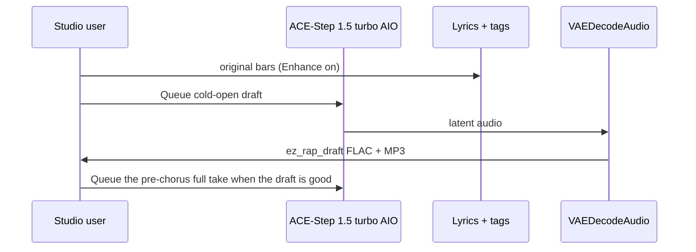

# Local music

**What's on this page**

- **Occupancy warning:** do not load ACE-Step with Klein / Wan / LTX
- **First Queue** is **audio/music/rap-draft**, then the full track or an album take
- **`download-music --tier turbo`** (same ACE-Step AIO as podcast acestep)
- **Sequential Queue** and album art in a later Klein session
- **Child pages** for RAP-FIRST albums, Drive-through EDM, and disclosure
- **Audio Rack** (`inspire/audio-rack`) splices professional tags/lyrics on occupancy **llm** — copy into rap-draft; do not load ACE-Step on the rack canvas

**What this enables**

- **A cold-open boom-bap draft** on one NVIDIA DGX Spark without cloud music APIs
- **One hundred thirty-five original Nill Bye takes** (64–210 s, varied form) without cloud music APIs
- **Eighty-five original Drive-through EDM takes** (150–480 s, short builds, fast tempos) without cloud music APIs
- **Reusing** the podcast ACE-Step AIO dest so the 10 GB file is not pulled twice
- **Keeping** the visual studio bootable when the music pack is missing
- **Muxing** a cover still + FLAC into a YouTube MP4 without changing the rap graphs

**Who this is for:** studio users after `download-music --tier turbo`. Do not co-resident with LTX / Wan / Klein.

<Callout type="warning" title="Not legal advice">
  Platform rules and copyright change. Read the current DistroKid, Spotify, YouTube, FTC, and USCO pages before you monetize. Tags vs lyrics, Hard no, QC, and platform disclosure: [Music disclosure](create/music-disclosure.md).
</Callout>

<Callout type="error" title="Occupancy">
  Do **not** load Klein + Wan + LTX + ACE-Step in one session. Cover art is a **later** Klein session. Spark: the AIO is ~10 GB VRAM-adjacent work — do **not** co-resident with LTX / Wan / Klein. Start still requires typing `yes`. Compose `restart: "no"` is unchanged.
</Callout>
---



Cover art is a **later** Klein session. Occupancy: do not load LTX + ACE-Step together.

<Cards>
  <Card title="RAP-FIRST">
    ---

    Cold-open draft, pre-chorus full take, then nine Nill Bye albums (135 takes, 64–210 s, varied form).

    [Nill Bye albums](create/music-rap.md)
  </Card>
  <Card title="Drive-through EDM">
    ---

    Five bass-set albums (85 takes, 150–480 s). Short build, heavy drop, then switch-ups. Tempos 165–176. Not rap over a club bed.

    [Drive-through EDM](create/music-edm.md)
  </Card>
  <Card title="Disclosure">
    ---

    DistroKid / Spotify / YouTube / USCO, tags vs lyrics, Hard no, QC. Not legal advice.

    [Music disclosure](create/music-disclosure.md)
  </Card>
</Cards>

Catalog filenames: [Audio catalog](create/workflows-audio.md).

---

## First Queue

Graph: **audio/music/rap-draft** (`extra.lab_profile` `us-safe-music`). Same role as **klein-still-draft**. App **Duration (seconds)** defaults to **32**. Prefix `ez_rap_draft`. Full stage table: [RAP-FIRST](create/music-rap.md#draft-first-queue).

Then load **audio/music/rap-full** (pre-chorus form), **or** a numbered take under `_lab/audio/albums/nill-bye/<album>/`, **or** `_lab/audio/albums/drive-through/<album>/`.

---

## Download

Music weights are **opt-in**. `./scripts/manage.sh download-models` does **not** pull them. `doctor` prints turbo JSON and still exits 0 when the pack is absent.

```bash
./scripts/manage.sh download-music --tier turbo     # ace_step_1.5_turbo_aio.safetensors (~10 GB)
./scripts/manage.sh download-music --tier xl        # optional XL split only
# same --limit auto|N|off wrap as download-models (always clears on exit)
```

Turbo uses the **same snapshot** as `download-podcast --tier acestep`:

```text
${MODELS_DIR}/Comfy-Org__ace_step_1.5_ComfyUI_files_acestep/checkpoints/ace_step_1.5_turbo_aio.safetensors
${MODELS_DIR}/comfy/checkpoints/ace_step_1.5_turbo_aio.safetensors   # relative symlink
```

If you already ran `download-podcast --tier acestep`, `download-music --tier turbo` is a cache hit + relink. Do not download the 10 GB AIO twice.

Relative symlinks only (host `/mnt/models` vs container `/models`).

---

## Sequential Queue

1. `./scripts/manage.sh download-music --tier turbo`
2. `./scripts/manage.sh start` — type **yes**
3. Load **audio/music/rap-draft**. Enhance on. Queue. Files under `${COMFY_OUTPUT_DIR}` as `ez_rap_draft_*.flac` / `ez_rap_draft_*.mp3`
4. Then load **audio/music/rap-full** (pre-chorus form), **or** a numbered take under `_lab/audio/albums/nill-bye/<album>/`, **or** `_lab/audio/albums/drive-through/<album>/`. Full album: `./scripts/manage.sh album-render --album nill-bye/peer-review --art skip|upload|generate`
5. Album art: App **Album art** skip (default) / upload / generate, or `album-render --art skip|upload|generate`. Cover LoadImage is **bypassed** (and unwired) so App Queue does not require a file. Upload: graph view, **Ctrl+B** Cover image, then wire IMAGE to Album metadata. Generate queues `cover.json` (klein occupancy) then POST `/free` then ACE tracks. Do not co-resident Klein + ACE. Generic stills: **stills/thumbnail** or **stills/podcast-cover** in a later session.
6. Optional YouTube still-image video (host ffmpeg; graphs still save FLAC + MP3):

```bash
./scripts/manage.sh audio-still-video \
  --audio "${COMFY_OUTPUT_DIR}/ez_rap_full_00001_.flac" \
  --image "${COMFY_OUTPUT_DIR}/ez_thumbnail_00001_.png"
# → ${COMFY_OUTPUT_DIR}/ez_rap_full_00001_.mp4
# Square covers letterbox onto 1920×1080. Shorts: --size 1080x1920
```

Spark: the AIO is ~10 GB VRAM-adjacent work. Do **not** co-resident with LTX / Wan / Klein.

Start still requires typing `yes`. Compose `restart: "no"` is unchanged.
