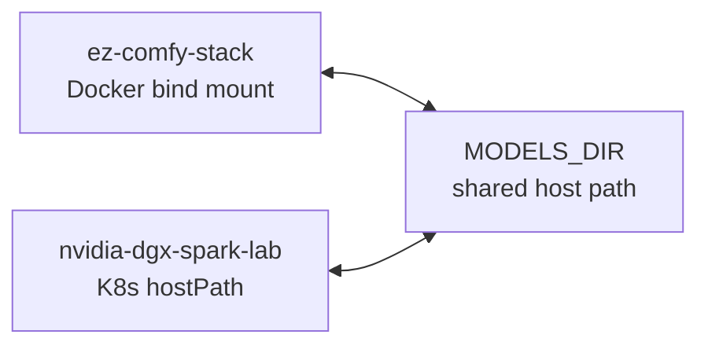
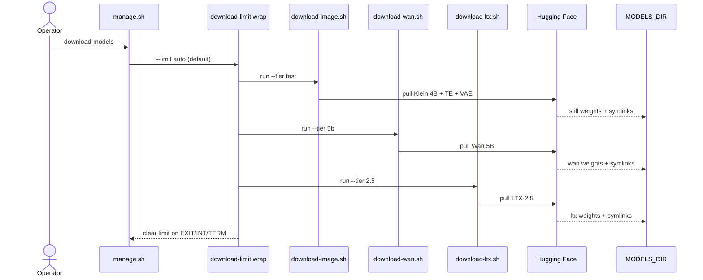
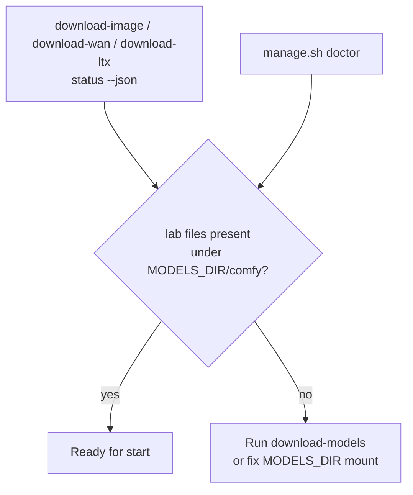

# Multi-stack model sharing

**What's on this page**

- **One `MODELS_DIR`** shared by this Docker stack and nvidia-dgx-spark-lab
- **Download path** (`download-models` → Klein / Wan / LTX, limit clears on exit)
- **Readiness check** (`status --json` and `doctor`)

**What this enables**

- **Downloading weights once** and reusing them across stacks
- **Checking readiness** without network access

**Who this is for:** operators who also run nvidia-dgx-spark-lab. Layout: [Models and cache](../models-and-cache.md). This sample stack does not pull in K3s or multi-node NCCL.

---

## Multi-stack sharing

Independent Sparks share `MODELS_DIR`; still no in-tree NCCL. Graduate to nvidia-dgx-spark-lab for K8s / multi-node work.

### Download path

Throttle details: [Download limit](../download-limit.md). Pack ids: [Download tiers](../download-tiers.md).

### Readiness check

