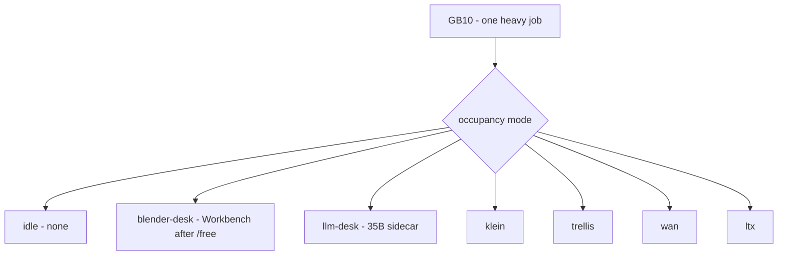

# Occupancy matrix

**What's on this page**

- **CLI modes** from `scripts/lib/occupancy.sh` - idle, blender-desk, llm-desk, klein, trellis, wan, ltx
- **Mode x legal GPU jobs**
- **XOR diagram**, park vs stop
- **Graph occupancy `llm`** is **not** a CLI mode
- **Path D MCP**, `EZDCCOccupancyGate`, `${COMFY_OUTPUT_DIR}/.occupancy.json`

**What this enables**

- **Seeing** which job is legal before you Queue or dump
- **Parking** Comfy (`POST /free`) instead of `stop` for Workbench
- **Remembering** `occupancy enter` does **not** start Compose

Narrative desk: [Occupancy](../occupancy.md). MCP tools: [MCP](mcp.md).

```bash
export SPARK_HOST="${SPARK_HOST:-127.0.0.1}"
export SPARK_USER="${SPARK_USER:-$USER}"
export MODELS_DIR="${MODELS_DIR:-/mnt/models}"
export COMFY_OUTPUT_DIR="${COMFY_OUTPUT_DIR:-/mnt/comfy-output}"
export COMFY_PORT="${COMFY_PORT:-8188}"
export DOWNLOAD_LIMIT="${DOWNLOAD_LIMIT:-auto}"
```

```bash
./scripts/manage.sh occupancy status
./scripts/manage.sh occupancy enter blender-desk
./scripts/manage.sh occupancy enter llm-desk --yes
./scripts/manage.sh occupancy enter klein --yes
```

<Callout type="error" title="One heavy job">
  Parked Comfy is **not** a second denoise. `blender-desk` is Workbench / CPU after models unload. `llm-desk` is the host 35B llama-server after unload - that sidecar **is** the GPU job. Cycles CUDA, TRELLIS, Wan, LTX, and llm-desk still XOR. This does **not** start Compose and does **not** weaken `restart: "no"`, headroom, or download-limit clear-on-exit.
</Callout>
---

## Mode x legal GPU jobs

`OCCUPANCY_MODE_LIST`: `idle` `blender-desk` `llm-desk` `klein` `trellis` `wan` `ltx`.

| Mode | Compose | Legal GPU job | Also allowed | Refused |
| --- | --- | --- | --- | --- |
| **`idle`** | **down** | none | Host dumps / NVENC (Compose is down) | Any Comfy Queue; 35B sidecar is stopped |
| **`blender-desk`** | up **or** down | Workbench / CPU dumps after `POST /free` when up | Host `export-guides` / `blender-stills` / `house-views` / `blender` when parked or Compose down | Cycles CUDA / OptiX while Compose is **up**; NVENC while Compose is **up**; `llm-desk`; Klein / TRELLIS / Wan / LTX Queue |
| **`llm-desk`** | up **or** down | Host `llama-server` on `127.0.0.1:30000` | Writing desk after `POST /free` when Compose is up | Blender desk without `--yes`; visual denoise; DCC dump while sidecar is live |
| **`klein`** | **up** 90g/80g | Klein stills | - | Other heavy families; live Blender/MCP without `--yes` |
| **`trellis`** | **up** 90g/80g | TRELLIS.2 INT8 image->mesh | - | Same XOR |
| **`wan`** | **up** 90g/80g | Wan 5 s silent | - | Same XOR |
| **`ltx`** | **up** 90g/80g | LTX 5 s AV | - | Same XOR |

Heavy modes **do not start Compose**. If the container is down they error: `./scripts/manage.sh start` (type **yes**).

NVENC / `film-proxies` stay XOR with **compose-up** (`refuse_if_comfy_running`). Park is not enough.



---

## Park vs stop

| | Park (`occupancy enter blender-desk`) | `./scripts/manage.sh stop` |
| --- | --- | --- |
| **Container** | Stays **up** (or already down) | **Down** |
| **Weights** | `POST /free` `{unload_models, free_memory}` when up | Unloaded with the process |
| **Volume** | Kept | Kept |
| **Use** | Workbench dumps without a full start cycle | NVENC, SuperSplat, wedged UI, reboot |

If `/free` fails, Workbench may still contend for unified memory - `occupancy idle` then.

---

## Graph occupancy `llm` is not a CLI mode

App Mode chips (`custom_nodes/ez_studio_app`) use keys `none` / `llm` / `klein` / `wan` / `ltx` / `film` / `audio`. **`llm` means nothing GPU** on that chip (Prompt Forge / research-chat). There is no `occupancy enter llm`.

The writing-desk CLI mode is **`llm-desk`**. In-canvas **Creative Research** DESCRIPTION says occupancy **llm**: GPU 35B sidecar when `llm-desk` is up, else on-box 4B. [Custom nodes](../reference/custom-nodes.md) - [ComfyUI Apps](../studio-apps.md).

---

## Path D MCP

Laptop agent is the MCP client. Spark runs `blender-mcp` / `research-mcp` (stdio). Tunnels:

```bash
ssh -L "${COMFY_PORT}:127.0.0.1:${COMFY_PORT}" "${SPARK_USER}@${SPARK_HOST}"
ssh -L 30000:127.0.0.1:30000 "${SPARK_USER}@${SPARK_HOST}"
```

**bpy** tools need `blender-desk`. **research-mcp** is CPU GGUF and **does not refuse** a GPU Comfy session. Tool list: [MCP](mcp.md).

---

## EZDCCOccupancyGate and state file

`EZDCCOccupancyGate` reads **JSON only** (`${COMFY_OUTPUT_DIR}/.occupancy.json`). Missing file passes as `unknown` (first-run / pytest). It does **not** start Compose, call Manager unload, or launch Blender.

Default payload when missing: `version`, `mode` (`idle`), `compose`, `parked`, `blender_pid`, `mcp_pid`, `llm_pid`. Live `occupancy status --json` adds `compose_live`, `queue`, `llm_live`.

State lives on **outputs**, never `${MODELS_DIR}`.
