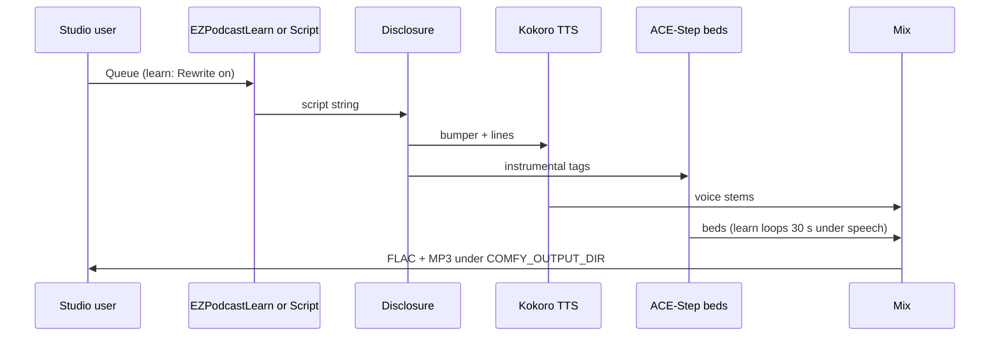

# Local podcast

**What's on this page**

- Option A (two-host-episode) vs Option B (radio drama) vs Option C (learning episode)
- App Mode: script or sources + format/duration, bed/sting tags, Kokoro stock voices (refs stay graph-only)
- Why TTS-Audio-Suite and OldTimeRadio are not vendored
- Kokoro default on Spark; Chatterbox / Qwen3-TTS optional (`qwen3tts` is a complete snapshot, not weights-only)
- Native ACE-Step instrumental beds
- Voice consent, platform rules, and authorship
- `download-podcast` usage, sequential Queue, and loudnorm
- Optional YouTube still-video: host `audio-still-video` after cover (not Apple Podcasts)
- Clone-and-translate of a recorded show is a different lane: [Local dub](dub.md)

**What this enables**

- Queue a local two-host or learning episode without cloud TTS or rented music
- Keep the visual studio bootable when podcast extras are missing
- Disclose synthetic voices in the mix, not only in a description box
- Mux a cover still + episode FLAC into a YouTube MP4 without changing the episode graph

<Callout type="warning" title="Not legal advice">
  Platform rules and copyright change. Read the current Apple, YouTube, Spotify, FTC, and USCO pages before you monetize.
</Callout>
---

## Three operator paths

Do **not** load Klein + Wan + LTX + ACE-Step + TTS in one session. Cover art is a separate graph.

### Option A — two-host-episode commercial episode

Graph: **audio/podcast/two-host-episode** (`extra.lab_profile` `us-safe-podcast`).

| Stage | What runs | Prefix |
| --- | --- | --- |
| SCRIPT | App **Script** + **Rewrite script**. In-tree `EZPodcastScript` (enhance **off** so `Speaker A:` / `Speaker B:` stay parser input). Missing GGUF passes the widget through | `ez_podcast_script` |
| DISCLOSURE | `EZPodcastDisclosure` prepends the spoken bumper | (string) |
| VOICES | App **Speaker A / B**, **Include announcer**, **Speaking speed**. `EZKokoroTTS` Kokoro-82M ONNX/CPU built-ins. Voice-clone refs stay graph-only | `ez_podcast_voice` |
| BEDS | App **Bed tags**, **Rewrite bed**, **Bed length (seconds)**. Native Comfy ACE-Step 1.5, instrumental (lyrics hidden) | `ez_podcast_bed` |
| MIX | Duck −15 dB + overlay. FLAC master + 320 kbps MP3 | `ez_podcast_ep` / `ez_podcast_mix` |
| COVER | Queue **stills/podcast-cover** separately (1024², `ez_podcast`) | `ez_podcast` |

First spoken line is always:

> Voices and music on this show are synthesized. The hosts are original characters, not recordings of real people.

Do not type that line yourself. The disclosure node prepends it.

### Option B — one-graph radio drama

Graph: **audio/podcast/radio-drama** (`us-safe-radio`). Same legal engines. Writer prompt is lab-original fiction (`radio_drama.txt`), not a news rewrite. App Mode: **Script**, **Sting tags** / **Bed tags**, sting and bed length, **Speaker A / B / Announcer**, **Include announcer**, **Speaking speed**. ACE-Step sting + bed stay instrumental (lyrics hidden). One master mix (`ez_radio_ep` / `ez_radio_mix`).

Optional Wan silent bumper / LTX 5s hook **groups default off** (node mode never). Queue **motion/loops/bumper-loop** or **motion/av/hook-av** in a later session. Not a one-graph film.

### Option C — learning episode

Graph: **audio/podcast/learn-episode** (`us-safe-learn-podcast`). Same legal engines as Option A. Occupancy **audio**.

Paste a lazy blob of notes, `https://` links, captioned video URLs, or local `.txt` / `.md` / `.srt` / `.vtt` paths. Pick **Format** and **Duration**. Rewrite stays **on**.

| Stage | What runs | Prefix |
| --- | --- | --- |
| SOURCES | App **Sources**, **Format**, **Duration**, **Fetch links**, **Rewrite**. `EZPodcastLearn` writes a deduped digest then a Speaker A/B (or solo) script | `ez_learn_sources` |
| DISCLOSURE | `EZPodcastDisclosure` prepends the spoken bumper | (string) |
| VOICES | App **Speaker A / B**, **Speaking speed**. `EZKokoroTTS` Kokoro-82M built-ins | `ez_learn_voice` |
| BEDS | App **Bed tags**. Native ACE-Step 1.5, **30 s** instrumental, looped under the speech (`EZAudioLoopToMatch`). Duck −15 dB | `ez_learn_bed` |
| MIX | Overlay. FLAC master + 320 kbps MP3 | `ez_learn_ep` / `ez_learn_mix` |
| COVER | Queue **stills/podcast-cover** separately (1024², `ez_podcast`) | `ez_podcast` |

| Format | Shape |
| --- | --- |
| Quick recap | Two-host, tight, what to remember |
| Deep dive | Two-host, examples, caveats, connections |
| Explainer (default) | Teacher A + curious student B |
| Quiz drill | Host asks, cohost answers, then correction |
| Solo lecture | Speaker A only |
| Debate | A/B argue tensions in the sources, then synthesize |

| Duration | Spoken budget | Writer passes |
| --- | --- | --- |
| 3 min commute | ~450 words | 1 |
| 8 min briefing (default) | ~1200 words | 3 |
| 15 min lesson | ~2250 words | 5 |
| 25 min seminar | ~3750 words | 8 (slow CPU TTS) |

Fetch is SSRF-safe **HTTPS** only. Video URLs pull **captions only** (`yt-dlp --skip-download --write-sub`). No media download. No dub ASR or voice clone. Missing captions are a status line; the rest of the mix still runs. This is a personal study mix of operator-provided sources — not news copy, not a doctor / lawyer / finance-advisor persona. Missing GGUF concatenates sources and wraps Speaker A lines.

---

## Why those packs are not vendored

This lab does **not** git-clone, pip-require, or default to:

- **TTS-Audio-Suite** — many engines, including F5-TTS CC-BY-NC, Fish NC, Higgs commercial traps, VibeVoice research-only, and ARM wheel pain on GB10
- **ComfyUI-OldTimeRadio** — optional lanes that pull US-excluded or non-commercial video models
- Cloud ACE-Step forks, MiniMax Music, F5-TTS official weights, Coqui XTTS v2, Echo-TTS, Fish Audio S2, celebrity reference WAVs, ElevenLabs, or xAI TTS

Native ACE-Step 1.5 already ships in `COMFYUI_REF=v0.34.6` (`TextEncodeAceStepAudio1.5`, `EmptyAceStep1.5LatentAudio`). Beds stay **instrumental** (`instrumental`, `no vocals` in tags; empty lyrics). Rap vocals with original lyrics live on [Local music](music.md) and reuse this same AIO dest — do not download it twice.

---

## Engines on Spark

| Engine | License | Role | Default download? |
| --- | --- | --- | --- |
| Kokoro-82M ONNX | Apache 2.0 | Default TTS, built-in voices, CPU/aarch64-safe | No — `download-podcast --tier analog` |
| ACE-Step 1.5 turbo AIO | MIT | Instrumental beds | No — `--tier acestep` |
| Chatterbox Turbo | MIT | Optional GPU TTS; PerTh watermark stays on | No — `--tier chatterbox` |
| Qwen3-TTS 0.6B | Apache 2.0 | Optional TTS + voice design. `--tier qwen3tts` is a **complete Base snapshot** (config + text tokenizer + nested 12Hz `speech_tokenizer/`), not `model.safetensors` only. Wheel is a separate `--no-deps` extra | No — `--tier qwen3tts` |
| Qwen3-4B-Instruct GGUF | Apache 2.0 | Script draft, fail-soft | Already in `download-models` |

Empty Chatterbox/Qwen3 refs fall back to Kokoro built-ins. Never drop celebrity WAVs into the graph.

`kokoro-onnx` / `onnxruntime` are **optional runtime** installs inside the container venv. They are **not** baked in `phase-nodes.sh` (a new pip would invalidate **venv-extra**, not the multi‑GB torch layer). Analog graphs still load if the wheel is missing; Queue fail-softs until you install it and `download-podcast --tier analog`.

---

## Voice consent and invented characters

Hosts are **original characters**, not recordings of real people. Operator-owned reference clips are allowed only when you have rights. Do not clone living people. Do not ship Rogan/Ramsay-style refs in this repo. Translating a recorded podcast while keeping the original speakers is [Local dub](dub.md) (`audio/dub/clone-translate`), with a rights attestation on every Queue.

---

## Platform and US rules (operator checklist)

- **Apple Podcasts 1.11** — disclose material AI audio in the **content** and in **metadata**
- **YouTube** — use the synthetic/altered content toggle; July 2026 inauthentic-content rules (no template slop, no AI doctor / lawyer / finance-advisor persona)
- **Spotify** — allowed if you own the rights, disclose, and do not use unconsented clones
- **FTC** — spoken sponsor reads; synthetic persona endorsements need both a paid-connection disclosure and “this voice is AI”
- **USCO Part 2 / Thaler** — prompts are not authorship. A human-edited script plus selection, arrangement, and mix **can** be. Raw generations are not registrable

---

## Download

Podcast weights are **opt-in**. `./scripts/manage.sh download-models` does **not** pull them. `doctor` prints analog JSON and still exits 0 when the pack is absent.

```bash
./scripts/manage.sh download-podcast --tier analog      # Kokoro ONNX + voices
./scripts/manage.sh download-podcast --tier acestep     # ace_step_1.5_turbo_aio.safetensors
# same AIO dest as: ./scripts/manage.sh download-music --tier turbo
./scripts/manage.sh download-podcast --tier qwen3tts    # complete 0.6B Base + nested 12Hz tokenizer (~3 GB)
./scripts/manage.sh download-podcast --tier all         # analog + ACE + optional TTS
# same --limit auto|N|off wrap as download-models (always clears on exit)
# qwen3tts with compose up: extras then pip install --no-deps qwen-tts
# (never unconstrained pip install qwen-tts — it pins transformers==4.57.3)
```

Layout after analog + acestep:

```text
${MODELS_DIR}/comfy/
  onnx/kokoro-v1.0.onnx
  tts/voices-v1.0.bin
  checkpoints/ace_step_1.5_turbo_aio.safetensors
```

Relative symlinks only (host `/mnt/models` vs container `/models`).

---

## What runs on Queue



Cover art is a **later** Klein session. Occupancy: do not load LTX + ACE-Step together.

## Sequential Queue

1. `download-podcast --tier analog` (and `--tier acestep` for beds)
2. Optional: `pip install kokoro-onnx onnxruntime` in the Comfy venv (runtime; see [Troubleshooting — models and workflows](operate/troubleshooting-models-workflows.md))
3. `./scripts/manage.sh start` — type **yes**
4. Load **audio/podcast/two-host-episode** (authored script) or **audio/podcast/learn-episode** (paste sources, pick Format + Duration). Queue. Files under `${COMFY_OUTPUT_DIR}` as `ez_podcast_ep_*.flac` / `ez_learn_ep_*.flac` (plus the matching `*_mix_*.mp3`)
5. Load **stills/podcast-cover** in a **later** session. Queue `ez_podcast_*.png`
6. Loudness (ffmpeg; Comfy cannot LUFS):

```bash
./scripts/utilities/podcast-loudnorm.sh run --in "${COMFY_OUTPUT_DIR}/ez_podcast_ep_00001_.flac"
# --target youtube  → −14 LUFS; default podcast → −16 LUFS
```

7. Optional YouTube still-image video (host ffmpeg; the graph still saves FLAC + MP3). Do this **after** loudnorm if you want −14 LUFS in the MP4; `audio-still-video` does not loudnorm unless `--loudnorm youtube`:

```bash
./scripts/manage.sh audio-still-video \
  --audio "${COMFY_OUTPUT_DIR}/ez_podcast_ep_00001_-youtube-lufs.flac" \
  --image "${COMFY_OUTPUT_DIR}/ez_podcast_00001_.png"
```

Apple Podcasts still wants the audio master. The MP4 is a YouTube convenience, not a talking-head.

Start still requires typing `yes`. Compose `restart: "no"` is unchanged.
