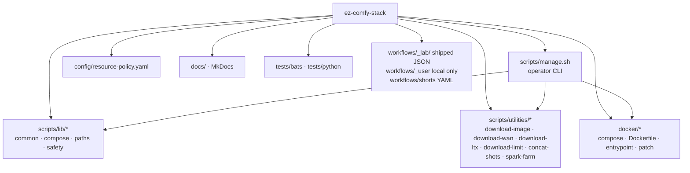
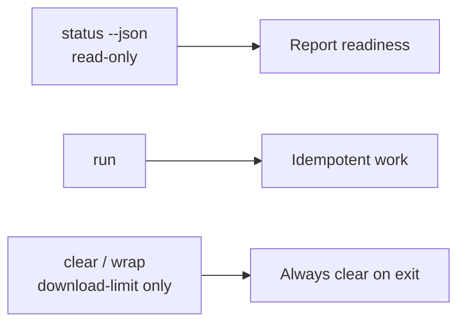
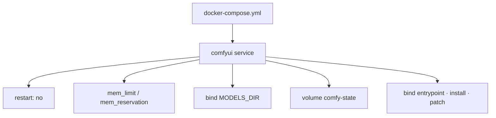
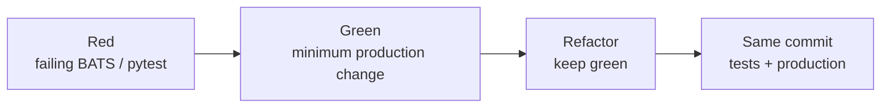
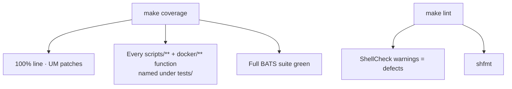
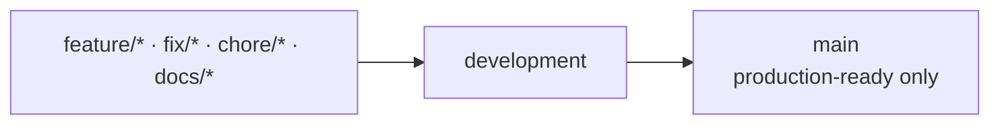

# Project Conventions

**What's on this page**

- Core principles
- Repo layout and ownership
- Shell style (Google Shell Style Guide + project deviations)
- Docker, testing, coverage gate, and branching rules
- Docs publish and **human-readable formatting** patterns

**What this enables**

- Consistent, reviewable contributions without the full lab Bazel/K8s surface
- Shell that matches industry practice while staying safe on remote DGX Spark hosts
- MkDocs pages operators can **scan** (not only search)

## Principles

| Principle | Meaning |
| --- | --- |
| Stability first | SSH stays usable under load |
| Explicit resources | Docker mem limits always set |
| No auto-start | `restart: "no"` |
| Hermetic tests | BATS/pytest without real Spark |
| Docs as code | MkDocs pages with required sections |
| Keep it small | No K8s/Ansible/dashboard/Bazel |
| Style as gate | ShellCheck + shfmt on every change |

## Repo layout



Shipped Comfy graphs live under `workflows/_lab/<lane>/` (`klein`, `wan`, `ltx`, `shorts`, `dcc`, `optional`, `audio`, `inspire`) and keep the `*-lab-example.json` suffix. Shot YAML stays in `workflows/shorts/*.shots.yaml`. `workflows/_user/` is a local convention only — live private graphs are on `${COMFY_OUTPUT_DIR}/comfy-user/default/workflows/_user/` and must not be committed.

## Shell style

**Primary reference:** [Google Shell Style Guide](https://google.github.io/styleguide/shellguide.html).

This project follows that guide for executables and libraries, with the **intentional deviations** below. When the guide and this page conflict, this page wins for the listed deviations only.

### Rules we follow (summary)

| Area | Rule |
| --- | --- |
| Language | Bash only for executables |
| STDERR | `log` / `warn` / `err` → stderr; data/JSON → stdout |
| Comments | File overview header; every library function documented |
| Function docs | Google-style **Globals / Arguments / Outputs / Returns** blocks |
| Indent | 2 spaces; no tabs (`shfmt -i 2 -ci`) |
| Control flow | `; then` / `; do` on same line as `if` / `for` / `while` |
| Tests | Prefer `[[ … ]]`; use `-z` / `-n` for empty strings; `==` for equality |
| Command subst | `$(…)` only (never backticks) |
| Quoting | Quote expansions: `"${var}"`, `"${array[@]}"`, `"$@"` |
| Arrays | Use arrays for argument lists; expand with `"${arr[@]}"` |
| Arithmetic | `$((…))` / `((…))`; not `let` / `expr` / `$[…]` |
| Eval / aliases | Forbidden in scripts |
| Pipes to while | Prefer process substitution: `while read; do …; done < <(cmd)` |
| Locals | `local` in functions; split `local x` / `x="$(cmd)"` when exit status of `cmd` matters |
| Constants | `UPPER_SNAKE`; prefer `readonly` when set once |
| Naming | Functions/vars `lower_snake_case`; `name()` without `function` keyword |
| Structure | Helpers grouped; multi-function scripts use `main` + source guard |
| Libraries | `scripts/lib/*.sh` — `.sh` extension, **not** executable |
| Entry scripts | `*.sh`, executable, `set -euo pipefail` |
| ShellCheck | Clean at warning level (`make lint`) |
| SUID/SGID | Forbidden |

### Intentional deviations from Google

| Google guide | This project | Why |
| --- | --- | --- |
| Shebang `#!/bin/bash` | `#!/usr/bin/env bash` | Works on macOS (Homebrew bash) and Linux Spark without assuming `/bin/bash` is modern |
| Prefer scripts ≤ ~100 lines or rewrite | Modular multi-file shell ops surface | Operator tooling is intentionally Bash; split by domain (`lib/*`, utilities) |
| Function banner style only | Globals/Arguments/Outputs/Returns labels (Google fields) | Clearer API docs; optional `# @command` on CLI entrypoints for help discoverability |
| Hard 80-column lines | Prefer ≤80; soft max ~100 | Long HF repo ids and one-line JSON status payloads |
| Package functions with `::` | Flat `verb_noun` names | Single small repository |

### Function comment template

```bash
#######################################
# One-line summary of behavior.
# Longer notes if needed for non-obvious safety or side effects.
# Globals:
#   MODELS_DIR (read)
# Arguments:
#   $1 - tier id (fast|quality|…)
# Outputs:
#   Writes human status to stderr; JSON to stdout when --json
# Returns:
#   0 on success, 1 on error
#######################################
some_func() {
  local tier="${1}"
  …
}
```

### Entry script skeleton

```bash
#!/usr/bin/env bash
#
# ## tool-name
#
# Overview, usage, safety, exit codes.

set -euo pipefail

# sources, constants (readonly where fixed)

#######################################
# …
#######################################
helper() { …; }

#######################################
# CLI dispatcher.
# Arguments:
#   $@ - CLI args
#######################################
main() {
  …
}

# shfmt -s may leave ${BASH_SOURCE[0]} unquoted inside [[ ]]; that is intentional.
if [[ ${BASH_SOURCE[0]} == "${0}" ]]; then
  main "$@"
fi
```

### Utility contract

Utilities under `scripts/utilities/` implement at least:

| Subcommand | Contract |
| --- | --- |
| `status [--json]` | Read-only; exit 0 when reporting succeeds |
| `run` | Idempotent where practical |
| Extra | `clear` / `wrap` allowed for download-limit |



## Docker

- One compose service for the unified stack  
- Multi-stage image: **runtime** builder stages + **runtime** final (no secrets/models; `CUDA_BASE_IMAGE=…devel` is an override)  
- **Layer cache contract** (do not regress):
  - Torch stage `COPY` is only `install-comfy/core.sh` + `phase-venv-torch.sh` (not `common.sh` / Comfy pins)
  - Named stages `torch` → `comfy` → `nodes`; pin `ARG`s declared in the stage that uses them
  - Runtime: `COPY --link` `/opt/parts/venv` then `venv-extra` then `app` **before** entrypoint/install/patch
  - Validated pins: `TORCH_VERSION`, `COMFYUI_REF`, `COMFYUI_MANAGER_REF`, `COMFYUI_NUNCHAKU_NODE_REF` (see models-and-cache.md)
  - BuildKit `# syntax=docker/dockerfile:1`, `COPY --link`, `COPY --chmod`, pip + apt cache mounts
  - Compose bind-mounts ops scripts + `install-comfy/` for zero-rebuild iteration
- GHCR channel by long-lived branch: publish tags `us-safe-studio` (`main`) and `us-safe-studio-development`; `manage.sh` pulls the tag for the current git branch (feature branches use the development channel). Old `flux-to-ltx*` tags freeze on the previous image.  
- Scripts as real files (not inline ConfigMap YAML)  
- Host model cache + named volume for Comfy state  
- Compose `restart: "no"`; explicit `mem_limit` / `mem_reservation`  




## Testing

- TDD for behavior changes  
- BATS for shell; pytest for Python  
- **Hermetic by default**: `test_helper.bash` sets `LAB_HERMETIC=1`, speed/probe mocks, and `HF_PROGRESS=0` (no real curl/speedtest, no progress-monitor sleeps)
- **Parallel BATS**: `bats --jobs` across files when GNU `parallel` is installed (`BATS_JOBS` override); serialize within files
- `make coverage` enforces:
  - **100% Python line coverage** on `patch_get_free_memory` and `patch_unified_memory_copy`
  - **Strict shell inventory**: every function in `scripts/**/*.sh` and `docker/**/*.sh` must be **named under `tests/`** (production-only references do not count)
  - Full BATS suite green  
- **Tests ship with production code** — same commit as the files under test  
- **Test shell style**: `tests/bats/*.bats`, `tests/bats/*.bash`, and `tests/*.sh` follow the Google Shell Style Guide where applicable (quoted `"${var}"`, `[[ … ]]`, Google-style helper comments in `test_helper.bash`, 2-space indent / shfmt for `.sh` runners)





## Branches

- Feature work from `development`: `feature/<short-description>`  
- Conventional commit titles  
- PR into `development` first  



## Docs publish

- Local / PR: `make docs` (strict MkDocs Material build into `site/`)
- Public site (per long-lived branch) via **mike** on GitHub Pages:
  - `main` → [latest](https://toxicoder.github.io/ez-comfy-stack/latest/)
  - `development` → [development](https://toxicoder.github.io/ez-comfy-stack/development/)
- Workflow: `.github/workflows/deploy-docs.yml` (push to `main`/`development` with docs paths, or `workflow_dispatch`)
- Stack is **MkDocs 1.x + Material** (`docs/requirements.txt`). Do **not** upgrade to MkDocs 2.x (incompatible with Material plugins/theme; no migration path). CI and `make docs` set `NO_MKDOCS_2_WARNING=1` to suppress Material’s advisory. Revisit only if migrating tooling (e.g. Zensical evaluation).
- Keep the top nav on screen while scrolling: `navigation.tabs` **and** `navigation.tabs.sticky` in `mkdocs.yml`. Do **not** enable `header.autohide` (Material hides the tabs row on scroll without sticky).
- Header compact-on-scroll lives in `docs/stylesheets/extra.css` (wired via `extra_css`). Do not fork Material `header.html` / `tabs.html` for this. All header controls stay visible; only padding/height shrinks after the page title scrolls away. The same stylesheet sets `.md-typeset { font-size: 0.875rem }` (Material default is `0.8rem`); do not raise `html` font-size or the rem-based header will grow with the article.
- Sticky table headers also live in `extra.css`: `.md-typeset table thead th` pins under the lifted header (`--ez-sticky-table-top`, 4.8rem default / 4.2rem after compact-on-scroll). Keep `.md-typeset__scrollwrap { overflow: visible }` so the wrap does not become the sticky scrollport. Do not fork table templates.
- Prefer **relative** links between pages and to in-repo paths so they stay correct on every git branch and under each published version prefix
- Branch-stamped at build time via `docs/hooks.py` + `EZ_DOCS_VERSION` / `MIKE_DOCS_VERSION` (optional `EZ_DOCS_GIT_REF` override):
  - Edit links (`edit/<ref>/docs/`)
  - This-repo GitHub `blob` / `tree` URLs
  - Operator Setup git ref: write `__DOCS_GIT_REF__` in source (e.g. `git clone -b __DOCS_GIT_REF__`); hooks stamp `main` or `development` to match the published alias
- Operator docs that mean “the branch for **these** docs” must use `__DOCS_GIT_REF__`, not a hardcoded long-lived branch name. Contributor workflow text (“branch from `development`”) stays literal.

### Docs formatting (human readability)

Readers **scan**. Prefer inverted pyramid: outcome and commands first, theory and edge cases later.

**Required page chrome** (every `docs/*.md` page, including `docs/learn/`):

1. YAML frontmatter: `title`, `description`, `tags`
2. **What's on this page** (bullet list)
3. **What this enables** (bullet list)

**Nav (Diátaxis-shaped, task tabs):** Learn (explanation + [glossary](glossary.md)) → Start (tutorial) → Create (how-to) → Operate (how-to + reference) → Contribute. Do not mix a command catalog into Getting Started (`manage-cli.md`) or a workflow spreadsheet into the playbook (`studio-workflows.md`).

**Glossary (definition modal):**

- Source of truth: `includes/glossary.json` (JSON, not YAML — CI pytest does not install PyYAML)
- Unique `id` (`[a-z0-9-]+`) and unique case-insensitive `aliases`
- `short` is one line (modal + `title=` tooltip); `long` is markdown on [glossary.md](glossary.md)
- First occurrence per term **per page**; skip `code` / `pre` / headings / links / the glossary page itself
- `docs/glossary.py` wraps HTML; `docs/javascripts/glossary.js` opens a native `<dialog>`
- Do **not** enable Material `abbr` + snippets `auto_append` (hover-only, double-wraps)
- Do **not** enable `content.instant` unless you re-test the modal on client-side navigation

**Rich formatting patterns** (MkDocs Material — see `mkdocs.yml`):

| Pattern | Use for |
| --- | --- |
| Numbered steps | Operator sequences (`setup` → `start` → `stop`) |
| Tables | Defaults, symptom → action, file basenames |
| `!!! tip` / `!!! warning` / `!!! danger` / `!!! success` | Side notes that must not break narrative flow |
| `??? …` collapsible | Advanced, optional, “how it works”, long diagrams |
| `=== "…"` content tabs | Mutually exclusive paths (interactive vs non-interactive; image vs video) |
| Task lists `- [ ]` | Prerequisites the operator can check off |
| `++ctrl+c++` (`pymdownx.keys`) | Keyboard shortcuts |
| Mermaid | Architecture / decision trees — **after** actionable commands when the reader’s job is to run something |
| Card grids (`<div class="grid cards" markdown>`) | Home / Learn indexes — equal-weight next steps |
| `:material-…:` / `:octicons-…:` icons | Cards and scan anchors (`pymdownx.emoji` twemoji) |
| Bold first phrase in list items | Scan anchors |

**Getting Started** is the primary operator path: keep the happy path short; park image-layer, cold-start, and lab-internals content in collapsible blocks.

**Session variables:** operator command fences should reuse `SPARK_HOST`, `SPARK_USER`, `MODELS_DIR`, `COMFY_OUTPUT_DIR`, `COMFY_PORT`, `DOWNLOAD_LIMIT` (defaults from `.env.example`) so blocks are paste-and-run. Do not hardcode `<spark-ip>`.

**Default stack vocabulary:** Klein 4B + Wan 2.2 5B + LTX-2.5. Lab CLIP is `qwen_3_4b` (type `flux2`) and LTX-2.5 `CLIPLoader` Gemma4-with-proj. Klein 9B and old `flux-to-ltx*` GHCR tags are banned/frozen mentions only.

```bash
make docs   # strict build must stay green
```
