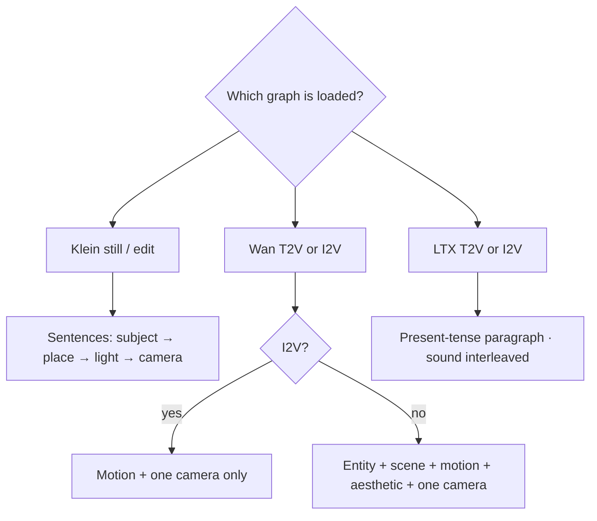
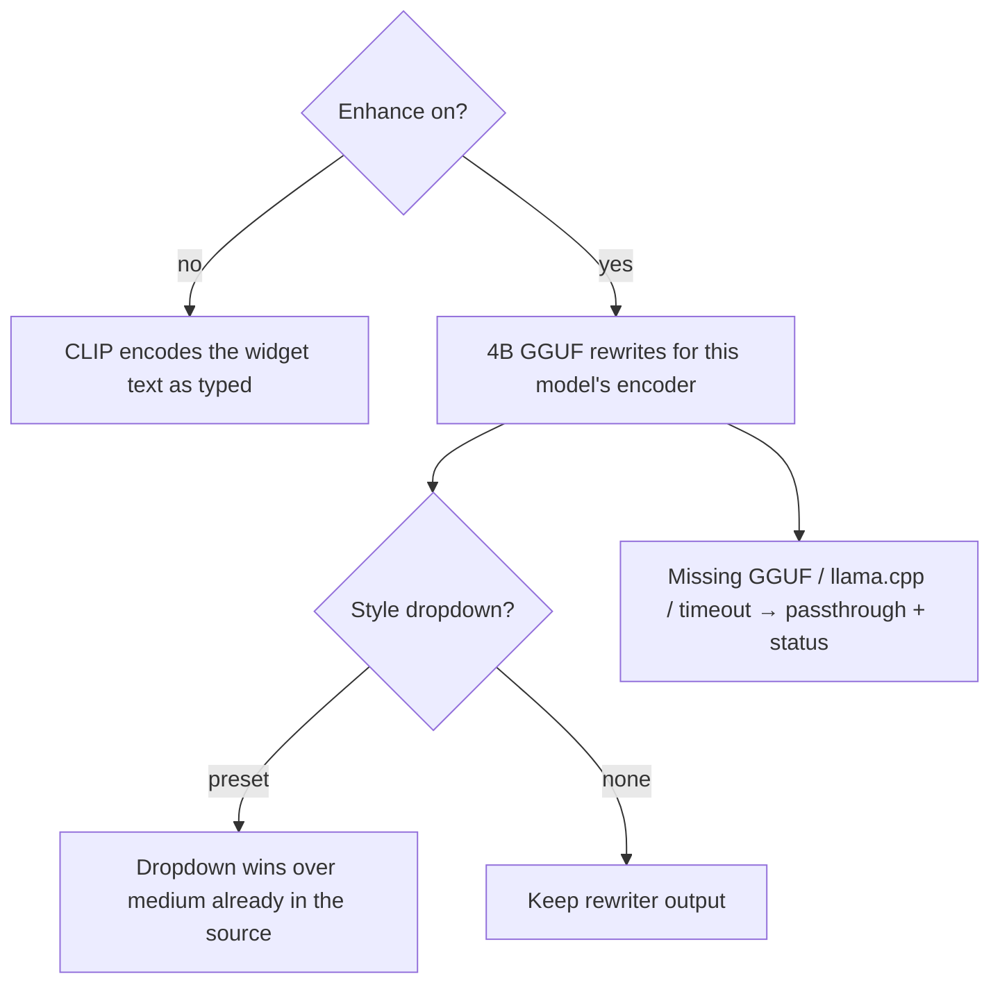

# Prompting Klein, Wan, and LTX

**What's on this page**

- How each lab model actually reads a prompt
- Canned lab-example text (already rewritten)
- GIF loop motion and dream-house world bible (one place prompt; one shot per room or angle; Prompt Join lock=view). Clay tour: same bible, Klein restyles Blender stills
- Character draft then tweak (style dropdown; generated still as the next reference)
- Lazy path: Prompt Enhance nodes (on-box Qwen3-4B-Instruct-2507, Enhance **on** by default, including identity bibles and 90s films)
- Style dropdown: research-backed look references; dropdown wins over style already in the source
- After Queue, the dim **CLIP prompt** box is always visible and shows the string CLIP/ACE encoded

**What this enables**

- Writing (or pasting) a prompt that matches Klein 4B, Wan 2.2, or LTX-2.5 instead of SD1.5 tag soup
- Typing a lazy sentence and letting the on-box Qwen3 rewriter expand it for Klein / Wan / LTX
- Optional style dropdown (50 presets): the rewriter weaves research-backed medium, light, color, and texture into the CLIP prompt, and retunes any style already in the source

!!! tip "Lab graphs already ship model-native prompts"

    Seeded **\*-lab-example** graphs use research-backed Positive / Motion text **and** Prompt Enhance **on**. Turn Enhance **off** only to pin widget text. **prompt-forge-lab-example** previews Klein / Wan / LTX rewrites with no UNET (occupancy **llm**). Copy the family you need into Spark Still. The CLIP prompt box is visible before Queue (empty until rewrite) and shows the encoded string after.

Why the three models exist: [Klein, Wan, and LTX](learn/pipeline.md).

---

## Models and text encoders

| Model | Encoder | CLIP type | Prompt shape |
| --- | --- | --- | --- |
| FLUX.2 Klein 4B distilled | Qwen3-4B | `flux2` | Sentences. Subject → place → light → camera. Under ~150 words. Positive opposites, not “no logos”. |
| Wan 2.2 TI2V-5B | UMT5-XXL | `wan` | T2V: Entity + Scene + Motion + Aesthetic + one camera move (~80–120 words). I2V: **Motion + Camera only**. Silent — do not prompt audio. |
| LTX-2.5 distilled | Gemma4-12B-with-proj | `ltxv` | One flowing present-tense paragraph, 4–8 sentences, **audio interleaved**. Dialogue in `"quotes"` only if you asked for speech. |

Comfy wraps Klein’s string in a Qwen chat template. Do **not** paste `<|im_start|>` into the widget.

Distilled Klein is **CFG 1.0 / 4 steps** — quality is almost entirely the Positive prompt. FLUX-family models do not use negatives well; put constraints in the positive (“unmarked facades, empty of signage”).

---

## Recipes

=== "Klein 4B (still)"

    Front-load the subject. Write prose.

    **Do:** `A photoreal still of a tropical coastal city rooftop terrace at golden hour. An original techno wizard in an unmarked sun-washed teal technical running coat stands mid-stride on the terrace. Warm gold-cyan holographic glyph rings bloom from a compact unmarked data-staff…`

    **Don’t:** `rooftop, techno wizard, photo, 24mm, no logos, no text`

=== "Wan 2.2 T2V"

    Entity + scene + motion + **one** camera verb (`dolly in`, `pan`, `tracking`, `fixed camera`). About 80–120 words. No audio, no score.

=== "Wan 2.2 I2V"

    The start image owns look. Prompt only motion and camera. Keep identity locked. Lab I2V graphs no longer encode a separate look CLIP into the sampler.

=== "Looping GIF (Wan I2V)"

    Locked camera plus cyclic motion (breeze, curtains, leaves, water). Do **not** prompt a walk or a one-way dolly — **wan-gif-loop-lab-example** plays the clip forward then reverse (VHS ping-pong) so the join frame is the start image. Turn ping-pong off only when reverse playback would look wrong.

=== "Dream-house pack (Klein)"

    Type **one place**. Identity-mode enhance freezes only the rooms, furniture, outdoor lamps, and surroundings you named (the default placeholder is a full-floor penthouse on a tall tower in a dense unmarked city). Name lounge, kitchen, dining, bath, bedroom, terrace, study, and outdoor lamps so the tour can enter them. Hidden SHOT cards are a walkthrough — tower, foyer, lounge, kitchen, dining, bedroom, bath, terrace, drone, study — not a penthouse template. Each card is one room or angle with its own backdrop: only lounge looks out the main opening; kitchen, dining, bedroom, bath, and study keep interior walls. **Prompt Join** `lock=view` front-loads the shot, then “same building, rooms, furniture, and materials” + “this still is only the room and backdrop the shot names” + the bible, and repeats that closer after the bible. Shot cards are **not** Klein-t2i-enhanced — a per-shot rewrite would mutate the bible. Shots 02–10 are independent T2I (empty latent, same seed) — they do **not** `ReferenceLatent` shot 01. Dawn / noon / night of one camera belong on **klein-time-of-day-lab-example** (`lock=state`). `lock=state` is the other mode: same camera, change only light/grade/action (lighting-trio, before/after). Unused shots may be bypassed.

    Second door — **klein-dream-house-clay-lab-example**: same bible and shot cards, but each still `ReferenceLatent`s a Blender clay plate (`ez_house_clay_01`…`10`). Dump with `./scripts/manage.sh house-views` while Comfy is **down**. Prompt the **look** (style dropdown, materials); do not re-describe the floorplan — the greybox already locked cameras and adjacency. Prefix `ez_dream_house_clay_01`…`10`. No Blender → stay on the T2I tour. Playbook: [Dream-house tours](learn/dream-house.md).

=== "LTX-2.5 AV"

    Flowing paragraph, present tense, audio beside the action (wind, footsteps, a shop bell) — not a sound trailer at the end. Shorts: world SFX, **no score**. Do not paste a Wan or Kling shot list unchanged. 90s films bake one `ltx_i2v` paragraph per shot (I2V: motion + one camera + interleaved foley; start image owns look). **go-see** pins Enhance **off** so the body-cam bible is encoded as written; still-here / switchyard keep Enhance on.

    First-person body-cam (go-see): one signature stunt per 5 s; eye-level; sleeves and gloves in the lower third; look at the landing before a jump; dip on impact then recover; land the last frame on a readable plant for the next I2V. Close-mic breath + surface foley beside the move. No speech. Identity still is already at a dead sprint.

---

## Prompt Enhance nodes

In-tree pack `custom_nodes/ez_prompt_enhance` (category **ez-comfy/prompt**). Entrypoint copies every pack under `custom_nodes/` into Comfy on start (same pattern as lab workflows), including `ez_ltx_spatial` which snaps LTX canvases off 720/1080 so the video VAE does not einops-crash, and `ez_film` which unloads Klein before LTX and stitches the 90s MP4.

| Node | Modes | Use on |
| --- | --- | --- |
| **Klein Prompt Enhance** | `t2i`, `edit`, `identity` | every Klein still / edit / identity bible (including 90s film identity) |
| **Wan Prompt Enhance** | `t2v`, `i2v`, `flf`, `vace` | wan-i2v-5s / wan-t2v-5s / wan-flf-5s / wan-vace-join |
| **LTX Prompt Enhance** | `t2v`, `i2v` | ltx-i2v-5s / ltx-t2v-5s / each 90s film shot |
| **ACE-Step Prompt Enhance** | `vocal`, `instrumental` | music-rap-* tags+lyrics; podcast instrumental beds |
| **Prompt Join** | `lock=view`: shot + lock + bible + inventory + closer (camera-first walkthrough; this still is only the room and backdrop the shot names). `lock=state`: bible + inventory + lock + shot | dream-house (view) and lighting/before-after (state) |

STRING out → CLIPTextEncode `text` input.

1. `./scripts/manage.sh download-models` (includes `comfy/llm/Qwen3-4B-Instruct-2507-Q4_K_M.gguf`).
2. Type a lazy sentence (or leave the canned paragraph). **Enhance** defaults **on**.
3. Optional: pick a **style** (photorealistic, anime, cartoon, … — 50 ids, or `none`).
4. Queue. On the Enhance node, read the dim **CLIP prompt** box — that is the text CLIP encoded. The top prompt widget stays as you typed it. If the 4B rewriter was skipped, **Enhance status** says why (missing GGUF, missing llama.cpp, timeout) and generation still runs. A selected style should read as that medium (cel, watercolor, oil on canvas, …), not a 3D/photo paragraph with a style trailer.

**Enhance defaults to true** on every lab graph, including identity bibles and 90s films. Turn it **off** to pin the source widget. Identity mode keeps the bible camera-free and still weaves a selected style (medium and texture, no camera). Style is ignored on I2V / FLF / VACE (the start image owns look).

When Enhance is **on** and a style is selected (t2i / t2v / Klein edit / identity):

- The dropdown is look authority. If the source already names a medium, lighting, grade, lens, or art style, the rewriter **replaces** those clauses so they match the dropdown. It does not stack two styles.
- Each preset is a short reference (medium, light, color, texture, camera or projection) tuned for Klein prose, Wan aesthetic+stylization, or LTX lighting/surface in the flowing paragraph.
- CLIP text stays generic: no camera/film/studio brand names. Labels such as **Pixar-like 3D** still weave as “stylized feature 3D”.
- The dropdown wins in the CLIP string even if the 4B rewriter ignores the hint or the GGUF passthroughs: conflicting medium words are dropped and the catalog medium is front-loaded.
- After Queue, the **CLIP prompt** box on the node is the preview. First deploy: restart the container so `js/` is copied, then hard-refresh the Comfy tab.

After Queue the node is an output: the **CLIP prompt** widget is the CLIP string (no `[passthrough:` prefix). **Enhance status** is empty when the rewriter ran, or a next step when it did not.

Fail-soft: missing GGUF, missing `llama-cpp-python`, timeout, or empty model output logs a warning and passes the source through (with style applied if one is selected). Generation still runs. Do not copy a GGUF by hand — `./scripts/manage.sh download-models` plus a restart heals `comfy/llm/` and `doctor`/`start` relink a snapshot that is already on disk.

!!! warning "CPU-only local LLM"

    Prompt Enhance runs **Qwen3-4B-Instruct-2507 Q4_K_M** (~2.5 GiB) through llama.cpp with **`n_gpu_layers=0`**. Do not GPU-offload it next to LTX-2.5. Do not run Gemma 4 E2B or a 30B+ llama.cpp server on the same Spark while Comfy is generating.

Safety: `restart: "no"`, headroom preflight, and download-limit clear-on-exit are unchanged. No API keys. The GGUF lives under `MODELS_DIR`, never in the image.

---

## Next steps

Queue **klein-still-draft-lab-example** first ([Getting Started](getting-started.md)), or **klein-character-draft-lab-example** then **klein-character-tweak-lab-example** to iterate a still. Daily loop: still → Wan 5 s → LTX 5 s on [Visual Generative AI](visual-generative-ai.md).
