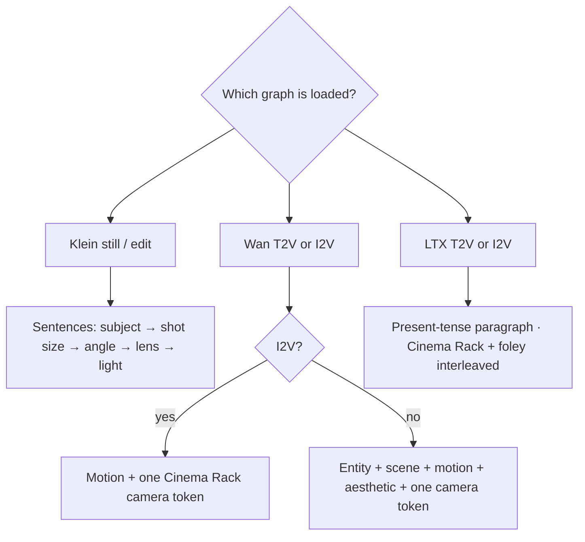
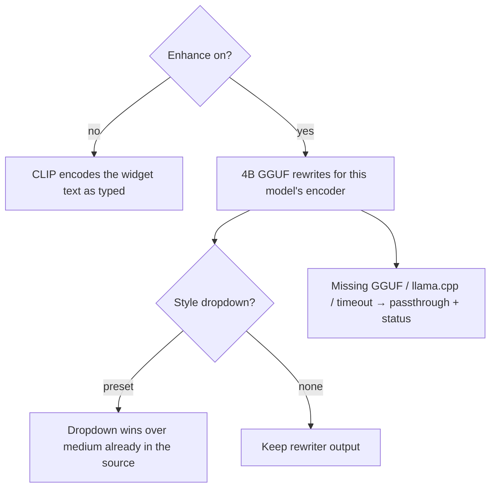

# Prompting every US-safe model

**What's on this page**

- How each US-safe model actually reads a prompt (defaults and opt-in)
- Canned lab graph text (already rewritten)
- GIF loop motion and dream-house world bible (one place prompt; walkthrough shot cards per room — lens, height, a distinct room program, near/far; Prompt Join lock=view). Clay tour: same bible, Klein restyles Blender stills
- Character draft then tweak (style dropdown; generated still as the next reference)
- Lazy path: Prompt Enhance nodes (on-box Qwen3-4B-Instruct-2507). Seeded graphs pin Enhance **on** for lazy CLIP printers and **off** when the string is already a recipe, script, or film shot.
- Negative CLIP nodes go through **Negative Prompt Enhance** (positive CLIP string as context) so canned `illustration` / `Pixar` terms cannot fight the intended look. Families: klein, wan, ltx, zimage, longcat, dreamx, s2v. Distilled CFG 1 models still get a list; fold real exclusions into the **positive**.
- Rewriter **context** sockets carry a bible, logline, research brief, or episode script. Enhance **off** ignores context so authored recipes stay pinned
- Style dropdown: research-backed look references; dropdown wins over style already in the source
- Sample prompt dropdown: 20 lab recipes per graph family plus **Custom** to type your own. Default is Custom so the canned widget text still Queues. Pick a sample to fill (and lock) the Prompt box; pick Custom to edit. Place recipes (Cliff villa, Forest cabin, …) on **klein/dream-house** are valid Sample values — Comfy accepts every catalog label even though the App dropdown shows only this graph’s twenty.
- After Queue, the dim **CLIP prompt** box is always visible and shows the string CLIP/ACE encoded

**What this enables**

- Writing (or pasting) a prompt that matches the encoder in front of you instead of SD1.5 tag soup
- Picking a lab sample prompt from the App dropdown, or Custom to type a lazy sentence the on-box Qwen3 rewriter expands for Klein / Wan / LTX / Z-Image / LongCat / DreamX
- Optional style dropdown (150 presets): the rewriter weaves research-backed medium, light, color, and texture into the CLIP prompt, and retunes any style already in the source
- **Cinema Rack** (`inspire/cinema-rack`): pick one cinematography technique per axis (shot size, angle, move, lens, light, …) and splice a Klein / Wan / LTX string. Deterministic — no LLM. Wan emits one camera verb. Lazy Prompt Enhance uses the same catalog language (clauses, recipes, Wan tokens) when it rewrites. [Cinema Rack](create/cinema-rack.md)

!!! tip "Lab graphs already ship model-native prompts"

    Seeded lab graphs use research-backed Positive / Motion text. Prompt Enhance is **on** for lazy CLIP printers (Klein stills, generic 5s Wan/LTX, identity bibles you type). It is **off** for authored recipes: 90s films, talking-head freeze, ping-pong loops, camera-verb I2V, podcast Speaker A/B scripts, ACE tags/lyrics, IC-LoRA. Turn it the other way in the App if you want. **inspire/app-forge** clones a shipped lab graph into live `_user/` from a brief (occupancy **llm**; does not Queue). **inspire/research-chat** is a no-UNET creative desk (occupancy **llm**): chat or planner+search subagents, then paste ingredients into **inspire/prompt-forge** Context (or type the lazy sentence once in Prompt — all three families share it). Beat Sheet packs Logline / Script / Audio policy / Score into every card rewrite. 90s films wire the Klein identity STRING into each LTX enhance **context** (dormant while Enhance is off). The CLIP prompt box is visible before Queue (empty until rewrite) and shows the encoded string after.

Why the three models exist: [Klein, Wan, and LTX](learn/pipeline.md).

---

## Models and text encoders

| Model | Encoder | CLIP type | Prompt shape | Negative |
| --- | --- | --- | --- | --- |
| FLUX.2 Klein 4B distilled / NVFP4 | Qwen3-4B | `flux2` | Sentences. Subject → shot size → angle → lens → light (Cinema Rack). Under ~150 words. Positive opposites, not “no logos”. | CFG 1.0 — ignored unless you raise CFG or swap **base** |
| FLUX.2 Klein 4B base | Qwen3-4B | `flux2` | Same sentences. 20–50 steps, CFG ~4. | Live. Same artifact list |
| Z-Image Turbo | Qwen3-4B | `flux2` / Z-Image wrap | 80–250 words. Shot & subject → appearance → clothing → environment → lighting → mood → medium → in-prompt constraints. | Official pipeline ignores `negative_prompt`. Fold exclusions into the positive |
| Wan 2.2 TI2V-5B | UMT5-XXL | `wan` | T2V: Entity + Scene + Motion + Aesthetic + one Cinema Rack token (~80–120 words). I2V: **Motion + Camera only**. Silent. | Often CFG 1 on MagCache drafts |
| Wan 2.2 A14B | UMT5-XXL | `wan` | Same formula. Cinematic aesthetic labels. MagCache **off**. Official guide scale ~3–4. | Live |
| Wan Fun InP / VACE | UMT5 | `wan` | FLF: motion between two frames. VACE: motion through the seam. One camera. Silent. | Same Wan artifacts |
| Wan S2V-14B | UMT5 + wav2vec | `wan` | Look lock + talking/singing action + one camera. **Wav owns lip-sync and duration.** | Live (CFG ~4.5). Do not negate the wav |
| LTX-2.5 distilled | Gemma4-12B-with-proj | `ltxv` | One flowing present-tense paragraph, 4–8 sentences, **audio interleaved**. Dialogue in `"quotes"` only if you asked for speech. | Distilled CFG 1; keep flicker/wrong-audio list |
| LTX IC-LoRA Union | Gemma4-with-proj | `ltxv` | Look, materials, light — **not** “depth map / canny / pose”. Guide owns blocking. Seeded graphs pin Enhance **off**. | `negative_ltx` |
| LongCat-Video | LongCat text | opt-in | Scene + motion + cinematography + style. I2V extends the still. Continuation names the next beat. Picture only. | Standard CFG ~4. Distill CFG 1 |
| DreamX-Creator | UMT5-XXL | opt-in | First frame owns look. Unified AV paragraph (motion + acoustic events). Text CFG ~5. | Live. Do not negate named foley |
| ACE-Step 1.5 turbo / XL | ACE tags | `ace` | Genre-first tags; lyrics keep `[verse]` / `[chorus]`. Instrumental: `instrumental, no vocals` + `[inst]`. | Not applicable |
| TRELLIS.2 / SeedVR2 / DA3 / TTS / ASR | — | — | No CLIP text contract. TRELLIS conditions on DINOv3 + image. | Not applicable |

Comfy wraps Klein’s string in a Qwen chat template. Do **not** paste `<|im_start|>` into the widget.

Distilled Klein is **CFG 1.0 / 4 steps** — quality is almost entirely the Positive prompt. FLUX-family models do not use negatives well; put constraints in the positive (“unmarked facades, empty of signage”).

---

## Recipes

=== "Klein 4B (still)"

    Front-load the subject. Write prose.

    **Do:** `A chest-mounted first-person body-cam still, already at a dead sprint across a golden-hour tropical rooftop terrace, looking straight ahead at a wide rooftop gap that already fills the center. Mount at sternum height. Only the wearer's own ink-black fitted running sleeves and blank matte-black gloves enter from the bottom edge, empty palms, hands free. An open short storm-cloak with warm-gold lining streams at the edges. Late-sun rim light, fabric weave and stone grit. Wide 24mm body-cam, YouTube 16:9, bare frame edges and a clean unmarked lens…`

    **Don’t:** `rooftop, techno wizard, photo, 24mm, no logos, no text`

=== "Wan 2.2 T2V"

    Entity + scene + motion + **one** Cinema Rack camera token (`dolly in`, `pan left`, `tracking`, `orbit`, `fixed camera`). About 80–120 words. No audio, no score. Lighting and lens use catalog look language (golden-hour amber, 24mm-equivalent wide), not tag soup.

=== "Wan 2.2 I2V"

    The start image owns look. Prompt only motion and camera. Keep identity locked. Lab I2V graphs no longer encode a separate look CLIP into the sampler.

=== "Looping GIF (Wan I2V)"

    Locked camera plus cyclic motion (breeze, curtains, leaves, water). Do **not** prompt a walk or a one-way dolly — **wan/gif-loop** plays the clip forward then reverse (VHS ping-pong) so the join frame is the start image. Turn ping-pong off only when reverse playback would look wrong.

=== "Dream-house pack (Klein)"

    Type **one place**. Identity-mode enhance freezes only the rooms, furniture, outdoor lamps, and surroundings you named (the default placeholder is a full-floor penthouse on a tall tower in a dense unmarked city). Name lounge, kitchen, dining, bath, bedroom, terrace, study, and outdoor lamps so the tour can enter them. Name each room’s backdrop in the bible (which wall or opening that room faces). Hidden SHOT cards are walkthrough cameras — tower, foyer, lounge, kitchen, dining, bedroom, bath, terrace, drone, study — lens, camera height, a distinct room program (entrance hall, living hall, cook line, dining hall, sleep chamber, wet room, open-air terrace, writing room), near/far planes, and which room, not a penthouse template and not one volume restyled. They do not name dusk, materials, or architecture. **Prompt Join** `lock=view` front-loads the shot, then “same building, rooms, furniture, and materials” + “this still is only the room and backdrop the shot names” + the bible, and repeats that closer after the bible. Shot cards are **not** Klein-t2i-enhanced — a per-shot rewrite would mutate the bible. Shots 02–10 are independent T2I (empty latent, same seed) — they do **not** `ReferenceLatent` shot 01. Dawn / noon / night of one camera belong on **klein/time-of-day** (`lock=state`). `lock=state` is the other mode: same camera, change only light/grade/action (lighting-trio, before/after). Unused shots may be bypassed.

    Second door — **klein/dream-house-clay**: same bible and shot cards, but each still `ReferenceLatent`s a clay plate (`ez_house_clay_01`…`10`). `start` seeds LoadImage; optional Workbench dump with `./scripts/manage.sh house-views` while Comfy is **down**. Prompt the **look** (style dropdown, materials); do not re-describe the floorplan — the greybox already locked cameras and adjacency. Prefix `ez_dream_house_clay_01`…`10`. Language-only (no geometry) → T2I tour. Playbook: [Dream-house tours](learn/dream-house.md).

=== "LTX-2.5 AV"

    Flowing paragraph, present tense, audio beside the action (wind, footsteps, a shop bell) — not a sound trailer at the end. Shorts: world SFX, **no score**. Do not paste a Wan or Kling shot list unchanged. 90s films bake one `ltx_i2v` paragraph per shot (I2V: motion + one camera + interleaved foley; start image owns look). All three 90s films pin Enhance **off** so the identity and each shot paragraph are encoded as written. Showcase Apps: **ltx/dialogue-5s** puts speech in `"quotes"`; **ltx/multishot-5s** names the cut in prose (`hard cut`, `match cut`) and says whether audio continues; **ltx/first-last-5s** describes the transition between two stills; **ltx/audio-to-video-5s** lets the loaded wav own timing.

    First-person body-cam (go-see): one signature stunt per 5 s; eye-level chest-cam; only the wearer's own sleeves and gloves along the bottom edge — never a person occupying the plate. Look at the landing before a jump; dip on impact then recover; land the last frame on a readable plant for the next I2V. Close-mic breath + surface foley beside the move. No speech. Identity still is already at a dead sprint. I2V describes motion from the start frame; do not restate a second body.

    LTX audio: name the mix first (`Wordless mix: only footfalls, wind, grit, close-mic breath, silent mouth`). Put `No speech.` last for the bible contract. Do not quote dialogue. Distilled AV will talk if the clause is only a prohibition.

=== "Z-Image Turbo (opt-in)"

    Same Qwen3-4B chat wrap as Klein, longer (80–250 words). Turbo **ignores** a Negative CLIP box — put cleanup in the positive (`unmarked surfaces, solitary street, clean lens`).

=== "Wan S2V (opt-in)"

    Reference image + wav. Prompt the talking/singing action and one camera. Do not quote dialogue the wav does not contain. CFG ~4.5 so negatives are live; do not negate the wav.

=== "LongCat-Video (opt-in)"

    Scene + motion + cinematography + style. I2V extends the still. Continuation names only the next beat. Picture only — no audio. Standard CFG ~4.

=== "DreamX-Creator (opt-in)"

    First frame owns look. One paragraph of **visual dynamics plus acoustic events** (UMT5). Text CFG ~5. Do not restyle the still.

=== "LTX IC-LoRA"

    Describe look, materials, and light. Do **not** name depth / canny / pose. Seeded envelopes pin Enhance **off**.

---

## Prompt Enhance nodes

In-tree pack `custom_nodes/ez_prompt_enhance` (category **ez-comfy/prompt**). Entrypoint copies every pack under `custom_nodes/` into Comfy on start (same pattern as lab workflows), including `ez_ltx_spatial` which snaps LTX canvases off 720/1080 so the video VAE does not einops-crash, and `ez_film` which unloads Klein before LTX and stitches the 90s MP4.

| Node | Modes | Use on |
| --- | --- | --- |
| **Klein Prompt Enhance** | `t2i`, `edit`, `identity`, `text_swap` | every Klein still / edit / identity bible (including 90s film identity). `text_swap` is glyph-lock lettering on **klein/text-swap**. NVFP4 / base share this rewriter |
| **Wan Prompt Enhance** | `t2v`, `i2v`, `flf`, `vace`, `s2v` | wan-i2v-5s / wan-t2v-5s / wan-flf-5s / wan-vace-join / A14B / S2V talking-head |
| **LTX Prompt Enhance** | `t2v`, `i2v`, `iclora` | ltx-i2v-5s / ltx-t2v-5s / each 90s film shot / IC-LoRA (Enhance **off** on seeded envelopes) |
| **Z-Image Prompt Enhance** | still | opt-in Z-Image Turbo. Preview on **inspire/prompt-forge**. No `z_image_turbo` lab printer |
| **LongCat Prompt Enhance** | `t2v`, `i2v`, `vc` | opt-in LongCat. Preview on **inspire/prompt-forge** and **optional/longcat-video** |
| **DreamX Prompt Enhance** | I2V AV | opt-in DreamX-Creator. Preview on **inspire/prompt-forge** |
| **ACE-Step Prompt Enhance** | `vocal`, `instrumental` | music-rap-* tags+lyrics; music-edm-drive-through-* scores; podcast instrumental beds |
| **Negative Prompt Enhance** | family `klein` `wan` `ltx` `zimage` `longcat` `dreamx` `s2v` | every CLIP **Negative** — reads the enhanced positive so the negative cannot fight the intended medium, lighting, or subject |
| **Prompt Join** | `lock=view`: shot + lock + bible + inventory + closer (camera-first walkthrough; this still is only the room and backdrop the shot names). `lock=state`: bible + inventory + lock + shot | dream-house (view) and lighting/before-after (state) |
| **Context Join** | labeled logline / script / audio policy / score packed into one STRING | beat-sheet desk → every LTX card enhance `context` |

STRING out → CLIPTextEncode `text` input.

1. `./scripts/manage.sh download-models` (includes `comfy/llm/Qwen3-4B-Instruct-2507-Q4_K_M.gguf`).
2. Pick a **Sample prompt** (20 lab recipes) or **Custom** to type a lazy sentence (the canned paragraph stays until you pick a sample). **Enhance** defaults **on**.
3. Optional: pick a **style** (photorealistic, anime, cartoon, … — 150 ids, or `none`).
4. Queue. On the Enhance node, read the dim **CLIP prompt** box — that is the text CLIP encoded. The top prompt widget stays as you typed it. If the 4B rewriter was skipped, **Enhance status** says why (missing GGUF, missing llama.cpp, timeout) and generation still runs. A selected style should read as that medium (cel, watercolor, oil on canvas, …), not a 3D/photo paragraph with a style trailer.

**Enhance defaults to true on the node** (a dragged node still rewrites). Seeded JSON pins it **off** when a rewrite would mutate structured input:

| Pin Enhance **off** | Why |
| --- | --- |
| 90s films and 7.5 min acts (identity + 18 LTX shots) | Baked `shots.yaml`; rewriter changes camera and foley |
| Talking-head LTX I2V | A2V freeze recipe |
| **ltx/dialogue-5s** / **multishot-5s** / **product-hero** / **first-last-5s** / **audio-to-video-5s** | Authored LTX-2.5 showcase; quoted speech, named cuts, freeze bed |
| GIF / bumper / sticker loops | Ping-pong needs cyclic locked-camera motion |
| Orbit / push-in / parallax I2V | The canned camera verb **is** the param |
| IC-LoRA depth | Clay already locked camera |
| Podcast script + ACE beds | `Speaker A:` labels and instrumental tags are parser input |
| Rap tags + lyrics (draft, full, nill-bye) | `[verse]`/`[chorus]`, BPM, `language=en` vs encoder widgets |
| Drive-through EDM arrangement scores | empty-body `[drop]`/`[inst]`/`[outro]` with cues inside the brackets, BPM; eighty-three takes stay instrumental; two bass-set treats add one 1–2 word `[chorus]` chop (no `[verse]`). Free-text under a marker is sung |

Lazy Klein stills, identity bibles you type, Klein edit, generic 5s Wan/LTX printers, Prompt Forge, Cinema Rack, and Beat Sheet stay **on**. Dub **Rewrite translation** stays on — that path translates turns, it does not CLIP-rewrite. Identity mode keeps the bible camera-free and still weaves a selected style (medium and texture, no camera). Style is ignored on I2V / FLF / VACE / S2V / LongCat continuation (the start image or wav owns look). Do not Klein-t2i-enhance Prompt Join shot cards.

When Enhance is **on** and a style is selected (t2i / t2v / Klein edit / identity):

- The dropdown is look authority. If the source already names a medium, lighting, grade, lens, or art style, the rewriter **replaces** those clauses so they match the dropdown. It does not stack two styles.
- Each preset is a short reference (medium, light, color, texture, camera or projection) tuned for Klein prose, Wan aesthetic+stylization, or LTX lighting/surface in the flowing paragraph.
- CLIP text stays generic: no camera/film/studio brand names. Labels such as **Pixar-like 3D** still weave as “stylized feature 3D”.
- The dropdown wins in the CLIP string even if the 4B rewriter ignores the hint or the GGUF passthroughs: conflicting medium words are dropped and the catalog medium is front-loaded.
- **Negative Prompt Enhance** takes that CLIP string as context. A canned `illustration` / `Pixar` negative is dropped when the positive is watercolor or stylized feature 3D; watermarks and melt/flicker stay. Distilled Klein is still CFG 1.0 (negatives ignored unless you raise CFG or swap UNET). Authored graphs pin this Enhance **off** with the rest.
- After Queue, the **CLIP prompt** box on the node is the preview. First deploy: restart the container so `js/` is copied, then hard-refresh the Comfy tab.

After Queue the node is an output: the **CLIP prompt** widget is the CLIP string (no `[passthrough:` prefix). **Enhance status** is empty when the rewriter ran, or a next step when it did not.

Fail-soft: missing GGUF, missing `llama-cpp-python`, timeout, or empty model output logs a warning and passes the source through (with style applied if one is selected). Generation still runs. Do not copy a GGUF by hand — `./scripts/manage.sh download-models` plus a restart heals `comfy/llm/` and `doctor`/`start` relink a snapshot that is already on disk. **Enhance status** `llama.cpp unavailable` means `from llama_cpp import Llama` failed (not that pip skipped). Queue self-heals the CPU wheel from the official extra-index, then force-reinstalls the GitHub manylinux wheel if the pin is already satisfied but Llama still will not import. If status still names a `docker exec … pip install --force-reinstall` command, run that line. Confirm: `docker exec ez-comfy-studio /comfy-state/ComfyUI/.venv/bin/python -c 'from llama_cpp import Llama'`. Pip “already satisfied” alone is not the check.

!!! warning "GPU-first local LLM"

    GPU-first: occupancy `llm` / `llm-desk` / `idle` uses the host 35B sidecar when it answers (`occupancy enter llm-desk --yes`). Prompt Enhance on Wan / LTX / TRELLIS stays **CPU 4B** so the denoise keeps unified memory (OOM-safe). `EZ_LLM_ALLOW_GPU=0` forces CPU everywhere. Do not run the 35B sidecar next to LTX. The in-image llama-cpp pin is still a CPU wheel — in-canvas 4B ngl is occupancy-ready for a later CUDA wheel.

Safety: `restart: "no"`, headroom preflight, and download-limit clear-on-exit are unchanged. No API keys. The GGUF lives under `MODELS_DIR`, never in the image.

---

## Next steps

Queue **klein/still-draft** first ([Getting Started](getting-started.md)), or **klein/character-draft** then **klein/character-tweak** to iterate a still. Swap lettering on an existing plate with **klein/text-swap** (output matches the source size; style is off). Daily loop: still → Wan 5 s → LTX 5 s on [Visual Generative AI](visual-generative-ai.md).
