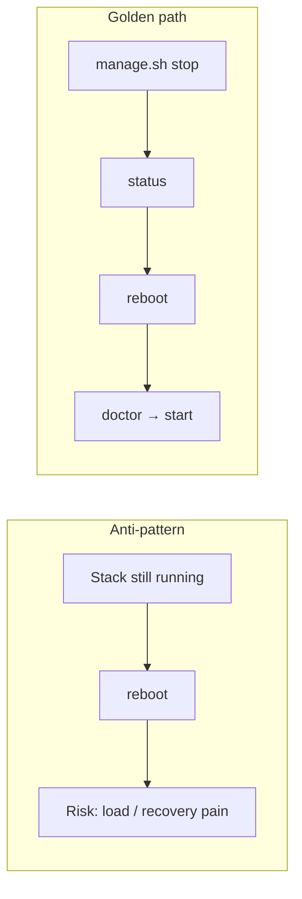
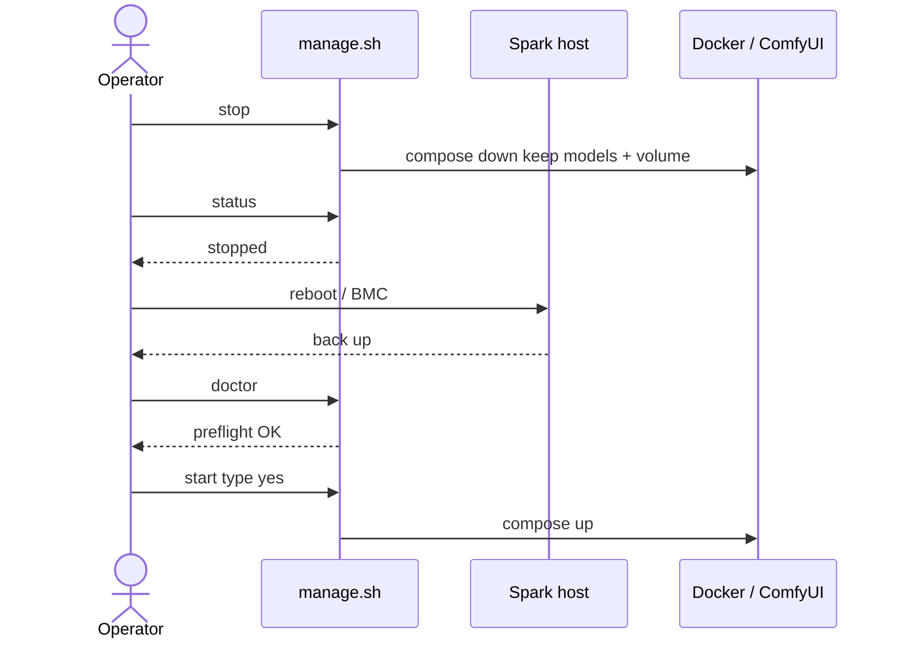
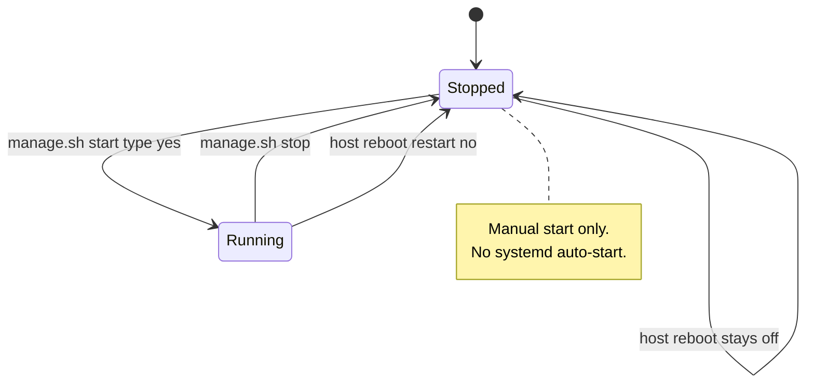
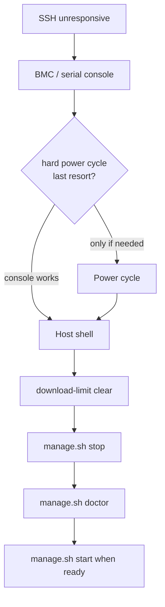

# Reboot Safety

**What's on this page**

- Golden rule and recommended sequence
- Why containers do not auto-return after reboot
- Recovery when SSH is already unresponsive

**What this enables**

- Rebooting a Spark without losing SSH recoverability or corrupting long downloads

## Golden rule

**Never reboot with the heavy ComfyUI stack still running.**



## Sequence

1. From your workstation / SSH session:

   ```bash
   ./scripts/manage.sh stop
   ./scripts/manage.sh status
   ```

2. Reboot the node (`sudo reboot` or out-of-band BMC).

3. After boot, verify Docker and GPU:

   ```bash
   ./scripts/manage.sh doctor
   ```

4. Only then start again:

   ```bash
   ./scripts/manage.sh start
   ```



## Why containers do not return

Compose uses `restart: "no"`. There is no systemd unit that auto-starts this demo. That is intentional.



## If SSH is already unresponsive

- Use BMC / serial console  
- Hard power cycle only as last resort  
- After recovery: `download-limit clear`, `manage.sh stop`, then doctor  


