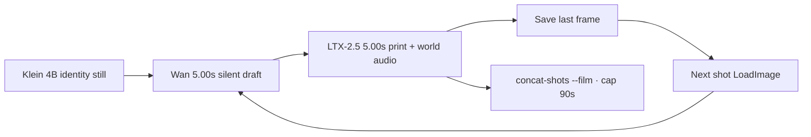

# 90s shorts

**What's on this page**

- Why 18 × 5.00s shots instead of one 90s Queue
- Which US-safe models do identity, rehearsal, and print
- Shot maps for go-see, still-here, and switchyard
- Operator loop: Klein still → Wan draft → LTX print → concat
- Spark farm: parallel 5s Queues, local concat

**What this enables**

- Three continuous ~90s films (go-see, still-here, switchyard) on the **US-safe local pack**
- Last-frame continuity without a 90s denoise
- A 90.00s publish cap (`ffmpeg -t 90`)

!!! warning "Not legal advice"

    LTX-2.5 is the audio model and is **not Apache**. Community License: free commercial under **$10M COMPANY** annual revenue (affiliates count); disclose AI-generated media; do not strip provenance; do not distill. Wan 2.2 TI2V-5B is Apache 2.0 and silent. See [Model licenses](licenses.md).

---

## Why not one 90s graph

Default lab graphs iterate in **minutes**. A 90s (or 30–60s) denoise on GB10 is the wrong default.

Continuity is **last frame of shot N → LoadImage of shot N+1**. Each micro-shot is independent:

| | |
| --- | --- |
| Micro-shot | **120 frames @ 24 fps = 5.00 s** |
| Beats | **6** (same places as the old six-column films) |
| Micro-shots per beat | **3** (enter / traverse / exit) |
| Picture | **18 × 5.00 s = 90.00 s** |
| Publish | `concat-shots.sh --film … --yes` → ffmpeg **`-t 90`**; fail if probe `> 90` |

Do **not** Queue 90s, 241+ frames, or a single-graph film. If a latent widget errors on even length, you may set **121** (4n+1 / 8n+1) on that shot and still concat with the 90s cap.



---

## Models (US-safe local pack only)

| Job | Graph | Model | License |
| --- | --- | --- | --- |
| Identity still | `workflows/shorts/{film}-90s-lab-example.json` | Klein 4B distilled FP8 | Apache 2.0 |
| Motion rehearsal | `workflows/shorts/bridge-wan-lab-example.json` | Wan 2.2 TI2V-5B I2V | Apache 2.0, silent |
| Print + synced world audio | `workflows/shorts/bridge-ltx-lab-example.json` | LTX-2.5 distilled I2V | Community License (not Apache) |

Deliverable MP4s are **LTX I2V heroes** (breath, world objects, **no score**). Wan is the cheap motion draft — skip it and Queue LTX only if you already like the camera.

LTX-2.5 native multishot (several cuts in one 5–10s clip) is an optional experiment **inside** a beat, not the 90s path.

---

## Operator loop

Host JSON lives under `workflows/shorts/`. The container entrypoint copies `*.json` and `shorts/*.json` into Comfy `user/default/workflows/`.

1. Load the film bible (`go-see-90s-lab-example` / `still-here-90s-lab-example` / `switchyard-90s-lab-example`). Queue the Klein identity still (`ez_<slug>_identity`).
2. Load **bridge-wan-lab-example**. Set LoadImage to that PNG (shot 1) or the previous `ez_<slug>_bN_sM_last`. Paste **Motion** from the on-canvas shot map (source of truth: `{film}.shots.yaml`). Set VHS prefix `ez_<slug>_bN_sM_wan_video` and last-frame SaveImage `ez_<slug>_bN_sM_last`. Queue **5.00s** silent.
3. Load **bridge-ltx-lab-example**. Same first frame. Paste **Motion + audio**. VHS prefix `ez_<slug>_bN_sM_ltx_video`. Queue **5.00s** AV.
4. Repeat 18 times. Last frame of shot N is LoadImage of shot N+1.
5. Concat (dry-run first; `--yes` writes the cap):

```bash
./scripts/utilities/concat-shots.sh --film go-see --dry-run
./scripts/utilities/concat-shots.sh --film go-see --yes
```

Publish names under `COMFY_OUTPUT_DIR` (default `/mnt/comfy-output`): `ez_gosee_90s.mp4`, `ez_stillhere_90s.mp4`, `ez_switchyard_90s.mp4`.

YouTube: disclose AI-generated media (LTX term). Do not strip provenance.

---

## Shot maps

First-person **go-see** is **camera language**, not licensed IP. Same SFW / no unlicensed marks / no real likenesses as the rest of the stack.

=== "go-see"

    POV travel. Identity lock: olive windbreaker + worn black gloves in frame. Parkour is transportation. **No score** (breath + world).

    | Beat | Place | s1 enter | s2 traverse | s3 exit |
    | --- | --- | --- | --- | --- |
    | 1 | Dawn rooftop | Hands on wet tar, vault parapet | Barrel-roll through sky | Land-roll on warehouse roof |
    | 2 | Warehouse → market | Ladder drop | Pallet vault, awning | Run out toward river |
    | 3 | River / forest | Stones, splash | Through bridge arch | Creek jump in beech |
    | 4 | Headland | Trees thin | Boulder plant | Generic white lighthouse, no place name |
    | 5 | Wall / meadow | Granite steps | Squeeze dry-stone gap | Burst into meadow |
    | 6 | Ridge hold | Hands on wooden rail | Look | Quiet laugh, hold |

=== "still-here"

    Third-person household morning. Identity lock: plain ceramic mug. Invented two-note child-hum (no real-child first frame, no licensed music).

    | Beat | Place | Notes |
    | --- | --- | --- |
    | 1 | Kitchen, first light | Kettle, pour, mug, hum off-screen |
    | 2 | Table | Steam, hum closer, doorway |
    | 3 | Hands on mug | Motif answers, house creak |
    | 4 | Living room | Sun bar, silhouette in the next doorway |
    | 5 | Doorway | Silhouette only — no close-up identity |
    | 6 | Table hold | Empty chair, last hummed note, house quiet |

=== "switchyard"

    Night freight yard. Identity lock: rain, ballast, generic unmarked boxcars, yard lamp. No railroad company marks.

    | Beat | Place | Notes |
    | --- | --- | --- |
    | 1 | Gravel walk | Rain, lamps, stop between first unmarked cars |
    | 2 | Between cars | Gloves on a rusty ladder rail, coupling clank |
    | 3 | Ladder | Climb in the rain, roof edge |
    | 4 | Roof walk | Distant generic horn — not a real carrier identity |
    | 5 | Drop to gravel | Window glow, no readable sign |
    | 6 | Lamp hold | Look down the dark string of cars, quiet laugh |

Prefixes: `ez_gosee_b{1..6}_s{1..3}`, `ez_stillhere_…`, `ez_switchyard_…`. Machine-readable lists: `workflows/shorts/*.shots.yaml`.

---

## Spark farm

Three Sparks can Queue **different beats** in parallel (independent 5s jobs, shared `/mnt/models`). Concat stays on one host. No NCCL. See [Spark farm](spark-farm.md).

---

## Safety

Unchanged: `restart: "no"`, heavy confirm on `start`, headroom preflight, download-limit wrap. This path does not start Docker; it only stitches files already under `COMFY_OUTPUT_DIR`.
