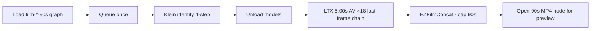

# 90s shorts

**What's on this page**

- Why 18 × 5.00s shots instead of one 90s denoise
- One-click Comfy graph per film (Klein identity + 18 LTX prints + stitch)
- Shot maps for go-see (first-person running), still-here, and switchyard
- Model-native Klein / LTX prompts ([Prompting](prompting.md))
- Spark farm: optional parallel 5s Queues, local concat
- Shot resume, OTIO export, NVENC proxies, take-promote, Fun InP / SeedVR2 opt-in
- Optional studio-ui board (`:8190` profile), LTX Director GPL clone, OpenCut MIT embed
- Optional 3D sidecars (TRELLIS.2, DA3-BASE, host Blender / SuperSplat) and VACE join

**What this enables**

- Three continuous ~90s films (first-person running go-see, still-here, switchyard) on the **US-safe local pack**
- Last-frame continuity without a 90s denoise
- A 90.00s publish cap (in-graph `EZFilmConcat`, or host `ffmpeg -t 90`)
- One Queue per film — identity, 18 prints, stitch, preview, save

!!! warning "Not legal advice"

    LTX-2.5 is the audio model and is **not Apache**. Community License: free commercial under **$10M COMPANY** annual revenue (affiliates count); disclose AI-generated media; do not strip provenance; do not distill. Wan 2.2 TI2V-5B is Apache 2.0 and silent. See [Model licenses](licenses.md).

---

## Why not one 90s latent

Default lab graphs iterate in **minutes**. A 90s (or 30–60s) **denoise** on GB10 is the wrong default — keep widgets at **120 frames**.

The one-click film graph still prints **18 independent 5.00s latents**. Continuity is **last frame of shot N → start image of shot N+1**. One Queue runs them in order because each printer depends on the previous last frame.

| | |
| --- | --- |
| Micro-shot | **120 frames @ 24 fps = 5.00 s** |
| LTX print size | **1280×704** (VAE ÷32; not 1280×720) |
| Klein identity | **1280×704** (same VAE grid as LTX; do not feed 720) |
| Beats | **6** |
| Micro-shots per beat | **3** (enter / traverse / exit) |
| Picture | **18 × 5.00 s = 90.00 s** |
| Publish | in-graph **EZFilmConcat** (or `concat-shots.sh --film … --yes`) → ffmpeg **`-t 90`**; fail if probe `> 90` |

Do **not** set 241+ frames or a single 90s latent. If a latent widget errors on even length, you may set **121** (4n+1 / 8n+1) on that shot and still concat with the 90s cap.



---

## Models (US-safe local pack only)

| Job | Where | Model | License |
| --- | --- | --- | --- |
| Identity still | Group **1. Identity (Klein)** | Klein 4B distilled FP8 | Apache 2.0 |
| Print + synced world audio | Groups **3–8** (beats) | LTX-2.5 distilled I2V | Community License (not Apache) |
| Stitch + preview | Group **9. Publish 90s MP4** | `EZFilmConcat` (ffmpeg AAC + YouTube loudnorm) | — |
| Optional silent rehearsal | `workflows/wan-i2v-shot-lab-example.json` | Wan 2.2 TI2V-5B I2V | Apache 2.0, silent |

One-click film files:

- `workflows/shorts/film-go-see-90s-run-lab-example.json`
- `workflows/shorts/film-still-here-90s-lab-example.json`
- `workflows/shorts/film-switchyard-90s-lab-example.json`

Deliverable MP4s are **LTX I2V heroes** (breath, world objects, **no score**) with audio muxed per shot via `LTXVAudioVAEDecode` → `VHS_VideoCombine`, then stitched. Wan is an optional cheap motion draft — skip it if you already like the camera.

LTX-2.5 native multishot (several cuts in one 5–10s clip) is an optional experiment **inside** a beat, not the 90s path.

---

## Operator loop

Each film graph ships **Klein identity + 18 LTX 5.00s printers + in-graph stitch**. Prompts are baked from `{film}.shots.yaml` (Klein `identity_look`, LTX `ltx_i2v`). The container entrypoint copies `*.json` and `shorts/*.json` into Comfy `user/default/workflows/`. Restart so `custom_nodes/ez_film` is copied with the other in-tree packs.

1. Load one film graph (`film-go-see-90s-run-lab-example` / `film-still-here-90s-lab-example` / `film-switchyard-90s-lab-example`).
2. Queue **once**. Klein runs first (Enhance **off**, 4-step). Models unload. Then 18 × **5.00s** LTX prints chain last-frame → next start. Leave LTX **1280×704**.
3. Wall-clock is 18 sequential 5s prints (tens of minutes to a couple of hours on GB10). That is expected, not a hang. Headroom preflight still applies at start.
4. After Queue, click **Save 90s film (MP4) — open node for preview**. File: `${COMFY_OUTPUT_DIR}/ez_<slug>_90s.mp4`. Per-shot files remain as `ez_<slug>_bN_sM_ltx_video_*.mp4`.
5. Optional silent rehearsal of one frame: **wan-i2v-shot-lab-example**. Optional single-shot iterate: **ltx-i2v-shot-lab-example**.
Shot-level resume lives under `${COMFY_OUTPUT_DIR}/films/<slug>/` (`state.json`, `shots/NN.mp4`). A dropped SSH session is not a two-hour requeue:

```bash
./scripts/utilities/compile-film.sh go-see
./scripts/manage.sh print-shot go-see 12
./scripts/manage.sh start && ./scripts/manage.sh film-resume go-see
# film-resume skips ok shots whose duration is 5.00±0.05 s and reprints
# crashed `running` rows (no MP4) only.
```

6. Host / spark-farm fallback (when you printed shots outside the one-click graph):

```bash
FILM=go-see   # or still-here | switchyard
./scripts/utilities/concat-shots.sh --film "${FILM}" --dry-run
./scripts/utilities/concat-shots.sh --film "${FILM}" --yes
# Optional audio acrossfade (0.10 s). Video stays stream-copy. LTX shots only
# (Wan-silent has no audio stream — --xfade refuses).
./scripts/utilities/concat-shots.sh --film "${FILM}" --xfade 10 --yes
# Listen to go-see with and without --xfade 10; default remains the hard-cut golden.

# OTIO handshake for Kdenlive/Shotcut (host, no GPU):
./scripts/manage.sh film-export-otio go-see
# NVENC proxies 960×528 ~2 Mbps (Comfy must be stopped):
./scripts/manage.sh stop
./scripts/manage.sh film-proxies go-see --yes
# Promote take 3 of shot 12 into the jobstore master:
./scripts/manage.sh take-promote go-see 12 3
```

Optional jobstore board (no GPU, 512m, `restart: "no"`). Default `start` does **not** launch it:

```bash
docker compose --profile studio-ui up studio-ui
# http://localhost:8190
```

LTX Director is a **GPL** clone into the Comfy volume, not this MIT tree:

```bash
LAB_ENABLE_LTX_DIRECTOR=1 ./scripts/manage.sh start
```

Refuse MiniMax H3 Director. OpenCut (`jtydhr88/ComfyUI-OpenCut`, MIT) is fail-soft. Not the OpenCut Rust rewrite, not Next.js+Postgres.

ACE-Step 90 s bed → `manage.sh stop` / unload → LTX A2V freeze. Qwen3-TTS is opt-in with operator-owned refs (`download-podcast --tier qwen3tts`); empty refs stay Kokoro. Wire **EZFilmDisclosure** on the publish graph (LTX Community License end-card).

Official LTX-2.5 quality/control graphs (two-stage DFR, A2V freeze, IC-LoRA) live in Comfy **Templates → LTX-2.5**. Repo note: `workflows/quality/ltx-2.5/NOTICE.md`. Lab printers stay 5.00 s.

Optional silent **first-last-frame** draft: `wan-flf-5s-lab-example` after `./scripts/utilities/download-wan.sh run --tier fun-inp` (~47 GB, Apache). Unload LTX first. MagCache is **draft-only** on `wan-i2v-5s-lab-example` (`extra.lab_magcache`; never on LTX heroes).

Post-concat restore (opt-in Apache SeedVR2-3B):

```bash
./scripts/manage.sh stop
./scripts/manage.sh download-restore --tier seedvr2-3b
# Conservative 1.3–1.5× on the stitched master only. Not download-models.
```

Optional 17-frame VACE join (`1+8n`, MagCache **off**). Unload LTX first:

```bash
./scripts/utilities/download-wan.sh run --tier vace
# load wan-vace-join-lab-example (Shot A last → Shot B first)
```

Host 3D sidecars (Comfy **must be stopped**): [Studio sidecars](studio-sidecars.md), [Blender](blender-gb10-sidecar.md), [SuperSplat](splat-sidecar.md).

```bash
./scripts/manage.sh stop
./scripts/manage.sh download-3d --tier trellis2   # or da3-base | all
./scripts/manage.sh blender                       # host binary; never in Dockerfile
```

NVENC preview encode (Comfy **must be stopped** — encoder contention on GB10):

```bash
./scripts/manage.sh stop
./scripts/utilities/nvenc-preview.sh --in "${COMFY_OUTPUT_DIR}/ez_gosee_90s.mp4" \
  --out "${COMFY_OUTPUT_DIR}/ez_gosee_90s_preview.mp4" --yes
```

Publish names under `${COMFY_OUTPUT_DIR}` (default `/mnt/comfy-output`): `ez_gosee_90s.mp4`, `ez_stillhere_90s.mp4`, `ez_switchyard_90s.mp4`.

YouTube: disclose AI-generated media (LTX term). Do not strip provenance.

---

## Shot maps

First-person **go-see** is **camera language**, not licensed IP. Same SFW / no unlicensed marks / no real likenesses as the rest of the stack.

=== "go-see"

    First-person **running**. Identity lock: olive windbreaker + worn black gloves in frame. Footfalls and arms, not parkour. **No score** (breath + world).

    | Beat | Place | s1 enter | s2 traverse | s3 exit |
    | --- | --- | --- | --- | --- |
    | 1 | Dawn rooftop | Run on wet tar, gloves pumping | Run across the next roof | Run onto warehouse roof |
    | 2 | Warehouse → market | Run down the stair | Run the alley, duck awning | Run out toward river |
    | 3 | River / forest | Run across stones | Run through bridge arch | Run the creek path |
    | 4 | Headland | Trees thin, keep running | Run past boulder | Run toward generic lighthouse |
    | 5 | Wall / meadow | Run up granite steps | Run through dry-stone gap | Run into meadow |
    | 6 | Ridge hold | Slow; hands on wooden rail | Look | Quiet laugh, hold |

=== "still-here"

    Third-person household morning. Identity lock: plain ceramic mug. Invented two-note child-hum (no real-child first frame, no licensed music).

    | Beat | Place | Notes |
    | --- | --- | --- |
    | 1 | Kitchen, first light | Kettle, pour, mug, hum off-screen |
    | 2 | Table | Steam, hum closer, doorway |
    | 3 | Hands on mug | Motif answers, house creak |
    | 4 | Living room | Sun bar, silhouette in the next doorway |
    | 5 | Doorway | Silhouette only — no close-up identity |
    | 6 | Table hold | Empty chair, last hummed note, house quiet |

=== "switchyard"

    Night freight yard. Identity lock: rain, ballast, generic unmarked boxcars, yard lamp. No railroad company marks.

    | Beat | Place | Notes |
    | --- | --- | --- |
    | 1 | Gravel walk | Rain, lamps, stop between first unmarked cars |
    | 2 | Between cars | Gloves on a rusty ladder rail, coupling clank |
    | 3 | Ladder | Climb in the rain, roof edge |
    | 4 | Roof walk | Distant generic horn — not a real carrier identity |
    | 5 | Drop to gravel | Window glow, no readable sign |
    | 6 | Lamp hold | Look down the dark string of cars, quiet laugh |

Prefixes: `ez_gosee_b{1..6}_s{1..3}`, `ez_stillhere_…`, `ez_switchyard_…`. Machine-readable lists: `workflows/shorts/*.shots.yaml` (`identity_look` for Klein, `ltx_i2v` for each print).

---

## Spark farm

The one-click film graph is **sequential on one host**. Three Sparks can still Queue **different beats** in parallel as independent 5s jobs (shared `${MODELS_DIR}`) on **ltx-i2v-shot-lab-example**. Concat stays on one host (`concat-shots.sh --film`). `spark-farm.sh run --film go-see` prints that Queue reminder (it does not POST graphs). No NCCL. See [Spark farm](spark-farm.md).

---

## Safety

Unchanged: `restart: "no"`, heavy confirm on `start`, headroom preflight, download-limit wrap. The film path does not start Docker. One Queue is long because it runs 18 × 5.00s prints, not because it allocated a 90s latent. Peak VRAM is one LTX 5s print after Klein unloads — do not weaken headroom preflight.
