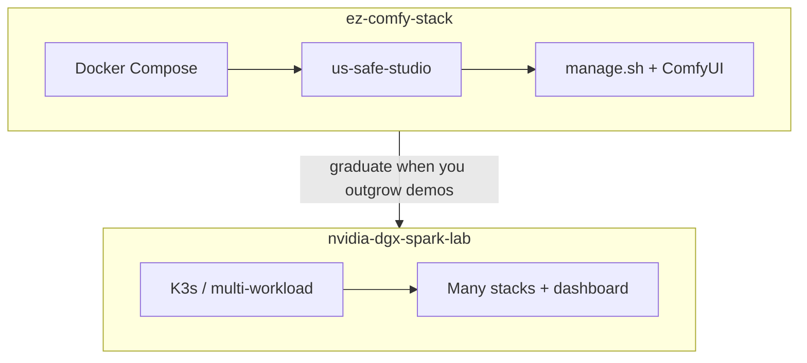

# When to use ez-comfy-stack vs spark-lab

**What's on this page**

- **Compose demo vs K3s lab** - what each repo is for
- **What this sample stack refuses** - K3s, a full dashboard, NCCL-as-a-feature, MiniMax H3
- **Independent Sparks** may share `${MODELS_DIR}`; still **no NCCL**
- **How to graduate** without rewriting this tree into the lab

**What this enables**

- **Picking** the repo that matches one-box stills / 5 s prints vs long-term multi-workload ops
- **Avoiding** a "just add K3s" PR in ez-comfy-stack
- **Sharing** one weight copy across Sparks without pretending it is tensor-parallel

```bash
export SPARK_HOST="${SPARK_HOST:-127.0.0.1}"
export SPARK_USER="${SPARK_USER:-$USER}"
export MODELS_DIR="${MODELS_DIR:-/mnt/models}"
export COMFY_OUTPUT_DIR="${COMFY_OUTPUT_DIR:-/mnt/comfy-output}"
export COMFY_PORT="${COMFY_PORT:-8188}"
export DOWNLOAD_LIMIT="${DOWNLOAD_LIMIT:-auto}"
```

ez-comfy-stack is the **sample / demo** Compose studio. [nvidia-dgx-spark-lab](https://github.com/toxicoder/nvidia-dgx-spark-lab) is the long-term lab. Architecture of this repo: [Architecture](../learn/architecture.md).

---

## Compose demo vs K3s lab

| | **ez-comfy-stack** (this repo) | **nvidia-dgx-spark-lab** |
| --- | --- | --- |
| **Runtime** | Docker Compose (`restart: "no"`) | K3s / multi-workload |
| **GPU job** | One GB10 denoise or sidecar (occupancy XOR) | Lab stacks + dashboard |
| **Weights** | Host `${MODELS_DIR}` (default `/mnt/models`) | Same cache convention; shareable |
| **UI** | ComfyUI `${COMFY_PORT}` (8188) | Many services |
| **Clustering** | Independent Comfy workers + one weight copy | Tensor-parallel / NCCL belongs **there** |
| **Scope** | Klein 4B -> Wan 2.2 5 s -> LTX-2.5 AV demo | Long-term ops |



<Callout type="warning" title="This repo must not grow K3s">
  Do not pull K3s, a full dashboard, or in-tree NCCL into ez-comfy-stack. Bazelisk is the contributor test/lint/docs entry point only. Point long-term cluster users at nvidia-dgx-spark-lab. Independent Sparks may still **share `${MODELS_DIR}`**; that is NFS/rsync, **not** NCCL.
</Callout>
---

## Independent Sparks, still no NCCL

Three boxes can Queue **independent** 5 s Wan/LTX shots against the same `${MODELS_DIR}` (NFS over the 200 GbE fabric, or `spark-farm.sh sync-models` rsync). Each node types **yes** on its own `./scripts/manage.sh start`. `spark-farm.sh` **never** remote-starts Compose.

That is **throughput + one weight copy**, not slicing one sampler across three GB10s. MiniMax H3 is banned ([licenses](../licenses.md)). Runbook: [Spark farm](../spark-farm.md). Occupancy stays per node: [Occupancy](../occupancy.md).

---

## Stay here when

- You want Klein 4B stills, Wan 2.2 silent 5 s, and LTX-2.5 AV on **one** Spark
- You accept occupancy XOR (one heavy GPU job)
- You want `restart: "no"`, headroom 28 GiB, and download-limit wrap
- You might share `${MODELS_DIR}` across Sparks without a cluster control plane

## Graduate when

- You need K3s, multi-workload scheduling, or a lab dashboard
- You need tensor-parallel LLMs / NCCL across GB10s
- You have outgrown a Compose demo

Safety on this path does not change: `restart: "no"`, type **yes** on `start`, headroom preflight, download-limit clear-on-exit.
