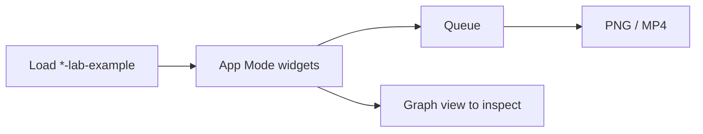

# ComfyUI Apps

**What's on this page**

- How App Mode relates to the node graph
- Apps sidebar (`.app.json`) vs Workflows
- Creator widgets: Prompt, Style, Rewrite prompt, Seed (unique labels, wired LoadImage only)
- Occupancy (one GB10 job) — chip at the top of the widget list
- Lane A (Inspire) vs Lane B (Produce)
- Handoff chains (still → motion → AV)

**What this enables**

- Opening a lab graph from Comfy’s **Apps** sidebar, not only Workflows
- Queueing a lab graph from creator widgets instead of hunting the canvas
- Knowing which App to stop before you load the next one
- Following Spark Still → Hero → Silent 5s → AV 5s without renaming files

**Who this is for:** studio users after `klein-still-draft-lab-example` has been loaded once.

Lab graphs are still the same host `*-lab-example.json` files. On `start` they seed into Comfy as `*.app.json` when App Mode is the default view, so they appear under **Apps** as well as **Workflows**. [App Mode](learn/comfyui.md#graph-and-app) is a widget surface on that JSON (ComfyUI frontend **1.41.13+**). It is **not** a second frontend and not `studio-ui`. A small occupancy chip sits at the top of the App widget list (under the menu if you are in graph view) and shows which family is running, still N of M on multi-plate Apps, and the next handoff. It does not cover Run. Restart the container after a pull so `custom_nodes/ez_studio_app` is copied.

---

## Graph vs App

| Surface | What you edit | When |
| --- | --- | --- |
| **App** | Unique creator widgets: **Prompt**, **Style** (`none` = off), **Rewrite prompt**, then **Seed**. **Start image** only when that LoadImage is wired (I2V, character tweak, clay). Style is hidden on I2V (the start frame owns look). Size and UNET only on **klein-still-daily**. Music adds duration + vocal/instrumental; podcast adds bed length + Kokoro stock voices; dub adds source, rights, and target language. Duplicate widgets get distinct labels (Klein prompt / Wan prompt, Beat 1 enter, Bed tags). | Daily Queue |
| **Graph** | Groups, bypass (Ctrl+B), VHS preview, UNET/CLIP/VAE, hidden shot cards, unwired placeholders (Fun InP end frame, VACE shot B), voice-clone refs | Debug, film one-click, unused plates |

Official persist is `extra.linearData` (`inputs` / `outputs`). Each input is `[nodeId, widgetName, config?]` with an **integer** node id. ComfyUI frontend **1.49.6+** (the v0.34.6 pin) upgrades that to a live `graphId:nodeId:name` WidgetId at load. Do **not** persist `"11:prompt"` two-part ids — the frontend treats a colon as a subgraph locator and drops the widget, leaving App view with Run and occupancy but no Prompt. The lab contract is `extra.lab_app_mode` (`lane`, `occupancy`, `handoff`, `frontend_min`). Do not require `extra.linearMode` — upstream does not write it.

Comfy’s **Apps** sidebar lists files whose name ends in `.app.json`. On `start`, the entrypoint seeds every App Mode graph (`default_view: app`) as `_lab/<lane>/*-lab-example.app.json`. The same stem still appears under **Workflows** in that folder. 90s film graphs stay `default_view: graph` (too many widgets) and keep the `.json` suffix — App Mode is still **enabled**, but they stay Workflows-only. Folders do not add `workflows/apps/`.

Filenames: [Workflow catalog](studio-workflows.md). Playbook: [Still to motion to AV](visual-generative-ai.md). Restart the container after a pull so the `.app.json` copy runs.

---

## Occupancy

One GB10 job. Cover art ≠ film ≠ podcast. Every App Note includes a one-line occupancy stanza.

| Occupancy | Allowed | Must be stopped |
| --- | --- | --- |
| `none` / `llm` | Prompt Forge, Beat Sheet | nothing GPU |
| `klein` | still Apps + Platform Pack | Wan, LTX, podcast, music |
| `wan` | silent 5 s / GIF / bumper | LTX, podcast, music |
| `ltx` | any AV 5 s | Wan, podcast, music, other LTX |
| `film` | 90 s one-click | everything else on that Spark |
| `audio` | podcast / dub / rap | Klein / Wan / LTX session |

Prompt Enhance GGUF stays CPU-only (`n_gpu_layers=0`). Sidecar occupancy (Comfy XOR Blender) is unchanged: [Studio sidecars](studio-sidecars.md).

---

## Lane A — Inspire

Explore identity, cameras, and world bibles. Occupancy **klein** unless noted.

| App | What it does |
| --- | --- |
| **klein-still-draft-lab-example** | Spark Still. 768×432, seed 42, Enhance on. Prefix `ez_still_draft` |
| **klein-identity-sheet-lab-example** | Front / three-quarter / profile. 1280×704, Enhance on (identity mode) |
| **klein-storyboard-6up-lab-example** | Six new cameras of one scene (`ez_board_01`…`06`) |
| **klein-dream-house-lab-example** | Virtual tour. Ten 4:5 stills of **one place**, one room or angle each (tower, foyer, rooms, terrace, drone, study; default placeholder is a full-floor penthouse in a dense city) |
| **klein-dream-house-clay-lab-example** | Same walkthrough as Klein edit of clay plates (`ez_house_clay_01`…`10`). `start` seeds LoadImage; optional `house-views` dump. Prefix `ez_dream_house_clay_01`…`10` |
| **klein-style-lock-lab-example** | One place, four cameras |
| **klein-lighting-trio-lab-example** | Same subject, three lights |
| **klein-camera-angles-lab-example** | Wide / medium / close |
| **klein-color-moods-lab-example** | Warm plate plus three grades |
| **klein-time-of-day-lab-example** | Dusk plate, then dawn / noon / night |
| **klein-hook-still-lab-example** | Vertical 9:16 first-frame hook (`ez_hook_still`) |
| **klein-character-draft-lab-example** | Character still. Prompt + style, 1024×1280, prefix `ez_character` |
| **klein-character-tweak-lab-example** | Edit that still. LoadImage + change prompt, ReferenceLatent, prefix `ez_character_tweak` |
| **prompt-forge-lab-example** | No UNET. Klein + Wan + LTX enhance preview. Occupancy **llm** (CPU GGUF) |
| **beat-sheet-lab-example** | Script desk. Logline, audio policy, 18 cards (`action \| camera \| world SFX \| dialogue`). `shot-sheet` writes `films/<slug>/shots.yaml`. Occupancy **none** |

---

## Lane B — Produce

Ship plates and ~5 s clips. Hide UNET/CLIP/VAE except **klein-still-daily** (swap table).

| App | Occupancy | Prefix / output |
| --- | --- | --- |
| **klein-still-daily-lab-example** | klein | `ez_still_app` — click UNET to swap distilled / NVFP4 / base |
| **klein-still-hero-lab-example** | klein | `ez_still_hero` — 1280×704 LTX feeder |
| **klein-thumbnail-lab-example** | klein | `ez_thumbnail` 1280×720 |
| **klein-ig-square-lab-example** | klein | `ez_ig_square` 1:1 |
| **klein-og-blog-lab-example** | klein | `ez_og` 1216×640 |
| **klein-banner-wide-lab-example** | klein | `ez_banner` ~3:1 |
| **klein-shorts-still-lab-example** | klein | `ez_shorts_still` 432×768 |
| **wan-i2v-5s-lab-example** | wan | Silent 5 s, 121 frames, MagCache draft-only |
| **wan-gif-loop-lab-example** | wan | 49-frame ping-pong GIF |
| **ltx-i2v-5s-lab-example** | ltx | AV 5 s, 1280×704 |
| **ltx-hook-av-lab-example** | ltx | AV cold open |
| **klein-platform-pack-lab-example** | klein | Six plates from one identity (`ez_pack_thumb` / ig / portrait / shorts / og / banner). Ctrl+B unused groups |

Creator plates (packshot, end-card, quote, food, bumper, B-roll, orbit, …) stay in the [catalog](studio-workflows.md). Klein stills may use 1280×720; LTX feeders stay **1280×704**.

Audio Apps (`podcast-*`, `dub-*`, `music-rap-*`, **audio-finish-lab-example**) are occupancy **audio**. That includes the fifteen **180 s** `music-rap-nill-bye-*-lab-example` diss takes under `_lab/audio/nill-bye/` ([Local music](music.md)). Graph outputs stay FLAC + MP3. Mux a still for YouTube with `./scripts/manage.sh audio-still-video --audio FILE --image FILE` (host ffmpeg; compose may stay up). Film `film-*-90s-*-lab-example` is occupancy **film**. DCC: [DCC guide pack](dcc-workflows.md). Clay-to-finish playbook: [Clay to finish](learn/clay-to-finish.md).

---

## Handoff chains

| From | To |
| --- | --- |
| Spark Still | Hero Still → Silent 5s (`wan-i2v-5s`) → AV 5s (`ltx-i2v-5s`) |
| Spark Still | Platform Pack (`klein-platform-pack`) → Silent 5s / Hook AV |
| Character Draft | Character Tweak → Identity Sheet → Silent 5s |
| Hook Still | `wan-shorts-i2v` → `ltx-shorts-i2v` |
| Storyboard 6-up | `wan-i2v-shot` / `ltx-i2v-shot` |
| Beat sheet (script desk) | `shot-sheet` → identity sheet / clay dump / `klein-from-clay` |
| Klein-from-clay | `overlay-qc` → `ltx-iclora-depth` → `audio-finish` / `stem-mix` |
| World bible (dream-house) | Loop kit (GIF / bumper / sticker) |
| Clay dream-house | `start` (or `house-views` dump) → **klein-dream-house-clay-lab-example** → same loop kit |

Set I2V **LoadImage** to the still prefix you just saved (`ez_still_draft_*.png`, `ez_hook_still_*.png`, …). I2V graphs also Queue on Comfy’s `example.png`.

Do **not** Queue Wan and LTX in the same session. Stop the other occupancy first.

!!! warning "Do not weaken"

    `restart: "no"`, type **yes** on start, headroom, and download-limit are unchanged. Apps do not add `workflows/apps/`. Optional graphs live under `_lab/optional/`. App Mode graphs seed as `*.app.json` inside `_lab/<lane>/`, not as a second tree.
