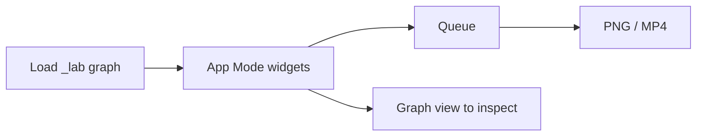

# ComfyUI Apps

**What's on this page**

- How App Mode relates to the node graph
- Apps sidebar (`.app.json`) vs Workflows
- Where operator Apps persist (`_user/`; explicit lab Save or duplicate only)
- Creator widgets: Quality (Lab / Draft / High / Free Commercial Use), Prompt, Style, Rewrite prompt, Rewrite negative (stays on so the negative cannot fight the final positive; one toggle per family), Seed (unique labels, wired LoadImage / LoadAudio)
- Occupancy (one GB10 job) — chip at the top of the widget list, plus App summary and Quality caption. Minimize it to a corner pill or close it; a closed chip returns as a pill on the next run or App load. The choice is remembered in this browser.
- Lane A (Inspire) vs Lane B (Produce)
- Handoff chains (still → motion → AV)

**What this enables**

- Opening a lab graph from Comfy’s **Apps** sidebar, not only Workflows
- Queueing a lab graph from creator widgets instead of hunting the canvas
- Knowing which App to stop before you load the next one
- Following Spark Still → Hero → Silent 5s → AV 5s without renaming files

**Who this is for:** studio users after `stills/still-draft` has been loaded once.

Lab graphs are the host `_lab/<lane>/*.json` files (folder-scoped ids). On `start` they seed into Comfy as `*.app.json` when App Mode is the default view, so they appear under **Apps** as well as **Workflows**. [App Mode](learn/comfyui.md#graph-and-app) is a widget surface on that JSON (ComfyUI frontend **1.41.13+**). It is **not** a second frontend and not [`studio-ui`](reference/studio-ui.md). A small occupancy chip sits at the top of the App widget list (under the menu if you are in graph view) and shows which family is running, a one-line summary of what the App does (`extra.lab_description`), the active Quality overlay, still N of M on multi-plate Apps, and the next handoff. Widget help text wraps so the full description stays readable. It does not cover Run. **Minimize** collapses the chip to an **App · family** pill (click the pill to expand). **Close** hides it until the next run or App load, when it returns as that pill. The choice is stored in this browser. Restart the container after a pull so `custom_nodes/ez_studio_app` is copied.

---

## Graph vs App

| Surface | What you edit | When |
| --- | --- | --- |
| **App** | Unique creator widgets. When the graph needs a still, **Start image** (or **First frame** / **Last frame**) is first so Queue cannot hide a missing file. Then **Quality** (Lab / Draft / High), **Sample prompt** (30 lab recipes + **Custom**), **Prompt**, **Format / platform** (on Apps that own a canvas), **Output size** (Match input uses a loaded still's aspect; Force format keeps the Format pick), **Duration** (LTX 5/8/10/12 s, default 8 s; Wan stays 5 s), **Style** (`none` = off), **Rewrite prompt**, then **Seed**, then Width / Height (and Batch on Klein stills). Format sets pixels and Rewrite prompt framing; Custom uses the size widgets (Klein ÷16, Wan ÷16, LTX ÷32 — pick **LTX · 16:9 YouTube (1280×704)**, never type 720). Filename / LoadImage / LoadAudio widgets upload a file or choose one already on the output disk. **Start image** only when that LoadImage is wired (I2V, talking-head, character tweak, clay, text-swap). Optional references use the same picker and may stay empty. **motion/av/first-last-8s** exposes **First frame** and **Last frame**. **motion/av/audio-to-video-8s** exposes **Audio file**. **motion/av/clip-chain** keeps Start image first, then Quality, Sample prompt (Beat 1), four **Beat N prompt** boxes, Format, Output size (Match input), Duration (default 8 s), Describe image, shared Rewrite / Audio notes / Logline, Seed, then Width / Height (Custom only). Occupancy stays on the chip, not as an App combo. Style is hidden on I2V (the start frame owns look). **stills/still-studio** also adds **Look recipe**, Image model, and Steps / CFG — prefix follows Format. **stills/image-studio** adds **Mode category**, **Creator mode** (100 presets), Look recipe, Image model, Steps / CFG, and an optional example/reference still — prefix follows Creator mode. **stills/still-daily** keeps Image model + steps/CFG. Music adds duration + vocal/instrumental; podcast adds bed length + Kokoro stock voices; **audio/podcast/learn-episode** adds **Sources**, **Format**, and **Duration** (ACE bed stays 30 s and loops); dub adds source file + upload, optional URL, rights, and target language. Duplicate widgets get distinct labels (Klein prompt / Wan prompt, Beat 1 prompt, Bed tags). | Daily Queue |
| **Graph** | Groups, bypass (Ctrl+B), VHS preview, UNET/CLIP/VAE, hidden shot cards, unwired placeholders (Fun InP end frame, VACE shot B), voice-clone refs | Debug, film one-click, unused plates |

**Quality** is a workflow-global combo (`EZQuality`) near the top of `linearData` (first on graphs with no required still; second when a LoadImage picker leads). Changing Quality updates Steps / CFG / Image model in the open App (Vue-safe widget writes) and does not live-link other open tabs. Newly opened Apps default to the last named Quality you picked in this browser. Editing Steps, CFG, or Image model (or CLIP / VAE) selects **custom** and keeps those values — Queue will not re-overlay. **custom** also freezes the last overlay if you pick it yourself. **lab** restores authored widgets. Prompt / tags / lyrics edits Queue at every Quality; typing the box selects Sample prompt **custom** so the textarea is what encodes. Named qualities (draft / standard / high / Free Commercial Use / ultra / max) may swap UNET, CLIP, and VAE when those files are on disk. They never change size or length, and Quality is not `--tier quality`. **Free Commercial Use (\<$10M)** pins Apache Klein 4B (never 9B or FLUX.2-dev) and LTX-2.5 steps; on Klein stills with a generic 16:9 / 9:16 Format it retargets to the LTX feeder size (`1280×704` / `768×1280`). Wan / audio / trellis are no-ops for that choice. ultra/max may select opt-in Non-Commercial weights (gated, not YouTube-ok). Inspire desks (no UNET) still show the combo as a no-op.

Official persist is `extra.linearData` (`inputs` / `outputs`). Each input is `[nodeId, widgetName, config?]` with an **integer** node id. ComfyUI frontend **1.49.6+** (this stack pins **1.52.7** with v0.37.0) upgrades that to a live `graphId:nodeId:name` WidgetId at load. Do **not** persist `"11:prompt"` two-part ids — the frontend treats a colon as a subgraph locator and drops the widget, leaving App view with Run and occupancy but no Prompt. The lab contract is `extra.lab_app_mode` (`lane`, `occupancy`, `handoff`, `frontend_min`). Do not require `extra.linearMode` — upstream does not write it.

Comfy’s **Apps** sidebar lists files whose name ends in `.app.json`. On `start`, the entrypoint seeds every App Mode graph (`default_view: app`) as `_lab/<lane>/*.app.json`. The same stem still appears under **Workflows** in that folder. 90s film graphs stay `default_view: graph` (too many widgets) and keep the `.json` suffix — App Mode is still **enabled**, but they stay Workflows-only. Folders do not add `workflows/apps/`.

Filenames: [Workflow catalog](studio-workflows.md). Playbook: [Still to motion to AV](visual-generative-ai.md). Restart the container after a pull so the `.app.json` copy runs.

Save your own Apps under **`_user/`**. Duplicate a lab graph (App Forge, Save As `_user/`, or a new file under live `_lab/`) and it stays in `_user/`. A Save that overwrites live `_lab/<lane>/*.app.json` is rescued into `_user/_rescued/` on the next `start`. Catalog updates (pull + `start`) do **not** copy shipped `_lab` graphs into `_user/`. Re-open a rescued file — `_lab/` is the shipped catalog. If `_user/_rescued/` is already full of catalog clones from older starts, delete that folder (keep the rest of `_user/`).

---

## Occupancy

One GB10 job. Cover art ≠ film ≠ podcast. Every App Note includes a one-line occupancy stanza.

| Occupancy | Allowed | Must be stopped |
| --- | --- | --- |
| `none` / `llm` | Prompt Forge, Research Chat, Beat Sheet | nothing GPU |
| `klein` | still Apps + Platform Pack | Wan, LTX, podcast, music |
| `wan` | silent 5 s / GIF / bumper | LTX, podcast, music |
| `ltx` | any AV 8 s App | Wan, podcast, music, other LTX |
| `film` | 90 s one-click | everything else on that Spark |
| `audio` | podcast / dub / rap | Klein / Wan / LTX session |

Prompt Enhance GGUF stays CPU-only (`n_gpu_layers=0`). Sidecar occupancy (Comfy XOR Blender) is unchanged: [Studio sidecars](studio-sidecars.md). `export-guides` / `blender-stills` / `house-views` die if compose is up.

---

## Lane A — Inspire

Explore identity, cameras, and world bibles. Occupancy **klein** unless noted.

| App | What it does |
| --- | --- |
| **stills/still-draft** | Spark Still. Default 768×432; **Format / platform** retargets (YouTube, Shorts, …). Prefix `ez_still_draft` |
| **stills/identity-sheet** | Front / three-quarter / profile. 1280×704, Enhance on (identity mode) |
| **stills/storyboard-6up** | Six new cameras of one scene (`ez_board_01`…`06`) |
| **stills/dream-house** | Virtual tour. Ten 4:5 stills of **one place**, each a different room or view (tower, foyer, lounge, kitchen, dining, bedroom, bath, terrace, drone, study; default placeholder is a full-floor penthouse in a dense city) |
| **stills/dream-house-clay** | Same walkthrough as Klein edit of clay plates (`ez_house_clay_01`…`10`). `start` seeds LoadImage; optional `house-views` dump. Prefix `ez_dream_house_clay_01`…`10` |
| **stills/style-lock** | One place, four cameras |
| **stills/lighting-trio** | Same subject, three lights |
| **stills/camera-angles** | Wide / medium / close |
| **stills/color-moods** | Warm plate plus three grades |
| **stills/time-of-day** | Dusk plate, then dawn / noon / night |
| **stills/hook-still** | Vertical 9:16 first-frame hook (`ez_hook_still`) |
| **stills/character-draft** | Character still. Prompt + style, 1024×1280, prefix `ez_character` |
| **stills/character-tweak** | Edit that still. LoadImage + change prompt, ReferenceLatent, prefix `ez_character_tweak` |
| **inspire/prompt-forge** | No UNET. One Prompt + optional Context, then Klein / Wan / LTX / Z-Image / LongCat / DreamX enhance preview. Occupancy **llm** (CPU GGUF) |
| **inspire/cinema-rack** | No UNET. Pick cinematography axes (shot size, move, light, …) and splice Klein / Wan / LTX prompts. Occupancy **llm** (CPU GGUF). [Cinema Rack](create/cinema-rack.md) |
| **inspire/audio-rack** | No UNET. Pick audio/music axes (genre, tempo, drums, …) and splice ACE-Step tags / lyrics form. Occupancy **llm** (CPU GGUF). Do not load ACE-Step on this canvas. [Audio Rack](create/audio-rack.md) |
| **inspire/research-chat** | Creative-process chat with web search and sequential research subagents. Occupancy **llm** (CPU GGUF). Laptop agents: `research-mcp` |
| **inspire/app-forge** | No UNET. Clone a shipped lab graph into live `_user/` as a new App. Occupancy **llm** (CPU GGUF). Laptop agents: `studio-mcp`. [App Forge](create/app-forge.md) |
| **inspire/beat-sheet** | Script desk. Logline / script / audio policy / score pack into every card rewrite. 18 cards (`action \| camera \| world SFX \| dialogue`). `shot-sheet` writes `films/<slug>/shots.yaml`. Occupancy **none** |

---

## Lane B — Produce

Ship plates and ~5 s clips. Hide UNET/CLIP/VAE except **klein-still-daily**, **stills/still-studio**, and **stills/image-studio** (swap table).

| App | Occupancy | Prefix / output |
| --- | --- | --- |
| **stills/still-daily** | klein | `ez_still_app` — Format / platform + click UNET to swap distilled / NVFP4 / base |
| **stills/still-studio** | klein | Format / platform desk. Prefix follows Format (`ez_still_studio` when Custom). Default 1280×704 |
| **stills/image-studio** | klein | Universal still desk. **Iterate** (first control, off by default) does text-to-image, then edits that still. **This run** shows the values Queue will send. 100 creator modes + Format / platform + optional reference. Prefix follows Creator mode unless Iterate is on (`ez_iterate`). Default 1280×704 |
| **stills/still-hero** | klein | `ez_still_hero` — default 1280×704 LTX feeder; Format / platform retargets |
| **stills/thumbnail** | klein | `ez_thumbnail` 1280×720 |
| **stills/instagram-square** | klein | `ez_ig_square` 1:1 |
| **stills/open-graph** | klein | `ez_og` 1216×640 |
| **stills/banner-wide** | klein | `ez_banner` ~3:1 |
| **stills/shorts-still** | klein | `ez_shorts_still` 432×768 |
| **motion/silent/still-to-video-5s** | wan | Silent 5 s, 121 frames, MagCache draft-only |
| **motion/loops/gif-loop** | wan | 49-frame ping-pong GIF |
| **motion/av/still-to-video-8s** | ltx | AV 8 s, 1280×704 |
| **motion/av/clip-chain** | ltx | Four 8 s AV beats, last-frame continuity, `ez_clip_chain.mp4`. Prefix `ez_clip_b01`…`b04` |
| **motion/av/hook-av** | ltx | AV cold open |
| **motion/av/dialogue-8s** | ltx | Quoted speech + world SFX. Prefix `ez_ltx_dialogue` |
| **motion/av/multishot-8s** | ltx | Native multishot (named cuts). Prefix `ez_ltx_multishot` |
| **motion/av/product-hero** | ltx | Packshot I2V orbit. Prefix `ez_ltx_product` |
| **motion/av/first-last-8s** | ltx | First + last still → one AV take. Prefix `ez_ltx_flf` |
| **motion/av/audio-to-video-8s** | ltx | Freeze a ~8 s wav; mux original audio. Prefix `ez_ltx_a2v` |
| **stills/platform-pack** | klein | Six plates from one identity (`ez_pack_thumb` / ig / portrait / shorts / og / banner). Ctrl+B unused groups |
| **stills/text-swap** | klein | `ez_text_swap` — replace lettering, lock type/angle/look, match source size |
| **stills/background-swap** | klein | `ez_bg_swap` — replace backdrop, ground, and nearby set dressing; empty Flux.2 canvas; photo reference for place swaps; Cubic block world uses a block study and pastes people. Other/background character toggles |
| **stills/background-edit** | klein | `ez_bg_edit` — restyle the environment in place (cartoon, add/remove, weather); match source size. Other/background character toggles |

Creator plates (packshot, end-card, quote, food, bumper, B-roll, orbit, …) stay in the [catalog](studio-workflows.md). One hundred extra platform Apps live under `_lab/creator/` (YouTube channel art, IG 4:5, Pinterest 2:3, Twitch BRB, Spotify Canvas, merch mocks): [Creator pack](create/workflows-creator.md). Example chain: **creator/stills/instagram-portrait** → **creator/silent/instagram-story-loop** → **creator/av/instagram-reel-lifestyle**. Klein stills may use 1280×720; LTX feeders stay **1280×704**. Lab sizes match platform **aspect**; scale in an editor if a host wants more pixels.

Audio Apps (`audio/podcast/two-host-episode`, `audio/podcast/radio-drama`, `audio/podcast/learn-episode`, `dub-*`, `audio/music/rap-draft`, `audio/music/rap-full`, **audio/stem-mix**) are occupancy **audio**. Catalog albums live under `_lab/audio/albums/<artist>/<album>/` with numbered tracks, `cover.json` (klein), and `album.json` (zip). Outputs are FLAC + MP3 tagged with artist/album/title; optional cover is in the tags. One-go: `./scripts/manage.sh album-render --album nill-bye/peer-review`. Mux a still for YouTube with `./scripts/manage.sh audio-still-video --audio FILE --image FILE` (host ffmpeg; compose may stay up). Film graphs under `_lab/films/` are occupancy **film**. DCC Apps live under `_lab/dcc/` (lane **dcc**). Clay-to-finish playbook: [Clay to finish](learn/clay-to-finish.md). Blender stills + video: [Blender creator suite](learn/blender-creator.md).

---

## Lane DCC — clay desk

Block in host Blender (Comfy **down**), then Queue these Apps. Occupancy XOR with dumps is unchanged.

| App | Occupancy | What it does |
| --- | --- | --- |
| **dcc/clay-hero** | klein | Klein edit of guide `first.png`, 1280×704, prefix `ez_clay_hero` |
| **dcc/clay-plates** | klein | One clay still → hero 704 / packshot 1:1 / IG 4:5 / shorts 9:16 (`ez_clay_pack_*`) |
| **dcc/canny-hero** | klein | Klein edit of `canny.png`, 1280×704, prefix `ez_canny_hero` |
| **dcc/depth-control-8s** | ltx | Union Control envelope, depth from `depth.mp4` |
| **dcc/canny-control-8s** | ltx | Same envelope, canny from `canny.mp4` |
| **dcc/depth-control-shorts** | ltx | Depth envelope at **768×1280** |
| **dcc/first-last-from-guide** | wan | Fun InP `first.png` + `last.png` (opt-in `download-wan --tier fun-inp`) |
| **dcc/guide-still** | klein | In-canvas loaders + occupancy gate. Prefix `ez_guide_hero` |
| **dcc/depth-from-loader** | ltx | Envelope from loaders. MagCache off. Prefix `ez_iclora_guide` |
| **dcc/still-to-mesh** | trellis | Still pack `mug` → TRELLIS.2 INT8 under `assets/objects/_lab-mug/` |

---

## Handoff chains

| From | To |
| --- | --- |
| Spark Still | Hero Still → Silent 5s (`wan-i2v-5s`) → AV 8s (`ltx-i2v-5s`) or FLF (`motion/av/first-last-8s`) |
| Product packshot | `motion/av/product-hero` |
| Talking-head still | `motion/av/audio-to-video-8s` (real freeze; two-stage stays Templates) |
| Spark Still | Platform Pack (`klein-platform-pack`) → Silent 5s / Hook AV |
| Character Draft | Character Tweak → Identity Sheet → Silent 5s |
| Hook Still | `wan-shorts-i2v` → `ltx-shorts-i2v` |
| Storyboard 6-up | `wan-i2v-shot` / `ltx-i2v-shot` |
| Research Chat | Prompt Forge → Spark Still (`klein-still-draft`) |
| Beat sheet (script desk) | `shot-sheet` → identity sheet / clay dump / `klein-from-clay` |
| Klein-from-clay | `overlay-qc` → `ltx-iclora-depth` → `audio-finish` / `stem-mix` |
| Klein-from-clay | Silent 5s (`wan-i2v-5s`) |
| Klein-from-clay-plates | `wan-shorts-i2v` / `ltx-iclora-depth-shorts` |
| Klein-from-canny | `ltx-iclora-canny` |
| Guide pack first+last | `wan-flf-from-guide` |
| World bible (dream-house) | Loop kit (GIF / bumper / sticker) |
| Clay dream-house | `start` (or `house-views` dump) → **stills/dream-house-clay** → same loop kit |
| IG 4:5 (`creator/stills/instagram-portrait`) | `creator/silent/instagram-story-loop` → `creator/av/instagram-reel-lifestyle` |
| Shorts thumb (`creator/stills/youtube-shorts-thumb`) | `creator/silent/zoom-punch` → `motion/av/shorts-still-8s` |
| Canvas still (`creator/stills/spotify-canvas-still`) | `creator/silent/spotify-canvas` (silent rebound) |
| Twitch starting (`creator/stills/twitch-starting`) | `creator/silent/twitch-starting-loop` → `creator/av/twitch-starting-av` |

Set I2V **LoadImage** to the still prefix you just saved (`ez_still_draft_*.png`, `ez_hook_still_*.png`, …). I2V graphs also Queue on Comfy’s `example.png`.

Do **not** Queue Wan and LTX in the same session. Stop the other occupancy first.

<Callout type="warning" title="Do not weaken">
  `restart: "no"`, type **yes** on start, headroom, and download-limit are unchanged. Apps do not add `workflows/apps/`. Optional graphs live under `_lab/optional/`. App Mode graphs seed as `*.app.json` inside `_lab/<lane>/`, not as a second tree.
</Callout>
