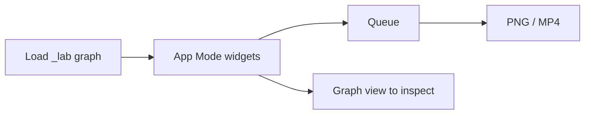

# ComfyUI Apps

This page answers one of the four start-creating questions: **what to edit in App
Mode, which lane a graph belongs to, and what to stop before loading the next one**. It covers the App surface itself. Which graph to pick is on
[Workflow catalog](studio-workflows.md), the loop a graph sits in is on
[The still-to-motion-to-AV pipeline](visual-generative-ai.md), and the words you
type are on [Prompting](prompting.md).

**What's on this page**

- **Graph vs App** - what each surface edits, and what the Quality combo owns
- **Reference stills (optional)** - the picker, the three slots, and the mute
- **Occupancy** - the one-heavy-job table and what must be stopped
- **Lane A - Labs** - the explore desks
- **Lane B - Produce** - the ship plates and clips
- **Lane DCC - clay desk** - the Blender-to-Comfy Apps
- **Handoff chains** - what to load after each App
- **Related** - where to go once you know the surface

**What this enables**

- **Opening a lab graph** from Comfy's **Apps** sidebar, not only Workflows
- **Queueing a lab graph** from creator widgets instead of hunting the canvas
- **Knowing which App to stop** before you load the next one
- **A/B-ing one setup** with the reference stills muted, without clearing what you picked
- **Following Spark Still -> Hero -> Silent 5s -> AV 5s** without renaming files

**Who this is for:** studio users after `photos/still-draft` has been loaded once.

Lab graphs are the host `_lab/<lane>/*.json` files (folder-scoped ids). On `start` they seed into Comfy as `*.app.json` when App Mode is the default view, so they appear under **Apps** as well as **Workflows**. [App Mode](learn/comfyui.md#graph-and-app) is a widget surface on that JSON (ComfyUI frontend **1.41.13+**). It is **not** a second frontend and not [`studio-ui`](reference/studio-ui.md). A small occupancy chip sits at the top of the App widget list (under the menu if you are in graph view) and shows which family is running, a one-line summary of what the App does (`extra.lab_description`), the active Quality overlay, still N of M on multi-plate Apps, and the next handoff. Widget help text wraps so the full description stays readable. It does not cover Run. **Minimize** collapses the chip to an **App - family** pill (click the pill to expand). **Close** hides it until the next run or App load, when it returns as that pill. The choice is stored in this browser. Restart the container after a pull so `custom_nodes/ez_studio_app` is copied.

```mermaid
flowchart LR
  Load["Load _lab graph"] --> App["App Mode widgets"]
  App --> Queue["Queue"]
  Queue --> Out["PNG / MP4"]
  App --> Graph["Graph view to inspect"]
```

---

## Graph vs App

| Surface | What you edit | When |
| --- | --- | --- |
| **App** | Unique creator widgets. When the graph needs a still, **Start image** (or **First frame** / **Last frame**) is first so Queue cannot hide a missing file. Then **Quality** (Lab / Draft / High), **Sample prompt** (30 lab recipes + **Custom**), **Prompt**, **Format / platform** (on Apps that own a canvas), **Output size** (Match input uses a loaded still's aspect; Force format keeps the Format pick), **Duration** (LTX 5/8/10/12 s, default 8 s; Wan stays 5 s), **Style** (`none` = off), **Rewrite prompt**, then **Seed**, then Width / Height (and Batch on Klein stills). Format sets pixels and Rewrite prompt framing; Custom uses the size widgets (Klein div16, Wan div16, LTX div32 - pick **LTX - 16:9 YouTube (1280x704)**, never type 720). Filename / LoadImage / LoadAudio widgets upload a file or choose one already on the output disk. **Start image** only when that LoadImage is wired (I2V, talking-head, character tweak, clay, text-swap). Optional references stay empty by default. The App surfaces **Example / reference (optional)** (one LoadImage-style picker) and the **Use reference stills** mute; the node card adds the two extra pickers, thumbnails, and the drop zone. Blank is the default and Queues as text-to-image. **video/av/first-last-8s** exposes **First frame** and **Last frame**. **video/av/audio-to-video-8s** exposes **Audio file**. **video/av/clip-chain** keeps Start image first, then Quality, Sample prompt (Beat 1), four **Beat N prompt** boxes, Format, Output size (Match input), Duration (default 8 s), Describe image, shared Rewrite / Audio notes / Logline, Seed, then Width / Height (Custom only). Occupancy stays on the chip, not as an App combo. Style is hidden on I2V (the start frame owns look). **photos/still-studio** also adds **Look recipe** and Steps / CFG - prefix follows Format. **photos/image-studio** adds **Mode category**, **Creator mode** (100 presets), Look recipe, Steps / CFG, and **Example / reference (optional)** - prefix follows Creator mode. **photos/still-daily** keeps Steps / CFG. Music adds duration + vocal/instrumental; podcast adds bed length + Kokoro stock voices; **audio/podcast/learn-episode** adds **Sources**, **Format**, and **Duration** (ACE bed stays 30 s and loops); dub adds source file + upload, optional URL, rights, and target language. Duplicate widgets get distinct labels (Klein prompt / Wan prompt, Beat 1 prompt, Bed tags). | Daily Queue |
| **Graph** | Groups, bypass (Ctrl+B), VHS preview, UNET/CLIP/VAE, hidden shot cards, unwired placeholders (Fun InP end frame, VACE shot B), voice-clone refs | Debug, film one-click, unused plates |

**Quality** is a per-graph combo (`EZQuality`) near the top of `linearData` (first on graphs with no required still; second when a LoadImage picker leads). Picking a tier writes Steps / CFG / Image model (and CLIP / VAE) on **every** sampler and loader instance the family can reach in the open App (Vue-safe widget writes) and does not live-link other open tabs. Newly opened Apps default to the last named Quality you picked in this browser. An App whose graph holds nothing the overlay can write ships no combo at all - a selector that changes nothing is worse than none, so album renders, Labs desks, and other loader-less graphs simply omit the row.

The combo is read from the widgets, not write-only: it is recomputed on graph load, on graph change, on any widget edit, and at Queue, and reports the named tier whose parameters the widgets actually hold - **lab** when they match the values the graph was authored with, **custom** otherwise. Only the parameters that family's tiers own are compared, so editing a parameter no tier touches (CFG on a Wan graph) keeps the level. **custom** is not absorbing: put the owned widgets back on a tier's values and that tier is re-derived. The caption under the combo names the transformer and the sampler settings Queue will send. Prompt / tags / lyrics edits Queue at every Quality; typing the box selects Sample prompt **custom** so the textarea is what encodes.

A tier that cannot be written is a **failed apply**, not a silent skip. If the tier's model file is not in that loader's combo list, or the widget is not built yet, the write is refused, the combo goes to **custom**, and the caption names what diverged. Nothing queues under the tier name with the old weights still in the widgets. A tier outside the graph's own family is refused the same way: the combo never lists it, and the `--quality TIER` CLI names the family and the tier on stderr and writes the graph unchanged rather than stamping a level it did not apply.

Tiers are named profiles that swap weights, not a step ladder. `custom_nodes/ez_quality/presets.py` is the only definition; `custom_nodes/ez_quality/js/ez_quality_presets.js` is generated from it, so regenerate with `bazelisk run //tests:build_quality_js` after editing presets.py (hand-editing the generated file is a defect). Each family's combo offers only the tiers in `EZ_QUALITY_TIERS[family]`, which `presets.tiers_for_family` derives from that same table: a tier that would write no widget on that family is left out of the list rather than offered as a no-op, so a Klein App never shows the FLUX 3 or Qwen-Image rows and a Wan App never shows a weight swap it has no loader for. **Lab** and **custom** stay on every App that has a combo.

| Family | What the tiers own | Real rows |
| --- | --- | --- |
| Klein stills | steps, CFG, UNET, CLIP, VAE, CLIP type | draft 4 steps (Klein 4B nvfp4, CFG 1.0), standard 8 (Klein 4B fp8), `high` and **Free Commercial Use (\<$10M)** are the same profile - Klein 4B base, 24 steps, CFG 3.5. `ultra` is only 4 steps because it swaps to Klein 9B distilled; `max` is 20 steps on Klein 9B base |
| FLUX 3 Image stills (`labs/opt-in/still-flux3-*`) | steps, CFG, UNET, CLIP, VAE, CLIP type | only `flux3-fast` (16 steps, CFG 1.0) and `flux3-quality` / `flux3-nvfp4` (50 steps, CFG 3.5) apply. The Klein ladder is a no-op there |
| Qwen-Image 2.1 stills (`labs/opt-in/still-qwen-image`) | steps, CFG, UNET, CLIP, VAE - the CLIP type stays authored | only `qwen-image` / `qwen-image-nvfp4` (50 steps, CFG 3.5) and `qwen-image-turbo` / `qwen-image-turbo-nvfp4` (16 steps, CFG 1.0) apply. The Klein ladder and the `flux3-*` rows are a no-op there. Opt-in **Qwen RESEARCH LICENSE AGREEMENT** weights, not Apache - no commercial use of the weights or their output without a separate paid Qwen license. Pixels come from **Resolution** (one square side): the encoder builds the 64-channel latent itself, so that app carries no Format / platform picker |
| Wan / LTX / film | steps only - never CFG, never weights | draft 12, standard 20, `high` 28, `max` 32. **Free Commercial Use (\<$10M)** is 28 on LTX / film and is not offered on Wan |
| Audio (ACE-Step) | steps only | draft 4, standard 8, `high` 16, `max` 24 |
| TRELLIS | steps only | draft 8, standard 12, `high` 20, `max` 28 - on the three guided stages only. The unguided texture stage (`KSampler (texture)`, authored CFG 1) keeps its own step count: the ladder is tuned against the guided stages, so it leaves that recipe alone |

### One App per model stack

An App drives one model stack, and **Quality** is the only weight swap it offers. Every tier an App lists loads a weight from that App's own stack: the Klein Apps move between Klein 4B and Klein 9B, the FLUX 3 Image App between its distilled, base, and NVFP4 builds, the Qwen App between Qwen-Image and its turbo and NVFP4 builds, the Wan and LTX Apps between step counts on the transformer they already pin.

That scoping is why the selector is reliable. A loader combo lists every `.safetensors` in the mounted `models/` tree, so an App that showed one let a single Queue pair a Klein UNET with a Qwen text encoder and fail on CLIP type or VAE. For that reason **UNET / CLIP / VAE stay off every App surface** - the stamper refuses an App spec that exposes a loader widget, so the leak cannot come back through a new App.

Reaching another stack is a second App authored for that stack, and several objectives deliberately ship twice. The still desk is the clearest case:

| Objective | Klein App (Apache, default) | Other stacks, separate Apps |
| --- | --- | --- |
| One hero still | `photos/still-daily`, `photos/still-studio`, `photos/image-studio` | `labs/opt-in/still-flux3-fast`, `labs/opt-in/still-flux3-quality` (FLUX 3 Image Klein), `labs/opt-in/still-qwen-image` (Qwen-Image 2.1) |

Those Apps share a purpose and differ in weights, so they stay apart: the CLIP type, the VAE, the latent channel count, and the license all change with the stack, and an App that carried two of them would need a combo that reaches both. Adding a stack means adding an App (register it in the matching `tests/python/_build_*.py` builder and pin its family in `custom_nodes/ez_quality/presets.py`), never widening an existing App's ladder.

The FLUX 3 Image pair is the one place two Apps share a stack. Each App authors one build and walks the operator through its own gated Hugging Face acceptance (`bazelisk run //scripts:run-utility -- download-image run --tier flux3` for the distilled INT8, `--tier flux3-base` for the base INT8), so the App you open names the pull you most likely still owe. The separation is a prompt toward the right license click, and nothing more: the `flux3-*` ladder is family-wide, so either App can write either build, and **Check models** names the command for whichever weight is missing.

Two gates hold the line, and both run in CI:

- `bazelisk test //tests:pytest` runs `tests/python/test_lab_model_stack.py`, which classifies every weight pin in every shipped graph and fails a graph that pins two stacks, pins a weight no stack claims, or claims a heavy occupancy with nothing loaded.
- `bazelisk test //tests:bats_workflow_test` runs `tests/python/_audit_lab_graphs.py`, which applies the same rule per graph and also fails a note that tells the operator to load a graph the catalog does not ship.

Quality does not touch the Width / Height or Duration widgets, and Quality is not `--tier quality` (that flag is a download pack id - [Download tiers](download-tiers.md)). The one size effect is **Free Commercial Use (\<$10M)** on Klein stills: a generic 16:9 / 9:16 **Format** row retargets to **16:9 LTX feeder (1280x704)** / **9:16 LTX feeder (768x1280)**; named platform jobs, **Custom**, and rows already on a feeder stay put. ultra/max may select opt-in Non-Commercial weights (gated, not YouTube-ok). The `qwen-image*` tiers select opt-in **Qwen RESEARCH LICENSE AGREEMENT** weights (ungated, no `HF_TOKEN`, still not YouTube-ok - section 2.b bars commercial use until you hold a separate paid Qwen license). A graph with no sampler and no loader to write - the Labs desks, an album render, a dub - carries no combo at all, so there is no level there to misread.

`EZQuality` nodes that are muted or bypassed (LiteGraph `mode` other than 0) are ignored by the overlay and wear no caption. No film graph ships one muted: each film app carries a single model family, so the plate App (`workflows/_lab/film/<slug>/00-plate.json`) moves Klein tiers only and the act / feature App (`act-01.json` .. `act-05.json`, `feature.json`) moves LTX tiers only. Set the tier in the App you are about to Queue - the plate's combo has no effect on the print pass, because they are two separate Queues over a file on disk.

The CLI submits the same table: `bazelisk run //scripts:run-utility -- print-shot <film> <id> --quality TIER` and `bazelisk run //scripts:run-utility -- album-render run --album ARTIST/SLUG --quality TIER` (or `EZ_QUALITY=TIER`) overlay the graph before each POST; with neither, the tier the graph records is used.

Official persist is `extra.linearData` (`inputs` / `outputs`). Each input is `[nodeId, widgetName, config?]` with an **integer** node id. ComfyUI frontend **1.49.6+** (this stack pins **1.57.4** with v0.43.0) upgrades that to a live `graphId:nodeId:name` WidgetId at load. Do **not** persist `"11:prompt"` two-part ids - the frontend treats a colon as a subgraph locator and drops the widget, leaving App view with Run and occupancy but no Prompt. The lab contract is `extra.lab_app_mode` (`lane`, `occupancy`, `handoff`, `frontend_min`). Do not require `extra.linearMode` - upstream does not write it.

Comfy's **Apps** sidebar lists files whose name ends in `.app.json`. On `start`, the entrypoint seeds every App Mode graph (`default_view: app`) as `_lab/<lane>/*.app.json`. The same stem still appears under **Workflows** in that folder. The film **plate** apps are App Mode (`default_view: app`); the act / feature print graphs stay `default_view: graph` (too many widgets) and keep the `.json` suffix - App Mode is still **enabled**, but they stay Workflows-only. Folders do not add `workflows/apps/`.

Filenames: [Workflow catalog](studio-workflows.md). Playbook: [The still-to-motion-to-AV pipeline](visual-generative-ai.md). Restart the container after a pull so the `.app.json` copy runs.

Save your own Apps under **`_user/`**. Duplicate a lab graph (App Forge, Save As `_user/`, or a new file under live `_lab/`) and it stays in `_user/`. A Save that overwrites live `_lab/<lane>/*.app.json` is rescued into `_user/_rescued/` on the next `start` - re-open a rescued file, because `_lab/` is the shipped catalog. If `_user/_rescued/` is already full of catalog clones from older starts, delete that folder (keep the rest of `_user/`). Folder rules and the sidebar tree: [Workflow catalog](studio-workflows.md#where-the-graphs-live).

---

## Reference stills (optional)

**Example / reference (optional)** is the App label for the canvas node **Optional reference stills** (`EZOptionalImage`). Every Klein graph in the catalog ships it empty. Leave it blank and Queue: the graph runs text-to-image exactly as before. That is the default path, not a fallback.

Give the model something to look at when you need it:

1. Pick a still in **Example / reference (optional)**. To attach more than one, use **+ Add reference** on the node card to reveal the other two pickers (`filename_2`, `filename_3`). Each one is a real LoadImage-style picker: drag a file onto the card's drop zone, upload, choose a file already on disk, or pick a name from `input/`. A wired IMAGE batch also lands on the node.
2. Read the card status line. `Reference stills: 2 of 3` means two stills attach, `No reference still - Queue as is` means Queue runs text-to-image, and `Reference stills muted` means the mute has them parked. A wired batch reads `plus a wired batch`. Each filled slot shows a thumbnail, so you can see what is going in.
3. Queue. Up to three picked stills plus one wired batch reach Klein / Flux.2 as real reference latents.
4. To compare with and without the stills, turn the **Use reference stills** mute off (the node widget reads **Use references** / **References off**) and Queue again. The stills stop reaching the model - the node reports `references off` - and your picks stay put, so turning it back on restores them. Picking a new still also turns the mute back on for you. Do not clear the picker to A/B.

**Klein canvas (optional ref)** (`EZKleinRefCanvas`) attaches at most **max_refs** frames (1-4, default 3). Set it to 1 to make one still dominate, or when a wired batch is sending more frames than you meant.

Nothing about the node name, its outputs, or the App input label changed, so graphs you saved keep loading. A graph saved against the older node keeps its single picker and gets the toggle plus the two extra pickers at their defaults (references on, extra slots empty).

Stills that will not apply: [Troubleshooting](troubleshooting.md#reference-stills-optional-refs). Node table: [Custom nodes](reference/custom-nodes.md#ez_image).

---

## Occupancy

One GB10 job. Cover art != film != podcast. Every App Note includes a one-line occupancy stanza.

| Occupancy | Allowed | Must be stopped |
| --- | --- | --- |
| `none` / `llm` | Prompt Forge, Research Chat, Beat Sheet | nothing GPU |
| `klein` | still Apps + Platform Pack | Wan, LTX, podcast, music |
| `wan` | silent 5 s / GIF / bumper | LTX, podcast, music |
| `ltx` | any AV 8 s App | Wan, podcast, music, other LTX |
| `film` | 90 s one-click | everything else on that Spark |
| `audio` | podcast / dub / rap | Klein / Wan / LTX session |

Prompt Enhance GGUF stays CPU-only (`n_gpu_layers=0`). Sidecar occupancy (Comfy XOR Blender) is unchanged: [Host sidecars overview](studio-sidecars.md). `export-guides` / `blender-stills` / `house-views` die if compose is up.

---

## Lane A - Labs

Explore identity, cameras, and world bibles. Occupancy **klein** unless noted.

| App | What it does |
| --- | --- |
| **photos/still-draft** | Spark Still. Default 768x432; **Format / platform** retargets (YouTube, Shorts, ...). Prefix `ez_still_draft` |
| **photos/identity-sheet** | Front / three-quarter / profile. 1280x704, Enhance on (identity mode) |
| **photos/storyboard-6up** | Six new cameras of one scene (`ez_board_01`...`06`) |
| **photos/dream-house** | Virtual tour. Ten 4:5 stills of **one place**, each a different room or view (tower, foyer, lounge, kitchen, dining, bedroom, bath, terrace, drone, study; default placeholder is a full-floor penthouse in a dense city) |
| **photos/dream-house-clay** | Same walkthrough as Klein edit of clay plates (`ez_house_clay_01`...`10`). `start` seeds LoadImage; optional `house-views` dump. Prefix `ez_dream_house_clay_01`...`10` |
| **photos/style-lock** | One place, four cameras |
| **photos/lighting-trio** | Same subject, three lights |
| **photos/camera-angles** | Wide / medium / close |
| **photos/color-moods** | Warm plate plus three grades |
| **photos/time-of-day** | Dusk plate, then dawn / noon / night |
| **photos/hook-still** | Vertical 9:16 first-frame hook (`ez_hook_still`) |
| **photos/character-draft** | Character still. Prompt + style, 1024x1280, prefix `ez_character` |
| **photos/character-tweak** | Edit that still. LoadImage + change prompt, ReferenceLatent, prefix `ez_character_tweak` |
| **labs/assist/prompt-forge** | No UNET. One Prompt + optional Context, then Klein / Wan / LTX / Z-Image / LongCat / DreamX enhance preview. Occupancy **llm** (CPU GGUF) |
| **labs/assist/cinema-rack** | No UNET. Pick cinematography axes (shot size, move, light, ...) and splice Klein / Wan / LTX prompts. Occupancy **llm** (CPU GGUF). [Cinema Rack](create/cinema-rack.md) |
| **labs/assist/audio-rack** | No UNET. Pick audio/music axes (genre, tempo, drums, ...) and splice ACE-Step tags / lyrics form. Occupancy **llm** (CPU GGUF). Do not load ACE-Step on this canvas. [Audio Rack](create/audio-rack.md) |
| **labs/assist/research-chat** | Creative-process chat with web search and sequential research subagents. Occupancy **llm** (CPU GGUF). Laptop agents: `research-mcp` |
| **labs/assist/app-forge** | No UNET. Clone a shipped lab graph into live `_user/` as a new App. Occupancy **llm** (CPU GGUF). Laptop agents: `studio-mcp`. [App Forge](create/app-forge.md) |
| **labs/assist/beat-sheet** | Script desk. Logline / script / audio policy / score pack into every card rewrite. 18 cards (`action \| camera \| world SFX \| dialogue`). `shot-sheet` writes `films/<slug>/shots.yaml`. Occupancy **none** |

---

## Lane B - Produce

Ship plates and ~5 s clips. UNET / CLIP / VAE stay hidden on every App: a loader
combo lists every weight in `models/`, so showing one would let an App reach
another stack's weights. **Quality** is the only weight swap an App offers, and it
stays inside that App's stack.

| App | Occupancy | Prefix / output |
| --- | --- | --- |
| **photos/still-daily** | klein | `ez_still_app` - Format / platform; Quality swaps Klein 4B fp8 / NVFP4 / base |
| **photos/still-studio** | klein | Format / platform desk. Prefix follows Format (`ez_still_studio` when Custom). Default 1280x704 |
| **photos/image-studio** | klein | Universal still desk. **Iterate** (first control, off by default) does text-to-image, then edits that still. **This run** shows the values Queue will send. 100 creator modes + Format / platform + optional reference. Prefix follows Creator mode unless Iterate is on (`ez_iterate`). Default 1280x704 |
| **photos/still-hero** | klein | `ez_still_hero` - default 1280x704 LTX feeder; Format / platform retargets |
| **photos/thumbnail** | klein | `ez_thumbnail` 1280x720 |
| **photos/instagram-square** | klein | `ez_ig_square` 1:1 |
| **photos/open-graph** | klein | `ez_og` 1216x640 |
| **photos/banner-wide** | klein | `ez_banner` ~3:1 |
| **photos/shorts-still** | klein | `ez_shorts_still` 432x768 |
| **video/silent/still-to-video-5s** | wan | Silent 5 s, 121 frames, MagCache draft-only |
| **video/loops/gif-loop** | wan | 49-frame ping-pong GIF |
| **video/av/still-to-video-8s** | ltx | AV 8 s, 1280x704 |
| **video/av/clip-chain** | ltx | Four 8 s AV beats, last-frame continuity, `ez_clip_chain.mp4`. Prefix `ez_clip_b01`...`b04` |
| **video/av/hook-av** | ltx | AV cold open |
| **video/av/dialogue-8s** | ltx | Quoted speech + world SFX. Prefix `ez_ltx_dialogue` |
| **video/av/multishot-8s** | ltx | Native multishot (named cuts). Prefix `ez_ltx_multishot` |
| **video/av/product-hero** | ltx | Packshot I2V orbit. Prefix `ez_ltx_product` |
| **video/av/first-last-8s** | ltx | First + last still -> one AV take. Prefix `ez_ltx_flf` |
| **video/av/audio-to-video-8s** | ltx | Freeze a ~8 s wav; mux original audio. Prefix `ez_ltx_a2v` |
| **photos/platform-pack** | klein | Six plates from one identity (`ez_pack_thumb` / ig / portrait / shorts / og / banner). Ctrl+B unused groups |
| **photos/text-swap** | klein | `ez_text_swap` - replace lettering, lock type/angle/look, match source size |
| **photos/background-swap** | klein | `ez_bg_swap` - replace backdrop, ground, and nearby set dressing; empty Flux.2 canvas; photo reference for place swaps; Cubic block world erases the people from a block study and pastes them back at full resolution, or (person mask unavailable) keeps them photoreal on the photo-anchored rebuild. Other/background character toggles |
| **photos/background-edit** | klein | `ez_bg_edit` - restyle the environment in place (cartoon, add/remove, weather); match source size. Other/background character toggles |

Creator plates (packshot, end-card, quote, food, bumper, B-roll, orbit, ...) stay in the [catalog](studio-workflows.md). One hundred extra platform Apps live under `_lab/social/` (YouTube channel art, IG 4:5, Pinterest 2:3, Twitch BRB, Spotify Canvas, merch mocks): [Creator pack](create/workflows-creator.md). Example chain: **social/stills/instagram-portrait** -> **social/silent/instagram-story-loop** -> **social/av/instagram-reel-lifestyle**. Klein stills may use 1280x720; LTX feeders stay **1280x704**. Lab sizes match platform **aspect**; scale in an editor if a host wants more pixels.

Audio Apps (`audio/podcast/two-host-episode`, `audio/podcast/radio-drama`, `audio/podcast/learn-episode`, `dub-*`, `audio/music/rap-draft`, `audio/music/rap-full`, **audio/stem-mix**) are occupancy **audio**. Catalog albums live under `_lab/audio/albums/<artist>/<album>/` with numbered tracks, `cover.json` (klein), and `album.json` (zip). Outputs are FLAC + MP3 tagged with artist/album/title; optional cover is in the tags. One-go: `bazelisk run //:manage -- album-render --album nill-bye/peer-review`. Mux a still for YouTube with `bazelisk run //:manage -- audio-still-video --audio FILE --image FILE` (host ffmpeg; compose may stay up). Film Apps under `_lab/film/` are one family each: `00-plate` is occupancy **klein**, `feature` / `act-01` .. `act-05` are occupancy **ltx**, and `generate-cutaway` is occupancy **wan**. Control-guide Apps live under `_lab/guides/` (lane **guides**) and the meshes under `_lab/3d/` (lane **3d**). Clay-to-finish playbook: [Clay blockout to finished clip](learn/clay-to-finish.md). Blender stills + video: [Blender creator suite](learn/blender-creator.md).

---

## Lane DCC - clay desk

Block in host Blender (Comfy **down**), then Queue these Apps. Occupancy XOR with dumps is unchanged.

| App | Occupancy | What it does |
| --- | --- | --- |
| **guides/clay-hero** | klein | Klein edit of guide `first.png`, 1280x704, prefix `ez_clay_hero` |
| **guides/clay-plates** | klein | One clay still -> hero 704 / packshot 1:1 / IG 4:5 / shorts 9:16 (`ez_clay_pack_*`) |
| **guides/canny-hero** | klein | Klein edit of `canny.png`, 1280x704, prefix `ez_canny_hero` |
| **guides/depth-control-8s** | ltx | Union Control envelope, depth from `depth.mp4` |
| **guides/canny-control-8s** | ltx | Same envelope, canny from `canny.mp4` |
| **guides/depth-control-shorts** | ltx | Depth envelope at **768x1280** |
| **guides/first-last-from-guide** | wan | Fun InP `first.png` + `last.png` (opt-in `download-wan --tier fun-inp`) |
| **guides/guide-still** | klein | In-canvas loaders + occupancy gate. Prefix `ez_guide_hero` |
| **guides/depth-from-loader** | ltx | Envelope from loaders. MagCache off. Prefix `ez_iclora_guide` |
| **3d/trellis2** | trellis | Klein still via `LoadImage` -> textured TRELLIS.2 INT8 mesh. `SaveGLB` writes `assets/objects/_lab-trellis2/mesh` |
| **3d/still-to-mesh** | trellis | Still pack `mug` via `EZDCCLoadStillPack` -> textured mesh. `SaveGLB` writes `assets/objects/_lab-mug/mesh` |
| **3d/blockout-mesh** | trellis | Still pack via `EZDCCLoadStillPack` -> **untextured gray-box blockout**: structure + shape stages only, no upsample, no texture VAE, no `PaintMesh`. The fast layout proxy. `SaveGLB` writes `assets/objects/_lab-blockout/blockout` |
| **3d/shot-to-prop** | trellis | DCC guide still via `EZDCCLoadGuideStill` (`slug=go-see`, `shot_id=12`, `layer=first`) -> textured mesh of one hero object, for re-compositing that object into other shots. `SaveGLB` writes `assets/objects/_lab-shot-prop/prop` |
| **3d/prop-variants** | trellis | Klein still via `LoadImage`, `EmptyTrellis2LatentStructure` `batch_size=4` -> four candidate meshes from one still in a single occupancy session. `SaveGLB` writes `assets/objects/_lab-variants/prop` |

All five mesh Apps are lane **3d** (`_lab/3d/`) and claim occupancy **trellis** - one heavy 3D job at a time, so stop the previous family before you Queue the next. Each takes an image in (`LoadImage`, `EZDCCLoadStillPack`, or `EZDCCLoadGuideStill`) and emits one `.glb` per batch item on the output disk under the prefix above; `MeshToFile3D` has no widgets and writes nothing, `SaveGLB` is the node that puts the file on disk. `3d/blockout-mesh` stops after the shape stage, so it has no texture VAE and no painted surface - Queue it for layout, then re-run the full chain on the take you keep. The chain and the model pins: [DCC guide pack](dcc-workflows.md#lab-graphs).

---

## Handoff chains

| From | To |
| --- | --- |
| Spark Still | Hero Still -> Silent 5s (`wan-i2v-5s`) -> AV 8s (`ltx-i2v-5s`) or FLF (`video/av/first-last-8s`) |
| Product packshot | `video/av/product-hero` |
| Talking-head still | `video/av/audio-to-video-8s` (real freeze; two-stage stays Templates) |
| Spark Still | Platform Pack (`klein-platform-pack`) -> Silent 5s / Hook AV |
| Character Draft | Character Tweak -> Identity Sheet -> Silent 5s |
| Hook Still | `wan-shorts-i2v` -> `ltx-shorts-i2v` |
| Storyboard 6-up | `wan-i2v-shot` / `ltx-i2v-shot` |
| Research Chat | Prompt Forge -> Spark Still (`klein-still-draft`) |
| Beat sheet (script desk) | `shot-sheet` -> identity sheet / clay dump / `klein-from-clay` |
| Klein-from-clay | `overlay-qc` -> `ltx-iclora-depth` -> `audio-finish` / `stem-mix` |
| Klein-from-clay | Silent 5s (`wan-i2v-5s`) |
| Klein-from-clay-plates | `wan-shorts-i2v` / `ltx-iclora-depth-shorts` |
| Klein-from-canny | `ltx-iclora-canny` |
| Guide pack first+last | `wan-flf-from-guide` |
| World bible (dream-house) | Loop kit (GIF / bumper / sticker) |
| Clay dream-house | `start` (or `house-views` dump) -> **photos/dream-house-clay** -> same loop kit |
| IG 4:5 (`social/stills/instagram-portrait`) | `social/silent/instagram-story-loop` -> `social/av/instagram-reel-lifestyle` |
| Shorts thumb (`social/stills/youtube-shorts-thumb`) | `social/silent/zoom-punch` -> `video/av/shorts-still-8s` |
| Canvas still (`social/stills/spotify-canvas-still`) | `social/silent/spotify-canvas` (silent rebound) |
| Twitch starting (`social/stills/twitch-starting`) | `social/silent/twitch-starting-loop` -> `social/av/twitch-starting-av` |

Set I2V **LoadImage** to the still prefix you just saved (`ez_still_draft_*.png`, `ez_hook_still_*.png`, ...). I2V graphs also Queue on Comfy's `example.png`.

Do **not** Queue Wan and LTX in the same session. Stop the other occupancy first.

<Callout type="warning" title="Do not weaken">
  `restart: "no"`, type **yes** on start, headroom, and download-limit are unchanged. Apps do not add `workflows/apps/`. Optional graphs live under `_lab/labs/opt-in/`. App Mode graphs seed as `*.app.json` inside `_lab/<lane>/`, not as a second tree.
</Callout>

---

## Related

1. Choose the graph before you open the App: [Workflow catalog](studio-workflows.md)
2. Run the loop these Apps chain together: [The still-to-motion-to-AV pipeline](visual-generative-ai.md)
3. Write the prompt the widgets feed: [Prompting](prompting.md)
4. Clone an App you can keep: [App Forge](create/app-forge.md)
5. Splice a look into the Prompt box: [Cinema Rack](create/cinema-rack.md)
