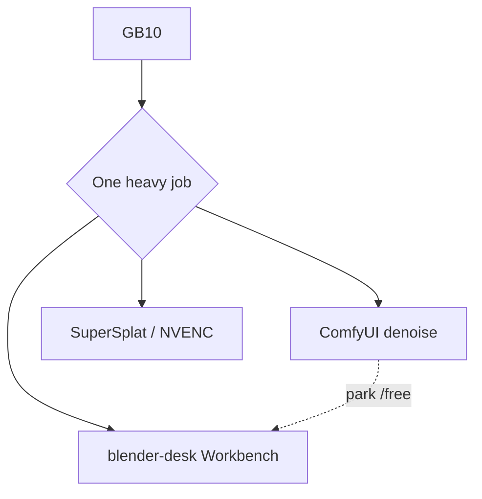

# Studio sidecars

**What's on this page**

- What a sidecar is (host process, not Compose)
- Occupancy: one heavy GPU job
- TRELLIS.2 native + DA3-BASE opt-in packs
- Pointers to Blender, SuperSplat, and host NLE (Kdenlive / Shotcut)

**What this enables**

- Optional 3D stills and depth without putting DCC or splat viewers in the Docker image
- Unchanged `restart: "no"`, `mem_limit: 90g`, and headroom preflight

!!! warning "Occupancy"

    GB10 is one heavy GPU job. Park Comfy (`occupancy enter blender-desk`) for Workbench dumps. Stop Blender before TRELLIS / LTX / Wan. SuperSplat and NVENC still want Compose **down**. Sidecars are **not** `docker compose` services. [Occupancy desk](occupancy.md).



---

## Host, not Dockerfile

| Sidecar | Where it runs | License | In image? |
| --- | --- | --- | --- |
| Blender | Host binary on `PATH` | Blender's own | **No** — [Blender GB10 sidecar](blender-gb10-sidecar.md) |
| SuperSplat | Host static viewer | MIT | **No** — [Splat sidecar](splat-sidecar.md) |
| TRELLIS.2 native | Comfy after `download-3d` | MIT | Weights on `MODELS_DIR` only. No nvdiffrast |
| DA3-BASE | Comfy after `download-3d` | Apache 2.0 | Weights on `MODELS_DIR` only. DA3-LARGE refused |

Never `pip install nvdiffrast` / `nvdiffrec`. Never vendor Inria 3DGS or Pixal3D as a default.

Generated meshes, previews, and scene instances are **outputs** in the [Asset Bible](asset-bible.md) under `COMFY_OUTPUT_DIR/assets/` — never in `MODELS_DIR` or `guides/`.

```bash
./scripts/manage.sh occupancy enter blender-desk
./scripts/manage.sh download-3d --tier trellis2   # or da3-base | all
./scripts/manage.sh blender                      # Workbench; dies if Comfy is heavy
./scripts/manage.sh export-guides --film go-see --shot 12   # same occupancy
./scripts/manage.sh blender-stills --film go-see --plate mug --size 1024x1024
./scripts/manage.sh house-views --slug lab-penthouse        # Instagram 4:5 clay; same occupancy
./scripts/manage.sh occupancy enter trellis --yes
```

Guide packs: [DCC guide pack](dcc-workflows.md). Clay is Workbench; beauty is Path A. Never 1280×720.

VACE join (Wan 2.1 1.3B Apache, 17 frames = `1+8n`) is a Comfy graph, not a sidecar:

```bash
./scripts/utilities/download-wan.sh run --tier vace
# load workflows/_lab/wan/wan-vace-join-lab-example.json — MagCache off
```

## Host NLE (Kdenlive / Shotcut)

OTIO from `./scripts/manage.sh film-export-otio go-see` is stdlib JSON under `films/<slug>/publish/`. Import on the Spark host or a laptop — never in the Docker image.

On DGX Spark (Ubuntu aarch64):

```bash
sudo apt-get update
sudo apt-get install -y kdenlive shotcut
# or: flatpak install flathub org.kde.kdenlive
```

Then open the `.otio` in Kdenlive/Shotcut. Occupancy: stop Comfy first if the NLE will use the GPU.

See [Model licenses](licenses.md) and [Models & Cache](models-and-cache.md).
