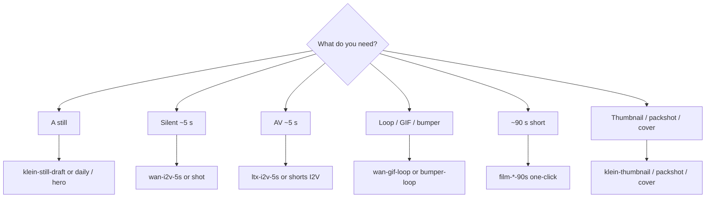

# Workflow catalog

**What's on this page**

- Which graph for which job
- Seeded Klein / Wan / LTX / Apps (Lane A vs Lane B) / 90s / creator / audio tables
- Notes that apply to every seeded lab graph

**What this enables**

- Picking a filename instead of starting from a blank canvas
- Keeping the [playbook](visual-generative-ai.md) a how-to, not a spreadsheet

**Who this is for:** studio users after the first still-draft Queue.

After `download-models` + `start`, load from Comfy’s **Workflows** sidebar under **`_lab/<lane>/`** (seeded from host `workflows/_lab/`). Filenames are short stems in lane folders (`klein/still-draft.json`); the unique id is `extra.lab_rel`. App Mode graphs also appear under Comfy’s **Apps** sidebar (`*.app.json` on disk under the same lane folder; same stem). Save your own graphs in **`_user/`**. Do **not** edit live `_lab/` copies — they are overwritten on start. Do **not** edit raw JSON — change widgets on the canvas.

Sidebar tree after start:

```text
user/default/workflows/
  _lab/
    klein/     stills, plates, identity, platform pack, dream-house, dream-house-clay, …
    wan/       silent 5s, gif/bumper/sticker, flf, vace, shot
    ltx/       AV 5s, hook, b-roll, interior, weather, shorts I2V, shot
    shorts/    go-see, still-here, switchyard (90s one-click)
    dcc/       clay → print, plates, canny, iclora envelopes, FLF from guide, in-canvas loaders
    optional/  a14b, longcat stub, klein-trellis2
    audio/     podcast, dub, music/rap-draft, music/rap-full
      albums/nill-bye/<album>/     nine Nill Bye albums (numbered tracks + cover + album)
      albums/drive-through/<album>/  five Drive-through albums
    inspire/   prompt-forge, research-chat, beat-sheet
  _user/       your graphs (never overwritten)
```

Reusable printer blocks live in the node library after start (`custom_nodes/ez_studio_blocks/subgraphs/`): **klein-t2i-backbone**, **wan-i2v-5s**, **ltx-av-5s**, **ltx-film-shot**. Drop them from the subgraph menu instead of copy-pasting chains.



---

## Catalog

=== "Still (Klein 4B)"

    | Workflow | What it does |
    | --- | --- |
    | **klein/still-draft** | Apache Klein 4B distilled, **768×432**, **4** steps, batch 2, prefix `ez_still_draft` |
    | **klein/still-hero** | Same prompt + seed, **1280×704** (LTX VAE grid), more steps, prefix `ez_still_hero`. Enhance **on**. |
    | **klein/identity-sheet** | 3-angle sheet (front / three-quarter / profile) of the identity you type. Seed **42**, Enhance **on** (identity mode), **1280×704** |
    | **klein/character-draft** | Character still 1024×1280, style dropdown, prefix `ez_character` |
    | **klein/character-tweak** | Klein-edit that still (LoadImage + ReferenceLatent), prefix `ez_character_tweak` |
    | **klein/talking-head** | Klein still → LTX A2V freeze smoke. Qwen3-TTS / Wan S2V opt-in. No banned lip-sync OSS |

=== "Motion (Wan 2.2 5B)"

    | Workflow | What it does |
    | --- | --- |
    | **wan/i2v-5s** | Silent I2V smoke, 832×480, **121** frames @ 24 fps. MagCache **draft-only** (`extra.lab_magcache`) |
    | **wan/flf-5s** | Fun InP first-last-frame 5 s (opt-in `download-wan --tier fun-inp`). MagCache off |
    | **wan/vace-join** | Wan 2.1 VACE 1.3B 17-frame join (`1+8n`). Opt-in `download-wan --tier vace`. MagCache off |
    | **optional/wan/i2v-a14b** | Optional A14B FP8: high+low UNET on canvas, Queue on high-noise 8-step (`download-wan --tier a14b`). MagCache off. Unload 5B first. Under `_lab/optional/` |
    | **optional/klein/trellis2** | Klein still → native TRELLIS.2 INT8 mesh (512). `download-3d --tier trellis2`. `occupancy enter trellis`. Under `_lab/optional/` |
    | **wan/t2v-5s** | Silent T2V smoke, 121 frames (LoadImage bypassed) |
    | **wan/i2v-shot** | Concat-safe **120** frames + last-frame SaveImage. 90s shots, or prefix `ez_shot_01..06` |

=== "AV hero (LTX-2.5)"

    | Workflow | What it does |
    | --- | --- |
    | **ltx/i2v-5s** | ~5 s I2V, **1280×704**, native audio (Community License, $10M cap) |
    | **ltx/t2v-5s** | ~5 s T2V AV, **1280×704** |

    !!! warning "LTX width/height must be divisible by 32"

        Broadcast 720p (**1280×720**) and 1080p (**1920×1080**) are **not** native LTX VAE sizes (720/16=45, then the next `/2` patch fails). Lab landscape graphs use **1280×704**. Klein **I2V feeders** (`klein-still-hero`, 90s film identity) are **1280×704**. Thumbnails/end-cards may stay 1280×720. Typing 720 or 1080 on LTX widgets is **auto-snapped** (704 / 1056) by `ez_ltx_spatial` — prefer 704 so you skip the extra crop. Portrait shorts I2V is **768×1280**. See [Troubleshooting](troubleshooting.md).

=== "Apps (Lane A / Lane B)"

    App Mode (frontend **1.41.13+**) is a widget surface on the same lab JSON. Occupancy and handoff: [ComfyUI Apps](studio-apps.md).

    Lane A — Inspire (occupancy **klein**)

    | Workflow | What it does |
    | --- | --- |
    | **klein/still-draft** | Spark Still. 768×432, Enhance on. Prefix `ez_still_draft` |
    | **klein/identity-sheet** | 3-angle sheet of the identity you type, seed **42**, **1280×704** |
    | **klein/storyboard-6up** | Six new cameras of one scene (`ez_board_01`…`06`) |
    | **klein/dream-house** | World bible. Ten Instagram 4:5 stills: virtual tour of one place (tower, foyer, rooms, terrace, drone, study) |
    | **klein/dream-house-clay** | Same tour as Klein **edit** of clay (`ez_house_clay_01`…`10`). `start` seeds plates; optional `house-views` dump. Prefix `ez_dream_house_clay_*` |
    | **klein/character-draft** | Character still, 1024×1280, style dropdown, prefix `ez_character` |
    | **klein/character-tweak** | Edit `ez_character_*.png` with a change prompt (ReferenceLatent) |
    | **klein/hook-still** | Vertical 9:16 hook still |
    | **inspire/prompt-forge** | No UNET. Klein / Wan / LTX enhance preview (occupancy **llm**) |
    | **inspire/research-chat** | Creative-process chat + web search + research subagents (occupancy **llm**). Handoff Prompt Forge |
    | **inspire/beat-sheet** | Script desk. Logline + audio policy + 18 cards. `shot-sheet` writes `films/<slug>/shots.yaml` (occupancy **none**) |

    Lane B — Produce

    | Workflow | Occupancy | What it does |
    | --- | --- | --- |
    | **klein/still-daily** | klein | Daily still. Click UNET to swap distilled / NVFP4 / base. Prefix `ez_still_app` |
    | **klein/still-hero** | klein | Same prompt + seed, **1280×704**, prefix `ez_still_hero` |
    | **wan/gif-loop** | wan | Wan 5B I2V GIF (49 frames @ 12 fps, ping-pong). Prefix `ez_gif_loop` |
    | **wan/i2v-5s** | wan | Silent 5 s I2V smoke, 121 frames |
    | **ltx/i2v-5s** | ltx | AV 5 s I2V, **1280×704** |
    | **klein/platform-pack** | klein | Six plates, one identity (`ez_pack_*`). Independent T2I; Ctrl+B unused groups |

=== "90s shorts"

    | Workflow | What it does |
    | --- | --- |
    | **shorts/go-see** | **One-click** first-person parkour 90s: Klein identity + 18 LTX 5.00s AV prints + stitch |
    | **shorts/still-here** | **One-click** household morning 90s (same shape) |
    | **shorts/switchyard** | **One-click** night freight-yard 90s (same shape) |
    | **wan/i2v-shot** | Optional silent rehearsal / six-shot concat demo |
    | **ltx/i2v-shot** | Generic 5.00 s AV print (non-film) |

    Full loop: [90s shorts](shorts.md). One file per film — Queue once.

=== "Creator toolkit"

    Pack 1

    | Workflow | What it does |
    | --- | --- |
    | **klein/shorts-still** | Vertical 9:16 Shorts still (`ez_shorts_still`) |
    | **wan/shorts-i2v** | Vertical silent I2V from that still |
    | **ltx/shorts-i2v** | Vertical AV I2V (~5 s) with world audio |
    | **klein/thumbnail** | YouTube thumbnail still 1280×720 |
    | **klein/product-packshot** | Clean product packshot 1:1 |
    | **klein/before-after** | Before plate, after Klein-edit of the same mug |
    | **klein/style-lock** | One penthouse, four cameras, locked inventory |
    | **wan/bumper-loop** | Loopable MP4 bumper (ping-pong) |
    | **ltx/broll-ambient** | Ambient B-roll AV plate (~5 s) |
    | **klein/storyboard-6up** | Six storyboard frames of one rooftop from new cameras |

    Pack 2 — stills and plates

    | Workflow | What it does |
    | --- | --- |
    | **klein/endcard-cta** | End-card / CTA plate 16:9 |
    | **klein/quote-bg** | Quote-card background 1:1 |
    | **klein/og-blog** | Blog / Open Graph hero |
    | **klein/podcast-cover** | Podcast cover 1:1 |
    | **klein/banner-wide** | Channel / LinkedIn banner ~3:1 |
    | **klein/ig-square** | Instagram 1:1 still |
    | **klein/hook-still** | 9:16 first-frame hook |
    | **klein/lower-third-bg** | Lower-third-safe 16:9 plate |
    | **klein/food-tabletop** | Food / tabletop 4:5 |
    | **klein/lighting-trio** | Same subject, three lights (SHOT KEY is the identity plate) |
    | **klein/time-of-day** | Dusk plate, then dawn / noon / night edits |
    | **klein/camera-angles** | Wide / medium / close of one subject, new cameras |
    | **klein/color-moods** | Warm plate, then three grade edits |

    Pack 2 — motion / AV

    | Workflow | What it does |
    | --- | --- |
    | **wan/orbit-i2v** | Slow orbit I2V ~5 s |
    | **wan/push-in-i2v** | Hero push-in I2V ~5 s |
    | **wan/parallax-i2v** | Subtle parallax I2V ~5 s |
    | **wan/sticker-loop** | Looping sticker MP4 |
    | **ltx/weather-broll** | Rain / wind B-roll AV |
    | **ltx/interior-ambience** | Interior room-tone AV |
    | **ltx/hook-av** | ~5 s AV cold open |

=== "Audio (podcast / dub / rap / EDM)"

    Occupancy **audio**. Opt-in weights (`download-podcast` / `download-dub` / `download-music`). Do not co-resident with Klein / Wan / LTX. Album art is skip / upload / generate (`cover.json` is klein occupancy). Graphs save tagged FLAC + MP3; `album-render` zips the folder. YouTube still-image MP4 is host `audio-still-video` after Queue. Playbook: [Local podcast](podcast.md), [Local dub](dub.md), [Local music](music.md).

    | Workflow | What it does |
    | --- | --- |
    | **audio/dub/localize** | Multi-speaker clone-and-translate. Pick or upload source media. Rights gate. **Clone CFG** auto 0 on EN→ES. Duration-locked `ez_dub_yt` for YouTube Languages. Prefix `ez_dub_mix` |
    | **audio/podcast/audio-first** | Two-host episode. Kokoro stock voices + ACE-Step instrumental bed. Prefix `ez_podcast_ep` |
    | **audio/podcast/radio-drama** | One-graph radio drama. Sting + bed stay instrumental. Prefix `ez_radio_ep` |
    | **audio/music/rap-draft** | ACE-Step rap draft **32 s** boom-bap 88 (`ez_rap_draft`) |
    | **audio/music/rap-full** | ACE-Step rap full **96 s** boom-bap 88 (`ez_rap_full`). Queue draft first |

    Nine Nill Bye albums under `_lab/audio/albums/nill-bye/<album>/`. Queue a numbered track, or `album-render`. Full table: [Local music](music.md).

    | Album | What it does |
    | --- | --- |
    | **audio/albums/nill-bye/peer-review** | Fifteen tracks + `cover.json` + `album.json`. Lab catalog vs Rake. `album-render --album nill-bye/peer-review` |
    | **audio/albums/nill-bye/citation-needed** | Fifteen tracks. Style pack (same dry booth; not trap/EDM). `album-render --album nill-bye/citation-needed` |
    | **audio/albums/nill-bye/false-drop** | Fifteen tracks. Rap over club beds, no autotune. `album-render --album nill-bye/false-drop` |
    | **audio/albums/nill-bye/frozen-ercot** | Fifteen tracks. Civic variety, punch-up satire of a public official. `album-render --album nill-bye/frozen-ercot` |
    | **audio/albums/nill-bye/lone-star-tab** | Fifteen tracks. Civic club beds, same punch-up rule. `album-render --album nill-bye/lone-star-tab` |
    | **audio/albums/nill-bye/thirty-four-counts** | Fifteen tracks. Federal variety. `album-render --album nill-bye/thirty-four-counts` |
    | **audio/albums/nill-bye/pardon-flood** | Fifteen tracks. Federal club beds. `album-render --album nill-bye/pardon-flood` |
    | **audio/albums/nill-bye/winterize-wells** | Fifteen tracks. Progress variety — methods and statutes, no roast target. `album-render --album nill-bye/winterize-wells` |
    | **audio/albums/nill-bye/duty-switch** | Fifteen tracks. Progress club beds, same builder rule. `album-render --album nill-bye/duty-switch` |

    Five Drive-through albums under `_lab/audio/albums/drive-through/<album>/`. Warped hybrid-trap bass set (not rap over a club bed). Drop first, hard warpy drops, trap drums, chest-sub bass. Headliner / Afterparty / Secret Homage vary Comfy node placement. Full table: [Local music](music.md).

    | Album | What it does |
    | --- | --- |
    | **audio/albums/drive-through/hour-1** | Fifteen tracks. Hour 1. `album-render --album drive-through/hour-1` |
    | **audio/albums/drive-through/hour-2** | Fifteen tracks. Hour 2. `album-render --album drive-through/hour-2` |
    | **audio/albums/drive-through/headliner** | Fifteen tracks. Headliner. `album-render --album drive-through/headliner` |
    | **audio/albums/drive-through/afterparty** | Twenty tracks. Afterparty. `album-render --album drive-through/afterparty` |
    | **audio/albums/drive-through/secret-homage** | Twenty tracks. Secret Homage. `album-render --album drive-through/secret-homage` |

=== "DCC (clay → print)"

    | Workflow | What it does |
    | --- | --- |
    | **dcc/klein/from-clay** | Klein 4B edit of a guide-pack `first.png`. Enhance **on**, seed **42**, **1280×704**. Prefix `ez_clay_hero`. Then `overlay-qc`. Occupancy: dump while Comfy is **down**. |
    | **dcc/klein/from-clay-plates** | One clay still → four plates (hero 704, packshot 1:1, IG 4:5, shorts 9:16). Prefix `ez_clay_pack_*`. |
    | **dcc/klein/from-canny** | Klein 4B edit of `canny.png`. Prefix `ez_canny_hero`. Handoff: `ltx-iclora-canny`. |
    | **klein/dream-house-clay** | Instagram 4:5 Path B: ten Klein edits of `house-views` clay (1024×1280). Not an LTX pack. |
    | **dcc/ltx/iclora-depth-5s** | Lab envelope for a 5.00s depth-guided LTX print. Official Union Control graph is **Templates → LTX-2.5**. Opt-in `download-ltx --tier iclora`. MagCache off. Distilled-only. Joint AV is a world bed. |
    | **dcc/ltx/iclora-canny-5s** | Same envelope; wire `canny.mp4`. |
    | **dcc/ltx/iclora-depth-shorts** | Depth envelope at **768×1280**. Dump with `export-guides --width 768 --height 1280`. |
    | **dcc/wan/flf-from-guide** | Fun InP first+last from the pack. Opt-in `download-wan --tier fun-inp`. MagCache off. |
    | **dcc/klein/from-guide-loader** | Stay on `:8188`. `EZDCCLoadGuideStill` + occupancy gate. Prefix `ez_guide_hero`. |
    | **dcc/ltx/iclora-from-guide-loader** | Envelope from loaders + `depth.mp4` path. MagCache off. Distilled-only. Prefix `ez_iclora_guide`. |
    | **dcc/trellis/from-klein-still** | Still pack `plate=mug` → native TRELLIS.2 INT8. Output `assets/objects/_lab-mug/`. Occupancy **trellis**. |
    | **audio/finish** | Picture-lock stem mix desk. Occupancy **audio**. Host `stem-mix.sh` (duck −15 dB, YouTube loudnorm). |

    Operator loop: [DCC guide pack](dcc-workflows.md). Stay on `:8188`: [Stay in Comfy after a Blender dump](learn/comfy-first-blender.md). Playbook: [Clay to finish](learn/clay-to-finish.md). Stills: [Blender creator suite](learn/blender-creator.md).

=== "License"

    MiniMax H3 is **banned** (US Excluded Territory). Klein 9B and FLUX.2-dev are not defaults. See [Model licenses](licenses.md).

---

## Notes that apply to every lab graph

Every seeded lab graph includes an on-canvas **Note** (purpose, models, sampler, prompting tips, run steps). Video graphs emit MP4 via VHS with **`save_output: true`**; after Queue, open **Save video (MP4) — open node for preview**. LTX graphs decode audio (`LTXVAudioVAEDecode`) into the MP4. **wan/gif-loop** emits `image/gif`.

Optional Wan A14B is a Queue graph (`workflows/_lab/optional/wan/i2v-a14b.json`): **both** high-noise and low-noise FP8 UNETs on the canvas. Queue uses the high-noise expert at 8 Lightning-style steps (MagCache **off**) so the graph loads. Dual-expert KSampler split is the full I2V recipe after both weights exist (Comfy Templates / operator). Download `download-wan.sh run --tier a14b` and unload 5B first.

Daily loop: [Still to motion to AV](visual-generative-ai.md). Prompt shapes: [Prompting](prompting.md).
