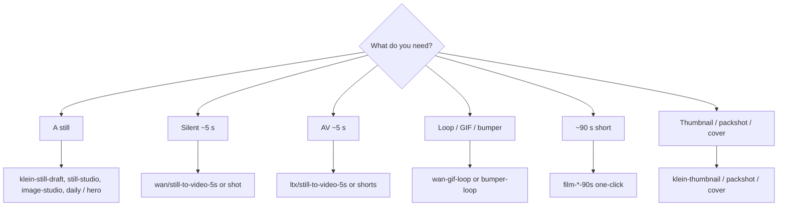

# Workflow catalog

**What's on this page**

- **Which graph** for which job
- **Sidebar tree** after `start`, plus the still vs motion vs AV decision
- **Catalog children** for Klein stills, Wan/LTX motion, creator platform Apps, 90s/DCC film, and audio
- **Notes** that apply to every seeded lab graph
- Nodes 2.0 (`Vue-corrected`) as the default canvas for every seeded graph

**What this enables**

- **Picking a filename** instead of starting from a blank canvas
- **Keeping** the [playbook](visual-generative-ai.md) a how-to, not a spreadsheet

**Who this is for:** studio users after the first still-draft Queue. Node-by-node widgets: [Workflow details](create/workflows-index.md). Encyclopedia: [Workflow node parameters](reference/workflow-nodes.md).

After `download-models` + `start`, load from Comfy’s **Workflows** sidebar under **`_lab/<lane>/`** (seeded from host `workflows/_lab/`). Filenames are short stems in lane folders (`klein/still-draft.json`); the unique id is `extra.lab_rel`. Every shipped graph is Nodes 2.0 native (`extra.workflowRendererVersion` = `Vue-corrected`). App Mode graphs also appear under Comfy’s **Apps** sidebar (`*.app.json` on disk under the same lane folder; same stem). Save your own graphs in **`_user/`**. Live `_lab/` is the git catalog (overwritten on start). A Save that landed in `_lab/` is **rescued** into `_user/` or `_user/_rescued/` on the next start. Do **not** edit raw JSON — change widgets on the canvas. Toggle Nodes 2.0 from the Comfy logo menu if you need classic LiteGraph; the JSON still loads.

Sidebar tree after start:

```text
user/default/workflows/
  _lab/
    klein/     stills, plates, identity, platform pack, dream-house, dream-house-clay, creator/…
    wan/       silent 5s, gif/bumper/sticker, first-last, vace, shot, creator/…
    ltx/       AV 5s, hook, b-roll, shorts, first-last, audio-to-video, shot, creator/…
    shorts/    go-see, still-here, switchyard (90s); tide-table / night-oven / glasshouse / last-lane / breakwater act-01…05 (7.5 min)
    dcc/       clay → print, plates, canny, depth/canny control, first-last from guide, in-canvas loaders
    optional/  a14b, longcat stub, klein-trellis2
    audio/     podcast (two-host, radio-drama, learn-episode), dub, music/rap-draft, music/rap-full
      albums/nill-bye/<album>/     nine Nill Bye albums (numbered tracks + cover + album)
      albums/drive-through/<album>/  five Drive-through albums
    inspire/   prompt-forge, cinema-rack, audio-rack, research-chat, app-forge, beat-sheet
  _user/       your graphs (never overwritten; `_rescued/` holds in-place lab edits)
```

Reusable printer blocks live in the node library after start (`custom_nodes/ez_studio_blocks/subgraphs/`): **klein-t2i-backbone**, **wan-i2v-5s**, **ltx-av-5s**, **ltx-film-shot**. Drop them from the subgraph menu instead of copy-pasting chains.



---

## Catalog

App Mode (frontend **1.41.13+**) is a widget surface on the same lab JSON. Occupancy and handoff: [ComfyUI Apps](studio-apps.md).

<div class="grid cards" markdown>

-   :material-image:{ .lg .middle } **Stills (Klein 4B)**

    ---

    Draft / hero / daily stills, identity, character, creator plates, Apps Lane A Klein.

    [:octicons-arrow-right-24: Stills catalog](create/workflows-stills.md)

-   :material-movie-open:{ .lg .middle } **Motion and AV**

    ---

    Wan 2.2 silent ~5 s, LTX-2.5 AV, GIF / bumper / sticker, creator motion plates. LTX size is ÷32.

    [:octicons-arrow-right-24: Motion catalog](create/workflows-motion.md)

-   :material-filmstrip:{ .lg .middle } **90s film and DCC**

    ---

    One-click 90s shorts, five-act 7.5 min films, plus clay → print, IC-LoRA envelopes, and in-canvas guide loaders.

    [:octicons-arrow-right-24: Film catalog](create/workflows-film.md)

-   :material-palette:{ .lg .middle } **Creator pack**

    ---

    One hundred extra platform Apps: YouTube, Instagram, TikTok, X, LinkedIn, Pinterest, Twitch, Spotify, merch, production plates.

    [:octicons-arrow-right-24: Creator catalog](create/workflows-creator.md)

-   :material-music:{ .lg .middle } **Audio**

    ---

    Podcast, dub, RAP-FIRST, Drive-through EDM. Occupancy **audio**. Do not co-resident with Klein / Wan / LTX.

    [:octicons-arrow-right-24: Audio catalog](create/workflows-audio.md)

</div>

Playbooks: [Still to motion to AV](visual-generative-ai.md), [Short films](shorts.md), [Local podcast](podcast.md), [Local dub](dub.md), [Local music](music.md). Outputs land under `${COMFY_OUTPUT_DIR}`.

=== "License"

    MiniMax H3 is **banned** (US Excluded Territory). Klein 9B and FLUX.2-dev are opt-in FLUX Non-Commercial packs, not lab UNET pins. See [Model licenses](licenses.md).

---

## Inspire (Lane A)

No UNET still. Occupancy **llm** or **none**. Full Apps Lane A Klein stills: [Stills catalog](create/workflows-stills.md).

| Workflow | What it does |
| --- | --- |
| **[inspire/prompt-forge](generated/workflows/inspire/prompt-forge.md)** | No UNET. Shared Prompt + Context, then Klein / Wan / LTX / Z-Image / LongCat / DreamX enhance preview (occupancy **llm**) |
| **[inspire/cinema-rack](generated/workflows/inspire/cinema-rack.md)** | No UNET. Splice cinematography axes into Klein / Wan / LTX (occupancy **llm**). [Cinema Rack](create/cinema-rack.md) |
| **[inspire/audio-rack](generated/workflows/inspire/audio-rack.md)** | No UNET. Splice audio/music axes into ACE-Step tags / lyrics (occupancy **llm**). [Audio Rack](create/audio-rack.md) |
| **[inspire/research-chat](generated/workflows/inspire/research-chat.md)** | Creative-process chat + web search + research subagents (occupancy **llm**). Handoff Prompt Forge |
| **[inspire/app-forge](generated/workflows/inspire/app-forge.md)** | No UNET. Clone a lab graph into live `_user/` (occupancy **llm**). [App Forge](create/app-forge.md) |
| **[inspire/beat-sheet](generated/workflows/inspire/beat-sheet.md)** | Script desk. Logline + audio policy + 18 cards. `shot-sheet` writes `films/<slug>/shots.yaml` (occupancy **none**) |

---

## Notes that apply to every lab graph

Every seeded lab graph includes an on-canvas **Note** (purpose, models, sampler, prompting tips, run steps). Video graphs emit MP4 via VHS with **`save_output: true`**; after Queue, open **Save video (MP4) — open node for preview**. LTX graphs decode audio (`LTXVAudioVAEDecode`) into the MP4. **[wan/gif-loop](generated/workflows/wan/gif-loop.md)** emits `image/gif`.

Optional Wan A14B is a Queue graph (`workflows/_lab/optional/wan/still-to-video-a14b.json`): **both** high-noise and low-noise FP8 UNETs on the canvas. Queue uses the high-noise expert at 8 Lightning-style steps (MagCache **off**) so the graph loads. Dual-expert KSampler split is the full I2V recipe after both weights exist (Comfy Templates / operator). Download `download-wan.sh run --tier a14b` and unload 5B first.

Daily loop: [Still to motion to AV](visual-generative-ai.md). Prompt shapes: [Prompting](prompting.md).
