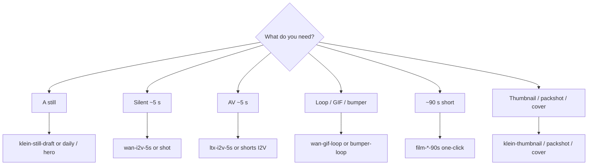

# Workflow catalog

**What's on this page**

- Which graph for which job
- Seeded Klein / Wan / LTX / Apps (Lane A vs Lane B) / 90s / creator / audio tables
- Notes that apply to every `*-lab-example`

**What this enables**

- Picking a filename instead of starting from a blank canvas
- Keeping the [playbook](visual-generative-ai.md) a how-to, not a spreadsheet

**Who this is for:** studio users after the first still-draft Queue.

After `download-models` + `start`, load from Comfy’s **Workflows** sidebar under **`_lab/<lane>/`** (seeded from host `workflows/_lab/`). Filenames end with **`-lab-example`**. App Mode graphs also appear under Comfy’s **Apps** sidebar (`*.app.json` on disk under the same lane folder; same stem). Save your own graphs in **`_user/`**. Do **not** edit live `_lab/` copies — they are overwritten on start. Do **not** edit raw JSON — change widgets on the canvas.

Sidebar tree after start:

```text
user/default/workflows/
  _lab/
    klein/     stills, plates, identity, platform pack, dream-house, dream-house-clay, …
    wan/       silent 5s, gif/bumper/sticker, flf, vace, shot
    ltx/       AV 5s, hook, b-roll, interior, weather, shorts I2V, shot
    shorts/    film-*-90s-*-lab-example.json
    dcc/       clay → print, plates, canny, iclora envelopes, FLF from guide, in-canvas loaders
    optional/  a14b, longcat stub, klein-trellis2
    audio/     podcast-*, dub-*, music-rap-draft/full
      nill-bye/phase0|1|2|3|4|5|6|7|8/   one hundred thirty-five 180 s music-rap-nill-bye-* takes
      drive-through/phase0|1|2|3|4/ eighty-five 180 s music-edm-drive-through-* EDM takes
    inspire/   prompt-forge, research-chat, beat-sheet
  _user/       your graphs (never overwritten)
```

Reusable printer blocks live in the node library after start (`custom_nodes/ez_studio_blocks/subgraphs/`): **klein-t2i-backbone**, **wan-i2v-5s**, **ltx-av-5s**, **ltx-film-shot**. Drop them from the subgraph menu instead of copy-pasting chains.



---

## Catalog

=== "Still (Klein 4B)"

    | Workflow | What it does |
    | --- | --- |
    | **klein-still-draft-lab-example** | Apache Klein 4B distilled, **768×432**, **4** steps, batch 2, prefix `ez_still_draft` |
    | **klein-still-hero-lab-example** | Same prompt + seed, **1280×704** (LTX VAE grid), more steps, prefix `ez_still_hero`. Enhance **on**. |
    | **klein-identity-sheet-lab-example** | 3-angle sheet (front / three-quarter / profile) of the identity you type. Seed **42**, Enhance **on** (identity mode), **1280×704** |
    | **klein-character-draft-lab-example** | Character still 1024×1280, style dropdown, prefix `ez_character` |
    | **klein-character-tweak-lab-example** | Klein-edit that still (LoadImage + ReferenceLatent), prefix `ez_character_tweak` |
    | **klein-talking-head-lab-example** | Klein still → LTX A2V freeze smoke. Qwen3-TTS / Wan S2V opt-in. No banned lip-sync OSS |

=== "Motion (Wan 2.2 5B)"

    | Workflow | What it does |
    | --- | --- |
    | **wan-i2v-5s-lab-example** | Silent I2V smoke, 832×480, **121** frames @ 24 fps. MagCache **draft-only** (`extra.lab_magcache`) |
    | **wan-flf-5s-lab-example** | Fun InP first-last-frame 5 s (opt-in `download-wan --tier fun-inp`). MagCache off |
    | **wan-vace-join-lab-example** | Wan 2.1 VACE 1.3B 17-frame join (`1+8n`). Opt-in `download-wan --tier vace`. MagCache off |
    | **wan-i2v-a14b-lab-example** | Optional A14B FP8: high+low UNET on canvas, Queue on high-noise 8-step (`download-wan --tier a14b`). MagCache off. Unload 5B first. Under `_lab/optional/` |
    | **klein-trellis2-lab-example** | Klein still → native TRELLIS.2 INT8 mesh (512). `download-3d --tier trellis2`. `occupancy enter trellis`. Under `_lab/optional/` |
    | **wan-t2v-5s-lab-example** | Silent T2V smoke, 121 frames (LoadImage bypassed) |
    | **wan-i2v-shot-lab-example** | Concat-safe **120** frames + last-frame SaveImage. 90s shots, or prefix `ez_shot_01..06` |

=== "AV hero (LTX-2.5)"

    | Workflow | What it does |
    | --- | --- |
    | **ltx-i2v-5s-lab-example** | ~5 s I2V, **1280×704**, native audio (Community License, $10M cap) |
    | **ltx-t2v-5s-lab-example** | ~5 s T2V AV, **1280×704** |

    !!! warning "LTX width/height must be divisible by 32"

        Broadcast 720p (**1280×720**) and 1080p (**1920×1080**) are **not** native LTX VAE sizes (720/16=45, then the next `/2` patch fails). Lab landscape graphs use **1280×704**. Klein **I2V feeders** (`klein-still-hero`, 90s film identity) are **1280×704**. Thumbnails/end-cards may stay 1280×720. Typing 720 or 1080 on LTX widgets is **auto-snapped** (704 / 1056) by `ez_ltx_spatial` — prefer 704 so you skip the extra crop. Portrait shorts I2V is **768×1280**. See [Troubleshooting](troubleshooting.md).

=== "Apps (Lane A / Lane B)"

    App Mode (frontend **1.41.13+**) is a widget surface on the same `*-lab-example` JSON. Occupancy and handoff: [ComfyUI Apps](studio-apps.md).

    Lane A — Inspire (occupancy **klein**)

    | Workflow | What it does |
    | --- | --- |
    | **klein-still-draft-lab-example** | Spark Still. 768×432, Enhance on. Prefix `ez_still_draft` |
    | **klein-identity-sheet-lab-example** | 3-angle sheet of the identity you type, seed **42**, **1280×704** |
    | **klein-storyboard-6up-lab-example** | Six new cameras of one scene (`ez_board_01`…`06`) |
    | **klein-dream-house-lab-example** | World bible. Ten Instagram 4:5 stills: virtual tour of one place (tower, foyer, rooms, terrace, drone, study) |
    | **klein-dream-house-clay-lab-example** | Same tour as Klein **edit** of clay (`ez_house_clay_01`…`10`). `start` seeds plates; optional `house-views` dump. Prefix `ez_dream_house_clay_*` |
    | **klein-character-draft-lab-example** | Character still, 1024×1280, style dropdown, prefix `ez_character` |
    | **klein-character-tweak-lab-example** | Edit `ez_character_*.png` with a change prompt (ReferenceLatent) |
    | **klein-hook-still-lab-example** | Vertical 9:16 hook still |
    | **prompt-forge-lab-example** | No UNET. Klein / Wan / LTX enhance preview (occupancy **llm**) |
    | **research-chat-lab-example** | Creative-process chat + web search + research subagents (occupancy **llm**). Handoff Prompt Forge |
    | **beat-sheet-lab-example** | Script desk. Logline + audio policy + 18 cards. `shot-sheet` writes `films/<slug>/shots.yaml` (occupancy **none**) |

    Lane B — Produce

    | Workflow | Occupancy | What it does |
    | --- | --- | --- |
    | **klein-still-daily-lab-example** | klein | Daily still. Click UNET to swap distilled / NVFP4 / base. Prefix `ez_still_app` |
    | **klein-still-hero-lab-example** | klein | Same prompt + seed, **1280×704**, prefix `ez_still_hero` |
    | **wan-gif-loop-lab-example** | wan | Wan 5B I2V GIF (49 frames @ 12 fps, ping-pong). Prefix `ez_gif_loop` |
    | **wan-i2v-5s-lab-example** | wan | Silent 5 s I2V smoke, 121 frames |
    | **ltx-i2v-5s-lab-example** | ltx | AV 5 s I2V, **1280×704** |
    | **klein-platform-pack-lab-example** | klein | Six plates, one identity (`ez_pack_*`). Independent T2I; Ctrl+B unused groups |

=== "90s shorts"

    | Workflow | What it does |
    | --- | --- |
    | **film-go-see-90s-run-lab-example** | **One-click** first-person parkour 90s: Klein identity + 18 LTX 5.00s AV prints + stitch |
    | **film-still-here-90s-lab-example** | **One-click** household morning 90s (same shape) |
    | **film-switchyard-90s-lab-example** | **One-click** night freight-yard 90s (same shape) |
    | **wan-i2v-shot-lab-example** | Optional silent rehearsal / six-shot concat demo |
    | **ltx-i2v-shot-lab-example** | Generic 5.00 s AV print (non-film) |

    Full loop: [90s shorts](shorts.md). One file per film — Queue once.

=== "Creator toolkit"

    Pack 1

    | Workflow | What it does |
    | --- | --- |
    | **klein-shorts-still-lab-example** | Vertical 9:16 Shorts still (`ez_shorts_still`) |
    | **wan-shorts-i2v-lab-example** | Vertical silent I2V from that still |
    | **ltx-shorts-i2v-lab-example** | Vertical AV I2V (~5 s) with world audio |
    | **klein-thumbnail-lab-example** | YouTube thumbnail still 1280×720 |
    | **klein-product-packshot-lab-example** | Clean product packshot 1:1 |
    | **klein-before-after-lab-example** | Before plate, after Klein-edit of the same mug |
    | **klein-style-lock-lab-example** | One penthouse, four cameras, locked inventory |
    | **wan-bumper-loop-lab-example** | Loopable MP4 bumper (ping-pong) |
    | **ltx-broll-ambient-lab-example** | Ambient B-roll AV plate (~5 s) |
    | **klein-storyboard-6up-lab-example** | Six storyboard frames of one rooftop from new cameras |

    Pack 2 — stills and plates

    | Workflow | What it does |
    | --- | --- |
    | **klein-endcard-cta-lab-example** | End-card / CTA plate 16:9 |
    | **klein-quote-bg-lab-example** | Quote-card background 1:1 |
    | **klein-og-blog-lab-example** | Blog / Open Graph hero |
    | **klein-podcast-cover-lab-example** | Podcast cover 1:1 |
    | **klein-banner-wide-lab-example** | Channel / LinkedIn banner ~3:1 |
    | **klein-ig-square-lab-example** | Instagram 1:1 still |
    | **klein-hook-still-lab-example** | 9:16 first-frame hook |
    | **klein-lower-third-bg-lab-example** | Lower-third-safe 16:9 plate |
    | **klein-food-tabletop-lab-example** | Food / tabletop 4:5 |
    | **klein-lighting-trio-lab-example** | Same subject, three lights (SHOT KEY is the identity plate) |
    | **klein-time-of-day-lab-example** | Dusk plate, then dawn / noon / night edits |
    | **klein-camera-angles-lab-example** | Wide / medium / close of one subject, new cameras |
    | **klein-color-moods-lab-example** | Warm plate, then three grade edits |

    Pack 2 — motion / AV

    | Workflow | What it does |
    | --- | --- |
    | **wan-orbit-i2v-lab-example** | Slow orbit I2V ~5 s |
    | **wan-push-in-i2v-lab-example** | Hero push-in I2V ~5 s |
    | **wan-parallax-i2v-lab-example** | Subtle parallax I2V ~5 s |
    | **wan-sticker-loop-lab-example** | Looping sticker MP4 |
    | **ltx-weather-broll-lab-example** | Rain / wind B-roll AV |
    | **ltx-interior-ambience-lab-example** | Interior room-tone AV |
    | **ltx-hook-av-lab-example** | ~5 s AV cold open |

=== "Audio (podcast / dub / rap / EDM)"

    Occupancy **audio**. Opt-in weights (`download-podcast` / `download-dub` / `download-music`). Do not co-resident with Klein / Wan / LTX. Cover art is a later Klein session. Graphs still save FLAC + MP3; YouTube still-image MP4 is host `audio-still-video` after Queue. Nill Bye / Drive-through takes nest under `_lab/audio/<artist>/phaseN/` and save as `Artist - Song Title - vN`. Playbook: [Local podcast](podcast.md), [Local dub](dub.md), [Local music](music.md).

    | Workflow | What it does |
    | --- | --- |
    | **dub-localize-lab-example** | Multi-speaker clone-and-translate. Pick or upload source media. Rights gate. **Dub status** after Queue. Duration-locked `ez_dub_yt` for YouTube Languages. Prefix `ez_dub_mix` |
    | **podcast-audio-first-lab-example** | Two-host episode. Kokoro stock voices + ACE-Step instrumental bed. Prefix `ez_podcast_ep` |
    | **podcast-radio-drama-lab-example** | One-graph radio drama. Sting + bed stay instrumental. Prefix `ez_radio_ep` |
    | **music-rap-draft-lab-example** | ACE-Step rap draft **32 s** boom-bap 88 (`ez_rap_draft`) |
    | **music-rap-full-lab-example** | ACE-Step rap full **96 s** boom-bap 88 (`ez_rap_full`). Queue draft first |

    phase0 — Nill Bye lab catalog. Queue on its own. Full table: [Local music](music.md).

    | Workflow | What it does |
    | --- | --- |
    | **music-rap-nill-bye-lab-coat-lab-example** | **180 s** diss, boom-bap 88. Nill Bye lab-coat roast of Rake (`Nill Bye - Lab Coat Lecture - v0`). `_lab/audio/nill-bye/phase0/` |
    | **music-rap-nill-bye-peer-review-lab-example** | **180 s** diss, boom-bap 88, `[spoken word]` intro (`Nill Bye - Peer Review - v0`) |
    | **music-rap-nill-bye-feels-lab-example** | **180 s** diss, lo-fi 86 (`Nill Bye - In His Feels - v0`) |
    | **music-rap-nill-bye-fake-cool-lab-example** | **180 s** diss, trap 140 (`Nill Bye - Fake Cool - v0`) |
    | **music-rap-nill-bye-hypothesis-lab-example** | **180 s** diss, boom-bap 92, seed 7 (`Nill Bye - Hypothesis vs Rumor - v0`) |
    | **music-rap-nill-bye-control-group-lab-example** | **180 s** diss, boom-bap 88 (`Nill Bye - Control Group - v0`). Uncontrolled variable |
    | **music-rap-nill-bye-sample-size-lab-example** | **180 s** diss, boom-bap 92, seed 11 (`Nill Bye - Sample Size - v0`) |
    | **music-rap-nill-bye-placebo-lab-example** | **180 s** diss, trap 140, seed 13 (`Nill Bye - Placebo - v0`) |
    | **music-rap-nill-bye-error-bars-lab-example** | **180 s** diss, boom-bap 88, seed 17 (`Nill Bye - Error Bars - v0`) |
    | **music-rap-nill-bye-lab-notebook-lab-example** | **180 s** diss, boom-bap 92, seed 19 (`Nill Bye - Lab Notebook - v0`) |
    | **music-rap-nill-bye-office-hours-lab-example** | **180 s** diss, lo-fi 86, seed 23 (`Nill Bye - Office Hours - v0`) |
    | **music-rap-nill-bye-grant-denied-lab-example** | **180 s** diss, boom-bap 88, `[spoken word]` intro, seed 29 (`Nill Bye - Grant Denied - v0`) |
    | **music-rap-nill-bye-contamination-lab-example** | **180 s** diss, trap 140, seed 31 (`Nill Bye - Contamination - v0`) |
    | **music-rap-nill-bye-double-blind-lab-example** | **180 s** diss, boom-bap 92, seed 37 (`Nill Bye - Double Blind - v0`) |
    | **music-rap-nill-bye-replicate-lab-example** | **180 s** diss, boom-bap 88, seed 7 (`Nill Bye - Replicate or Retract - v0`) |

    phase1 — Style pack (same dry booth; not trap/EDM). Queue on its own. Full table: [Local music](music.md).

    | Workflow | What it does |
    | --- | --- |
    | **music-rap-nill-bye-citation-needed-lab-example** | **180 s** jazz hop 90 (`Nill Bye - Citation Needed - v1`). Citation needed |
    | **music-rap-nill-bye-p-hacking-lab-example** | **180 s** g-funk 98 (`Nill Bye - P-Hacking - v1`) |
    | **music-rap-nill-bye-null-result-lab-example** | **180 s** reggae 92 (`Nill Bye - Null Result - v1`) |
    | **music-rap-nill-bye-expired-reagent-lab-example** | **180 s** neo-soul 84 (`Nill Bye - Expired Reagent - v1`) |
    | **music-rap-nill-bye-lab-safety-lab-example** | **180 s** rap rock 168 (`Nill Bye - Lab Safety - v1`) |
    | **music-rap-nill-bye-rumor-mill-lab-example** | **180 s** industrial 108 (`Nill Bye - Rumor Mill - v1`) |
    | **music-rap-nill-bye-gym-selfie-lab-example** | **180 s** afrobeat 110 (`Nill Bye - Gym Selfie - v1`) |
    | **music-rap-nill-bye-rented-drip-lab-example** | **180 s** synthwave 104 (`Nill Bye - Rented Drip - v1`) |
    | **music-rap-nill-bye-clout-diet-lab-example** | **180 s** trip-hop 86 (`Nill Bye - Clout Diet - v1`) |
    | **music-rap-nill-bye-mood-forecast-lab-example** | **180 s** cinematic 76 (`Nill Bye - Mood Forecast - v1`) |
    | **music-rap-nill-bye-algorithm-lab-example** | **180 s** funk 114 (`Nill Bye - Algorithm - v1`) |
    | **music-rap-nill-bye-story-time-lab-example** | **180 s** blues 74, `[spoken word]` intro (`Nill Bye - Story Time - v1`) |
    | **music-rap-nill-bye-caption-lab-example** | **180 s** chiptune 100 (`Nill Bye - Caption vs Data - v1`) |
    | **music-rap-nill-bye-energy-drink-lab-example** | **180 s** brass band 120 (`Nill Bye - Energy Drink - v1`) |
    | **music-rap-nill-bye-campfire-lab-example** | **180 s** folk 82 (`Nill Bye - Campfire Rumor - v1`) |

    phase2 — Trap / EDM pack (rap **over** club beds, no autotune). Queue on its own.

    | Workflow | What it does |
    | --- | --- |
    | **music-rap-nill-bye-false-drop-lab-example** | **180 s** dark trap 140 (`Nill Bye - False Drop - v2`) |
    | **music-rap-nill-bye-velvet-rope-lab-example** | **180 s** festival trap 150 (`Nill Bye - Velvet Rope - v2`) |
    | **music-rap-nill-bye-fog-machine-lab-example** | **180 s** rage 148 (`Nill Bye - Fog Machine - v2`) |
    | **music-rap-nill-bye-guest-list-lab-example** | **180 s** phonk 132 (`Nill Bye - Guest List - v2`) |
    | **music-rap-nill-bye-sparkler-lab-example** | **180 s** trap 145 (`Nill Bye - Sparkler Science - v2`) |
    | **music-rap-nill-bye-bottle-service-lab-example** | **180 s** house 126 (`Nill Bye - Bottle Service - v2`) |
    | **music-rap-nill-bye-strobe-claim-lab-example** | **180 s** techno 132 (`Nill Bye - Strobe Claim - v2`) |
    | **music-rap-nill-bye-amen-rumor-lab-example** | **180 s** drum and bass 174 (`Nill Bye - Amen Rumor - v2`) |
    | **music-rap-nill-bye-wobble-alibi-lab-example** | **180 s** dubstep 140 (`Nill Bye - Wobble Alibi - v2`) |
    | **music-rap-nill-bye-supersaw-flex-lab-example** | **180 s** future bass 148 (`Nill Bye - Supersaw Flex - v2`) |
    | **music-rap-nill-bye-laser-show-lab-example** | **180 s** electro house 128 (`Nill Bye - Laser Show - v2`) |
    | **music-rap-nill-bye-two-step-lab-example** | **180 s** UK garage 130 (`Nill Bye - Two-Step Alibi - v2`) |
    | **music-rap-nill-bye-jersey-bounce-lab-example** | **180 s** jersey club 140 (`Nill Bye - Jersey Bounce - v2`) |
    | **music-rap-nill-bye-kick-split-lab-example** | **180 s** hardstyle 150 (`Nill Bye - Kick-Split Myth - v2`) |
    | **music-rap-nill-bye-uplift-rumor-lab-example** | **180 s** trance 138 (`Nill Bye - Uplifting Rumor - v2`) |

    phase3 — Civic variety (punch-up satire of a public official; no disability / race / faith punch-down). Queue on its own. Full table: [Local music](music.md).

    | Workflow | What it does |
    | --- | --- |
    | **music-rap-nill-bye-frozen-ercot-lab-example** | **180 s** boom-bap 88 (`Nill Bye - Frozen Ercot - v3`). Uri / ERCOT |
    | **music-rap-nill-bye-abject-failure-lab-example** | **180 s** boom-bap 86, `[spoken word]` (`Nill Bye - Abject Failure - v3`) |
    | **music-rap-nill-bye-six-week-clock-lab-example** | **180 s** jazz hop 90 (`Nill Bye - Six Week Clock - v3`) |
    | **music-rap-nill-bye-no-bid-wire-lab-example** | **180 s** industrial 108 (`Nill Bye - No-Bid Wire - v3`) |
    | **music-rap-nill-bye-gavel-theater-lab-example** | **180 s** brass band 112 (`Nill Bye - Gavel Theater - v3`) |
    | **music-rap-nill-bye-property-hymn-lab-example** | **180 s** folk 82 (`Nill Bye - Property Hymn - v3`) |
    | **music-rap-nill-bye-voucher-raid-lab-example** | **180 s** country 100 (`Nill Bye - Voucher Raid - v3`) |
    | **music-rap-nill-bye-uninsured-blues-lab-example** | **180 s** blues 74 (`Nill Bye - Uninsured Blues - v3`) |
    | **music-rap-nill-bye-locked-stacks-lab-example** | **180 s** lo-fi 86 (`Nill Bye - Locked Stacks - v3`) |
    | **music-rap-nill-bye-mask-order-lab-example** | **180 s** neo-soul 84 (`Nill Bye - Mask Order - v3`) |
    | **music-rap-nill-bye-mid-decade-map-lab-example** | **180 s** chiptune 100 (`Nill Bye - Mid Decade Map - v3`) |
    | **music-rap-nill-bye-rack-tax-lab-example** | **180 s** synthwave 104 (`Nill Bye - Rack Tax - v3`) |
    | **music-rap-nill-bye-wudu-letter-lab-example** | **180 s** gospel 78 (`Nill Bye - Wudu Letter - v3`). Smear called out |
    | **music-rap-nill-bye-fourth-term-lab-example** | **180 s** cinematic 76 (`Nill Bye - Fourth Term - v3`) |
    | **music-rap-nill-bye-campus-cordon-lab-example** | **180 s** rap rock 168 (`Nill Bye - Campus Cordon - v3`) |

    phase4 — Civic club (rap over club beds, same punch-up rule). Queue on its own.

    | Workflow | What it does |
    | --- | --- |
    | **music-rap-nill-bye-lone-star-tab-lab-example** | **180 s** dark trap 140 (`Nill Bye - Lone Star Tab - v4`) |
    | **music-rap-nill-bye-river-buoy-lab-example** | **180 s** rage 148 (`Nill Bye - River Buoy - v4`) |
    | **music-rap-nill-bye-bus-receipt-lab-example** | **180 s** phonk 132 (`Nill Bye - Bus Receipt - v4`) |
    | **music-rap-nill-bye-guard-detail-lab-example** | **180 s** trap 145 (`Nill Bye - Guard Detail - v4`) |
    | **music-rap-nill-bye-chase-wreck-lab-example** | **180 s** house 126 (`Nill Bye - Chase Wreck - v4`) |
    | **music-rap-nill-bye-frequency-drop-lab-example** | **180 s** drum and bass 174 (`Nill Bye - Frequency Drop - v4`) |
    | **music-rap-nill-bye-permitless-lab-example** | **180 s** jersey club 140 (`Nill Bye - Permitless - v4`) |
    | **music-rap-nill-bye-trigger-clock-lab-example** | **180 s** future bass 148 (`Nill Bye - Trigger Clock - v4`) |
    | **music-rap-nill-bye-disaster-stamp-lab-example** | **180 s** techno 132, `[spoken word]` (`Nill Bye - Disaster Stamp - v4`) |
    | **music-rap-nill-bye-windmill-blame-lab-example** | **180 s** dubstep 140 (`Nill Bye - Windmill Blame - v4`) |
    | **music-rap-nill-bye-yass-primary-lab-example** | **180 s** electro house 128 (`Nill Bye - Yass Primary - v4`) |
    | **music-rap-nill-bye-hold-request-lab-example** | **180 s** UK garage 130 (`Nill Bye - Hold Request - v4`) |
    | **music-rap-nill-bye-sharia-plank-lab-example** | **180 s** hardstyle 150 (`Nill Bye - Sharia Plank - v4`). Empty scare |
    | **music-rap-nill-bye-invasion-hymn-lab-example** | **180 s** trance 138 (`Nill Bye - Invasion Hymn - v4`) |
    | **music-rap-nill-bye-demolish-hook-lab-example** | **180 s** festival trap 150 (`Nill Bye - Demolish Hook - v4`) |

    Drive-through EDM pack (American festival set, not rap over a club bed). Queue on its own; table order is the set list (`phase0/` hour 1, `phase1/` hour 2, `phase2/` hour 3 headliner, `phase3/` hour 4 afterparty, `phase4/` Secret Homage). Drop early, dirty pyro on every drop, chest-sub bass. Phase2, phase3, and phase4 vary Comfy node placement across five layouts. Full table: [Local music](music.md).

    | Workflow | What it does |
    | --- | --- |
    | **music-edm-drive-through-night-window-lab-example** | **180 s** bass house 145 (`Drive-through - Night Window - v0`). Opener, dirty 808 pyro |
    | **music-edm-drive-through-open-lane-lab-example** | **180 s** festival bass 152 (`Drive-through - Open Lane - v0`). Drop-first ID |
    | **music-edm-drive-through-exit-seven-lab-example** | **180 s** electro house 142 (`Drive-through - Exit Seven - v0`). Filter mix-in, dirty pyro |
    | **music-edm-drive-through-skyline-pass-lab-example** | **180 s** progressive house 145 (`Drive-through - Skyline Pass - v0`). Drop-first anthem |
    | **music-edm-drive-through-on-ramp-lab-example** | **180 s** festival bass 155 (`Drive-through - On-Ramp - v0`). Reverse-bass pyro |
    | **music-edm-drive-through-tunnel-bass-lab-example** | **180 s** dirty bass 150 (`Drive-through - Tunnel Bass - v0`). Three pyro drops |
    | **music-edm-drive-through-wide-open-lab-example** | **180 s** big room 150 (`Drive-through - Wide Open - v0`). DJ shout treat |
    | **music-edm-drive-through-overpass-lab-example** | **180 s** riddim 150 (`Drive-through - Overpass - v0`). Drop-first wobble pyro |
    | **music-edm-drive-through-second-wave-lab-example** | **180 s** festival remix 150 (`Drive-through - Second Wave - v0`). Vocal-chop treat |
    | **music-edm-drive-through-freight-pulse-lab-example** | **180 s** drumstep 176 (`Drive-through - Freight Pulse - v0`) |
    | **music-edm-drive-through-keep-going-lab-example** | **180 s** drumstep 170 (`Drive-through - Keep Going - v0`). Triple pyro peak |
    | **music-edm-drive-through-horizon-kick-lab-example** | **180 s** festival bass 165 (`Drive-through - Horizon Kick - v0`). Drop-first reverse bass |
    | **music-edm-drive-through-clean-wreckage-lab-example** | **180 s** dirty electro 150 (`Drive-through - Clean Wreckage - v0`). Three pyro wrecks |
    | **music-edm-drive-through-heart-lane-lab-example** | **180 s** future bass 145 (`Drive-through - Heart Lane - v0`). Drop-first warm 808 |
    | **music-edm-drive-through-dawn-receipt-lab-example** | **180 s** progressive house 140 (`Drive-through - Dawn Receipt - v0`). Hour-1 closer |
    | **music-edm-drive-through-rumble-strip-lab-example** | **180 s** bass house 140 (`Drive-through - Rumble Strip - v1`). Hour-2 opener |
    | **music-edm-drive-through-low-lane-lab-example** | **180 s** festival bass 144 (`Drive-through - Low Lane - v1`). Chest sub pyro |
    | **music-edm-drive-through-warm-merge-lab-example** | **180 s** future bass 148 (`Drive-through - Warm Merge - v1`) |
    | **music-edm-drive-through-colour-span-lab-example** | **180 s** dirty electro 150 (`Drive-through - Colour Span - v1`) |
    | **music-edm-drive-through-garage-ticket-lab-example** | **180 s** festival trap 140 (`Drive-through - Garage Ticket - v1`) |
    | **music-edm-drive-through-liquid-grade-lab-example** | **180 s** drumstep 174 (`Drive-through - Liquid Grade - v1`) |
    | **music-edm-drive-through-jump-bay-lab-example** | **180 s** brostep 150 (`Drive-through - Jump Bay - v1`). Dirty growl pyro |
    | **music-edm-drive-through-psy-median-lab-example** | **180 s** big room 145 (`Drive-through - Psy Median - v1`) |
    | **music-edm-drive-through-groove-mile-lab-example** | **180 s** slap house 144 (`Drive-through - Groove Mile - v1`) |
    | **music-edm-drive-through-donk-ramp-lab-example** | **180 s** dirty electro 150 (`Drive-through - Donk Ramp - v1`) |
    | **music-edm-drive-through-bounce-booth-lab-example** | **180 s** melbourne bounce 140 (`Drive-through - Bounce Booth - v1`) |
    | **music-edm-drive-through-toll-growl-lab-example** | **180 s** tearout 150 (`Drive-through - Toll Growl - v1`) |
    | **music-edm-drive-through-night-oil-lab-example** | **180 s** hybrid trap 142 (`Drive-through - Night Oil - v1`) |
    | **music-edm-drive-through-chest-pass-lab-example** | **180 s** festival bass 150 (`Drive-through - Chest Pass - v1`) |
    | **music-edm-drive-through-sunrise-sub-lab-example** | **180 s** progressive house 140 (`Drive-through - Sunrise Sub - v1`). Encore closer |
    | **music-edm-drive-through-lantern-merge-lab-example** | **180 s** bounce house 150 (`Drive-through - Lantern Merge - v2`). Hour-3 opener |
    | **music-edm-drive-through-firefly-lane-lab-example** | **180 s** color bass 152 (`Drive-through - Firefly Lane - v2`) |
    | **music-edm-drive-through-canopy-bounce-lab-example** | **180 s** bass house 148 (`Drive-through - Canopy Bounce - v2`) |
    | **music-edm-drive-through-grove-wreck-lab-example** | **180 s** future riddim 150 (`Drive-through - Grove Wreck - v2`) |
    | **music-edm-drive-through-moss-sub-lab-example** | **180 s** space bass 150 (`Drive-through - Moss Sub - v2`) |
    | **music-edm-drive-through-fern-stack-lab-example** | **180 s** hybrid bass 155 (`Drive-through - Fern Stack - v2`) |
    | **music-edm-drive-through-pollen-kick-lab-example** | **180 s** drumstep 174 (`Drive-through - Pollen Kick - v2`) |
    | **music-edm-drive-through-cedar-growl-lab-example** | **180 s** riddim 150 (`Drive-through - Cedar Growl - v2`) |
    | **music-edm-drive-through-moon-ramp-lab-example** | **180 s** wave bass 148 (`Drive-through - Moon Ramp - v2`) |
    | **music-edm-drive-through-trail-bounce-lab-example** | **180 s** slap house 150 (`Drive-through - Trail Bounce - v2`) |
    | **music-edm-drive-through-dew-wreck-lab-example** | **180 s** neuro bass 172 (`Drive-through - Dew Wreck - v2`) |
    | **music-edm-drive-through-sap-stack-lab-example** | **180 s** festival bass 165 (`Drive-through - Sap Stack - v2`) |
    | **music-edm-drive-through-glade-split-lab-example** | **180 s** dirty electro 150 (`Drive-through - Glade Split - v2`) |
    | **music-edm-drive-through-root-chest-lab-example** | **180 s** chest bass 148 (`Drive-through - Root Chest - v2`) |
    | **music-edm-drive-through-ember-crest-lab-example** | **180 s** festival bass 165 (`Drive-through - Ember Crest - v2`). Headliner closer |
    | **music-edm-drive-through-brake-fade-lab-example** | **180 s** dirty bass 150 (`Drive-through - Brake Fade - v3`). Hour-4 opener |
    | **music-edm-drive-through-diesel-hum-lab-example** | **180 s** bass house 152 (`Drive-through - Diesel Hum - v3`). Dual-action pedal |
    | **music-edm-drive-through-axle-grind-lab-example** | **180 s** tearout 155 (`Drive-through - Axle Grind - v3`) |
    | **music-edm-drive-through-weigh-station-lab-example** | **180 s** festival bass 158 (`Drive-through - Weigh Station - v3`) |
    | **music-edm-drive-through-black-ice-lab-example** | **180 s** riddim 160 (`Drive-through - Black Ice - v3`) |
    | **music-edm-drive-through-high-beams-lab-example** | **180 s** hybrid bass 165 (`Drive-through - High Beams - v3`). Dual-action pedal |
    | **music-edm-drive-through-chain-hook-lab-example** | **180 s** brostep 168 (`Drive-through - Chain Hook - v3`) |
    | **music-edm-drive-through-grit-plate-lab-example** | **180 s** slap house 150 (`Drive-through - Grit Plate - v3`) |
    | **music-edm-drive-through-steel-grate-lab-example** | **180 s** drumstep 172 (`Drive-through - Steel Grate - v3`) |
    | **music-edm-drive-through-rest-bay-lab-example** | **180 s** chest bass 155 (`Drive-through - Rest Bay - v3`). Dual-action pedal |
    | **music-edm-drive-through-haul-crate-lab-example** | **180 s** hybrid trap 170 (`Drive-through - Haul Crate - v3`) |
    | **music-edm-drive-through-night-splice-lab-example** | **180 s** wave bass 152 (`Drive-through - Night Splice - v3`) |
    | **music-edm-drive-through-torque-bay-lab-example** | **180 s** neuro bass 176 (`Drive-through - Torque Bay - v3`) |
    | **music-edm-drive-through-spare-drum-lab-example** | **180 s** festival bass 165 (`Drive-through - Spare Drum - v3`). Dual-action pedal |
    | **music-edm-drive-through-oil-pan-lab-example** | **180 s** bounce house 150 (`Drive-through - Oil Pan - v3`) |
    | **music-edm-drive-through-curb-check-lab-example** | **180 s** drumstep 174 (`Drive-through - Curb Check - v3`) |
    | **music-edm-drive-through-last-exit-lab-example** | **180 s** dirty bass 160 (`Drive-through - Last Exit - v3`). Dual-action pedal |
    | **music-edm-drive-through-asphalt-heart-lab-example** | **180 s** chest bass 155 (`Drive-through - Asphalt Heart - v3`) |
    | **music-edm-drive-through-clutch-slam-lab-example** | **180 s** tearout 168 (`Drive-through - Clutch Slam - v3`). Dual-action pedal |
    | **music-edm-drive-through-trailer-hitch-lab-example** | **180 s** festival bass 165 (`Drive-through - Trailer Hitch - v3`). Hour-4 closer |
    | **music-edm-drive-through-hush-lane-lab-example** | **180 s** dirty dubstep 140 (`Drive-through - Hush Lane - v4`). Secret Homage opener |
    | **music-edm-drive-through-cipher-lock-lab-example** | **180 s** brostep 140 (`Drive-through - Cipher Lock - v4`) |
    | **music-edm-drive-through-ghost-dock-lab-example** | **180 s** riddim 140 (`Drive-through - Ghost Dock - v4`) |
    | **music-edm-drive-through-sealed-ramp-lab-example** | **180 s** tearout 145 (`Drive-through - Sealed Ramp - v4`) |
    | **music-edm-drive-through-fog-vault-lab-example** | **180 s** electro house 142 (`Drive-through - Fog Vault - v4`) |
    | **music-edm-drive-through-dummy-light-lab-example** | **180 s** festival bass 145 (`Drive-through - Dummy Light - v4`) |
    | **music-edm-drive-through-quiet-wreck-lab-example** | **180 s** dirty bass 140 (`Drive-through - Quiet Wreck - v4`) |
    | **music-edm-drive-through-off-ledger-lab-example** | **180 s** drumstep 174 (`Drive-through - Off Ledger - v4`) |
    | **music-edm-drive-through-back-alley-lab-example** | **180 s** neuro bass 172 (`Drive-through - Back Alley - v4`) |
    | **music-edm-drive-through-cellar-kick-lab-example** | **180 s** dirty dubstep 148 (`Drive-through - Cellar Kick - v4`) |
    | **music-edm-drive-through-hidden-booth-lab-example** | **180 s** hybrid trap 140 (`Drive-through - Hidden Booth - v4`) |
    | **music-edm-drive-through-coded-sub-lab-example** | **180 s** chest bass 140 (`Drive-through - Coded Sub - v4`). Dual-action pedal |
    | **music-edm-drive-through-shadow-coil-lab-example** | **180 s** neuro bass 150 (`Drive-through - Shadow Coil - v4`) |
    | **music-edm-drive-through-mute-pyro-lab-example** | **180 s** dirty electro 150 (`Drive-through - Mute Pyro - v4`) |
    | **music-edm-drive-through-unlisted-row-lab-example** | **180 s** drumstep 176 (`Drive-through - Unlisted Row - v4`) |
    | **music-edm-drive-through-night-cipher-lab-example** | **180 s** wave bass 140 (`Drive-through - Night Cipher - v4`) |
    | **music-edm-drive-through-blank-stencil-lab-example** | **180 s** festival trap 140 (`Drive-through - Blank Stencil - v4`) |
    | **music-edm-drive-through-blind-stamp-lab-example** | **180 s** riddim 150 (`Drive-through - Blind Stamp - v4`) |
    | **music-edm-drive-through-cold-cache-lab-example** | **180 s** hybrid bass 142 (`Drive-through - Cold Cache - v4`) |
    | **music-edm-drive-through-secret-homage-lab-example** | **180 s** dirty dubstep 140 (`Drive-through - Secret Homage - v4`). Album closer |

=== "DCC (clay → print)"

    | Workflow | What it does |
    | --- | --- |
    | **klein-from-clay-lab-example** | Klein 4B edit of a guide-pack `first.png`. Enhance **on**, seed **42**, **1280×704**. Prefix `ez_clay_hero`. Then `overlay-qc`. Occupancy: dump while Comfy is **down**. |
    | **klein-from-clay-plates-lab-example** | One clay still → four plates (hero 704, packshot 1:1, IG 4:5, shorts 9:16). Prefix `ez_clay_pack_*`. |
    | **klein-from-canny-lab-example** | Klein 4B edit of `canny.png`. Prefix `ez_canny_hero`. Handoff: `ltx-iclora-canny`. |
    | **klein-dream-house-clay-lab-example** | Instagram 4:5 Path B: ten Klein edits of `house-views` clay (1024×1280). Not an LTX pack. |
    | **ltx-iclora-depth-5s-lab-example** | Lab envelope for a 5.00s depth-guided LTX print. Official Union Control graph is **Templates → LTX-2.5**. Opt-in `download-ltx --tier iclora`. MagCache off. Distilled-only. Joint AV is a world bed. |
    | **ltx-iclora-canny-5s-lab-example** | Same envelope; wire `canny.mp4`. |
    | **ltx-iclora-depth-shorts-lab-example** | Depth envelope at **768×1280**. Dump with `export-guides --width 768 --height 1280`. |
    | **wan-flf-from-guide-lab-example** | Fun InP first+last from the pack. Opt-in `download-wan --tier fun-inp`. MagCache off. |
    | **klein-from-guide-loader-lab-example** | Stay on `:8188`. `EZDCCLoadGuideStill` + occupancy gate. Prefix `ez_guide_hero`. |
    | **ltx-iclora-from-guide-loader-lab-example** | Envelope from loaders + `depth.mp4` path. MagCache off. Distilled-only. Prefix `ez_iclora_guide`. |
    | **trellis-from-klein-still-lab-example** | Still pack `plate=mug` → native TRELLIS.2 INT8. Output `assets/objects/_lab-mug/`. Occupancy **trellis**. |
    | **audio-finish-lab-example** | Picture-lock stem mix desk. Occupancy **audio**. Host `stem-mix.sh` (duck −15 dB, YouTube loudnorm). |

    Operator loop: [DCC guide pack](dcc-workflows.md). Stay on `:8188`: [Stay in Comfy after a Blender dump](learn/comfy-first-blender.md). Playbook: [Clay to finish](learn/clay-to-finish.md). Stills: [Blender creator suite](learn/blender-creator.md).

=== "License"

    MiniMax H3 is **banned** (US Excluded Territory). Klein 9B and FLUX.2-dev are not defaults. See [Model licenses](licenses.md).

---

## Notes that apply to every lab graph

Every **\*-lab-example** graph includes an on-canvas **Note** (purpose, models, sampler, prompting tips, run steps). Video graphs emit MP4 via VHS with **`save_output: true`**; after Queue, open **Save video (MP4) — open node for preview**. LTX graphs decode audio (`LTXVAudioVAEDecode`) into the MP4. **wan-gif-loop-lab-example** emits `image/gif`.

Optional Wan A14B is a Queue graph (`workflows/_lab/optional/wan-i2v-a14b-lab-example.json`): **both** high-noise and low-noise FP8 UNETs on the canvas. Queue uses the high-noise expert at 8 Lightning-style steps (MagCache **off**) so the graph loads. Dual-expert KSampler split is the full I2V recipe after both weights exist (Comfy Templates / operator). Download `download-wan.sh run --tier a14b` and unload 5B first.

Daily loop: [Still to motion to AV](visual-generative-ai.md). Prompt shapes: [Prompting](prompting.md).
