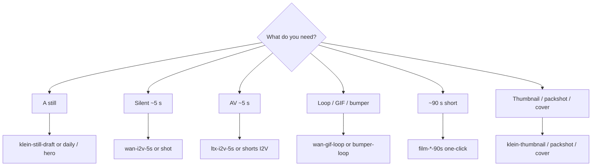

# Workflow catalog

**What's on this page**

- Which graph for which job
- Seeded Klein / Wan / LTX / Apps (Lane A vs Lane B) / 90s / creator / audio tables
- Notes that apply to every `*-lab-example`

**What this enables**

- Picking a filename instead of starting from a blank canvas
- Keeping the [playbook](visual-generative-ai.md) a how-to, not a spreadsheet

**Who this is for:** studio users after the first still-draft Queue.

After `download-models` + `start`, load from Comfy’s **Workflows** sidebar under **`_lab/<lane>/`** (seeded from host `workflows/_lab/`). Filenames end with **`-lab-example`**. App Mode graphs also appear under Comfy’s **Apps** sidebar (`*.app.json` on disk under the same lane folder; same stem). Save your own graphs in **`_user/`**. Do **not** edit live `_lab/` copies — they are overwritten on start. Do **not** edit raw JSON — change widgets on the canvas.

Sidebar tree after start:

```text
user/default/workflows/
  _lab/
    klein/     stills, plates, identity, platform pack, dream-house, …
    wan/       silent 5s, gif/bumper/sticker, flf, vace, shot
    ltx/       AV 5s, hook, b-roll, interior, weather, shorts I2V, shot
    shorts/    film-*-90s-*-lab-example.json
    dcc/       clay → print, iclora envelope
    optional/  a14b, longcat stub
    audio/     podcast-*, dub-*, music-rap-draft/full
      nill-bye/  fifteen 180 s music-rap-nill-bye-* diss takes
    inspire/   prompt-forge, beat-sheet
  _user/       your graphs (never overwritten)
```

Reusable printer blocks live in the node library after start (`custom_nodes/ez_studio_blocks/subgraphs/`): **klein-t2i-backbone**, **wan-i2v-5s**, **ltx-av-5s**, **ltx-film-shot**. Drop them from the subgraph menu instead of copy-pasting chains.



---

## Catalog

=== "Still (Klein 4B)"

    | Workflow | What it does |
    | --- | --- |
    | **klein-still-draft-lab-example** | Apache Klein 4B distilled, **768×432**, **4** steps, batch 2, prefix `ez_still_draft` |
    | **klein-still-hero-lab-example** | Same prompt + seed, **1280×704** (LTX VAE grid), more steps, prefix `ez_still_hero`. Enhance **on**. |
    | **klein-identity-sheet-lab-example** | 3-angle sheet (front / three-quarter / profile) of the identity you type. Seed **42**, Enhance **on** (identity mode), **1280×704** |
    | **klein-character-draft-lab-example** | Character still 1024×1280, style dropdown, prefix `ez_character` |
    | **klein-character-tweak-lab-example** | Klein-edit that still (LoadImage + ReferenceLatent), prefix `ez_character_tweak` |
    | **klein-talking-head-lab-example** | Klein still → LTX A2V freeze smoke. Qwen3-TTS / Wan S2V opt-in. No banned lip-sync OSS |

=== "Motion (Wan 2.2 5B)"

    | Workflow | What it does |
    | --- | --- |
    | **wan-i2v-5s-lab-example** | Silent I2V smoke, 832×480, **121** frames @ 24 fps. MagCache **draft-only** (`extra.lab_magcache`) |
    | **wan-flf-5s-lab-example** | Fun InP first-last-frame 5 s (opt-in `download-wan --tier fun-inp`). MagCache off |
    | **wan-vace-join-lab-example** | Wan 2.1 VACE 1.3B 17-frame join (`1+8n`). Opt-in `download-wan --tier vace`. MagCache off |
    | **wan-i2v-a14b-lab-example** | Optional A14B FP8: high+low UNET on canvas, Queue on high-noise 8-step (`download-wan --tier a14b`). MagCache off. Unload 5B first. Under `_lab/optional/` |
    | **wan-t2v-5s-lab-example** | Silent T2V smoke, 121 frames (LoadImage bypassed) |
    | **wan-i2v-shot-lab-example** | Concat-safe **120** frames + last-frame SaveImage. 90s shots, or prefix `ez_shot_01..06` |

=== "AV hero (LTX-2.5)"

    | Workflow | What it does |
    | --- | --- |
    | **ltx-i2v-5s-lab-example** | ~5 s I2V, **1280×704**, native audio (Community License, $10M cap) |
    | **ltx-t2v-5s-lab-example** | ~5 s T2V AV, **1280×704** |

    !!! warning "LTX width/height must be divisible by 32"

        Broadcast 720p (**1280×720**) and 1080p (**1920×1080**) are **not** native LTX VAE sizes (720/16=45, then the next `/2` patch fails). Lab landscape graphs use **1280×704**. Klein **I2V feeders** (`klein-still-hero`, 90s film identity) are **1280×704**. Thumbnails/end-cards may stay 1280×720. Typing 720 or 1080 on LTX widgets is **auto-snapped** (704 / 1056) by `ez_ltx_spatial` — prefer 704 so you skip the extra crop. Portrait shorts I2V is **768×1280**. See [Troubleshooting](troubleshooting.md).

=== "Apps (Lane A / Lane B)"

    App Mode (frontend **1.41.13+**) is a widget surface on the same `*-lab-example` JSON. Occupancy and handoff: [ComfyUI Apps](studio-apps.md).

    Lane A — Inspire (occupancy **klein**)

    | Workflow | What it does |
    | --- | --- |
    | **klein-still-draft-lab-example** | Spark Still. 768×432, Enhance on. Prefix `ez_still_draft` |
    | **klein-identity-sheet-lab-example** | 3-angle sheet of the identity you type, seed **42**, **1280×704** |
    | **klein-storyboard-6up-lab-example** | Six new cameras of one scene (`ez_board_01`…`06`) |
    | **klein-dream-house-lab-example** | World bible. Ten Instagram 4:5 stills: virtual tour of one place (tower, foyer, rooms, terrace, drone, study) |
    | **klein-character-draft-lab-example** | Character still, 1024×1280, style dropdown, prefix `ez_character` |
    | **klein-character-tweak-lab-example** | Edit `ez_character_*.png` with a change prompt (ReferenceLatent) |
    | **klein-hook-still-lab-example** | Vertical 9:16 hook still |
    | **prompt-forge-lab-example** | No UNET. Klein / Wan / LTX enhance preview (occupancy **llm**) |
    | **beat-sheet-lab-example** | Script desk. Logline + audio policy + 18 cards. `shot-sheet` writes `films/<slug>/shots.yaml` (occupancy **none**) |

    Lane B — Produce

    | Workflow | Occupancy | What it does |
    | --- | --- | --- |
    | **klein-still-daily-lab-example** | klein | Daily still. Click UNET to swap distilled / NVFP4 / base. Prefix `ez_still_app` |
    | **klein-still-hero-lab-example** | klein | Same prompt + seed, **1280×704**, prefix `ez_still_hero` |
    | **wan-gif-loop-lab-example** | wan | Wan 5B I2V GIF (49 frames @ 12 fps, ping-pong). Prefix `ez_gif_loop` |
    | **wan-i2v-5s-lab-example** | wan | Silent 5 s I2V smoke, 121 frames |
    | **ltx-i2v-5s-lab-example** | ltx | AV 5 s I2V, **1280×704** |
    | **klein-platform-pack-lab-example** | klein | Six plates, one identity (`ez_pack_*`). Independent T2I; Ctrl+B unused groups |

=== "90s shorts"

    | Workflow | What it does |
    | --- | --- |
    | **film-go-see-90s-run-lab-example** | **One-click** first-person parkour 90s: Klein identity + 18 LTX 5.00s AV prints + stitch |
    | **film-still-here-90s-lab-example** | **One-click** household morning 90s (same shape) |
    | **film-switchyard-90s-lab-example** | **One-click** night freight-yard 90s (same shape) |
    | **wan-i2v-shot-lab-example** | Optional silent rehearsal / six-shot concat demo |
    | **ltx-i2v-shot-lab-example** | Generic 5.00 s AV print (non-film) |

    Full loop: [90s shorts](shorts.md). One file per film — Queue once.

=== "Creator toolkit"

    Pack 1

    | Workflow | What it does |
    | --- | --- |
    | **klein-shorts-still-lab-example** | Vertical 9:16 Shorts still (`ez_shorts_still`) |
    | **wan-shorts-i2v-lab-example** | Vertical silent I2V from that still |
    | **ltx-shorts-i2v-lab-example** | Vertical AV I2V (~5 s) with world audio |
    | **klein-thumbnail-lab-example** | YouTube thumbnail still 1280×720 |
    | **klein-product-packshot-lab-example** | Clean product packshot 1:1 |
    | **klein-before-after-lab-example** | Before plate, after Klein-edit of the same mug |
    | **klein-style-lock-lab-example** | One penthouse, four cameras, locked inventory |
    | **wan-bumper-loop-lab-example** | Loopable MP4 bumper (ping-pong) |
    | **ltx-broll-ambient-lab-example** | Ambient B-roll AV plate (~5 s) |
    | **klein-storyboard-6up-lab-example** | Six storyboard frames of one rooftop from new cameras |

    Pack 2 — stills and plates

    | Workflow | What it does |
    | --- | --- |
    | **klein-endcard-cta-lab-example** | End-card / CTA plate 16:9 |
    | **klein-quote-bg-lab-example** | Quote-card background 1:1 |
    | **klein-og-blog-lab-example** | Blog / Open Graph hero |
    | **klein-podcast-cover-lab-example** | Podcast cover 1:1 |
    | **klein-banner-wide-lab-example** | Channel / LinkedIn banner ~3:1 |
    | **klein-ig-square-lab-example** | Instagram 1:1 still |
    | **klein-hook-still-lab-example** | 9:16 first-frame hook |
    | **klein-lower-third-bg-lab-example** | Lower-third-safe 16:9 plate |
    | **klein-food-tabletop-lab-example** | Food / tabletop 4:5 |
    | **klein-lighting-trio-lab-example** | Same subject, three lights (SHOT KEY is the identity plate) |
    | **klein-time-of-day-lab-example** | Dusk plate, then dawn / noon / night edits |
    | **klein-camera-angles-lab-example** | Wide / medium / close of one subject, new cameras |
    | **klein-color-moods-lab-example** | Warm plate, then three grade edits |

    Pack 2 — motion / AV

    | Workflow | What it does |
    | --- | --- |
    | **wan-orbit-i2v-lab-example** | Slow orbit I2V ~5 s |
    | **wan-push-in-i2v-lab-example** | Hero push-in I2V ~5 s |
    | **wan-parallax-i2v-lab-example** | Subtle parallax I2V ~5 s |
    | **wan-sticker-loop-lab-example** | Looping sticker MP4 |
    | **ltx-weather-broll-lab-example** | Rain / wind B-roll AV |
    | **ltx-interior-ambience-lab-example** | Interior room-tone AV |
    | **ltx-hook-av-lab-example** | ~5 s AV cold open |

=== "Audio (podcast / dub / rap)"

    Occupancy **audio**. Opt-in weights (`download-podcast` / `download-dub` / `download-music`). Do not co-resident with Klein / Wan / LTX. Cover art is a later Klein session. Graphs still save FLAC + MP3; YouTube still-image MP4 is host `audio-still-video` after Queue. Playbook: [Local podcast](podcast.md), [Local dub](dub.md), [Local music](music.md).

    | Workflow | What it does |
    | --- | --- |
    | **dub-localize-lab-example** | Multi-speaker clone-and-translate. Rights gate. Duration-locked `ez_dub_yt` for YouTube Languages. Prefix `ez_dub_mix` |
    | **podcast-audio-first-lab-example** | Two-host episode. Kokoro stock voices + ACE-Step instrumental bed. Prefix `ez_podcast_ep` |
    | **podcast-radio-drama-lab-example** | One-graph radio drama. Sting + bed stay instrumental. Prefix `ez_radio_ep` |
    | **music-rap-draft-lab-example** | ACE-Step rap draft **32 s** boom-bap 88 (`ez_rap_draft`) |
    | **music-rap-full-lab-example** | ACE-Step rap full **96 s** boom-bap 88 (`ez_rap_full`). Queue draft first |
    | **music-rap-nill-bye-lab-coat-lab-example** | **180 s** diss, boom-bap 88. Nill Bye lab-coat roast of Rake (`ez_rap_nill_labcoat`). `_lab/audio/nill-bye/`. Queue on its own |
    | **music-rap-nill-bye-peer-review-lab-example** | **180 s** diss, boom-bap 88, `[spoken word]` intro (`ez_rap_nill_review`) |
    | **music-rap-nill-bye-feels-lab-example** | **180 s** diss, lo-fi 86 (`ez_rap_nill_feels`) |
    | **music-rap-nill-bye-fake-cool-lab-example** | **180 s** diss, trap 140 (`ez_rap_nill_fakecool`) |
    | **music-rap-nill-bye-hypothesis-lab-example** | **180 s** diss, boom-bap 92, seed 7 (`ez_rap_nill_hypothesis`) |
    | **music-rap-nill-bye-control-group-lab-example** | **180 s** diss, boom-bap 88 (`ez_rap_nill_control`). Uncontrolled variable |
    | **music-rap-nill-bye-sample-size-lab-example** | **180 s** diss, boom-bap 92, seed 11 (`ez_rap_nill_samplesize`) |
    | **music-rap-nill-bye-placebo-lab-example** | **180 s** diss, trap 140, seed 13 (`ez_rap_nill_placebo`) |
    | **music-rap-nill-bye-error-bars-lab-example** | **180 s** diss, boom-bap 88, seed 17 (`ez_rap_nill_errorbars`) |
    | **music-rap-nill-bye-lab-notebook-lab-example** | **180 s** diss, boom-bap 92, seed 19 (`ez_rap_nill_notebook`) |
    | **music-rap-nill-bye-office-hours-lab-example** | **180 s** diss, lo-fi 86, seed 23 (`ez_rap_nill_office`) |
    | **music-rap-nill-bye-grant-denied-lab-example** | **180 s** diss, boom-bap 88, `[spoken word]` intro, seed 29 (`ez_rap_nill_grant`) |
    | **music-rap-nill-bye-contamination-lab-example** | **180 s** diss, trap 140, seed 31 (`ez_rap_nill_contam`) |
    | **music-rap-nill-bye-double-blind-lab-example** | **180 s** diss, boom-bap 92, seed 37 (`ez_rap_nill_doubleblind`) |
    | **music-rap-nill-bye-replicate-lab-example** | **180 s** diss, boom-bap 88, seed 7 (`ez_rap_nill_replicate`) |

=== "DCC (clay → print)"

    | Workflow | What it does |
    | --- | --- |
    | **klein-from-clay-lab-example** | Klein 4B edit of a guide-pack `first.png`. Enhance **on**, seed **42**, **1280×704**. Prefix `ez_clay_hero`. Then `overlay-qc`. Occupancy: dump while Comfy is **down**. |
    | **ltx-iclora-depth-5s-lab-example** | Lab envelope for a 5.00s depth-guided LTX print. Official Union Control graph is **Templates → LTX-2.5**. Opt-in `download-ltx --tier iclora`. MagCache off. Distilled-only. Joint AV is a world bed. |
    | **audio-finish-lab-example** | Picture-lock stem mix desk. Occupancy **audio**. Host `stem-mix.sh` (duck −15 dB, YouTube loudnorm). |

    Operator loop: [DCC guide pack](dcc-workflows.md). Playbook: [Clay to finish](learn/clay-to-finish.md).

=== "License"

    MiniMax H3 is **banned** (US Excluded Territory). Klein 9B and FLUX.2-dev are not defaults. See [Model licenses](licenses.md).

---

## Notes that apply to every lab graph

Every **\*-lab-example** graph includes an on-canvas **Note** (purpose, models, sampler, prompting tips, run steps). Video graphs emit MP4 via VHS with **`save_output: true`**; after Queue, open **Save video (MP4) — open node for preview**. LTX graphs decode audio (`LTXVAudioVAEDecode`) into the MP4. **wan-gif-loop-lab-example** emits `image/gif`.

Optional Wan A14B is a Queue graph (`workflows/_lab/optional/wan-i2v-a14b-lab-example.json`): **both** high-noise and low-noise FP8 UNETs on the canvas. Queue uses the high-noise expert at 8 Lightning-style steps (MagCache **off**) so the graph loads. Dual-expert KSampler split is the full I2V recipe after both weights exist (Comfy Templates / operator). Download `download-wan.sh run --tier a14b` and unload 5B first.

Daily loop: [Still to motion to AV](visual-generative-ai.md). Prompt shapes: [Prompting](prompting.md).
