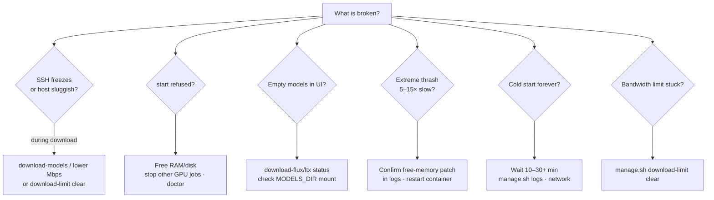
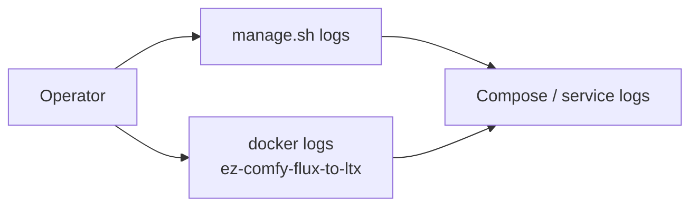
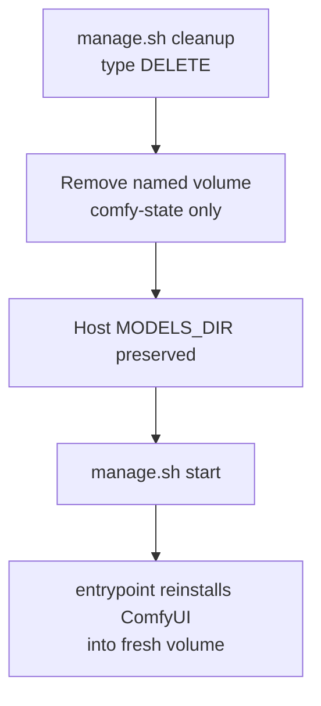

# Troubleshooting

**What's on this page**

- Symptom → cause → action table
- Decision tree for common failures
- Useful log commands and reset paths

**What this enables**

- Recovering from OOM, stuck bandwidth limits, empty models, and long cold starts

| Symptom | Likely cause | Action |
| --- | --- | --- |
| SSH freezes during download | Full-rate HF pull | Use `download-models` (auto limit) or lower fixed Mbps; `download-limit clear` |
| Extreme model thrash / 5–15× slow | Unpatched free-memory | Confirm patch in container logs; re-run entrypoint install |
| `start` refused | Headroom check | Free RAM/disk; stop other GPU jobs |
| Empty models in UI | Downloads not run | `download-flux` / `download-ltx` status; check `MODELS_DIR` mount |
| Pending / can't start container | Docker/GPU runtime | `nvidia-smi`, Container Toolkit install |
| Cold start forever | First PVC/volume pip+git | Wait; `manage.sh logs`; check network |
| Nunchaku missing | aarch64 wheel fail | Fail-soft; quality/FP8 paths may still work |
| Limits stuck after kill | trap skipped | `./scripts/manage.sh download-limit clear` |

## Symptom decision tree



## Logs

```bash
./scripts/manage.sh logs
docker logs ez-comfy-flux-to-ltx
```



## Reset Comfy install (keeps models)

```bash
./scripts/manage.sh cleanup   # type DELETE
./scripts/manage.sh start
```


