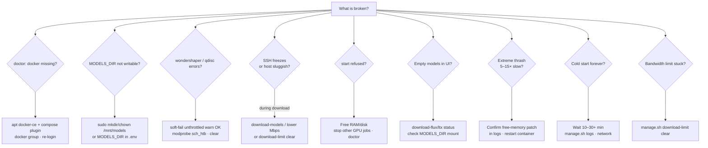
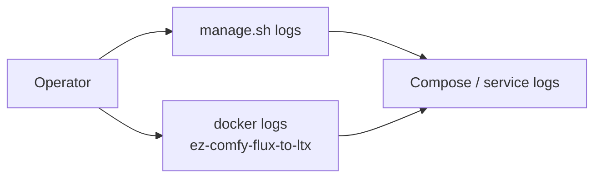
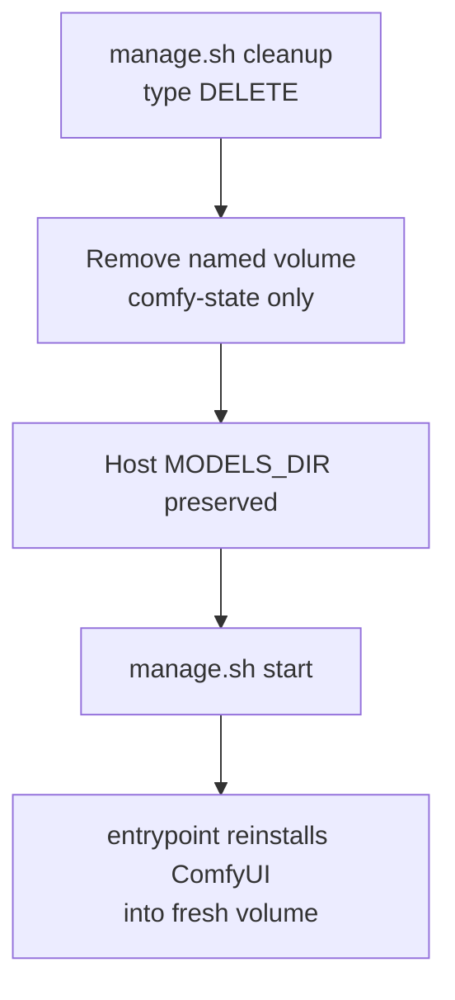

# Troubleshooting

**What's on this page**

- Symptom → cause → action by theme
- Decision tree for common failures
- Useful log commands and reset paths

**What this enables**

- Recovering from OOM, stuck bandwidth limits, empty models, and long cold starts

!!! tip "Try this first"

    ```bash
    ./scripts/manage.sh doctor
    ```

    Many rows below are hard failures `doctor` already reports. Prefer `./scripts/manage.sh setup` when Docker or `MODELS_DIR` is missing.

---

## Host & Docker

| Symptom | Likely cause | Action |
| --- | --- | --- |
| `docker missing` in doctor | Docker not installed / snap-only | `./scripts/manage.sh setup --install-docker` (sudo apt CE + compose); then `newgrp docker` or re-login |
| docker permission denied | Not in `docker` group this session | `sudo usermod -aG docker $USER` then `newgrp docker` or re-login SSH |
| docker daemon not reachable | dockerd not running | `sudo systemctl start docker` |
| `MODELS_DIR … not writable` | `/mnt/models` missing or root-owned | `./scripts/manage.sh setup` **or** `sudo mkdir -p /mnt/models && sudo chown $USER:$USER /mnt/models` **or** `MODELS_DIR=$HOME/models` |
| Pending / can't start container | Docker/GPU runtime | `nvidia-smi`, Container Toolkit install |
| `failed to fetch oauth token: denied` / `nvcr.io` Access Denied on `start` | NGC base image pull without login | Pull latest (default bases are **Docker Hub** `nvidia/cuda` devel builder + runtime final). Rebuild: `./scripts/manage.sh start`. If you set `CUDA_BASE_IMAGE` / `CUDA_RUNTIME_IMAGE` to `nvcr.io/...`, run `docker login nvcr.io` (user `$oauthtoken`, password = NGC API key) |

### Docker missing on DGX Spark

Docker is usually pre-installed on DGX Spark, but updates or OS reimages can remove it. Prefer **apt Docker CE** (not snap) so the NVIDIA Container Toolkit can attach GPUs.

```bash
./scripts/manage.sh setup --install-docker
# sudo password + type yes if prompted
newgrp docker   # if permission denied in this shell
./scripts/manage.sh doctor
```

=== "Interactive"

    ```bash
    ./scripts/manage.sh setup --install-docker
    ```

=== "Non-interactive"

    ```bash
    LAB_NON_INTERACTIVE=1 LAB_CONFIRM_TOKEN=yes SETUP_INSTALL_DOCKER=1 \
      ./scripts/manage.sh setup
    ```

### MODELS_DIR permission denied

Default cache is `/mnt/models` (shared with nvidia-dgx-spark-lab). Prefer bootstrap:

```bash
./scripts/manage.sh setup
# creates/chowns MODELS_DIR with sudo when needed
```

Manual equivalent:

```bash
sudo mkdir -p /mnt/models
sudo chown "$USER:$USER" /mnt/models
# or in .env:
# MODELS_DIR=$HOME/models
./scripts/manage.sh doctor
```

---

## Downloads & bandwidth

| Symptom | Likely cause | Action |
| --- | --- | --- |
| wondershaper `qdisc kind is unknown` / RTNETLINK | No HTB/IFB (common on DGX Spark) | Expected; wrap uses **gentle HF max-workers** from measured speed (HTTP probe). Not a hard Mbps cap. `DOWNLOAD_LIMIT=off` for full blast |
| Speedtest failed / always 50 Mbps | CLI missing or probe blocked | Auto-installs `speedtest-cli` when possible; **clears limits before measure**; then HTTP probe / live RX. Check outbound HTTPS if all fail |
| ++ctrl+c++ does not stop download | Old tee pipeline orphan | Pull latest; wrap/hf use process groups — Ctrl+C should stop `hf` within seconds |
| `Still waiting to acquire lock` on `*.lock` | Stale HF locks from killed downloads | `./scripts/manage.sh clear-hf-locks` or auto-clear on download-models; if stuck: `HF_LOCK_CLEAR_FORCE=1 ./scripts/manage.sh clear-hf-locks` |
| SSH freezes during download | Full-rate HF pull (limit off or soft-fail) | Prefer working `download-limit`; lower fixed Mbps; `download-limit clear` if half-applied |
| `huggingface-cli is deprecated` / 0 GB after download-models | Scripts used stub CLI | Pull latest; ensure `hf` on PATH (`pipx install huggingface_hub`); re-run download-models |
| Download failed / gated license | No token or license not accepted | Accept model license on HF; set `HF_TOKEN` in `.env` or `hf auth login` |
| Long Python `GatedRepoError` traceback | Older CLI path / unparsed hub error | Current stack prints a short checklist; open the model URL, Agree as the token’s user, re-run download. Debug: `LAB_DEBUG=1` |
| Limits stuck after kill | trap skipped | `./scripts/manage.sh download-limit clear` |

### wondershaper / qdisc failures

`download-models` wraps downloads under wondershaper. If the kernel rejects HTB (`qdisc kind is unknown`) or illegal rates, **wrap soft-fails**: it warns and continues **unthrottled** (SSH risk). Persistent `download-limit run` still hard-fails. Set `DOWNLOAD_LIMIT_REQUIRE=1` to hard-fail wrap too.

```bash
./scripts/manage.sh download-limit clear
# optional: sudo modprobe sch_htb sch_ingress sch_sfq
./scripts/manage.sh download-models
# or explicitly:
# DOWNLOAD_LIMIT=off ./scripts/manage.sh download-models
```

---

## Start & runtime

| Symptom | Likely cause | Action |
| --- | --- | --- |
| `start` refused | Headroom check | Free RAM/disk; stop other GPU jobs |
| Extreme model thrash / 5–15× slow | Unpatched free-memory | Confirm patch in container logs; re-run entrypoint install |
| Build OK, `status` empty / not in `docker ps` | Container exited immediately (`restart: "no"`) | Pull latest (workflow no longer mounts into `ComfyUI/` before clone). `./scripts/manage.sh logs` or `docker logs ez-comfy-flux-to-ltx`. Reset poisoned volume: `./scripts/manage.sh stop && docker volume rm ez-comfy-state` then `start` again. Stop other GPU containers if needed |
| `start` returns while logs still downloading torch | Normal cold install; multi‑GB wheels | Leave it running; `start` streams logs by default. Re-attach: `./scripts/manage.sh logs`. Markers: `[comfy-install] ══ step N/12 ══` (or `Docker phase: …` during image prebuild) |
| Quiet for minutes on step 4 (PyTorch) | Large cudnn/torch wheel download | Prefer GHCR prebuilt image (seed, no pip). Or wait for pip bars; host heartbeat every 30s |
| `docker pull ghcr.io/...` denied / not found | Wrong branch tag, package not published, or private | Confirm tag matches branch (`:flux-to-ltx` on `main`, `:flux-to-ltx-development` on `development`/feature — see `doctor`). Run `publish-image` on that long-lived branch; make GHCR package public; or `EZ_COMFY_IMAGE=…` / force local build: [Getting Started — build locally](getting-started.md#build-the-image-locally-optional) |
| First start still runs multi-GB pip | Thin image / no prebuilt / force cold | Check logs for “Seeding … prebuilt”. Rebuild with `EZ_COMFY_PREBUILD=1` or pull GHCR tag. Unset `LAB_FORCE_COLD_INSTALL` |
| `docker pull` / rebuild re-downloads multi‑GB after tiny script edit | Old image with monolithic prebuilt layer, or a real pip/torch change | Pull latest split layout: runtime has separate **venv** (~multi‑GB) and **app** layers. Ops scripts are late thin layers + compose bind-mounts. Nodes/source-only changes should re-pull **app** only; any pip change still re-pulls venv. See [Models & Cache](models-and-cache.md#image-layer-cache-high-velocity-rebuilds-pulls) |
| Local script change has no effect | Looking at baked image without restart | Compose mounts `docker/*.sh`, `docker/install-comfy/`, and the patch; restart after edit. To rebake prebuilt tree: [build locally](getting-started.md#build-the-image-locally-optional) (`LAB_STACK_FORCE_BUILD=1`) |
| `IndentationError` in `model_management.py` / `mem_free_torch` | Old free-memory patch broke indent | Pull latest (patch is bind-mounted). `./scripts/manage.sh stop && ./scripts/manage.sh start` — auto-repairs via git restore + re-patch. No full image rebuild required |
| Cold start forever | First PVC/volume pip+git | Wait; `manage.sh logs`; check network |
| Nunchaku import spam / `nunchaku 0.16.1` / missing `nunchaku.models` | Wrong **PyPI** package (`nunchaku` stats lib) or no aarch64 wheel on GB10 | Lab graphs do **not** need Nunchaku. Restart after image refresh (removes wrong package). Do **not** `pip install nunchaku` from PyPI. Optional real engine: GitHub wheels only (`NUNCHAKU_WHEEL_URL=…` or x86_64 cu/torch match). Spark aarch64: skip; use core UNET/CLIP/VAE loaders |
| Nunchaku missing | aarch64 wheel unavailable | Fail-soft; lab **lab-flux-*** / **lab-ltx-*** paths still work |

---

## Models & workflows

| Symptom | Likely cause | Action |
| --- | --- | --- |
| Empty models in UI | Downloads not run | `download-flux` / `download-ltx` status; check `MODELS_DIR` mount |
| Missing `ae.safetensors` / `qwen_3_4b` / `z_image_turbo_*.safetensors` | **Z-Image** template, not this stack | Load a **lab-*** workflow (e.g. **lab-flux-txt2img** / **lab-flux-to-ltx**). Stack models are Flux Klein NVFP4 + LTX-2.3 (see [Models & Cache](models-and-cache.md)). Run `download-models` if those files are missing under `MODELS_DIR/comfy/` |
| Missing `flux-2-klein-9b-nvfp4` or LTX `*.safetensors` in **lab-*** graphs | Weights not on host and/or Comfy `models/*` not symlinked to host | 1) `./scripts/manage.sh download-models` (exits non-zero until lab basenames exist) 2) `ls $MODELS_DIR/comfy/diffusion_models` 3) `docker exec ez-comfy-flux-to-ltx ls -la /comfy-state/ComfyUI/models/diffusion_models` — should be a **symlink** to `/models/comfy/diffusion_models`. Restart after pull so `link_models` retargets. Flux is gated: set `HF_TOKEN` and accept the BFL license |
| Missing `flux2-vae.safetensors` (VAELoader) while Qwen TE is present | Companions partial (TE ~6.8 GB alone used to cache-hit skip VAE) | Re-run `./scripts/manage.sh download-models` or `./scripts/utilities/download-flux.sh run --tier companions`. Confirm `ls $MODELS_DIR/comfy/vae/flux2-vae.safetensors`. Restart Comfy after pull |
| Comfy log: path `…/models/vae/*.safetensors` **exists but doesn't link anywhere**; UI missing `flux2-vae` / `LTX23_*_vae` while host `ls` looks fine | Absolute host symlinks under `MODELS_DIR/comfy/*` (e.g. → `/mnt/models/…`) break inside the container where the cache is mounted at `/models` | Pull latest; re-run `./scripts/manage.sh download-models` (cache hit rewrites **relative** links — no full re-download). Check `readlink $MODELS_DIR/comfy/vae/flux2-vae.safetensors` starts with `../`, not `/`. Confirm: `docker exec ez-comfy-flux-to-ltx test -e /models/comfy/vae/flux2-vae.safetensors`. **Do not** wipe `ez-comfy-state` for this |
| Missing `LTX23_video_vae_bf16` / LTX distilled FP8 in **lab-ltx-*** | LTX balanced not downloaded or not linked (older `*te*` globs mis-linked every `*.safetensors` into `text_encoders/`) | Pull latest; `./scripts/utilities/download-ltx.sh run --tier balanced` then `ls $MODELS_DIR/comfy/{diffusion_models,vae}` (not only `text_encoders/`). `doctor` / `download-models` gate on the full lab set |
| CLIP / latent errors on Flux lab graphs | Wrong CLIP type or latent node | Use seeded **lab-flux-*** graphs: CLIP type **`flux2`** with `qwen_3_8b_fp4mixed`, latent **`EmptyFlux2LatentImage`**. Do not use `qwen_image` / Z-Image loaders |
| Missing `VHS_VideoCombine` node | Optional VideoHelperSuite not installed | Lab LTX graphs only need core LTXV nodes + **SaveImage** frames. Install VHS yourself only if you want MP4 combine |

---

## Symptom decision tree



---

## Logs

```bash
./scripts/manage.sh logs
docker logs ez-comfy-flux-to-ltx
```



---

## Reset Comfy install (keeps models)

```bash
./scripts/manage.sh cleanup   # type DELETE
./scripts/manage.sh start
```


