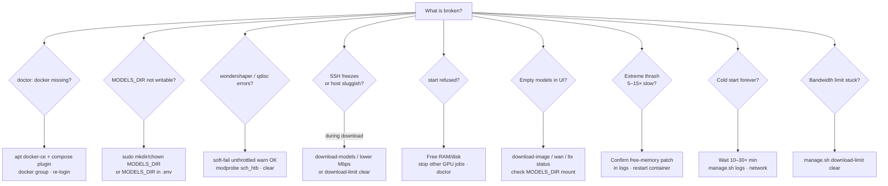
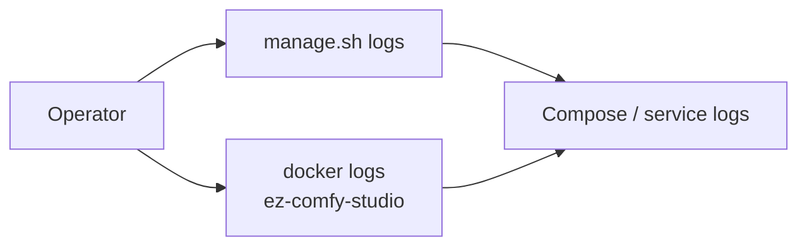
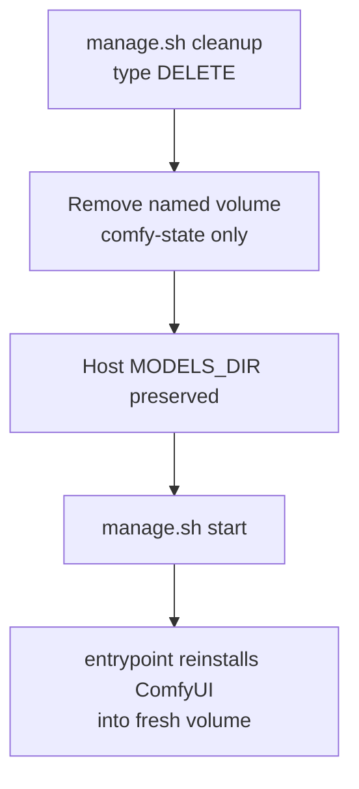

# Troubleshooting

**What's on this page**

- Symptom → cause → action by theme
- Decision tree for common failures
- Useful log commands and reset paths

**What this enables**

- Recovering from OOM, stuck bandwidth limits, empty models, and long cold starts

!!! tip "Try this first"

    ```bash
    ./scripts/manage.sh doctor
    ```

    Many rows below are hard failures `doctor` already reports. Prefer `./scripts/manage.sh setup` when Docker or `MODELS_DIR` is missing.

---

## Host & Docker

| Symptom | Likely cause | Action |
| --- | --- | --- |
| `docker missing` in doctor | Docker not installed / snap-only | `./scripts/manage.sh setup --install-docker` (sudo apt CE + compose); then `newgrp docker` or re-login |
| docker permission denied | Not in `docker` group this session | `sudo usermod -aG docker $USER` then `newgrp docker` or re-login SSH |
| docker daemon not reachable | dockerd not running | `sudo systemctl start docker` |
| `MODELS_DIR … not writable` | `${MODELS_DIR}` missing or root-owned | `./scripts/manage.sh setup` **or** `sudo mkdir -p "${MODELS_DIR}" && sudo chown "$USER:$USER" "${MODELS_DIR}"` **or** `MODELS_DIR=$HOME/models` |
| Pending / can't start container | Docker/GPU runtime | `nvidia-smi`, Container Toolkit install |
| `failed to fetch oauth token: denied` / `nvcr.io` Access Denied on `start` | NGC base image pull without login | Pull latest (default bases are **Docker Hub** `nvidia/cuda` devel builder + runtime final). Rebuild: `./scripts/manage.sh start`. If you set `CUDA_BASE_IMAGE` / `CUDA_RUNTIME_IMAGE` to `nvcr.io/...`, run `docker login nvcr.io` (user `$oauthtoken`, password = NGC API key) |

### Docker missing on DGX Spark

Docker is usually pre-installed on DGX Spark, but updates or OS reimages can remove it. Prefer **apt Docker CE** (not snap) so the NVIDIA Container Toolkit can attach GPUs.

```bash
./scripts/manage.sh setup --install-docker
# sudo password + type yes if prompted
newgrp docker   # if permission denied in this shell
./scripts/manage.sh doctor
```

=== "Interactive"

    ```bash
    ./scripts/manage.sh setup --install-docker
    ```

=== "Non-interactive"

    ```bash
    LAB_NON_INTERACTIVE=1 LAB_CONFIRM_TOKEN=yes SETUP_INSTALL_DOCKER=1 \
      ./scripts/manage.sh setup
    ```

### MODELS_DIR permission denied

Default cache is `/mnt/models` (shared with nvidia-dgx-spark-lab). Prefer bootstrap:

```bash
./scripts/manage.sh setup
# creates/chowns MODELS_DIR with sudo when needed
```

Manual equivalent:

```bash
sudo mkdir -p "${MODELS_DIR:-/mnt/models}"
sudo chown "$USER:$USER" "${MODELS_DIR:-/mnt/models}"
# or in .env:
# MODELS_DIR=$HOME/models
./scripts/manage.sh doctor
```

---

## Downloads & bandwidth

| Symptom | Likely cause | Action |
| --- | --- | --- |
| wondershaper `qdisc kind is unknown` / RTNETLINK | No HTB/IFB (common on DGX Spark) | Expected; wrap uses **gentle HF max-workers** from measured speed (HTTP probe). Not a hard Mbps cap. `DOWNLOAD_LIMIT=off` for full blast |
| Speedtest failed / always 50 Mbps | CLI missing or probe blocked | Auto-installs `speedtest-cli` when possible; **clears limits before measure**; then HTTP probe / live RX. Or skip the probe: `./scripts/manage.sh download-models --limit 40` |
| Auto cap too high / SSH still sluggish | Speedtest over-reads the path you share with SSH | `./scripts/manage.sh download-models --limit N` with a lower Mbps (e.g. 20–40). Persistent: `DOWNLOAD_LIMIT=40` in `.env` |
| ++ctrl+c++ does not stop download | Old tee pipeline orphan | Pull latest; wrap/hf use process groups — Ctrl+C should stop `hf` within seconds |
| `Still waiting to acquire lock` on `*.lock` | Stale HF locks from killed downloads | `./scripts/manage.sh clear-hf-locks` or auto-clear on download-models; if stuck **and no hf is running**: `HF_LOCK_CLEAR_FORCE=1 ./scripts/manage.sh clear-hf-locks` |
| `↓ … 0 MiB/s` + `found N incomplete` + lock still held | Hung **resume** — live `hf` holds the lock, partial not growing | ++ctrl+c++. Do **not** FORCE-clear locks while it runs. Then `./scripts/manage.sh reset-hf-partials --yes` and re-run, or `./scripts/manage.sh download-models --drop-incomplete`. Finished `.safetensors` are kept |
| SSH freezes during download | Full-rate HF pull (limit off or soft-fail) | Prefer working `download-limit`; lower fixed Mbps; `download-limit clear` if half-applied |
| `huggingface-cli is deprecated` / 0 GB after download-models | Scripts used stub CLI | Pull latest; ensure `hf` on PATH (`pipx install huggingface_hub`); re-run download-models |
| Download failed / gated license | No token or **LTX-2.5 license not accepted** for that token | `HF_TOKEN` set is not enough. Open https://huggingface.co/Lightricks/LTX-2.5 as the **same** user (`hf auth whoami`), click Agree, then re-run `download-models`. Klein/Wan can cache-hit while LTX is still missing |
| Long Python `GatedRepoError` traceback | CLI stderr was leaking (should be a short checklist) | Pull latest; traceback is captured to a log. `LAB_DEBUG=1` still dumps the last 40 lines |
| Limits stuck after kill | trap skipped | `./scripts/manage.sh download-limit clear` |

### wondershaper / qdisc failures

`download-models` wraps downloads under wondershaper. If the kernel rejects HTB (`qdisc kind is unknown`) or illegal rates, **wrap soft-fails**: it warns and continues **unthrottled** (SSH risk). Persistent `download-limit run` still hard-fails. Set `DOWNLOAD_LIMIT_REQUIRE=1` to hard-fail wrap too.

```bash
./scripts/manage.sh download-limit clear
# optional: sudo modprobe sch_htb sch_ingress sch_sfq
./scripts/manage.sh download-models --limit 40
# or skip throttle entirely (SSH risk):
# DOWNLOAD_LIMIT=off ./scripts/manage.sh download-models
```

---

## Start & runtime

| Symptom | Likely cause | Action |
| --- | --- | --- |
| `start` refused | Headroom check | Free RAM/disk; stop other GPU jobs |
| Extreme model thrash / 5–15× slow | Unpatched free-memory | Confirm patch in container logs; re-run entrypoint install |
| Build OK, `status` empty / not in `docker ps` | Container exited immediately (`restart: "no"`) | Pull latest (workflow no longer mounts into `ComfyUI/` before clone). `./scripts/manage.sh logs` or `docker logs ez-comfy-studio`. Reset poisoned volume: `./scripts/manage.sh stop && docker volume rm ez-comfy-state` then `start` again. Stop other GPU containers if needed |
| `start` returns while logs still downloading torch | Normal cold install; multi‑GB wheels | Leave it running; `start` streams logs by default. Re-attach: `./scripts/manage.sh logs`. Markers: `[comfy-install] ══ step N/12 ══` (or `Docker phase: …` during image prebuild) |
| Quiet for minutes on step 4 (PyTorch) | Large cudnn/torch wheel download | Prefer GHCR prebuilt image (seed, no pip). Or wait for pip bars; host heartbeat every 30s |
| `docker pull ghcr.io/...` denied / not found | Wrong branch tag, package not published, or private | Confirm tag matches branch (`:us-safe-studio` on `main`, `:us-safe-studio-development` on `development`/feature — see `doctor`). Run `publish-image` on that long-lived branch; make GHCR package public; or `EZ_COMFY_IMAGE=…` / force local build: [Getting Started — build locally](getting-started.md#build-the-image-locally-optional) |
| First start still runs multi-GB pip | Thin image / no prebuilt / force cold | Check logs for “Seeding … prebuilt”. Rebuild with `EZ_COMFY_PREBUILD=1` or pull GHCR tag. Unset `LAB_FORCE_COLD_INSTALL` |
| `docker pull` / rebuild re-downloads multi‑GB after tiny script edit | Old image with monolithic prebuilt layer, or a real pip/torch change | Pull latest split layout: runtime has separate **venv** (~multi‑GB) and **app** layers. Ops scripts are late thin layers + compose bind-mounts. Nodes/source-only changes should re-pull **app** only; any pip change still re-pulls venv. See [Models & Cache](models-and-cache.md#image-layer-cache-high-velocity-rebuilds-pulls) |
| Local script change has no effect | Looking at baked image without restart | Compose mounts `docker/*.sh`, `docker/install-comfy/`, and the patch; restart after edit. To rebake prebuilt tree: [build locally](getting-started.md#build-the-image-locally-optional) (`LAB_STACK_FORCE_BUILD=1`) |
| `IndentationError` in `model_management.py` / `mem_free_torch` | Old free-memory patch broke indent | Pull latest (patch is bind-mounted). `./scripts/manage.sh stop && ./scripts/manage.sh start` — auto-repairs via git restore + re-patch. No full image rebuild required |
| Cold start forever | First PVC/volume pip+git | Wait; `manage.sh logs`; check network |
| Nunchaku import spam / `nunchaku 0.16.1` / missing `nunchaku.models` | Wrong **PyPI** package (`nunchaku` stats lib) or no aarch64 wheel on GB10 | Lab graphs do **not** need Nunchaku. Restart after image refresh (removes wrong package). Do **not** `pip install nunchaku` from PyPI. Optional real engine: GitHub wheels only (`NUNCHAKU_WHEEL_URL=…` or x86_64 cu/torch match). Spark aarch64: skip; use core UNET/CLIP/VAE loaders |
| Nunchaku missing | aarch64 wheel unavailable | Fail-soft; **\*-lab-example** Flux / LTX paths still work |

---

## Models & workflows

| Symptom | Likely cause | Action |
| --- | --- | --- |
| Empty models in UI | Downloads not run | `./scripts/utilities/download-image.sh status --tier fast`; `download-wan.sh status --tier 5b`; `download-ltx.sh status --tier 2.5`; check `${MODELS_DIR}` mount |
| Missing `ae.safetensors` / `z_image_turbo_*.safetensors` | **Z-Image** template, not the default stack | Load **klein-still-draft-lab-example**. Default still is Klein 4B Apache (see [licenses](licenses.md)). Optional `download-image --tier zimage` |
| Missing `flux-2-klein-4b-fp8` / Wan / LTX-2.5 in **\*-lab-example** graphs | Weights not on host and/or Comfy `models/*` not symlinked to host | 1) `./scripts/manage.sh download-models` 2) `ls "${MODELS_DIR}/comfy/diffusion_models"` 3) `docker exec ez-comfy-studio ls -la /comfy-state/ComfyUI/models/diffusion_models` — should be a **symlink** to `/models/comfy/diffusion_models`. LTX-2.5 is gated: set `HF_TOKEN` and accept the Lightricks license |
| Missing `flux2-vae.safetensors` (VAELoader) while Qwen TE is present | Companions partial (TE-only cache-hit skip VAE) | Re-run `./scripts/manage.sh download-models` or `./scripts/utilities/download-image.sh run --tier fast` (fast includes `te` + `vae`). Confirm `ls "${MODELS_DIR}/comfy/vae/flux2-vae.safetensors"`. Restart Comfy after pull |
| Comfy log: path `…/models/vae/*.safetensors` **exists but doesn't link anywhere**; UI missing `flux2-vae` / `ltx-2.5-*-vae` while host `ls` looks fine | Absolute host symlinks under `MODELS_DIR/comfy/*` (e.g. → `/mnt/models/…`) break inside the container where the cache is mounted at `/models` | Pull latest; re-run `./scripts/manage.sh download-models` (cache hit rewrites **relative** links — no full re-download). Check `readlink "${MODELS_DIR}/comfy/vae/flux2-vae.safetensors"` starts with `../`, not `/`. Confirm: `docker exec ez-comfy-studio test -e /models/comfy/vae/flux2-vae.safetensors`. **Do not** wipe `ez-comfy-state` for this |
| Missing `ltx-2.5-video-vae-bf16` / LTX-2.5 distilled in **ltx-*-lab-example** | LTX-2.5 not downloaded or not linked (older `*te*` globs mis-linked every `*.safetensors` into `text_encoders/`) | Pull latest; `./scripts/utilities/download-ltx.sh run --tier 2.5` then `ls "${MODELS_DIR}/comfy/"{diffusion_models,vae}` (not only `text_encoders/`). `download-models` gates on the full lab set |
| CLIP / latent errors on Klein lab graphs | Wrong CLIP type or latent node | Use seeded **still-*-lab-example** graphs: CLIP type **`flux2`** with `qwen_3_4b`, latent **`EmptyFlux2LatentImage`**. Do not use `qwen_image` / Z-Image loaders |
| `Failed to find C compiler` / Triton on **CLIPTextEncode** | Runtime image missing `gcc`/`g++`; PyTorch 2.13 Triton JIT needs CC for `cuda_utils` / `bmm_outer_product` | Pull/rebuild image (runtime installs `gcc` `g++` + `python3-dev`) and restart. Confirm: `docker exec ez-comfy-studio which gcc` |
| `CalledProcessError` compiling `cuda_utils*.so` / `bmm_outer_product` on **CLIPTextEncode** (LTX Gemma or Flux) | Triton JIT has `gcc` but fails the compile (missing `Python.h` / `python3-dev`, or `libcuda.so.1` not on gcc `LIBRARY_PATH`). stderr is swallowed by Triton | Pull/rebuild image so runtime has **`python3-dev`** + `gcc`/`g++`. Restart. Confirm: `docker exec ez-comfy-studio test -f /usr/include/python3.*/Python.h && echo ok`. Logs should show `Triton JIT deps OK` (or auto-disable). Escape hatch: `LAB_DISABLE_TORCH_NATIVE_TRITON=1` then restart (eager/cuBLAS fallback; CLIP still works) |
| KSampler LTX: `Expected size 768 but got size 4096` / `embeddings_connector` | Wrong CLIP (projection-only or LTX-2.3 DualCLIP on a 2.5 graph) | Lab graphs need **CLIPLoader**: `gemma4-12b-with-proj-ltx-2.5-comfy-int8-convrot`, type **`ltxv`**. Run `./scripts/manage.sh download-models`, re-open **ltx-*-lab-example** from `workflows/` |
| KSampler LTX: `cannot reshape tensor of 0 elements into shape [1, 0, 32, -1]` / `freqs_cis_matrix` / `av_model` audio RoPE | LTX is a **joint AV** transformer; video-only latents leave audio length T=0 | Re-open a current **ltx-*-lab-example** graph (has `LTXVEmptyLatentAudio` + `LTXVConcatAVLatent` + `ltx-2.5-audio-vae-bf16`). Do not feed `EmptyLTXVLatentVideo` / `LTXVImgToVideo` straight into `KSampler`. Confirm `ls "${MODELS_DIR}/comfy/vae/ltx-2.5-audio-vae-bf16.safetensors"` |
| Missing `gemma4-12b-with-proj-ltx-2.5-comfy-int8-convrot` in LTX graphs | LTX-2.5 TE not downloaded | `./scripts/utilities/download-ltx.sh run --tier 2.5` or `download-models`; `ls "${MODELS_DIR}/comfy/text_encoders/gemma4-12b-with-proj-ltx-2.5-comfy-int8-convrot.safetensors"` |
| Missing `VHS_VideoCombine` node on **ltx-*-lab-example** | Image/volume predates VideoHelperSuite, or refresh clone failed | Pull/rebuild GHCR image (VHS is prebuilt). Restart container so stamp-present refresh runs `ensure_lab_video_nodes`. Confirm: `docker exec ez-comfy-studio test -d /comfy-state/ComfyUI/custom_nodes/ComfyUI-VideoHelperSuite`. Last resort: `LAB_FORCE_COLD_INSTALL=1` or volume cleanup, then re-open seeded workflows |
| Missing **Klein/Wan/LTX Prompt Enhance** node | Host pack not mounted or entrypoint copy skipped | Confirm compose bind-mount `../custom_nodes:/opt/ez-comfy/custom_nodes`. Restart so `install_lab_custom_nodes` copies into `/comfy-state/ComfyUI/custom_nodes/ez_prompt_enhance`. Confirm: `docker exec ez-comfy-studio test -f /comfy-state/ComfyUI/custom_nodes/ez_prompt_enhance/__init__.py` |
| Enhance on but prompt unchanged | `XAI_API_KEY` unset, timeout, or HTTP error (fail-soft passthrough) | Set `XAI_API_KEY` in `.env`, `stop` + `start`. Logs: `[ez_prompt_enhance]`. Default timeout 20s (`XAI_TIMEOUT_S`). Leave Enhance **off** to use the canned prompt with no API |
| Enhance rewrites a locked shorts identity | Enhance left on for a bible/bridge Queue | Set Enhance **false**. Canned identity/motion text is already model-native |
| LTX finished but I only see PNGs / no MP4 preview | Old workflow JSON without VHS, or looking only at SaveImage | Re-open current **ltx-*-lab-example** from `user/default/workflows/` (entrypoint re-copies host `workflows/`). After Queue, open **Save video (MP4)** node for preview; MP4 is on the host at `${COMFY_OUTPUT_DIR}` as `ez_ltx_*_video_*.mp4`. Confirm: `ls "${COMFY_OUTPUT_DIR}"` and `docker exec ez-comfy-studio ls /outputs`. Frames via SaveImage are secondary — [Visual Generative AI → Watch the video](visual-generative-ai.md#watch-the-video-wan-ltx) |
| Cannot find generated PNG/MP4 on the Spark host | Looking in the git repo or only inside `ez-comfy-state` | Media is bind-mounted to **`COMFY_OUTPUT_DIR`** (default `/mnt/comfy-output`). `./scripts/manage.sh setup` creates it. `status` prints the path. `cleanup` does not delete it |
| GIF moonwalks / plays backwards unnaturally | VHS **ping-pong** reversing a one-way move (walk, dolly) | On **wan-gif-loop-lab-example**, set **Infinite loop (ping-pong)** to false, or rewrite Motion for locked-camera cyclic motion (breeze, curtains). Ping-pong is the easy first=last loop |
| UNET missing after swapping to Klein base / NVFP4 on **klein-still-daily** | Optional still not downloaded | Stay on `flux-2-klein-4b-fp8.safetensors`, or `./scripts/utilities/download-image.sh run --tier base` / `--tier nvfp4` then restart Comfy so the filename appears |
| Dream-house Queue too slow / only need a few rooms | All ten SHOT groups enabled | Bypass unused SHOT groups (Ctrl+B). Identity + seed stay shared |
| OOM / multi-minute hang on a 90s (or 30s / 60s) Queue | One-graph long latent | Do not Queue 90s. Use 18 × **5.00 s** shorts + `concat-shots.sh --film`. See [90s shorts](shorts.md). Confirm headroom preflight; close other GPU jobs |
| 90s bible / shot graph missing in the Comfy UI | Entrypoint only used to copy top-level `workflows/*.json` | Pull latest; restart so `install_lab_workflows` copies `workflows/*.json` and `workflows/shorts/*.json` into `user/default/workflows/`. YAML shot lists are not copied (edit on the host) |
| Doctor warns `banned MiniMax H3 weight present` | Leftover files from an old `download-h3` run | After `./scripts/manage.sh stop`, delete those files under `${MODELS_DIR}/comfy/` (`minimax_h3_*.safetensors`, `qwen3vl_32b_minimax_h3_*.safetensors`). Do not Queue MiniMaxH3 nodes. See [Model licenses](licenses.md) |
| Pin mismatch / old volume Comfy | `.lab-comfyui-ref` lags `COMFYUI_REF` | `git pull`, `stop` + `start` so entrypoint reseeds from the image. Do **not** treat a 10s `compose restart` as done. Last resort: `LAB_FORCE_COLD_INSTALL=1` or `cleanup` then start |

---

## Symptom decision tree



---

## Logs

```bash
./scripts/manage.sh logs
docker logs ez-comfy-studio
```



---

## Reset Comfy install (keeps models)

```bash
./scripts/manage.sh cleanup   # type DELETE
./scripts/manage.sh start
```


