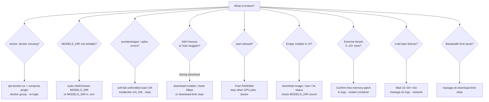
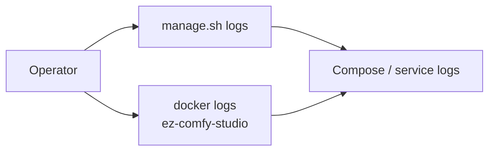
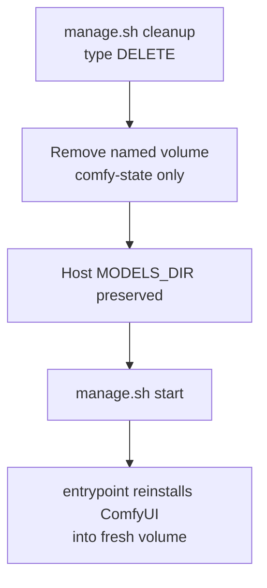

# Troubleshooting

**What's on this page**

- Symptom → cause → action by theme
- Docs copy-paste still showing `${SPARK_HOST}`
- Decision tree for common failures
- Useful log commands and reset paths

**What this enables**

- Recovering from OOM, stuck bandwidth limits, empty models, and long cold starts

!!! tip "Try this first"

    ```bash
    ./scripts/manage.sh doctor
    ```

    Many rows below are hard failures `doctor` already reports. Prefer `./scripts/manage.sh setup` when Docker or `MODELS_DIR` is missing.

## Docs site

| Symptom | Likely cause | Action |
| --- | --- | --- |
| Copy still shows `${SPARK_HOST}` / `${MODELS_DIR}` | Docs JS blocked, or a hard-cached `commands.js` | Hard-refresh the docs tab. Highlighted chips (dotted underline) are the same session fields as **Your Spark** — click to edit. Not a Spark/`doctor` failure. Values stay in this browser only |

## Studio user (canvas)

| Symptom | Likely cause | Action |
| --- | --- | --- |
| **Missing Models** on a `*-lab-example` | Weights not on `MODELS_DIR` / broken `comfy/` symlink | `./scripts/manage.sh download-models` then restart. [Models and cache](models-and-cache.md) |
| Start images vanished after `cleanup` | LoadImage files lived on the named volume | Put start frames in `${COMFY_OUTPUT_DIR}/input` (container `/inputs`). `cleanup` does not delete `COMFY_OUTPUT_DIR` |
| LTX `einops` / divide by 45 | Width/height not ÷32 (720 or 1080) | Lab size is **1280×704**. `ez_ltx_spatial` auto-snaps; prefer typing 704 |
| No MP4 preview, only PNGs | Old graph without VHS, or looking at SaveImage | Re-open seeded `wan-*` / `ltx-*`; open **Save video (MP4)** node |
| LTX MP4 has no sound | Missing audio VAE decode → VHS | Re-open current **ltx-*-lab-example** |
| Enhance did nothing | GGUF / llama.cpp missing, or local LLM timed out | Read **Enhance status**. `download-models` then restart. Default timeout is **180s** (`EZ_LLM_TIMEOUT_S`) on **8** CPU threads (`EZ_LLM_N_THREADS`) |
| Dub Queue says **rights refused** | **I have rights** is off (default) | Turn it on only when you own the recording or have speaker consent. [Local dub](dub.md) |
| Dub **Source file** is `(none)` / empty source | Nothing selected in the dropdown | **Upload media**, or pick a file already in `${COMFY_OUTPUT_DIR}/input`. Do not type a host path |
| Dub file not in the Source dropdown | File is under `/outputs`, or the App was open before `dub-fetch` | Put media in `${COMFY_OUTPUT_DIR}/input` (container `/inputs`). Reload the App. [Local dub](dub.md) |
| Dub **Upload media** missing | Pack JS not copied, or the browser is holding an old frontend | Restart the container so entrypoint copies `ez_dub/js/`. Hard-refresh the Comfy tab |
| Dub empty mix / no transcript | faster-whisper or Chatterbox missing, or ASR/clone snapshot incomplete | **Dub status** names the miss. `download-dub --tier asr` (needs `model.bin`, `config.json`, **and** `tokenizer.json`) then `--tier clone` (`ve.pt`, `s3gen.pt`, T3 V3, tokenizer JSON, `conds.pt`) with the stack **up**. Restart also heals wheels (entrypoint pip). Do **not** `pip install faster-whisper chatterbox-tts` as one command — chatterbox pins torch 2.6 and blocks ASR. |
| Dub status `faster-whisper not installed` | Combined pip failed (chatterbox torch pin), named volume predates the wheel bake, or pip landed in the volume venv while Comfy runs `/opt/comfy-prebuilt/.venv` | `git pull`, stack **up** (entrypoint heals the interpreter Comfy actually execs). `./scripts/manage.sh download-dub --tier asr`. Status should include the ImportError detail (e.g. `onnxruntime`). Then Queue; **Dub status** must list speaker/turn counts, not the wheel miss. |
| Dub mix is the original clip | Old fail-soft returned the source when turns/clone were empty | Pull latest. Queue must not write `ez_dub_yt` from `source.wav`. Empty mix + status means ASR/clone still missing. |
| Dub URL ingest failed | yt-dlp missing, or ToS/network | `./scripts/utilities/dub-fetch.sh status` then install yt-dlp, or **Upload media** / pick a local file |
| YouTube rejects the extra audio | Duration mismatch or MLA not enabled | Use `ez_dub_yt.wav` (duration-locked). MLA is rolling out; check Studio → Languages |
| VHS node missing | Image/volume predates VideoHelperSuite | Pull/rebuild GHCR image and restart |
| `export-guides` exit 2 | Compose is up (occupancy) | `./scripts/manage.sh stop` then dump. [DCC guide pack](dcc-workflows.md) |
| `house-views` exit 2 | Compose is up (occupancy) | `./scripts/manage.sh stop` then dump. [Dream-house tours](learn/dream-house.md) |
| `house-views` blender not on PATH | Host DCC missing | Workbench dump needs host Blender. The clay App still Queues on `start` / `--seed-inputs` layout plates. Language-only tour: **klein-dream-house-lab-example**. Never add Blender to the Dockerfile |
| House clay **Missing Inputs** / “no file selected” on Clay 01–10 | Plates not in `${COMFY_OUTPUT_DIR}/input` (LoadImage does not see `/outputs`) | Restart so the entrypoint backstop writes `ez_house_clay_01.png` … `10.png` into `/inputs`. `./scripts/manage.sh start` still prefers layout-accurate plates. While compose is up: `./scripts/manage.sh house-views --slug lab-penthouse --seed-inputs` (or `--install-inputs` if the pack exists), then reload the App |
| Guide pack QC refuses 1280×720 | LTX VAE grid is **1280×704** | Re-export at 704. `ez_ltx_spatial` is a backstop, not the plan |
| `overlay-qc` size mismatch | Look plate not 1280×704 | Re-Queue **klein-from-clay** at 1280×704. Do not stretch. [Clay to finish](learn/clay-to-finish.md) |
| `film-animatic` missing sources | No clay.mp4 and no first.png | Dump a guide pack or hold Klein stills under `stills/NN.png` |
| `stem-mix` / `film-accept` stem loudness | Missing mix or not −14 ± 2 LUFS | Pass `--bg` from the LTX print; stop LTX first. Occupancy **audio** |
| YouTube wants a video, I only have FLAC | Audio graphs save FLAC + MP3 on purpose | `./scripts/manage.sh audio-still-video --audio FILE --image FILE`. Cover from **klein-thumbnail** (16:9) or **klein-podcast-cover** (letterboxed). [Local music](music.md) |
| Union Control missing LoRA | IC-LoRA is opt-in, not `download-models` | `./scripts/manage.sh download-ltx --tier iclora`. Distilled-only; refuse 19B |

Concepts: [ComfyUI basics](learn/comfyui.md). Full tables below.

---

## Host & Docker

| Symptom | Likely cause | Action |
| --- | --- | --- |
| `docker missing` in doctor | Docker not installed / snap-only | `./scripts/manage.sh setup --install-docker` (sudo apt CE + compose); then `newgrp docker` or re-login |
| docker permission denied | Not in `docker` group this session | `sudo usermod -aG docker $USER` then `newgrp docker` or re-login SSH |
| docker daemon not reachable | dockerd not running | `sudo systemctl start docker` |
| `MODELS_DIR … not writable` | `${MODELS_DIR}` missing or root-owned | `./scripts/manage.sh setup` (sudo mkdir + chown). Last resort: `sudo mkdir -p "${MODELS_DIR}" && sudo chown "$USER:$USER" "${MODELS_DIR}"` **or** `MODELS_DIR=$HOME/models` |
| `mkdir: …/comfy/…: Permission denied` during `download-models` | Nested `comfy/<subdir>` is root-owned (container `mkdir` on the bind-mount) while snapshots under `${MODELS_DIR}` are writable. Cache-hit still needs a writable layout dir to symlink. | Re-run `./scripts/manage.sh download-models` — linking now sudo-heals each layout dir (same heal on `setup` / `start`). Last resort: `sudo chown -R "$USER:$USER" "${MODELS_DIR}/comfy"` |
| `ln: … comfy/llm/….gguf: Permission denied` then `GGUF ready` | Relink into a nested dir the user cannot write; the GGUF is already present | Start is OK — Enhance works if that path exists. Heal: `./scripts/manage.sh download-models` **or** `setup` / `start` (sudo-chown `comfy/`). Do not abort start |
| Pending / can't start container | Docker/GPU runtime | `nvidia-smi`, Container Toolkit install |
| `failed to fetch oauth token: denied` / `nvcr.io` Access Denied on `start` | NGC base image pull without login | Pull latest (default bases are **Docker Hub** `nvidia/cuda` **runtime** for builder and final). Rebuild: `./scripts/manage.sh start`. If you set `CUDA_BASE_IMAGE` / `CUDA_RUNTIME_IMAGE` to `nvcr.io/...`, run `docker login nvcr.io` (user `$oauthtoken`, password = NGC API key) |

### Docker missing on DGX Spark

Docker is usually pre-installed on DGX Spark, but updates or OS reimages can remove it. Prefer **apt Docker CE** (not snap) so the NVIDIA Container Toolkit can attach GPUs.

```bash
./scripts/manage.sh setup --install-docker
# sudo password + type yes if prompted
newgrp docker   # if permission denied in this shell
./scripts/manage.sh doctor
```

=== "Interactive"

    ```bash
    ./scripts/manage.sh setup --install-docker
    ```

=== "Non-interactive"

    ```bash
    LAB_NON_INTERACTIVE=1 LAB_CONFIRM_TOKEN=yes SETUP_INSTALL_DOCKER=1 \
      ./scripts/manage.sh setup
    ```

### MODELS_DIR permission denied

Default cache is `/mnt/models` (shared with nvidia-dgx-spark-lab). Prefer bootstrap:

```bash
./scripts/manage.sh setup
# creates/chowns MODELS_DIR and MODELS_DIR/comfy with sudo when needed
```

`download-models` and `start` also sudo-heal nested `comfy/` (HF snapshots at the top level can be writable while `comfy/` is still root-owned). Do not prefix those commands with `sudo`.

Manual last resort:

```bash
sudo mkdir -p "${MODELS_DIR:-/mnt/models}/comfy"
sudo chown -R "$USER:$USER" "${MODELS_DIR:-/mnt/models}"
# or in .env:
# MODELS_DIR=$HOME/models
./scripts/manage.sh doctor
```

---

## Downloads & bandwidth

| Symptom | Likely cause | Action |
| --- | --- | --- |
| wondershaper `qdisc kind is unknown` / RTNETLINK | No HTB/IFB (common on DGX Spark) | Expected; wrap uses **gentle HF max-workers** from measured speed (HTTP probe). Not a hard Mbps cap. `DOWNLOAD_LIMIT=off` for full blast |
| Speedtest failed / always 50 Mbps | CLI missing or probe blocked | Auto-installs `speedtest-cli` when possible; **clears limits before measure**; then HTTP probe / live RX. Or skip the probe: `./scripts/manage.sh download-models --limit 40` |
| Auto cap too high / SSH still sluggish | Speedtest over-reads the path you share with SSH | `./scripts/manage.sh download-models --limit N` with a lower Mbps (e.g. 20–40). Persistent: `DOWNLOAD_LIMIT=40` in `.env` |
| ++ctrl+c++ does not stop download | Old tee pipeline orphan | Pull latest; wrap/hf use process groups — Ctrl+C should stop `hf` within seconds |
| `Still waiting to acquire lock` on `*.lock` | Stale HF locks from killed downloads | `./scripts/manage.sh clear-hf-locks` or auto-clear on download-models; if stuck **and no hf is running**: `HF_LOCK_CLEAR_FORCE=1 ./scripts/manage.sh clear-hf-locks` |
| `↓ … 0 MiB/s` + `found N incomplete` + lock still held | Hung **resume** — live `hf` holds the lock, partial not growing | ++ctrl+c++. Do **not** FORCE-clear locks while it runs. Then `./scripts/manage.sh reset-hf-partials --yes` and re-run, or `./scripts/manage.sh download-models --drop-incomplete`. Finished `.safetensors` are kept |
| SSH freezes during download | Full-rate HF pull (limit off or soft-fail) | Prefer working `download-limit`; lower fixed Mbps; `download-limit clear` if half-applied |
| `Required tool missing: hf` | Host has no modern Hugging Face CLI | Pull latest; `setup` / `download-models` auto-install `hf`. Do not `sudo` the whole command (sudo PATH hides `~/.local/bin`). Manual fallback: `pipx install huggingface_hub` |
| `huggingface-cli is deprecated` / 0 GB after download-models | Scripts used stub CLI | Pull latest; auto-install prefers `hf` over the stub; re-run download-models |
| Download failed / gated license | No token or **LTX-2.5 license not accepted** for that token | `HF_TOKEN` set is not enough. Open https://huggingface.co/Lightricks/LTX-2.5 as the **same** user (`hf auth whoami`), click Agree, then re-run `download-models`. Klein/Wan can cache-hit while LTX is still missing |
| Long Python `GatedRepoError` traceback | CLI stderr was leaking (should be a short checklist) | Pull latest; traceback is captured to a log. `LAB_DEBUG=1` still dumps the last 40 lines |
| Limits stuck after kill | trap skipped | `./scripts/manage.sh download-limit clear` |

### wondershaper / qdisc failures

`download-models` wraps downloads under wondershaper. If the kernel rejects HTB (`qdisc kind is unknown`) or illegal rates, **wrap soft-fails**: it warns and continues **unthrottled** (SSH risk). Persistent `download-limit run` still hard-fails. Set `DOWNLOAD_LIMIT_REQUIRE=1` to hard-fail wrap too.

```bash
./scripts/manage.sh download-limit clear
# optional: sudo modprobe sch_htb sch_ingress sch_sfq
./scripts/manage.sh download-models --limit 40
# or skip throttle entirely (SSH risk):
# DOWNLOAD_LIMIT=off ./scripts/manage.sh download-models
```

---

## Start & runtime

| Symptom | Likely cause | Action |
| --- | --- | --- |
| `start` refused | Headroom check | Free RAM/disk; stop other GPU jobs |
| Extreme model thrash / 5–15× slow | Unpatched free-memory | Confirm patch in container logs; re-run entrypoint install |
| 10–20× slow / mushy video vs a 4090 | Silent PyTorch attention fallback (Kitchen/Sage not active) | `./scripts/manage.sh doctor` must **not** say `attention: pytorch-fallback` on a running Spark. Logs should contain `Using Comfy Kitchen attention`. Launch uses `--use-ck-attention` (never `--use-sage-attention` next to it). Do **not** `pip install sageattention` from PyPI on aarch64. Do **not** `spark-timing record` on that path (the command refuses) |
| Empty Kitchen timing table | CI has no GPU; seconds are operator-measured | `attention: kitchen`, Queue the three smokes, then `./scripts/manage.sh spark-timing record --klein N --wan N --ltx N`. File: `${COMFY_OUTPUT_DIR}/spark-timing.json`. Record refuses if compose is up and attention is not `kitchen` |
| SSH drop mid-90s film | `restart: "no"` is correct; no jobstore before this change | `./scripts/manage.sh start && ./scripts/manage.sh film-resume go-see` reprints only failed/crashed shots. Ok clips with duration 5.00±0.05 s are skipped |
| Build OK, `status` empty / not in `docker ps` | Container exited immediately (`restart: "no"`) | Pull latest (workflow no longer mounts into `ComfyUI/` before clone). `./scripts/manage.sh logs` or `docker logs ez-comfy-studio`. Reset poisoned volume: `./scripts/manage.sh stop && docker volume rm ez-comfy-state` then `start` again. Stop other GPU containers if needed |
| `unrecognized arguments: --normalvram` then container exits | Entrypoint still passed `--normalvram`; ComfyUI v0.34+ removed that flag (default VRAM is implied) | Pull latest. `entrypoint.sh` is bind-mounted — no image rebuild. `./scripts/manage.sh stop` then `start`. Confirm logs show Kitchen on :8188, not argparse help |
| `start` returns while logs still downloading torch | Normal cold install; multi‑GB wheels | Leave it running; `start` streams logs by default. Re-attach: `./scripts/manage.sh logs`. Markers: `[comfy-install] ══ step N/12 ══` (or `Docker phase: …` during image prebuild) |
| Quiet for minutes on step 4 (PyTorch) | Large cudnn/torch wheel download | Prefer GHCR prebuilt image (seed, no pip). Or wait for pip bars; host heartbeat every 30s |
| `docker pull ghcr.io/...` denied / not found | Wrong branch tag, package not published, or private | Confirm tag matches branch (`:us-safe-studio` on `main`, `:us-safe-studio-development` on `development`/feature — see `doctor`). Run `publish-image` on that long-lived branch; make GHCR package public; or `EZ_COMFY_IMAGE=…` / force local build: [Getting Started — build locally](getting-started.md#build-the-image-locally-optional) |
| First start still runs multi-GB pip | Thin image / no prebuilt / force cold | Check logs for “Seeding … prebuilt”. Rebuild with `EZ_COMFY_PREBUILD=1` or pull GHCR tag. Unset `LAB_FORCE_COLD_INSTALL` |
| `docker pull` / rebuild re-downloads multi‑GB after tiny script edit | Old image with monolithic prebuilt layer, or a real **torch** change | Pull latest split layout: runtime has **venv-torch** (multi‑GB), **venv-extra** (Comfy/node pip), and **app**. Ops scripts are late thin layers + compose bind-mounts. Node/source-only changes re-pull **app**; extra pip re-pulls **venv-extra** only; torch pin/index changes re-pull torch. See [Models & Cache](models-and-cache.md#image-layer-cache-high-velocity-rebuilds-pulls) |
| Local script change has no effect | Looking at baked image without restart | Compose mounts `docker/*.sh`, `docker/install-comfy/`, and the patch; restart after edit. To rebake prebuilt tree: [build locally](getting-started.md#build-the-image-locally-optional) (`LAB_STACK_FORCE_BUILD=1`) |
| `IndentationError` in `model_management.py` / `mem_free_torch` | Old free-memory patch broke indent | Pull latest (patch is bind-mounted). `./scripts/manage.sh stop && ./scripts/manage.sh start` — auto-repairs via git restore + re-patch. No full image rebuild required |
| Cold start forever | First PVC/volume pip+git | Wait; `manage.sh logs`; check network |
| Nunchaku import spam / `nunchaku 0.16.1` / missing `nunchaku.models` | Wrong **PyPI** package (`nunchaku` stats lib) or no aarch64 wheel on GB10 | Lab graphs do **not** need Nunchaku. Restart: entrypoint moves `ComfyUI-nunchaku` to `ComfyUI-nunchaku.disabled` when the engine is missing (Comfy skips `*.disabled`). Do **not** `pip install nunchaku` from PyPI. Optional real engine: GitHub wheels only (`NUNCHAKU_WHEEL_URL=…` or x86_64 cu/torch match). Spark aarch64: skip; use core UNET/CLIP/VAE loaders |
| Nunchaku missing | aarch64 wheel unavailable | Fail-soft; **\*-lab-example** Flux / LTX paths still work |
| `Cannot import …/custom_nodes/_user` / missing `__init__.py` | Empty host bind `${COMFY_OUTPUT_DIR}/custom-nodes-user` | Restart. Entrypoint writes an empty stub `__init__.py` when missing; never overwrites an operator pack |

---

## Models & workflows

| Symptom | Likely cause | Action |
| --- | --- | --- |
| Disk full / leftover LTX-2.3 snapshot | Leftover weights, HF hub, Docker layers, or other inference caches | `./scripts/manage.sh disk-wizard --plan` (host-wide, read-only). MODELS_DIR classes: `reap-models --plan` then `--apply --class superseded --quarantine --yes`. `cleanup` does **not** delete weights. |
| I passed `--tier fast` expecting faster video | `--tier` is a **pack id** per downloader, not a quality ladder | Image `fast` is Klein 4B distilled stills. Wan video default is `--tier 5b`. Map: [Download tiers](download-tiers.md) |
| I passed `--limit turbo` / thought `--limit` picked a model | `--limit` is **Mbps** (`auto` / `off` / integer) | Use `--tier` for the pack. [Download limit](download-limit.md) |
| Fun InP / SeedVR2 filled the box | Opt-in ~47 GB / ~15 GB packs | `reap-models --plan`; `--drop-pack` cannot eat shared VAE. Unload LTX before Fun InP. SeedVR2 is post-concat only |
| `film-proxies` / NVENC preview refused | Compose still up | `./scripts/manage.sh stop` then retry. Proxies never rewrite masters |
| MagCache node missing on Wan draft / `precompute_freqs_cis` ImportError | ComfyUI v0.34 moved the LTX RoPE helper; MagCache still imports the old name | Restart (entrypoint wraps the import). Wan 5B MagCache loads; MagCache-on-LTX stays unsupported. Graph still Queues without MagCache. See `extra.lab_magcache` on `wan-i2v-5s-lab-example`. Hero LTX graphs must not contain MagCache |
| LTX Director missing | GPL clone is opt-in | `LAB_ENABLE_LTX_DIRECTOR=1` then restart. Never MiniMax H3 Director |
| studio-ui empty / port closed | Profile not started; default `start` skips it | `docker compose --profile studio-ui up studio-ui`. No GPU. Compile a film first |
| take-promote missing file | No `takes/<id>/tNNN.mp4` | Print the shot (take increments on `running`), then promote |
| `blender` exit 2 / occupancy | Compose still up | `./scripts/manage.sh stop` then retry. Host Blender is never in the Dockerfile |
| `download-3d --tier da3-large` refused | DA3-LARGE is banned | Use `--tier da3-base`. nvdiffrast / Inria 3DGS / Pixal3D-as-default are also refused |
| TRELLIS / VACE OOM next to LTX | Two heavy jobs | Stop Comfy or unload LTX first. VACE join is 17 frames (`1+8n`); MagCache off |
| SuperSplat missing in the image | Host viewer, not Docker | [Splat sidecar](splat-sidecar.md). Do not add it to `docker/Dockerfile` |
| `film-accept` fail closed | Shot not 5.00±0.05s / not 1280×704 / LTX missing audio | Reprint the shot. Concat `--film --yes` runs this gate. `--skip-accept` is an escape hatch only |
| A14B / LongCat / DreamX OOM | Two heavy packs coresident | Unload 5B/LTX first. LongCat context-parallel only with `LAB_ALLOW_CONTEXT_PARALLEL=1`. No NCCL |
| DreamX-World refused | Wrong pack | `download-dreamx --tier creator` only |
| Empty models in UI | Downloads not run | `./scripts/utilities/download-image.sh status --tier fast`; `download-wan.sh status --tier 5b`; `download-ltx.sh status --tier 2.5`; check `${MODELS_DIR}` mount |
| Missing `ae.safetensors` / `z_image_turbo_*.safetensors` | **Z-Image** template, not the default stack | Load **klein-still-draft-lab-example**. Default still is Klein 4B Apache (see [licenses](licenses.md)). Optional `download-image --tier zimage` |
| Missing `flux-2-klein-4b-fp8` / Wan / LTX-2.5 in **\*-lab-example** graphs | Weights not on host and/or Comfy `models/*` not symlinked to host | 1) `./scripts/manage.sh download-models` 2) `ls "${MODELS_DIR}/comfy/diffusion_models"` 3) `docker exec ez-comfy-studio ls -la /comfy-state/ComfyUI/models/diffusion_models` — should be a **symlink** to `/models/comfy/diffusion_models`. LTX-2.5 is gated: set `HF_TOKEN` and accept the Lightricks license |
| Missing `flux2-vae.safetensors` (VAELoader) while Qwen TE is present | Companions partial (TE-only cache-hit skip VAE) | Re-run `./scripts/manage.sh download-models` or `./scripts/utilities/download-image.sh run --tier fast` (fast includes `te` + `vae`). Confirm `ls "${MODELS_DIR}/comfy/vae/flux2-vae.safetensors"`. Restart Comfy after pull |
| Comfy log: path `…/models/vae/*.safetensors` **exists but doesn't link anywhere**; UI missing `flux2-vae` / `ltx-2.5-*-vae` while host `ls` looks fine | Absolute host symlinks under `MODELS_DIR/comfy/*` (e.g. → `/mnt/models/…`) break inside the container where the cache is mounted at `/models` | Pull latest; re-run `./scripts/manage.sh download-models` (cache hit rewrites **relative** links — no full re-download). Check `readlink "${MODELS_DIR}/comfy/vae/flux2-vae.safetensors"` starts with `../`, not `/`. Confirm: `docker exec ez-comfy-studio test -e /models/comfy/vae/flux2-vae.safetensors`. **Do not** wipe `ez-comfy-state` for this |
| Missing `ltx-2.5-video-vae-bf16` / LTX-2.5 distilled in **ltx-*-lab-example** | LTX-2.5 not downloaded or not linked (older `*te*` globs mis-linked every `*.safetensors` into `text_encoders/`) | Pull latest; `./scripts/utilities/download-ltx.sh run --tier 2.5` then `ls "${MODELS_DIR}/comfy/"{diffusion_models,vae}` (not only `text_encoders/`). `download-models` gates on the full lab set |
| CLIP / latent errors on Klein lab graphs | Wrong CLIP type or latent node | Use seeded **still-*-lab-example** graphs: CLIP type **`flux2`** with `qwen_3_4b`, latent **`EmptyFlux2LatentImage`**. Do not use `qwen_image` / Z-Image loaders |
| `Failed to find C compiler` / Triton on **CLIPTextEncode** | Runtime image missing `gcc`/`g++`; PyTorch 2.13 Triton JIT needs CC for `cuda_utils` / `bmm_outer_product` | Pull/rebuild image (runtime installs `gcc` `g++` + `python3-dev`) and restart. Confirm: `docker exec ez-comfy-studio which gcc` |
| `CalledProcessError` compiling `cuda_utils*.so` / `bmm_outer_product` on **CLIPTextEncode** (LTX Gemma or Flux) | Triton JIT has `gcc` but fails the compile (missing `Python.h` / `python3-dev`, or `libcuda.so.1` not on gcc `LIBRARY_PATH`). stderr is swallowed by Triton | Pull/rebuild image so runtime has **`python3-dev`** + `gcc`/`g++`. Restart. Confirm: `docker exec ez-comfy-studio test -f /usr/include/python3.*/Python.h && echo ok`. Logs should show `Triton JIT deps OK` (or auto-disable). Escape hatch: `LAB_DISABLE_TORCH_NATIVE_TRITON=1` then restart (eager/cuBLAS fallback; CLIP still works) |
| KSampler LTX: `Expected size 768 but got size 4096` / `embeddings_connector` | Wrong CLIP (projection-only or LTX-2.3 DualCLIP on a 2.5 graph) | Lab graphs need **CLIPLoader**: `gemma4-12b-with-proj-ltx-2.5-comfy-int8-convrot`, type **`ltxv`**. Run `./scripts/manage.sh download-models`, re-open **ltx-*-lab-example** from `workflows/` |
| KSampler LTX: `cannot reshape tensor of 0 elements into shape [1, 0, 32, -1]` / `freqs_cis_matrix` / `av_model` audio RoPE | LTX is a **joint AV** transformer; video-only latents leave audio length T=0 | Re-open a current **ltx-*-lab-example** graph (has `LTXVEmptyLatentAudio` + `LTXVConcatAVLatent` + `ltx-2.5-audio-vae-bf16`). Do not feed `EmptyLTXVLatentVideo` / `LTXVImgToVideo` straight into `KSampler`. Confirm `ls "${MODELS_DIR}/comfy/vae/ltx-2.5-audio-vae-bf16.safetensors"` |
| `LTXVImgToVideo` `einops.EinopsError` / `can't divide axis of length 45` (or 33) | LTX video VAE is **32×** spatial. Broadcast **720** and **1080** are not divisible by 32 (720/16=45, then the next `/2` patch fails) | Pull latest and restart so `ez_ltx_spatial` is installed — Queue **auto-snaps** 720→704 and 1080→1056 (stderr `[ez_ltx_spatial]`). Lab graphs stay **1280×704**. Klein I2V feeders are **1280×704**. Prefer not to type 720/1080 so you skip the extra crop. Portrait lab is **768×1280**. Confirm: `docker exec ez-comfy-studio test -f /comfy-state/ComfyUI/custom_nodes/ez_ltx_spatial/__init__.py`. If the pack is missing, set widgets to a ÷32 pair and re-open **ltx-*-lab-example** |
| Missing `gemma4-12b-with-proj-ltx-2.5-comfy-int8-convrot` in LTX graphs | LTX-2.5 TE not downloaded | `./scripts/utilities/download-ltx.sh run --tier 2.5` or `download-models`; `ls "${MODELS_DIR}/comfy/text_encoders/gemma4-12b-with-proj-ltx-2.5-comfy-int8-convrot.safetensors"` |
| Missing `VHS_VideoCombine` node on **ltx-*-lab-example** | Image/volume predates VideoHelperSuite, or refresh clone failed | Pull/rebuild GHCR image (VHS is prebuilt). Restart container so stamp-present refresh runs `ensure_lab_video_nodes`. Confirm: `docker exec ez-comfy-studio test -d /comfy-state/ComfyUI/custom_nodes/ComfyUI-VideoHelperSuite`. Last resort: `LAB_FORCE_COLD_INSTALL=1` or volume cleanup, then re-open seeded workflows |
| Missing **Klein/Wan/LTX Prompt Enhance** node | Host pack not mounted or entrypoint copy skipped | Confirm compose bind-mount `../custom_nodes:/opt/ez-comfy/custom_nodes`. Restart so `install_all_lab_custom_nodes` copies `ez_prompt_enhance` (and `ez_ltx_spatial`) into `/comfy-state/ComfyUI/custom_nodes/`. Confirm: `docker exec ez-comfy-studio test -f /comfy-state/ComfyUI/custom_nodes/ez_prompt_enhance/__init__.py` |
| Missing **Podcast Script** / **Kokoro TTS** node | Host pack not mounted or entrypoint copy skipped | Restart so `install_all_lab_custom_nodes` copies `ez_podcast`. Confirm: `docker exec ez-comfy-studio test -f /comfy-state/ComfyUI/custom_nodes/ez_podcast/__init__.py` |
| Kokoro ONNX missing / empty speech | Analog pack not downloaded | `./scripts/manage.sh download-podcast --tier analog`. Confirm `ls "${MODELS_DIR}/comfy/onnx/kokoro-v1.0.onnx"` and `comfy/tts/voices-v1.0.bin` |
| ACE checkpoint name missing on podcast or rap graphs | ACE-Step AIO not downloaded | `./scripts/manage.sh download-music --tier turbo` **or** `download-podcast --tier acestep` (same dest). Lab file is `ace_step_1.5_turbo_aio.safetensors` under `comfy/checkpoints/` |
| **ACE tags + lyrics** Invalid input: keyscale=`true`, language=`C minor`, timesignature=`en` | Seed `control_after_generate` slot missing; combo widgets shifted by one | Pull latest. `./scripts/manage.sh stop` then `start` (type **yes**) so `_lab/` rsyncs. Re-open **music-rap-draft-lab-example** (or the podcast ACE graph). Do not keep a canvas loaded before the rsync. Seed control stays **fixed** |
| Rap bars slur / mush | Lines too long, or language not `en` | Shorten to ~6–10 syllables; keep `language=en` on `TextEncodeAceStepAudio1.5`. Re-open **music-rap-draft-lab-example** or a **music-rap-nill-bye-*-lab-example** under `_lab/audio/nill-bye/` |
| Trap/EDM bed swallows the booth | Club tags without dry-booth voice, or autotune creep | Keep `male rap vocals, dry booth, no autotune` on the tags widget. Re-open a **music-rap-nill-bye-*-lab-example** trap/EDM take; do not add autotune |
| Vocals leaking into an instrumental pass | Tags still say male rap vocals; lyrics still have bars | Keep boom-bap tags, append `instrumental, no vocals`, replace lyrics with `[inst]`. There is no third instrumental JSON |
| Drive-through EDM sings the arrangement score | App mode is vocal on a no-vocal take, or score lines look like lyrics | Keep **Vocal / instrumental** on instrumental for the thirteen locked takes. Re-open a **music-edm-drive-through-*-lab-example** under `_lab/audio/drive-through/`. Score stays production cues in `[inst]` / `[intro]` / `[outro]`; short lines (~6–10 syllables). Do not write story bars |
| Drive-through DJ shout sings the bed | Treat graph (`wide-open` / `second-wave`) but `[inst]` lines are singable | Keep App mode **vocal**. Keep the `[chorus]` chop to 2–4 short lines. `[inst]` stays instrument names only |
| Drive-through drop is mush / no hit | Arrangement lines too long, or Enhance rewrote `[inst]` | Seeded EDM graphs pin Enhance **off**. Short percussive lines in the drop blocks; do not turn Rewrite prompt on unless you want the 4B rewriter |
| `kokoro-onnx` / `onnxruntime` import miss on aarch64 | Optional runtime wheel not installed (not baked in the image) | Inside the container venv: `pip install kokoro-onnx onnxruntime` (CPU). Baking that into the image invalidates **venv-extra** (not the multi‑GB torch layer). Visual graphs still Queue without it |
| Podcast script unchanged with Enhance on / GGUF fail-soft | Same as prompt enhance: missing GGUF or llama.cpp | Widget text is passed through. `./scripts/manage.sh download-models` for the Qwen3-4B-Instruct GGUF. Seeded podcast graphs pin Enhance **off** so `Speaker A:` / `Speaker B:` stay parser input |
| Dub SRT / mix still in the source language | ASR never filled `text`, or GGUF passthrough (timeout / missing GGUF) | Rewrite translation **on**, Stage **all**. **Dub status** must show `translated N/M`, not `passthrough` / `GGUF missing`. `text_target` must differ when source ≠ target. Whisper needs `config.json` next to `model.bin`. Clone needs the complete V3 snapshot (`conds.pt` included). Chatterbox `language_id` is ISO (`es`, not `Spanish`). Missing engine: empty mix, not the original recording. |
| Rap bars slur / tags BPM fights the encoder | Enhance rewrote ACE tags/lyrics (BPM, language, `[verse]`) | Seeded rap graphs pin Enhance **off**. Turn Rewrite prompt on only for a lazy tags line |
| Master is not −16 LUFS | Comfy has no loudnorm node | `./scripts/utilities/podcast-loudnorm.sh run --in FILE` (ffmpeg). Missing ffmpeg is a hard failure — it will not skip |
| YouTube wants a video, I only have FLAC / MP3 | Audio lab graphs do not emit MP4 | `./scripts/manage.sh audio-still-video --audio FILE --image FILE` (host libx264; compose may stay up). Missing ffmpeg is a hard failure — it will not skip. Do not add VHS to the rap/podcast graphs |
| Black bars on a square cover in the YouTube MP4 | Default `--fit letterbox` onto 1920×1080 | `--fit crop`, or Queue **klein-thumbnail-lab-example** (1280×720) instead of the 1024² podcast cover |
| `audio-still-video` fails immediately | ffmpeg not on PATH | Install host ffmpeg. Same hard-fail as `podcast-loudnorm.sh` — it will not skip |
| Enhance on but prompt unchanged / **Enhance status** says GGUF missing | Snapshot not downloaded, or `comfy/llm/` link missing/broken. Fail-soft: style still applies, generation still runs; the 4B rewriter did not | Not an error in the CLIP string. **CLIP prompt** is what CLIP encoded; **Enhance status** is the reason. Run `./scripts/manage.sh download-models` (includes `comfy/llm/Qwen3-4B-Instruct-2507-Q4_K_M.gguf`). `doctor`/`start` relink a snapshot already under `MODELS_DIR/unsloth__Qwen3-4B-Instruct-2507-GGUF_llm/`. Restart the container after the pull. Rebuild the image if llama-cpp-python failed. Logs: `[ez_prompt_enhance]`. Default timeout **180s** (`EZ_LLM_TIMEOUT_S`), **8** CPU threads (`EZ_LLM_N_THREADS`). Status `timeout or empty model output` means raise those env vars and restart — do not drop a GGUF into Comfy Manager |
| Enhance CLIP prompt box stays empty after Queue | Pack JS not copied, or the browser is holding an old frontend | Restart the container so entrypoint copies `ez_prompt_enhance/js/`. Hard-refresh the Comfy tab. Confirm: `docker exec ez-comfy-studio test -f /comfy-state/ComfyUI/custom_nodes/ez_prompt_enhance/js/ez_prompt_enhance.js` |
| Style selected but still looks like the lab photoreal prompt | Style is `none`, mode is I2V, or reading the source widget instead of **CLIP prompt** | Set **style** to a preset (not `none`). Mode must be t2i / t2v / Klein edit. Read the **CLIP prompt** box — it should front-load the medium and drop `photoreal still` / `game-engine` fights. I2V ignores style (start image owns look) |
| Multi-shot Klein pack drifts (cups, houses, streets change) | World bible edited per shot, or an old graph | Re-open the seeded JSON. Edit **IDENTITY** / **HOUSE IDENTITY** once (App Mode is one prompt; dream-house inventory widgets stay empty). View packs (dream-house, style-lock, camera-angles, storyboard) are independent T2I with `lock=view` (shot first). State packs (lighting, moods, time-of-day, before/after) still Klein-edit from shot 01 via `ReferenceLatent` — do not bypass KEY / GOLDEN / WARM / BEFORE on a cold canvas |
| Enhance rewrites a locked shorts identity | Enhance left on for a bible/bridge Queue | Set Enhance **false**. Canned identity/motion text is already model-native |
| LTX finished but I only see PNGs / no MP4 preview | Old workflow JSON without VHS, or looking only at SaveImage | Re-open current **ltx-*-lab-example** from `user/default/workflows/` (entrypoint re-copies host `workflows/`). After Queue, open **Save video (MP4) — open node for preview**; MP4 is on the host at `${COMFY_OUTPUT_DIR}` as `ez_ltx_*_video_*.mp4`. Confirm: `ls "${COMFY_OUTPUT_DIR}"` and `docker exec ez-comfy-studio ls /outputs`. **Save frames (secondary)** PNGs are optional — [Visual Generative AI → Watch the video](visual-generative-ai.md#watch-the-video-wan-ltx) |
| Where is my 90s MP4? / how do I download it? | Looking only at SaveImage PNGs, or an old concat-copy file that browsers refuse | After Queue a **90s film ready** overlay plays and downloads the master. Files: `${COMFY_OUTPUT_DIR}/ez_gosee_90s.mp4` (H.264 + AAC + faststart) and `ez_gosee_90s.html`. Optional: `docker compose --profile studio-ui up studio-ui` then http://localhost:8190/watch/gosee. Confirm: `ls "${COMFY_OUTPUT_DIR}/ez_*_90s.mp4"` and `docker exec ez-comfy-studio ls /outputs`. Copy off the Spark with `scp`. `cleanup` does not delete this folder — [90s shorts](shorts.md) |
| **EZFilmConcat** `xfade requires audio` / path ends in `.png` | VHS_FILENAMES lists the metadata PNG first, then silent `.mp4`, then muxed `*-audio.mp4`. Old `ez_film` took the PNG. go-see `xfade_cs=8` then refuses | The 18 LTX prints already finished — **do not** re-Queue the full graph. Pull latest, `./scripts/manage.sh stop` then `start` (type **yes**) so `ez_film` copies. Stitch existing files: `./scripts/utilities/concat-shots.sh --film go-see --xfade 8 --yes`. Confirm: `ls "${COMFY_OUTPUT_DIR}"/ez_gosee_b*_s*_ltx_video*-audio.mp4`. After the pack update you can also Queue **only** EZFilmConcat (node 900) |
| LTX MP4 plays but has no sound | Graph missing `LTXVAudioVAEDecode` → VHS audio, or old seeded JSON | Pull latest workflows; confirm the canvas has **Audio VAE Decode** linked into **Save video (MP4)**. Re-copy via container restart. World audio is muxed into the MP4 — there is no separate WAV by default |
| Cannot find generated PNG/MP4 on the Spark host | Looking in the git repo or only inside `ez-comfy-state` | Media is bind-mounted to **`COMFY_OUTPUT_DIR`** (default `/mnt/comfy-output`). `./scripts/manage.sh setup` creates it. `status` prints the path. `cleanup` does not delete it |
| GIF moonwalks / plays backwards unnaturally | VHS **ping-pong** reversing a one-way move (walk, dolly) | On **wan-gif-loop-lab-example**, set **Infinite loop (ping-pong)** to false, or rewrite Motion for locked-camera cyclic motion (breeze, curtains). Ping-pong is the easy first=last loop |
| UNET missing after swapping to Klein base / NVFP4 on **klein-still-daily** | Optional still not downloaded | Stay on `flux-2-klein-4b-fp8.safetensors`, or `./scripts/utilities/download-image.sh run --tier base` / `--tier nvfp4` then restart Comfy so the filename appears |
| Dream-house Queue too slow / only need a few rooms | All ten SHOT groups enabled | Bypass unused SHOT groups (Ctrl+B). Identity and seed stay shared; 02–10 do not consume shot 01’s pixels |
| Dream-house 02–10 look like the same photo as 01 | Old graph still wraps 02–10 in `ReferenceLatent`, or the world bible still names a camera | Pull latest, re-open **klein-dream-house-lab-example**. Confirm Prompt Join `lock=view`, no `Ref from 01` nodes, and the shot is first in the joined CLIP string. HOUSE IDENTITY must be camera-free; shot cards own the camera. If they are *similar facades* rather than copies, see the next row |
| Dream-house stills are ten similar facades | Old `place_10` roles (approach / context / day-night copies of the same three-quarter) or bible-first join | Pull latest, re-open **klein-dream-house-lab-example**. Shot groups should read tower, foyer, lounge, kitchen, dining, bedroom, bath, terrace, drone, study. Prompt Join `lock=view` front-loads the shot. Dawn / noon / night of one camera is **klein-time-of-day-lab-example**. For rooms that must share a floorplan, dump `house-views` and Queue **klein-dream-house-clay-lab-example** |
| Dream-house kitchen or bath shows the lounge skyline | Old lock line forced “same sky and background” into every room, or the bible still leads with one bay/skyline in every CLIP string | Pull latest. Kitchen / dining / bedroom / bath / study cards name an interior wall that fills the entire backdrop. Only lounge looks out the main opening. Re-open the seeded JSON |
| Dream-house rooms look like the house changed, not a new room | Joined CLIP still pastes one skyline behind every interior, or shot 01 is a ground-level three-quarter of the penthouse | Pull latest. Shot 01 looks **up** at the tower in a dense canyon. Prompt Join repeats “this still is only the room and backdrop the shot names” after the bible. HOUSE IDENTITY names each room’s facing wall |
| Dream-house interiors do not match the sofa seen through the glass | HOUSE IDENTITY omitted the seating or outdoor lamps, or a shot card invents new furniture | Name lounge, kitchen, dining, bath, bedroom, terrace, study, outdoor lamps, and the view beyond the glass in HOUSE IDENTITY (App Mode is one prompt). Lounge looks out the main opening; other rooms do not reuse that backdrop |
| Dream-house rooms look like different penthouses | Shot card restyles massing, or identity enhance drifted | Keep HOUSE IDENTITY in **identity** mode. Shot cards are camera / room only. Turn Enhance off only to pin a frozen bible. Do not Klein-t2i-enhance joined shot cards. Massing, rooms, furniture, and surroundings must not change across the tour |
| OOM / multi-minute hang on a 90s (or 30s / 60s) **latent** | 241+ frame widget | Do not Queue a 90s denoise. Film graphs are 18 × **5.00 s** (120 frames) + stitch. See [90s shorts](shorts.md). Confirm headroom preflight; close other GPU jobs |
| One-click 90s film Queue runs for a long time | 18 sequential LTX 5s prints | Expected. The **90s film ready** overlay appears when stitch finishes. A true hang is 0 GPU / 241+ frames |
| 90s film / shot graph missing in the Comfy UI | Looking at the old flat `user/default/workflows/` list, or seed skipped | Look under **`_lab/shorts/`** (and `_lab/klein`, `_lab/wan`, `_lab/ltx`, …). Restart so `install_lab_workflows` rsyncs into `_lab/` only. Load **film-*-90s-*-lab-example**. YAML shot lists stay on the host at `workflows/shorts/*.shots.yaml` |
| My edit to a lab graph vanished after restart | You edited the live `_lab/` copy | Live `_lab/` is overwritten on every start. Copy the graph to **`_user/`** (or Save As) before editing. Operator files outside `_lab/` are never deleted |
| Manager-installed custom nodes vanished after pin refresh | Pack lived in `custom_nodes/` but not `_user/` | Install operator packs under `${COMFY_OUTPUT_DIR}/custom-nodes-user` (container `$COMFY_HOME/custom_nodes/_user`). Lab `ez_*` packs still overwrite from git |
| Lab graph is in Workflows but not in Apps | Seeded as `*.json` (film default, or pre-`.app.json` volume) | App Mode graphs seed as `*-lab-example.app.json`. Pull latest and restart so the entrypoint re-copies and removes the old `.json` sibling. 90s films stay Workflows-only (`default_view: graph`). This is not `studio-ui`. |
| App panel shows occupancy / Run but no Prompt, Style, or Rewrite | Old `linearData` used two-part ids (`"11:prompt"`). ComfyUI frontend 1.49.6 treats a colon as a subgraph locator and drops the widget | Pull latest, `./scripts/manage.sh stop` then `start` (type **yes**) so `_lab/` reseeds. Hard-refresh the Comfy tab. The first `linearData.inputs` id must be a number (`11`), not `11:prompt` |
| App Mode shows three identical Prompt boxes / 18 “Shot card”s | Old JSON or `ez_studio_app` JS not copied | Pull latest, restart so graphs restamp unique `label`s and `custom_nodes/ez_studio_app/js` copies. Prompt Forge should read Klein / Wan / LTX; beat sheet should read Beat 1 enter … |
| Klein plate App has a Start image that does nothing | Unwired LoadImage on a t2i plate (old stamp) | Pull latest. App Mode only exposes LoadImage when it is wired (I2V / character tweak / clay). Optional plate LoadImage stays graph-only |
| Occupancy chip covers the App Run button | Old `ez_studio_app` banner at bottom-left | Restart so the new JS mounts the chip at the top of the widget list (or under the menu in graph view) |
| Queuing a 90s film OOMs with Klein and LTX both resident | `EZUnloadModels` missing on an old graph | Pull latest film JSON; confirm **Unload models (pass IMAGE)** sits between Klein decode and LTX shot 1 — [90s shorts](shorts.md) |
| Missing **EZFilmConcat** / Unload models node | Host pack not mounted or entrypoint copy skipped | Restart so `install_all_lab_custom_nodes` copies `ez_film`. Confirm: `docker exec ez-comfy-studio test -f /comfy-state/ComfyUI/custom_nodes/ez_film/__init__.py` |
| Doctor warns `banned MiniMax H3 weight present` | Leftover files from an old `download-h3` run | After `./scripts/manage.sh stop`, delete those files under `${MODELS_DIR}/comfy/` (`minimax_h3_*.safetensors`, `qwen3vl_32b_minimax_h3_*.safetensors`). Do not Queue MiniMaxH3 nodes. See [Model licenses](licenses.md) |
| Pin mismatch / old volume Comfy | `.lab-comfyui-ref` lags `COMFYUI_REF` | `git pull`, `stop` + `start` so entrypoint reseeds from the image. Do **not** treat a 10s `compose restart` as done. Last resort: `LAB_FORCE_COLD_INSTALL=1` or `cleanup` then start |

---

## Symptom decision tree



---

## Logs

```bash
./scripts/manage.sh logs
docker logs ez-comfy-studio
```



---

## Reset Comfy install (keeps models)

```bash
./scripts/manage.sh cleanup   # type DELETE
./scripts/manage.sh start
```


