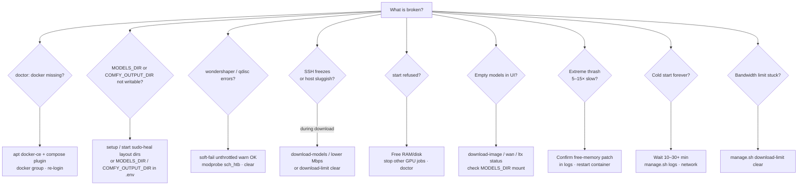
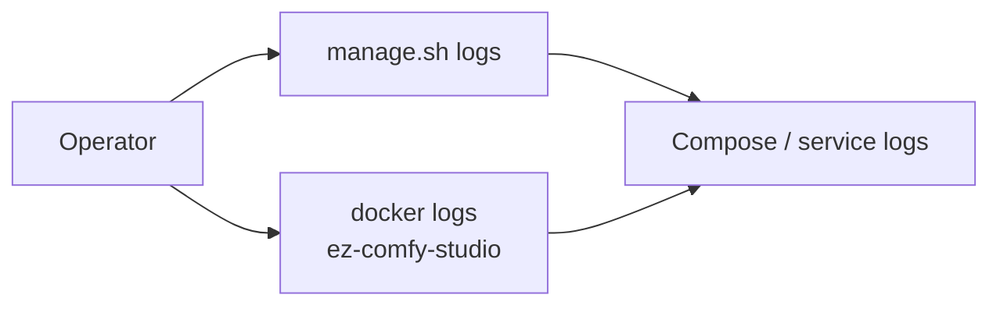
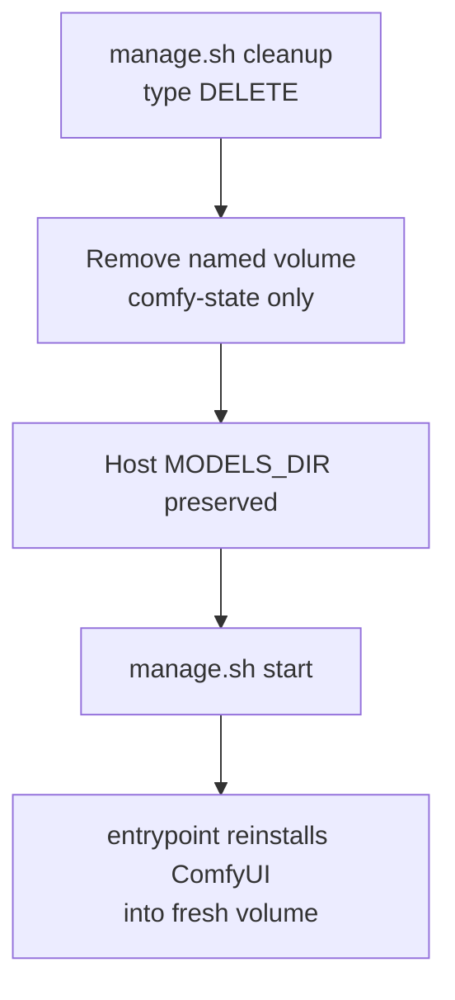

# Troubleshooting

**What's on this page**

- **Doctor first** — `./scripts/manage.sh doctor` before hunting rows
- **Topic pages** — docs site, canvas, host/Docker, downloads, start/runtime, models/workflows
- **Symptom decision tree** — common failures in one diagram
- **Logs and reset** — compose logs and `cleanup` that keeps `${MODELS_DIR}`

**What this enables**

- **Recovering** from OOM, stuck bandwidth limits, empty models, and long cold starts
- **Jumping** to the matching table without scrolling a dump

!!! tip "Try this first"

    ```bash
    ./scripts/manage.sh doctor
    ```

    Many rows on the topic pages are hard failures `doctor` already reports. Prefer `./scripts/manage.sh setup` when Docker or `${MODELS_DIR}` is missing.

## Topics

<div class="grid cards" markdown>

-   :material-web:{ .lg .middle } **Docs site**

    ---

    Copy-paste still showing `${SPARK_HOST}` / `${MODELS_DIR}` chips.

    [:octicons-arrow-right-24: Docs site](operate/troubleshooting-docs-site.md)

-   :material-palette:{ .lg .middle } **Studio canvas**

    ---

    Missing Models, LTX 720, Nodes 2.0 layout, dub (duration-locked YT tone / `job_slug=True`), occupancy XOR, studio-ui `:8190` (not App Mode).

    [:octicons-arrow-right-24: Studio canvas](operate/troubleshooting-canvas.md)

-   :material-server:{ .lg .middle } **Host and Docker**

    ---

    Docker missing, `MODELS_DIR` / `COMFY_OUTPUT_DIR` permission, Spark farm SSH (`SPARK_HOSTS` / `SPARK_FABRIC_IPS`).

    [:octicons-arrow-right-24: Host and Docker](operate/troubleshooting-host-docker.md)

-   :material-download:{ .lg .middle } **Downloads**

    ---

    wondershaper/qdisc, stuck limits, gated LTX (`HF_TOKEN` is not the license click).

    [:octicons-arrow-right-24: Downloads](operate/troubleshooting-downloads.md)

-   :material-play-circle:{ .lg .middle } **Start and runtime**

    ---

    Headroom refuse, Kitchen fallback, cold start, GHCR / layer cache.

    [:octicons-arrow-right-24: Start and runtime](operate/troubleshooting-start-runtime.md)

-   :material-file-tree:{ .lg .middle } **Models and workflows**

    ---

    Empty models, CLIP/VAE links, 90s concat, dream-house, ACE, occupancy gate.

    [:octicons-arrow-right-24: Models and workflows](operate/troubleshooting-models-workflows.md)

</div>

| Topic | Page |
| --- | --- |
| Docs site chips | [Troubleshooting — docs site](operate/troubleshooting-docs-site.md) |
| Studio user (canvas) | [Troubleshooting — studio canvas](operate/troubleshooting-canvas.md) |
| Host and Docker | [Troubleshooting — host and Docker](operate/troubleshooting-host-docker.md) |
| Downloads and bandwidth | [Troubleshooting — downloads and bandwidth](operate/troubleshooting-downloads.md) |
| Start and runtime | [Troubleshooting — start and runtime](operate/troubleshooting-start-runtime.md) |
| Models and workflows | [Troubleshooting — models and workflows](operate/troubleshooting-models-workflows.md) |

## Dub (clone-translate)

Canvas rows live in [Studio canvas](operate/troubleshooting-canvas.md). The fixture that shipped a 64 s YT tone:

| Symptom | Cause | Fix |
| --- | --- | --- |
| YT preview `ez_dub_yt_*.mp3` is ~source length but has no Spanish (tone, hush, ducked English, or a sliding moan) | Clone failed `is_speech_like` (including an F0-glide vocoder “whale”) or ingest `job_slug` became `True` from the upload button | Pull latest. Clone CFG auto is 0.3 (retry 0.5). Check Dub status. Inspect `dubs/<slug>/render/turn_*.raw.wav`. `download-dub --tier asr` then `--tier clone` with compose up. Never treat a duration-matched drone as success. Job dir must be `dubs/episode/`, not `dubs/True/`. |

---

## Symptom decision tree



---

## Logs

```bash
./scripts/manage.sh logs
docker logs ez-comfy-studio
```



---

## Reset Comfy install (keeps models)

```bash
./scripts/manage.sh cleanup   # type DELETE
./scripts/manage.sh start
```


