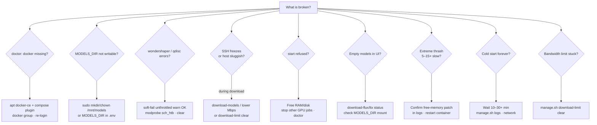
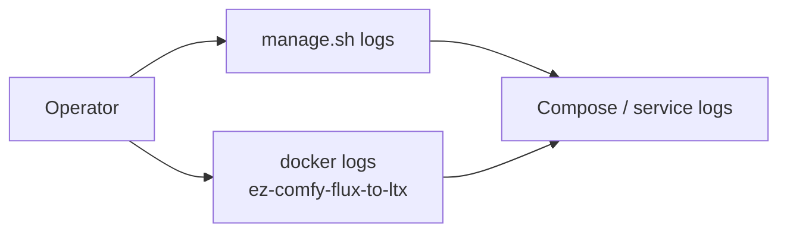
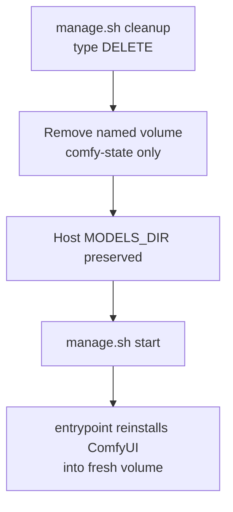

# Troubleshooting

**What's on this page**

- Symptom → cause → action table
- Decision tree for common failures
- Useful log commands and reset paths

**What this enables**

- Recovering from OOM, stuck bandwidth limits, empty models, and long cold starts

| Symptom | Likely cause | Action |
| --- | --- | --- |
| `docker missing` in doctor | Docker not installed / snap-only | `./scripts/manage.sh setup --install-docker` (sudo apt CE + compose); then `newgrp docker` or re-login |
| docker permission denied | Not in `docker` group this session | `sudo usermod -aG docker $USER` then `newgrp docker` or re-login SSH |
| docker daemon not reachable | dockerd not running | `sudo systemctl start docker` |
| `MODELS_DIR … not writable` | `/mnt/models` missing or root-owned | `./scripts/manage.sh setup` **or** `sudo mkdir -p /mnt/models && sudo chown $USER:$USER /mnt/models` **or** `MODELS_DIR=$HOME/models` |
| wondershaper `qdisc kind is unknown` / RTNETLINK | No HTB/IFB (common on DGX Spark) | Expected; wrap uses **gentle HF max-workers** from measured speed (HTTP probe). Not a hard Mbps cap. `DOWNLOAD_LIMIT=off` for full blast |
| Speedtest failed / always 50 Mbps | speedtest-cli missing | Auto now uses **Cloudflare HTTP probe** if CLIs fail; check outbound HTTPS; override `SPEEDTEST_HTTP_URL` |
| SSH freezes during download | Full-rate HF pull (limit off or soft-fail) | Prefer working `download-limit`; lower fixed Mbps; `download-limit clear` if half-applied |
| Extreme model thrash / 5–15× slow | Unpatched free-memory | Confirm patch in container logs; re-run entrypoint install |
| `start` refused | Headroom check | Free RAM/disk; stop other GPU jobs |
| Empty models in UI | Downloads not run | `download-flux` / `download-ltx` status; check `MODELS_DIR` mount |
| `huggingface-cli is deprecated` / 0 GB after download-models | Scripts used stub CLI | Pull latest; ensure `hf` on PATH (`pipx install huggingface_hub`); re-run download-models |
| Download failed / gated license | No token or license not accepted | Accept model license on HF; set `HF_TOKEN` in `.env` or `hf auth login` |
| Long Python `GatedRepoError` traceback | Older CLI path / unparsed hub error | Current stack prints a short checklist; open the model URL, Agree as the token’s user, re-run download. Debug: `LAB_DEBUG=1` |
| Pending / can't start container | Docker/GPU runtime | `nvidia-smi`, Container Toolkit install |
| Cold start forever | First PVC/volume pip+git | Wait; `manage.sh logs`; check network |
| Nunchaku missing | aarch64 wheel fail | Fail-soft; quality/FP8 paths may still work |
| Limits stuck after kill | trap skipped | `./scripts/manage.sh download-limit clear` |

## Symptom decision tree



## Docker missing on DGX Spark

Docker is usually pre-installed on DGX Spark, but updates or OS reimages can remove it. Prefer **apt Docker CE** (not snap) so the NVIDIA Container Toolkit can attach GPUs.

```bash
./scripts/manage.sh setup --install-docker
# sudo password + type yes if prompted
newgrp docker   # if permission denied in this shell
./scripts/manage.sh doctor
```

Non-interactive:

```bash
LAB_NON_INTERACTIVE=1 LAB_CONFIRM_TOKEN=yes SETUP_INSTALL_DOCKER=1 ./scripts/manage.sh setup
```

## MODELS_DIR permission denied

Default cache is `/mnt/models` (shared with nvidia-dgx-spark-lab). Prefer bootstrap:

```bash
./scripts/manage.sh setup
# creates/chowns MODELS_DIR with sudo when needed
```

Manual equivalent:

```bash
sudo mkdir -p /mnt/models
sudo chown "$USER:$USER" /mnt/models
# or in .env:
# MODELS_DIR=$HOME/models
./scripts/manage.sh doctor
```

## wondershaper / qdisc failures

`download-models` wraps downloads under wondershaper. If the kernel rejects HTB (`qdisc kind is unknown`) or illegal rates, **wrap soft-fails**: it warns and continues **unthrottled** (SSH risk). Persistent `download-limit run` still hard-fails. Set `DOWNLOAD_LIMIT_REQUIRE=1` to hard-fail wrap too.

```bash
./scripts/manage.sh download-limit clear
# optional: sudo modprobe sch_htb sch_ingress sch_sfq
./scripts/manage.sh download-models
# or explicitly:
# DOWNLOAD_LIMIT=off ./scripts/manage.sh download-models
```

## Logs

```bash
./scripts/manage.sh logs
docker logs ez-comfy-flux-to-ltx
```



## Reset Comfy install (keeps models)

```bash
./scripts/manage.sh cleanup   # type DELETE
./scripts/manage.sh start
```


