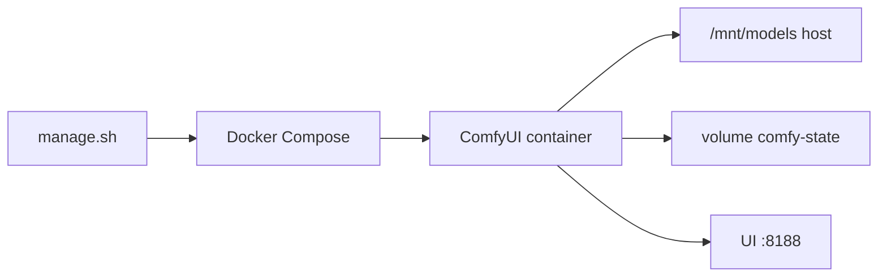

# Visual Generative AI

**What's on this page**

- Architecture and resource profile
- Spark unified-memory patch
- Operator commands

**What this enables**

- Running image + video generation tools in **one** Docker Compose stack
- Understanding why memory headroom and the free-memory patch matter on GB10

## Architecture



| Setting | Value |
| --- | --- |
| Profile | `flux-to-ltx` |
| Memory limit / reservation | 90g / 80g |
| GPU | all (1× GB10) |
| restart | `"no"` |
| Flux | Klein 9B NVFP4 + Nunchaku |
| LTX | distilled FP8 balanced |

## Spark optimizations

| Setting | Purpose |
| --- | --- |
| `patch_get_free_memory.py` | Use host free RAM instead of under-reporting `cudaMemGetInfo` |
| `PYTORCH_CUDA_ALLOC_CONF=expandable_segments:True` | Less allocator fragmentation |
| `LAB_VISUAL_ENABLE_NVFP4=1` | Hint for NVFP4 / Nunchaku paths |
| Fail-soft Nunchaku / SageAttention | aarch64 wheels may be missing |

## Commands

```bash
./scripts/manage.sh doctor
./scripts/manage.sh download-models
./scripts/manage.sh start
./scripts/manage.sh status
./scripts/manage.sh logs
./scripts/manage.sh stop
```

## Combined pipeline tips

1. Download **flux fast** + **ltx balanced** first  
2. Prefer keeping both model sets loaded between T2I and I2V  
3. Avoid concurrent large LLM containers on the same Spark  

## Safety

- Manual start only  
- Headroom preflight  
- Exclusive use of the GPU for this demo stack  
- Always `stop` before reboot  
