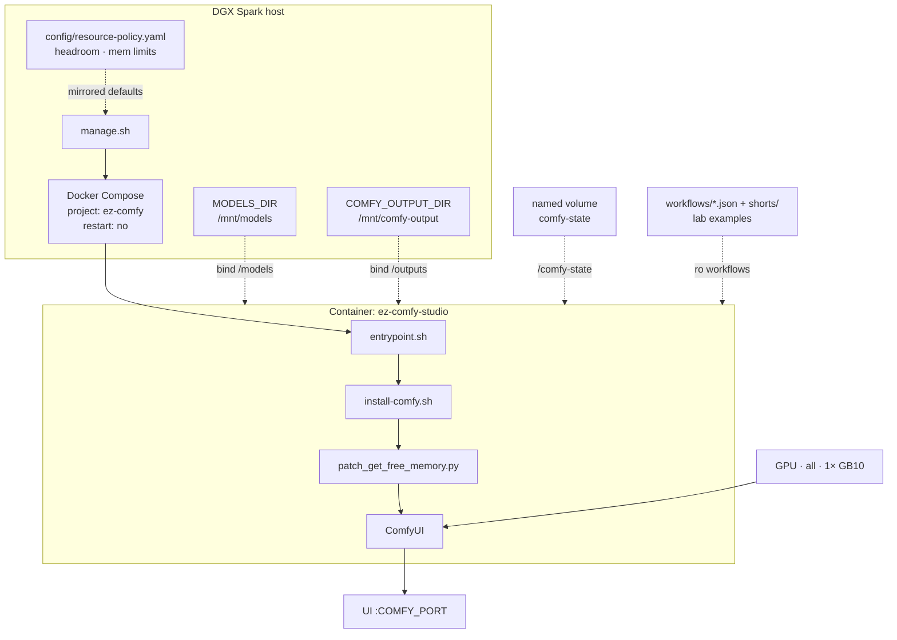
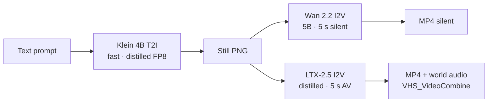
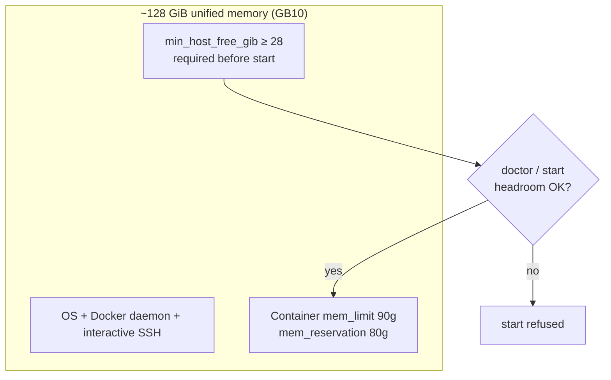
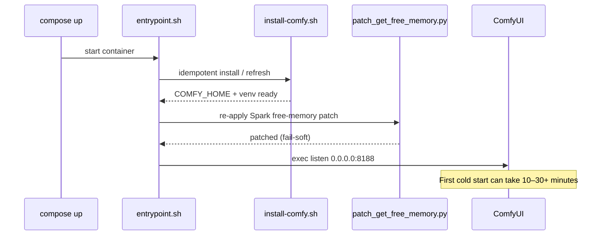
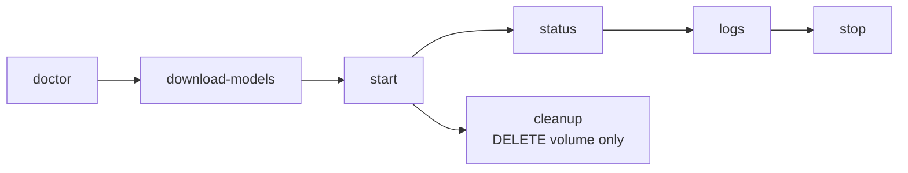

# Visual Generative AI

**What's on this page**

- Architecture and resource profile
- Klein → Wan → LTX pipeline
- Seeded lab workflows and the iteration loop
- Watching VHS MP4 output
- Spark unified-memory patch and entrypoint sequence

**What this enables**

- Running still + silent motion + AV tools in **one** Docker Compose stack
- Iterating in minutes on ~5 s clips instead of a 90 s denoise
- Understanding why memory headroom and the free-memory patch matter on GB10

!!! tip "First run?"

    For install and first UI open, use [Getting Started](getting-started.md). This page is the **studio playbook** after `klein-still-draft-lab-example` has queued once.

---

## Architecture

Host operator path, container lifecycle, mounts, and UI:



| Setting | Value |
| --- | --- |
| Profile | `us-safe-studio` |
| Memory limit / reservation | 90g / 80g |
| GPU | all (1× GB10) |
| restart | `"no"` |
| Image | Klein 4B distilled FP8 (`LAB_IMAGE_TIER=fast`) |
| Wan | 2.2 TI2V-5B (`LAB_WAN_TIER=5b`), silent |
| LTX | 2.5 distilled INT8-convrot (`LAB_LTX_TIER=2.5`) |
| Nunchaku | **off** (`LAB_VISUAL_ENABLE_NUNCHAKU=0`) |

MiniMax H3 is **not** in this stack (US Excluded Territory). See [Model licenses](licenses.md).

---

## Combined pipeline (Klein → Wan → LTX)

Text → still → **silent 5 s** → **AV 5 s** in one ComfyUI stack.



**Handoff:** load **klein-still-draft-lab-example** → Queue → set **wan-i2v-5s-lab-example** LoadImage to `ez_still_draft_*.png` → Queue ~5 s silent → optional **ltx-i2v-5s-lab-example** for native audio. I2V graphs also Queue on Comfy’s default **example.png**.

LTX-2.5 is a **joint audio/video** transformer. Seeded LTX graphs load the **audio VAE**, create matching empty audio latents, concat them with video latents before `KSampler`, then decode audio with **`LTXVAudioVAEDecode`** into **`VHS_VideoCombine`** so the MP4 includes world audio. Text conditioning is a single **CLIPLoader** (`gemma4-12b-with-proj-ltx-2.5-comfy-int8-convrot`, type **`ltxv`**).

!!! example "Pipeline tips"

    1. Download the default pack first (`download-models` = image fast + wan 5b + ltx 2.5)
    2. Prefer keeping both model sets loaded between T2I and I2V
    3. Avoid concurrent large LLM containers on the same Spark
    4. Video graphs emit **MP4** via **VideoHelperSuite** (`VHS_VideoCombine`, 24 fps) plus optional PNG frames
    5. Prompting: Klein wants Qwen-style prose (subject → light → camera); Wan wants motion + one camera move (no audio); LTX wants a present-tense paragraph with sound interleaved. See [Prompting](prompting.md). Every **\*-lab-example** canvas has an operator **Note**

---

## Example workflows

After `download-models` + `start`, open ComfyUI and load from `user/default/workflows/` (seeded from host `workflows/`). Filenames end with **`-lab-example`**. Do **not** edit raw JSON — change widgets on the canvas.

=== "Still (Klein 4B)"

    | Workflow | What it does |
    | --- | --- |
    | **klein-still-draft-lab-example** | Apache Klein 4B distilled, **768×432**, **4** steps, batch 2, prefix `ez_still_draft` |
    | **klein-still-hero-lab-example** | Same prompt + seed, **1280×720**, more steps, prefix `ez_still_hero` |

=== "Motion (Wan 2.2 5B)"

    | Workflow | What it does |
    | --- | --- |
    | **wan-i2v-5s-lab-example** | Silent I2V smoke, 832×480, **121** frames @ 24 fps |
    | **wan-t2v-5s-lab-example** | Silent T2V smoke, 121 frames (LoadImage bypassed) |
    | **wan-i2v-shot-lab-example** | Concat-safe **120** frames + last-frame SaveImage. 90s shots, or prefix `ez_shot_01..06` |

=== "AV hero (LTX-2.5)"

    | Workflow | What it does |
    | --- | --- |
    | **ltx-i2v-5s-lab-example** | ~5 s I2V with native audio (Community License, $10M cap) |
    | **ltx-t2v-5s-lab-example** | ~5 s T2V AV |

=== "Apps (still / GIF / IG)"

    | Workflow | What it does |
    | --- | --- |
    | **klein-still-daily-lab-example** | Daily Klein 4B still. Click the UNET filename to swap distilled / NVFP4 / base. Size, steps, CFG, seed on the canvas. Prefix `ez_still_app` |
    | **wan-gif-loop-lab-example** | Wan 5B I2V GIF (49 frames @ 12 fps). **Ping-pong ON** so first and last frames meet for infinite looping. Prefix `ez_gif_loop` |
    | **klein-dream-house-lab-example** | Ten Instagram 4:5 stills of one lake house. Edit **HOUSE IDENTITY** once; Queue writes `ez_dream_house_01`…`10` |

=== "90s shorts"

    | Workflow | What it does |
    | --- | --- |
    | **film-go-see-90s-run-lab-example** | **Unified** first-person running 90s: Klein identity + LTX 5.00s AV printer + shot map |
    | **film-still-here-90s-lab-example** | **Unified** household morning 90s (same shape) |
    | **film-switchyard-90s-lab-example** | **Unified** night freight-yard 90s (same shape) |
    | **wan-i2v-shot-lab-example** | Optional silent rehearsal / six-shot concat demo |
    | **ltx-i2v-shot-lab-example** | Generic 5.00 s AV print (non-film) |

    Full loop: [90s shorts](shorts.md). One file per film — mute groups, do not switch graphs.

=== "Creator toolkit"

    Pack 1

    | Workflow | What it does |
    | --- | --- |
    | **klein-shorts-still-lab-example** | Vertical 9:16 Shorts still (`ez_shorts_still`) |
    | **wan-shorts-i2v-lab-example** | Vertical silent I2V from that still |
    | **ltx-shorts-i2v-lab-example** | Vertical AV I2V (~5 s) with world audio |
    | **klein-thumbnail-lab-example** | YouTube thumbnail still 1280×720 |
    | **klein-product-packshot-lab-example** | Clean product packshot 1:1 |
    | **klein-before-after-lab-example** | Before/after still pair |
    | **klein-style-lock-lab-example** | Four style-locked stills |
    | **wan-bumper-loop-lab-example** | Loopable MP4 bumper (ping-pong) |
    | **ltx-broll-ambient-lab-example** | Ambient B-roll AV plate (~5 s) |
    | **klein-storyboard-6up-lab-example** | Six storyboard frames in one Queue |

    Pack 2 — stills and plates

    | Workflow | What it does |
    | --- | --- |
    | **klein-endcard-cta-lab-example** | End-card / CTA plate 16:9 |
    | **klein-quote-bg-lab-example** | Quote-card background 1:1 |
    | **klein-og-blog-lab-example** | Blog / Open Graph hero |
    | **klein-podcast-cover-lab-example** | Podcast cover 1:1 |
    | **klein-banner-wide-lab-example** | Channel / LinkedIn banner ~3:1 |
    | **klein-ig-square-lab-example** | Instagram 1:1 still |
    | **klein-hook-still-lab-example** | 9:16 first-frame hook |
    | **klein-lower-third-bg-lab-example** | Lower-third-safe 16:9 plate |
    | **klein-food-tabletop-lab-example** | Food / tabletop 4:5 |
    | **klein-lighting-trio-lab-example** | Same subject, three lights |
    | **klein-time-of-day-lab-example** | Dawn / noon / dusk / night |
    | **klein-camera-angles-lab-example** | Wide / medium / close |
    | **klein-color-moods-lab-example** | Four color moods |

    Pack 2 — motion / AV

    | Workflow | What it does |
    | --- | --- |
    | **wan-orbit-i2v-lab-example** | Slow orbit I2V ~5 s |
    | **wan-push-in-i2v-lab-example** | Hero push-in I2V ~5 s |
    | **wan-parallax-i2v-lab-example** | Subtle parallax I2V ~5 s |
    | **wan-sticker-loop-lab-example** | Looping sticker MP4 |
    | **ltx-weather-broll-lab-example** | Rain / wind B-roll AV |
    | **ltx-interior-ambience-lab-example** | Interior room-tone AV |
    | **ltx-hook-av-lab-example** | ~5 s AV cold open |

=== "License"

    MiniMax H3 is **banned** (US Excluded Territory). Klein 9B and FLUX.2-dev are not defaults. See [Model licenses](licenses.md).

Every **\*-lab-example** graph includes an on-canvas **Note** (purpose, models, sampler, prompting tips, run steps). Video graphs emit MP4 via VHS with **`save_output: true`**; after Queue, open **Save video (MP4) — open node for preview**. LTX graphs decode audio (`LTXVAudioVAEDecode`) into the MP4. **wan-gif-loop-lab-example** emits `image/gif`.

Optional Wan A14B is a **placeholder note** only (`workflows/optional/wan-i2v-a14b-lab-example.json`) — download `download-wan.sh run --tier a14b` first; it is not a Queue graph.

---

## Iteration loop (YouTube 16:9)

Do **not** edit raw JSON. Change widgets on the canvas.

1. Load **klein-still-draft-lab-example** → set Positive prompt + seed (fixed) → Queue (minutes, 4-step).
2. Pick a frame under `${COMFY_OUTPUT_DIR}` (`ez_still_draft_*.png`).
3. Load **wan-i2v-5s-lab-example** → set LoadImage to that PNG (or leave `example.png` to smoke-test) → edit **Motion / prompt** only → Queue ~5 s silent.
4. Optional audio: **ltx-i2v-5s-lab-example**, same first frame, same seed note, Queue ~5 s AV.
5. Short six-shot demo: Queue **wan-i2v-shot-lab-example** six times (`ez_shot_01` … `06`) then:

    ```bash
    ./scripts/utilities/concat-shots.sh --yes
    # default dir is ${COMFY_OUTPUT_DIR}; writes ez_concat_shots.mp4
    ```

6. **90s films** (go-see / still-here / switchyard): load one **film-*-90s** graph → Queue identity → unmute LTX → 18 × 5.00s prints → concat with `--film`. See [90s shorts](shorts.md).
7. Daily still / GIF / IG pack: **klein-still-daily-lab-example** → optional **wan-gif-loop-lab-example** (LoadImage = `ez_still_app_*.png`, leave ping-pong on) or **klein-dream-house-lab-example** for a 10-photo carousel.
8. Creator toolkit: vertical Shorts still→I2V, thumbnail, packshot, before/after, style lock, bumper, B-roll, storyboard 6-up (see catalog tab above).

Do not Queue a 90s denoise. Default graphs iterate in minutes.

---

## Watch the video (Wan / LTX)

!!! tip "Primary output is MP4"

    Seeded **wan-*** and **ltx-*** graphs install **ComfyUI-VideoHelperSuite** and wire **`VHS_VideoCombine`** after video `VAEDecode` (`save_output: true`). LTX graphs also run **`LTXVAudioVAEDecode`** into the VHS **audio** input so world audio is muxed into the MP4. After **Queue**, open **Save video (MP4) — open node for preview** for an **inline preview**. PNG **Save frames (secondary)** is optional. Files are on the **host** at `${COMFY_OUTPUT_DIR}` (container `/outputs`). `cleanup` does **not** delete this folder.

```bash
ls "${COMFY_OUTPUT_DIR}"/ez_still_draft_*.png
ls "${COMFY_OUTPUT_DIR}"/ez_ltx_*_video_*.mp4
```

| Graph | Frames | FPS | ≈ duration |
| --- | --- | --- | --- |
| `wan-i2v-5s` / `wan-t2v-5s` / `ltx-*-5s` | 121 | 24 | ~5.04 s |
| `wan-i2v-shot` / `ltx-i2v-shot` | 120 | 24 | **5.00 s** |
| 90s film (18 LTX prints + concat) | — | 24 | **90.00 s** cap |

!!! warning "Do not Queue 30 s / 60 s / 90 s in one graph"

    Long latents melt Spark. Prefer **~5 s** graphs; stitch with [concat-shots](shorts.md). Keep headroom preflight green.

Optional offline stitch of PNG frames only (if you need a host-side re-encode):

```bash
cd "${COMFY_OUTPUT_DIR}"
ffmpeg -y -framerate 24 -pattern_type glob -i 'ez_ltx_*_*.png' \
  -c:v libx264 -pix_fmt yuv420p -crf 18 out.mp4
```

If **`VHS_VideoCombine` is missing**, pull/rebuild the image and restart so install refresh can clone VideoHelperSuite — see [Troubleshooting](troubleshooting.md).

---

## Memory and headroom budget

GB10 unified memory is shared by OS, SSH, Docker, and the ComfyUI container. Policy defaults leave free host RAM so remote access stays usable.



---

## Spark optimizations

| Setting | Purpose |
| --- | --- |
| `patch_get_free_memory.py` | Use host free RAM instead of under-reporting `cudaMemGetInfo` |
| `PYTORCH_CUDA_ALLOC_CONF=expandable_segments:True` | Less allocator fragmentation |
| `LAB_VISUAL_ENABLE_NVFP4=1` | Hint only; default graphs use core FP8 Klein 4B, not Nunchaku |
| `LAB_VISUAL_ENABLE_NUNCHAKU=0` | Lab examples do not require Nunchaku |
| Fail-soft Nunchaku / SageAttention | aarch64 wheels may be missing |

### Container entrypoint sequence



??? abstract "Lab workflow internals"

    - Name pattern: host files `workflows/*-lab-example.json` and `workflows/shorts/*-lab-example.json` (entrypoint copies both)
    - Every graph has a ComfyUI **Note** node + `extra.lab_note` with the same operator guidance
    - Klein CLIP loader type is **`flux2`** with `qwen_3_4b` + `EmptyFlux2LatentImage` (simplified `KSampler`)
    - LTX-2.5 graphs use **CLIPLoader** (`gemma4-12b-with-proj-ltx-2.5-comfy-int8-convrot`, type **`ltxv`**), save **MP4** via **`VHS_VideoCombine`** (h264, 24 fps), and still save **frames** via `SaveImage`
    - Stack installs **ComfyUI-VideoHelperSuite** (required) plus runtime **`ffmpeg`** (imageio-ffmpeg pip is fallback)
    - LTX is **joint AV**: lab graphs load `ltx-2.5-audio-vae-bf16`, build empty audio latents (`LTXVEmptyLatentAudio`), **concat** with video latents before `KSampler`, then **`LTXVSeparateAVLatent` → `LTXVAudioVAEDecode` → `VHS_VideoCombine.audio`**. Omitting empty audio causes `reshape … [1, 0, 32, -1]`
    - Lab Klein graphs use **core** loaders only (not ComfyUI-nunchaku). Nunchaku import warnings on aarch64 are optional and do not block examples
    - Runtime image includes **`gcc`/`g++`** and **`python3-dev`** so PyTorch 2.13 Triton can JIT `cuda_utils` on first CLIP encode (fallback: `LAB_DISABLE_TORCH_NATIVE_TRITON=1`)
    - **Not Z-Image.** Community Z-Image templates need different weights (`ae` / `qwen_3_4b` / `z_image_turbo_*`)

??? abstract "Optional LTX-2.3 fallback"

    If LTX-2.5 access or INT8-convrot fails: `./scripts/utilities/download-ltx.sh run --tier 2.3` pulls Kijai distilled FP8 + Gemma 3 DualCLIP (`gemma_3_12B_it_fp4_mixed` + `ltx-2.3_text_projection_bf16`). **Seeded lab graphs still expect LTX-2.5 filenames** — do not treat 2.3 as the default playbook.

---

## Commands

First-run commands live on [Getting Started](getting-started.md). Day-to-day on a running host:

```bash
./scripts/manage.sh doctor
./scripts/manage.sh status
./scripts/manage.sh logs
./scripts/manage.sh stop
```



---

## Safety

!!! warning "Do not weaken"

    - Manual start only (`restart: "no"`)
    - Headroom preflight before start
    - Exclusive use of the GPU for this demo stack
    - Always `stop` before reboot — [Reboot Safety](reboot-safety.md)
